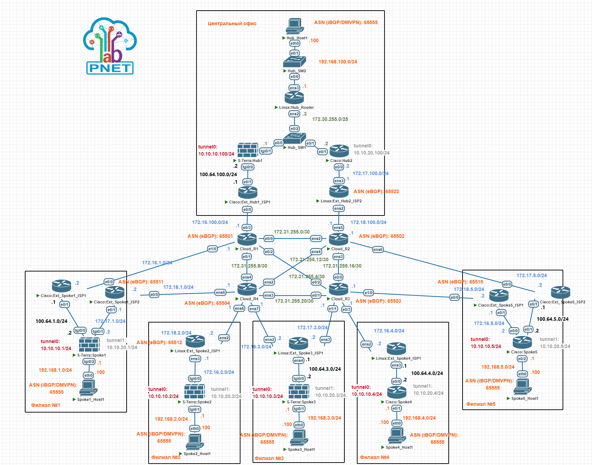

# Построение территориально распределенной сети компании при помощи технологии DMVPN на оборудовании "С-Терра Шлюз" 5.0 и маршрутизаторах Cisco Systems

## Цель

Проверить на совместимость криптомаршрутизаторы «С-Терра Шлюз» версии 5.0 и маршрутизаторы Cisco Systems в рамках технологии DMVPN (phase2)

## Задачи

1. Определить основные схемы подключения филиалов (spokes) и центрального офиса (hubs) к Интернет провайдерам
1. Выбрать протокол динамической маршрутизации, используемый в облаке DMVPN
1. Определить схему резервирования устройств (хабов) в центральном офисе
1. Собрать схему и проверить на совместимость вторую фазу DMVPN, сделать выводы

## Выбранная топология



## Схема для импорта в PNETlab

[Схема для импорта в PNETlab](media/_Exports_pnetlab_export-20250319-232456.zip)

## Версии ПО

- PNETlab - 5.3.11
- "С-Терра Шлюз" версии 5.0
- Роутеры - Cisco IOS Software, Linux Software (I86BI_LINUX-ADVENTERPRISEK9-M), Version 15.4(2)T4
- Коммутаторы - Cisco IOS Software, Linux Software (I86BI_LINUXL2-ADVENTERPRISEK9-M), Version 15.2(CML_NIGHTLY_20150703)
- ПК - VPC

## Общее описание

1. В центральном офисе размещаются два хаба, один на криптошлюзе "С-Терра Шлюз" 5.0 (имя устройства на схеме - S-Terra:Hub1), второй на Cisco Router (Cisco:Hub2).  
      - Архитектура DMVPN - Dual Hub Dual Cloud, Phase 2, iBGP.  
      - Первый хаб S-Terra:Hub1 обслуживает cloud\mGRE - 10.10.10.0/24, второй хаб Cisco:Hub2 - обслуживает cloud\mGRE - 10.10.20.0/24.
      Хабы подключены к двум разным Интернет провайдерам.  
      - Первый хаб S-Terra:Hub1 находится за статическим NAT (реализуется на устройстве Cisco:Ext_Hub1_ISP1),  
      для трафика второго хаба Cisco:Hub2 трансляция адресов (NAT) не осуществляется.  
      - NBMA (WAN) адреса первого и второго Интернет провайдера, соответственно 172.16.100.2/24 и 172.17.100.2/24.  
      - Защищаемая LAN подсеть - 192.168.100.0/24.

1. Где-то в сети Интернет, которая эмулируется устройствами Cloud_R1, Cloud_R2, Cloud_R3, Cloud_R4, размещаются филиальные устройства (споки).  
      Спок в первом филиале, представлен устройством "С-Терра Шлюз" 5.0 (имя устройства на схеме - S-Terra:Spoke1) и подключен к двум разным  Интернет провайдерам (устройства
      Linux:Ext_Spoke1_ISP1 и Cisco:Ext_Spoke1_ISP2) в режиме основной\резервный. Устройство Linux:Ext_Spoke1_ISP1 осуществляет статическую трансляцию адресов (NAT).  
      - Защищаемая LAN подсеть - 192.168.1.0/24.  
      - NBMA (WAN) адреса первого и второго Интернет провайдера, соответственно 172.16.1.2/24 и 172.17.1.2/24.

1. Спок во втором филиале, представлен устройством "С-Терра Шлюз" 5.0 (имя устройства на схеме - S-Terra:Spoke2) и подключен к одному Интернет провайдеру (устройство
      Linux:Ext_Spoke2_ISP1). Устройство Linux:Ext_Spoke2_ISP1 не осуществляет трансляцию адресов (NAT).
      - Защищаемая LAN подсеть - 192.168.2.0/24.
      - NBMA (WAN) адрес 172.16.2.2/24.

1. Спок в третьем филиале, представлен устройством "С-Терра Шлюз" 5.0 (имя устройства на схеме - S-Terra:Spoke3) и подключен к двум разным Интернет провайдерам, но посредством  одного роутера (устройство Linux:Ext_Spoke3_ISP1), в режиме основной\резервный. Устройство Linux:Ext_Spoke3_ISP1 осуществляет статическую трансляцию адресов (NAT).
      - Защищаемая LAN подсеть - 192.168.3.0/24.
      - NBMA (WAN) адреса первого и второго Интернет провайдера, соответственно 172.16.3.2/24 и 172.17.3.2/24.

1. Спок в четвертом филиале, представлен устройством Cisco Router (имя устройства на схеме - Cisco:Spoke4) и подключен к одному Интернет провайдеру (устройство
Linux:Ext_Spoke4_ISP1). Устройство Linux:Ext_Spoke4_ISP осуществляет статическую трансляцию адресов (NAT).
      - Защищаемая LAN подсеть - 192.168.4.0/24.
      - NBMA (WAN) адрес 172.16.4.2/24.

1. Спок в пятом филиале, представлен устройством Cisco Router (имя устройства на схеме - Cisco:Spoke5) и подключен к двум разным Интернет провайдерам (устройства
Cisco:Ext_Spoke5_ISP1 и Cisco:Ext_Spoke5_ISP2) в режиме основной\резервный. Устройство Cisco:Ext_Spoke5_ISP1 осуществляет статическую трансляцию адресов (NAT), Cisco:Ext_Spoke5_ISP2 не осуществляет.
      - Защищаемая LAN подсеть - 192.168.5.0/24.
      - NBMA (WAN) адреса первого и второго Интернет провайдера, соответственно 172.16.5.2/24 и 172.17.5.2/24.

## Используемые технологии

1. DMVPN (mGRE/NHRP)
1. IPsec/IKEv2
1. PKI (выделенный root CA на базе OpenSSL)
1. iBGP/eBGP/OSPF
1. NAT/IP SLA/VRF/MultiWAN (С-Терра)

## Проверка работоспособности

## Конфигурации устройств центрального офиса

### S-Terra:Hub1

#### IPsec/IKEv2/GRE

<details>
  <summary>Конфигурация</summary>

```
!
no service password-encryption
!
crypto ipsec df-bit copy
crypto isakmp identity address
username cscons privilege 15 password 0 csp
aaa new-model
!
!
hostname S-Terra-Hub1
enable password csp
!
!
!
!
logging trap debugging
!
!
crypto ikev2 proposal IKEV2-PROPOSAL
 encryption aes-cbc-256
 integrity sha256
 group 14
 prf sha256
!
crypto ikev2 policy IKEV2-POLICY
 proposal IKEV2-PROPOSAL
!
crypto ikev2 authentication sig IKEV2-AUTH-RSA-SIG
 identity dn
 ca trust-point s-terra_technological_trustpoint
 set identity mapping

!
crypto ikev2 profile IKEV2-PROFILE-RSA-SIG
 authentication remote IKEV2-AUTH-RSA-SIG
 authentication local IKEV2-AUTH-RSA-SIG
 set policy IKEV2-POLICY
!
crypto ikev2 ipsec-proposal IKEV2-IPSEC-PROPOSAL
 esp encryption aes-cbc-256
 esp integrity sha256 sha512
!
ip access-list extended GRE_VIA_TGI0/0
 permit gre host 100.64.100.2 each
!
ipv6 default filtering permit
!
!
crypto dynamic-map DMVPN-TGI0/0 1
 match address GRE_VIA_TGI0/0
 set ikev2-ipsec-proposal IKEV2-IPSEC-PROPOSAL
 set ikev2-profile IKEV2-PROFILE-RSA-SIG
 set local-address 100.64.100.2
 set mode transport
 set dead-connection history off
!
crypto map VPN-TGI0/0 1 ipsec-isakmp dynamic DMVPN-TGI0/0
!
interface TenGigabitEthernet0/0
 description To ISP1 (NAT)
 ip address 100.64.100.2 255.255.255.0
 crypto map VPN-TGI0/0
!
interface TenGigabitEthernet0/1
 description LAN
 ip address 172.30.255.1 255.255.255.128
!
interface TenGigabitEthernet0/2
 no ip address
 shutdown
!
interface TenGigabitEthernet0/3
 no ip address
 shutdown
!
interface TenGigabitEthernet0/4
 no ip address
 shutdown
!
interface TenGigabitEthernet0/5
 no ip address
 shutdown
!
interface Tunnel0
 description DMVPN Cloud #1
 ip address 10.10.10.100 255.255.255.0
 mtu 1400
 tunnel mode gre multipoint
 tunnel key 1
 offloading tx-checksumming
 tunnel ttl 64
 tunnel tos 0
!
!
ip route 0.0.0.0 0.0.0.0 100.64.100.1
!
!
crypto pki trustpoint s-terra_technological_trustpoint
 revocation-check crl none
crypto pki certificate chain s-terra_technological_trustpoint
certificate 18E83EAC6432945F7CB72922AEA5147EC1DCDCCB
30820417308202FFA003020102021418E83EAC6432945F7CB72922AEA5147EC1
DCDCCB300D06092A864886F70D01010B05003081923115301306035504030C0C
5465737420526F6F74204341310B3009060355040613025255310F300D060355
04080C064D6F73636F773113301106035504070C0A5A656C656E6F6772616431
143012060355040A0C0B532D546572726120435350310C300A060355040B0C03
526E443122302006092A864886F70D0109011613766E6F76696B6F7640732D74
657272612E7275301E170D3235303332303136353831395A170D343530333135
3136353831395A3081923115301306035504030C0C5465737420526F6F742043
41310B3009060355040613025255310F300D06035504080C064D6F73636F7731
13301106035504070C0A5A656C656E6F6772616431143012060355040A0C0B53
2D546572726120435350310C300A060355040B0C03526E443122302006092A86
4886F70D0109011613766E6F76696B6F7640732D74657272612E727530820122
300D06092A864886F70D01010105000382010F003082010A0282010100A5C0F4
4C2404EF2CF55FF3B8E1C61EF766BC585CB1010200BAC81E52EAF4E6C694F679
0AF98C63CA0E897F7A05892119EF5DF178D2A34A016AADB7D848A2887CC87484
FC6395446936BADA8CD48F85CB9AD6FA28D5D2F4ED106B353A0FE2074EEE2599
2882539CDB64EBBD40661A1F75C120FB66E0F5CD7E00D2F30E18B9C7314B6959
D3288BA8F40D5B651FF636E89E1BFA56A1F46D7A21182F30CF31D5323A30352B
FE16EF39D44215273C4054B8DDCE33791DF485CECF29DC23E5D1004AC31F2E73
0DF76980E3AE9B3B0160D3C771D3D9955B872BB14FC88396EE7EEFA801D246D9
A78F8FF786824B431E59F4EFFE08296DAD0CCF866FF11D5EABDD382D2B020301
0001A3633061301D0603551D0E04160414DC4FF91826C25066E36D0FF7001C44
632C06BF32301F0603551D23041830168014DC4FF91826C25066E36D0FF7001C
44632C06BF32300F0603551D130101FF040530030101FF300E0603551D0F0101
FF040403020186300D06092A864886F70D01010B0500038201010049698916E7
FD63AD4BFC0DA9B49A4EB40D84D786EF46F08B9979B256B1580AE3DD0BA84F0F
C5B63D368CB4BF6EF317D463C2C47B71ED5825A70C8ACFD6E3F5AEC55AC10E07
B6D7B48FBC87F27F469792C942316746FF3305ABDABA9D301A69785996052788
FC8DB070683FECEA112296568E6C14A8CD371C15FAFF2DB0C99DC172F705C1A5
BC27665DD185AA93AA29F71C3F7BC84FE20D53597CA90147E2F1A5FEB3D9FFB1
122A1EDB550D0E181001635B4C1EEFE61340675B30498E894853D465F8400F6E
6FCBCBEF73B34416F32E282D2510E029ADB4FAAA73FF095C7580B0D831B0A3CB
9CF6001DABBB147EA3BA5EB6DAFAF3A7035E856519FB25E21E738F

quit
!
end

```
</details>

#### NHRP

<details>
  <summary>Конфигурация</summary>

```
root@S-Terra-Hub1:~# cat /etc/opennhrp/opennhrp.conf
interface mgre_0
  cisco-authentication secret
  holding-time 90

```
</details>

#### Dynamic routing

<details>
  <summary>Конфигурация</summary>

```
frr version 9.0.4
frr defaults traditional
hostname S-Terra-Hub1
log syslog informational
service integrated-vtysh-config
!
interface eth1
 ip ospf area 0
 ip ospf cost 1
exit
!
router bgp 65555
 bgp router-id 10.10.10.100
 bgp log-neighbor-changes
 neighbor DMVPN-CLOUD1 peer-group
 neighbor DMVPN-CLOUD1 remote-as 65555
 bgp listen range 10.10.10.0/24 peer-group DMVPN-CLOUD1
 !
 address-family ipv4 unicast
  distance bgp 20 100 100
  redistribute ospf metric 110 route-map RMAP-FILTER-NET-FROM-HUB-TO-SPOKES
  neighbor DMVPN-CLOUD1 route-reflector-client
  neighbor DMVPN-CLOUD1 next-hop-self
  neighbor DMVPN-CLOUD1 route-map LP-200-OUT out
 exit-address-family
exit
!
router ospf
 ospf router-id 172.30.255.1
 redistribute bgp
exit
!
ip prefix-list PREFLIST-FILTER-NET-FROM-HUB-TO-SPOKES seq 5 permit 192.168.100.0/24
!
route-map LP-200-OUT permit 1
 set local-preference 200
exit
!
route-map RMAP-FILTER-NET-FROM-HUB-TO-SPOKES permit 10
 match ip address prefix-list PREFLIST-FILTER-NET-FROM-HUB-TO-SPOKES
exit
!
end

```
</details>


### Cisco:Hub2

<details>
  <summary>Конфигурация</summary>

```
version 15.4
service timestamps debug datetime msec
service timestamps log datetime msec
no service password-encryption
!
hostname Cisco:Hub2
!
boot-start-marker
boot-end-marker
!
!
!
no aaa new-model
mmi polling-interval 60
no mmi auto-configure
no mmi pvc
mmi snmp-timeout 180
no ip icmp rate-limit unreachable
!
!
!
!
!
!
!
!


!
!
!
!
no ip domain lookup
ip cef
no ipv6 cef
!
multilink bundle-name authenticated
!
!
!
!
!
!
!
crypto pki trustpoint CA
 enrollment terminal
 subject-name cn=Hub2
 revocation-check none
 rsakeypair VPN
!
!
crypto pki certificate chain CA
 certificate 1004
  30820445 3082032D A0030201 02020210 04300D06 092A8648 86F70D01 010B0500
  30819231 15301306 03550403 0C0C5465 73742052 6F6F7420 4341310B 30090603
  55040613 02525531 0F300D06 03550408 0C064D6F 73636F77 31133011 06035504
  070C0A5A 656C656E 6F677261 64311430 12060355 040A0C0B 532D5465 72726120
  43535031 0C300A06 0355040B 0C03526E 44312230 2006092A 864886F7 0D010901
  1613766E 6F76696B 6F764073 2D746572 72612E72 75301E17 0D323530 33323131
  36343734 315A170D 32363033 33313136 34373431 5A300F31 0D300B06 03550403
  13044875 62323082 0122300D 06092A86 4886F70D 01010105 00038201 0F003082
  010A0282 010100BC 9F90415E 17214A60 5E7A0D34 CBC4FCC1 DBE3E30D 85C18B22
  81537AE0 199EE0E1 AC587BD6 F6ACE537 1648C81A 522B85A5 89E035BC 59EB8C56
  0683BAB9 83C90749 7F50BCA5 BF9A2E7D 6B81E5D2 75A8B0D9 8369B6B0 93C39141
  0B7E81A5 9D75F5F3 C0DDE334 C5707B97 701A4321 06775472 0FE41BCA 5CF1E2D6
  3EA31569 C3825D0E A8C264DC A41394D0 91C51ACF F0C8745C 8CE62996 4CBF7C1C
  FFDE6730 9ECF4804 7999F2DF 40DE0834 E6847BF0 32609D38 EAC7D1A3 95CDCFC0
  9E753663 39561EE6 A85E0FAD 60485DA5 FA00EE35 36523902 B9203E2A A17B10EA
  F76F1641 8B70954F 466F3EC8 A7F799B5 1E181902 BC474D75 FDA6D2BC C00FAD9D
  BFDCF8AF BDAE7902 03010001 A3820125 30820121 30090603 551D1304 02300030
  1D060355 1D0E0416 0414FABA 183B50F6 BA9A5930 8B7BE186 1B912F3D C6D53081
  D2060355 1D230481 CA3081C7 8014DC4F F91826C2 5066E36D 0FF7001C 44632C06
  BF32A181 98A48195 30819231 15301306 03550403 0C0C5465 73742052 6F6F7420
  4341310B 30090603 55040613 02525531 0F300D06 03550408 0C064D6F 73636F77
  31133011 06035504 070C0A5A 656C656E 6F677261 64311430 12060355 040A0C0B
  532D5465 72726120 43535031 0C300A06 0355040B 0C03526E 44312230 2006092A
  864886F7 0D010901 1613766E 6F76696B 6F764073 2D746572 72612E72 75821418
  E83EAC64 32945F7C B72922AE A5147EC1 DCDCCB30 0B060355 1D0F0404 030205A0
  30130603 551D2504 0C300A06 082B0601 05050703 01300D06 092A8648 86F70D01
  010B0500 03820101 00216E40 0A2E7ADA B962EF51 713F32C4 85CAA358 1EE46D9A
  48CEF8B9 18143954 5B1A8066 AC04ACC0 822473A8 A737977C F619C15B 93EE976A
  D0267107 622A0953 A909ED34 177928FC 96202343 5E149497 A1EE4EDA 46A62EB1
  50DFF627 BD3889F3 12B1A791 6C597ED0 93FF4495 E09E0E3F 1DDCE6CF F2E0BA2E
  E69B6CE6 CD0ECE14 0056BF2A D45A89CF 2B49F278 9638DBB5 CB86B9AE A9D63A7A
  7C5EAFF5 A69A409B 7A19BA2D 6CFCB97E AC74E5AF 010A2F5D BA8C3612 3BEF7A5C
  012AEE5F 4C54CBF4 05319D76 A932D7D2 C3901243 5C8450E3 E170160B 577EC455
  8DC03768 20322F99 7E1E1EDF 4C8EAC1C 13E38D47 9C69EEA0 871BF48C 3ECD3E8F
  80B25326 61629921 56
        quit
 certificate ca 18E83EAC6432945F7CB72922AEA5147EC1DCDCCB
  30820417 308202FF A0030201 02021418 E83EAC64 32945F7C B72922AE A5147EC1
  DCDCCB30 0D06092A 864886F7 0D01010B 05003081 92311530 13060355 04030C0C
  54657374 20526F6F 74204341 310B3009 06035504 06130252 55310F30 0D060355
  04080C06 4D6F7363 6F773113 30110603 5504070C 0A5A656C 656E6F67 72616431
  14301206 0355040A 0C0B532D 54657272 61204353 50310C30 0A060355 040B0C03
  526E4431 22302006 092A8648 86F70D01 09011613 766E6F76 696B6F76 40732D74
  65727261 2E727530 1E170D32 35303332 30313635 3831395A 170D3435 30333135
  31363538 31395A30 81923115 30130603 5504030C 0C546573 7420526F 6F742043
  41310B30 09060355 04061302 5255310F 300D0603 5504080C 064D6F73 636F7731
  13301106 03550407 0C0A5A65 6C656E6F 67726164 31143012 06035504 0A0C0B53
  2D546572 72612043 5350310C 300A0603 55040B0C 03526E44 31223020 06092A86
  4886F70D 01090116 13766E6F 76696B6F 7640732D 74657272 612E7275 30820122
  300D0609 2A864886 F70D0101 01050003 82010F00 3082010A 02820101 00A5C0F4
  4C2404EF 2CF55FF3 B8E1C61E F766BC58 5CB10102 00BAC81E 52EAF4E6 C694F679
  0AF98C63 CA0E897F 7A058921 19EF5DF1 78D2A34A 016AADB7 D848A288 7CC87484
  FC639544 6936BADA 8CD48F85 CB9AD6FA 28D5D2F4 ED106B35 3A0FE207 4EEE2599
  2882539C DB64EBBD 40661A1F 75C120FB 66E0F5CD 7E00D2F3 0E18B9C7 314B6959
  D3288BA8 F40D5B65 1FF636E8 9E1BFA56 A1F46D7A 21182F30 CF31D532 3A30352B
  FE16EF39 D4421527 3C4054B8 DDCE3379 1DF485CE CF29DC23 E5D1004A C31F2E73
  0DF76980 E3AE9B3B 0160D3C7 71D3D995 5B872BB1 4FC88396 EE7EEFA8 01D246D9
  A78F8FF7 86824B43 1E59F4EF FE08296D AD0CCF86 6FF11D5E ABDD382D 2B020301
  0001A363 3061301D 0603551D 0E041604 14DC4FF9 1826C250 66E36D0F F7001C44
  632C06BF 32301F06 03551D23 04183016 8014DC4F F91826C2 5066E36D 0FF7001C
  44632C06 BF32300F 0603551D 130101FF 04053003 0101FF30 0E060355 1D0F0101
  FF040403 02018630 0D06092A 864886F7 0D01010B 05000382 01010049 698916E7
  FD63AD4B FC0DA9B4 9A4EB40D 84D786EF 46F08B99 79B256B1 580AE3DD 0BA84F0F
  C5B63D36 8CB4BF6E F317D463 C2C47B71 ED5825A7 0C8ACFD6 E3F5AEC5 5AC10E07
  B6D7B48F BC87F27F 469792C9 42316746 FF3305AB DABA9D30 1A697859 96052788
  FC8DB070 683FECEA 11229656 8E6C14A8 CD371C15 FAFF2DB0 C99DC172 F705C1A5
  BC27665D D185AA93 AA29F71C 3F7BC84F E20D5359 7CA90147 E2F1A5FE B3D9FFB1
  122A1EDB 550D0E18 1001635B 4C1EEFE6 1340675B 30498E89 4853D465 F8400F6E
  6FCBCBEF 73B34416 F32E282D 2510E029 ADB4FAAA 73FF095C 7580B0D8 31B0A3CB
  9CF6001D ABBB147E A3BA5EB6 DAFAF3A7 035E8565 19FB25E2 1E738F
        quit
!
redundancy
!
no cdp log mismatch duplex
!
ip tcp synwait-time 5
!
!
crypto ikev2 proposal 1
 encryption aes-cbc-256
 integrity sha256
 group 14
!
crypto ikev2 policy 1
 proposal 1
!
!
crypto ikev2 profile IKEV2-PROFILE
 match identity remote any
 identity local dn
 authentication remote rsa-sig
 authentication local rsa-sig
 pki trustpoint CA
!
crypto ikev2 dpd 10 2 on-demand
crypto ikev2 fragmentation mtu 1024
!
!
crypto ipsec transform-set ENCRYPT_AND_INTEGRITY esp-aes 256 esp-sha256-hmac
 mode transport
!
crypto ipsec profile DMVPN
 set transform-set ENCRYPT_AND_INTEGRITY
 set ikev2-profile IKEV2-PROFILE
!
!
!
!
!
!
!
interface Tunnel0
 ip address 10.10.20.100 255.255.255.0
 no ip redirects
 ip nhrp authentication secret
 ip nhrp network-id 2
 ip nhrp holdtime 90
 tunnel source Ethernet0/0
 tunnel mode gre multipoint
 tunnel key 2
 tunnel ttl 64
 tunnel protection ipsec profile DMVPN
!
interface Ethernet0/0
 description To ISP2 (no NAT)
 ip address 172.17.100.2 255.255.255.0
!
interface Ethernet0/1
 description LAN
 ip address 172.30.255.2 255.255.255.128
 ip ospf 1 area 0
!
interface Ethernet0/2
 no ip address
!
interface Ethernet0/3
 no ip address
!
router ospf 1
 router-id 172.30.255.2
 redistribute bgp 65555 metric 100 subnets
!
router bgp 65555
 bgp router-id 10.10.20.100
 bgp log-neighbor-changes
 bgp listen range 10.10.20.0/24 peer-group DMVPN-CLOUD2
 neighbor DMVPN-CLOUD2 peer-group
 neighbor DMVPN-CLOUD2 remote-as 65555
 !
 address-family ipv4
  bgp redistribute-internal
  redistribute ospf 1 route-map RMAP-FILTER-NET-FROM-HUB-TO-SPOKES
  neighbor DMVPN-CLOUD2 activate
  neighbor DMVPN-CLOUD2 route-reflector-client
  neighbor DMVPN-CLOUD2 next-hop-self
  distance bgp 20 100 100
 exit-address-family
!
ip forward-protocol nd
!
!
no ip http server
no ip http secure-server
ip route 0.0.0.0 0.0.0.0 172.17.100.1
!
!
ip prefix-list PREFLIST-FILTER-NET-FROM-HUB-TO-SPOKES seq 5 permit 192.168.100.0/24
!
route-map RMAP-FILTER-NET-FROM-HUB-TO-SPOKES permit 10
 match ip address prefix-list PREFLIST-FILTER-NET-FROM-HUB-TO-SPOKES
!
!
!
control-plane
!
!
!
!
!
!
!
!
line con 0
 exec-timeout 0 0
 privilege level 15
 logging synchronous
line aux 0
 exec-timeout 0 0
 privilege level 15
 logging synchronous
line vty 0 4
 login
 transport input none
!
!
end

```
</details>

### Hub_SW1

<details>
  <summary>Конфигурация</summary>

```
version 15.2
service timestamps debug datetime msec
service timestamps log datetime msec
no service password-encryption
service compress-config
!
hostname Hub_SW1
!
boot-start-marker
boot-end-marker
!
!
!
no aaa new-model
!
!
!
!
!
no ip icmp rate-limit unreachable
!
!
!
no ip domain-lookup
ip cef
no ipv6 cef
!
!
spanning-tree mode pvst
spanning-tree extend system-id
!
vlan internal allocation policy ascending
!
ip tcp synwait-time 5
!
!
!
!
!
!
!
!
!
!
!
!
interface Ethernet0/0
!
interface Ethernet0/1
!
interface Ethernet0/2
!
interface Ethernet0/3
!
ip forward-protocol nd
!
no ip http server
no ip http secure-server
!
!
!
!
!
!
control-plane
!
!
line con 0
 exec-timeout 0 0
 privilege level 15
 logging synchronous
line aux 0
 exec-timeout 0 0
 privilege level 15
 logging synchronous
line vty 0 4
 login
!
!
end

```
</details>

### Linux:Hub_Router

<details>
  <summary>Конфигурация</summary>

```
frr version 9.0.5
frr defaults traditional
hostname sterrarouter
log syslog informational
service integrated-vtysh-config
!
interface ens2
 ip address 172.30.255.3/25
 ip ospf area 0
exit
!
interface ens3
 ip address 192.168.100.1/24
 ip ospf area 0
 ip ospf passive
exit
!
router ospf
 ospf router-id 192.168.100.1
exit
!
end

```
</details>

### Hub_SW2

<details>
  <summary>Конфигурация</summary>

```
version 15.2
service timestamps debug datetime msec
service timestamps log datetime msec
no service password-encryption
service compress-config
!
hostname Hub_SW2
!
boot-start-marker
boot-end-marker
!
!
!
no aaa new-model
!
!
!
!
!
no ip icmp rate-limit unreachable
!
!
!
no ip domain-lookup
ip cef
no ipv6 cef
!
!
spanning-tree mode pvst
spanning-tree extend system-id
!
vlan internal allocation policy ascending
!
ip tcp synwait-time 5
!
!
!
!
!
!
!
!
!
!
!
!
interface Ethernet0/0
!
interface Ethernet0/1
!
interface Ethernet0/2
!
interface Ethernet0/3
!
interface Ethernet1/0
!
interface Ethernet1/1
!
interface Ethernet1/2
!
interface Ethernet1/3
!
ip forward-protocol nd
!
no ip http server
no ip http secure-server
!
!
!
!
!
!
control-plane
!
!
line con 0
 exec-timeout 0 0
 privilege level 15
 logging synchronous
line aux 0
 exec-timeout 0 0
 privilege level 15
 logging synchronous
line vty 0 4
 login
!
!
end


```
</details>

### Hub_Host1

<details>
  <summary>Конфигурация</summary>

```
Hub_Host1> show

NAME   IP/MASK              GATEWAY                             GATEWAY
Hub_Hos192.168.100.100/24   192.168.100.1
       fe80::250:79ff:fe66:68b1/64
```
</details>

### Cisco:Ext_Hub1_ISP1

<details>
  <summary>Конфигурация</summary>

```
version 15.4
service timestamps debug datetime msec
service timestamps log datetime msec
no service password-encryption
!
hostname Cisco:Ext_Hub1_ISP1
!
boot-start-marker
boot-end-marker
!
!
!
no aaa new-model
mmi polling-interval 60
no mmi auto-configure
no mmi pvc
mmi snmp-timeout 180
no ip icmp rate-limit unreachable
!
!
!
!
!
!
!
!


!
!
!
!
no ip domain lookup
ip cef
no ipv6 cef
!
multilink bundle-name authenticated
!
!
!
!
!
!
!
!
!
redundancy
!
no cdp log mismatch duplex
!
ip tcp synwait-time 5
!
!
!
!
!
!
!
!
!
!
!
!
!
interface Ethernet0/0
 ip address 172.16.100.2 255.255.255.0
 ip nat outside
 ip virtual-reassembly in
!
interface Ethernet0/1
 ip address 100.64.100.1 255.255.255.0
 ip nat inside
 ip virtual-reassembly in
!
interface Ethernet0/2
 no ip address
!
interface Ethernet0/3
 no ip address
!
ip forward-protocol nd
!
!
no ip http server
no ip http secure-server
ip nat inside source static 100.64.100.2 172.16.100.2
ip route 0.0.0.0 0.0.0.0 172.16.100.1
!
!
!
!
control-plane
!
!
!
!
!
!
!
!
line con 0
 exec-timeout 0 0
 privilege level 15
 logging synchronous
line aux 0
 exec-timeout 0 0
 privilege level 15
 logging synchronous
line vty 0 4
 login
 transport input none
!
!
end

```
</details>

### Linux:Ext_Hub2_ISP2

#### Dynamic routing

<details>
  <summary>Конфигурация</summary>

```
frr version 9.0.5
frr defaults traditional
hostname sterrarouter
log syslog informational
service integrated-vtysh-config
!
interface ens2
 ip address 172.18.100.2/24
exit
!
interface ens3
 ip address 172.17.100.1/24
exit
!
router bgp 65522
 no bgp ebgp-requires-policy
 neighbor 172.18.100.1 remote-as 65502
 !
 address-family ipv4 unicast
  redistribute connected
 exit-address-family
exit
!
end

```
</details>

## Конфигурации устройств филиала №1

### S-Terra:Spoke1

#### IPsec/IKEv2/GRE

<details>
  <summary>Конфигурация</summary>

```
!
version 12.4
no service password-encryption
!
crypto ipsec df-bit copy
crypto isakmp identity address
crypto isakmp keepalive 1 3
crypto isakmp keepalive retry-count 3
username cscons privilege 15 password 0 csp
aaa new-model
!
!
hostname S-Terra-Spoke1
enable password csp
!
!
!
!
!
logging trap debugging
!
!
crypto ikev2 proposal IKEV2-PROPOSAL
 encryption aes-cbc-256
 integrity sha256
 group 14
 prf sha256
!
crypto ikev2 policy IKEV2-POLICY
 proposal IKEV2-PROPOSAL
!
crypto ikev2 authentication sig IKEV2-AUTH-RSA-SIG
 identity dn
 ca trust-point s-terra_technological_trustpoint
 set identity mapping

!
crypto ikev2 profile IKEV2-PROFILE-RSA-SIG
 authentication remote IKEV2-AUTH-RSA-SIG
 authentication local IKEV2-AUTH-RSA-SIG
 set policy IKEV2-POLICY
!
crypto ikev2 ipsec-proposal IKEV2-IPSEC-PROPOSAL
 esp encryption aes-cbc-256
 esp integrity sha256
!
ip access-list extended GRE_VIA_TGI0/0
 permit gre host 100.64.1.2 each
!
ip access-list extended GRE_VIA_TGI0/1
 permit gre host 172.17.1.2 each
!
ipv6 default filtering deny
!
!
crypto dynamic-map DMVPN-TGI0/0 1
 match address GRE_VIA_TGI0/0
 set ikev2-ipsec-proposal IKEV2-IPSEC-PROPOSAL
 set ikev2-profile IKEV2-PROFILE-RSA-SIG
 set mode transport
 set dead-connection history off
!
crypto dynamic-map DMVPN-TGI0/1 1
 match address GRE_VIA_TGI0/1
 set ikev2-ipsec-proposal IKEV2-IPSEC-PROPOSAL
 set ikev2-profile IKEV2-PROFILE-RSA-SIG
 set mode transport
 set dead-connection history off
!
crypto map VPN-TGI0/0 1 ipsec-isakmp dynamic DMVPN-TGI0/0
!
crypto map VPN-TGI0/1 1 ipsec-isakmp dynamic DMVPN-TGI0/1
!
interface TenGigabitEthernet0/0
 description ISP1 (NAT)
 ip address 100.64.1.2 255.255.255.0
 crypto map VPN-TGI0/0
!
interface TenGigabitEthernet0/1
 description ISP2 (no NAT)
 ip address 172.17.1.2 255.255.255.0
 crypto map VPN-TGI0/1
!
interface TenGigabitEthernet0/2
 description LAN
 ip address 192.168.1.1 255.255.255.0
!
interface TenGigabitEthernet0/3
 no ip address
 shutdown
!
interface TenGigabitEthernet0/4
 no ip address
 shutdown
!
interface TenGigabitEthernet0/5
 no ip address
 shutdown
!
interface Tunnel0
 description To S-Terra:Hub1
 ip address 10.10.10.1 255.255.255.0
 mtu 1400
 tunnel mode gre multipoint
 tunnel key 1
 offloading tx-checksumming
 tunnel ttl 64
 tunnel tos 0
!
interface Tunnel1
 description To Cisco:Hub2
 ip address 10.10.20.1 255.255.255.0
 mtu 1400
 tunnel mode gre multipoint
 tunnel key 2
 offloading tx-checksumming
 tunnel ttl 64
 tunnel tos 0
!
!
!
!
crypto pki trustpoint s-terra_technological_trustpoint
 revocation-check crl none
crypto pki certificate chain s-terra_technological_trustpoint
certificate 18E83EAC6432945F7CB72922AEA5147EC1DCDCCB
30820417308202FFA003020102021418E83EAC6432945F7CB72922AEA5147EC1
DCDCCB300D06092A864886F70D01010B05003081923115301306035504030C0C
5465737420526F6F74204341310B3009060355040613025255310F300D060355
04080C064D6F73636F773113301106035504070C0A5A656C656E6F6772616431
143012060355040A0C0B532D546572726120435350310C300A060355040B0C03
526E443122302006092A864886F70D0109011613766E6F76696B6F7640732D74
657272612E7275301E170D3235303332303136353831395A170D343530333135
3136353831395A3081923115301306035504030C0C5465737420526F6F742043
41310B3009060355040613025255310F300D06035504080C064D6F73636F7731
13301106035504070C0A5A656C656E6F6772616431143012060355040A0C0B53
2D546572726120435350310C300A060355040B0C03526E443122302006092A86
4886F70D0109011613766E6F76696B6F7640732D74657272612E727530820122
300D06092A864886F70D01010105000382010F003082010A0282010100A5C0F4
4C2404EF2CF55FF3B8E1C61EF766BC585CB1010200BAC81E52EAF4E6C694F679
0AF98C63CA0E897F7A05892119EF5DF178D2A34A016AADB7D848A2887CC87484
FC6395446936BADA8CD48F85CB9AD6FA28D5D2F4ED106B353A0FE2074EEE2599
2882539CDB64EBBD40661A1F75C120FB66E0F5CD7E00D2F30E18B9C7314B6959
D3288BA8F40D5B651FF636E89E1BFA56A1F46D7A21182F30CF31D5323A30352B
FE16EF39D44215273C4054B8DDCE33791DF485CECF29DC23E5D1004AC31F2E73
0DF76980E3AE9B3B0160D3C771D3D9955B872BB14FC88396EE7EEFA801D246D9
A78F8FF786824B431E59F4EFFE08296DAD0CCF866FF11D5EABDD382D2B020301
0001A3633061301D0603551D0E04160414DC4FF91826C25066E36D0FF7001C44
632C06BF32301F0603551D23041830168014DC4FF91826C25066E36D0FF7001C
44632C06BF32300F0603551D130101FF040530030101FF300E0603551D0F0101
FF040403020186300D06092A864886F70D01010B0500038201010049698916E7
FD63AD4BFC0DA9B49A4EB40D84D786EF46F08B9979B256B1580AE3DD0BA84F0F
C5B63D368CB4BF6EF317D463C2C47B71ED5825A70C8ACFD6E3F5AEC55AC10E07
B6D7B48FBC87F27F469792C942316746FF3305ABDABA9D301A69785996052788
FC8DB070683FECEA112296568E6C14A8CD371C15FAFF2DB0C99DC172F705C1A5
BC27665DD185AA93AA29F71C3F7BC84FE20D53597CA90147E2F1A5FEB3D9FFB1
122A1EDB550D0E181001635B4C1EEFE61340675B30498E894853D465F8400F6E
6FCBCBEF73B34416F32E282D2510E029ADB4FAAA73FF095C7580B0D831B0A3CB
9CF6001DABBB147EA3BA5EB6DAFAF3A7035E856519FB25E21E738F

quit
!
end

```
</details>

#### NHRP

<details>
  <summary>Конфигурация</summary>

```
root@S-Terra-Spoke1:~# cat /etc/opennhrp/opennhrp.conf
interface mgre_0
  map 10.10.10.100/24 172.16.100.2 register reregister-time 5
  cisco-authentication secret
  holding-time 90
interface mgre_1
  map 10.10.20.100/24 172.17.100.2 register reregister-time 5
  cisco-authentication secret
  holding-time 90

```
</details>


#### MultiWAN

<details>
  <summary>Конфигурация</summary>

```
root@S-Terra-Spoke1:~# cat /etc/multiwan/config.yaml
config_format_version: 1
links_params:
  links:
  - name: ISP1
    iface_name: eth0
    prio: 100
    routes:
      ipv4:
        networks:
        - 0.0.0.0/0
        nexthop: 100.64.1.1
    check:
      hosts_reachability: any
      ipv4:
        hosts:
         - 172.16.100.2
         - 172.17.100.2
      method:
        icmp:
          max_rtt: 100
          interval: 1
          restore_interval: 1
          restore_count: 10
          failure_count: 10
          tos: 184
          data_size: 56
  - name: ISP2
    iface_name: eth1
    prio: 50
    routes:
      ipv4:
        networks:
        - 0.0.0.0/0
        nexthop: 172.17.1.1
    check:
      hosts_reachability: any
      ipv4:
         hosts:
         - 172.16.100.2
         - 172.17.100.2
      method:
        icmp:
          max_rtt: 100
          interval: 1
          restore_interval: 1
          restore_count: 10
          failure_count: 10
          tos: 184
          data_size: 56

```
</details>

#### Dynamic routing

<details>
  <summary>Конфигурация</summary>

```
!
frr version 9.0.4
frr defaults traditional
hostname S-Terra-Spoke1
log syslog informational
service integrated-vtysh-config
!
router bgp 65555
 bgp router-id 10.10.10.1
 bgp log-neighbor-changes
 timers bgp 3 9
 neighbor 10.10.10.100 remote-as 65555
 neighbor 10.10.20.100 remote-as 65555
 !
 address-family ipv4 unicast
  network 192.168.1.0/24
  neighbor 10.10.10.100 route-map LP-200-TO-HUB1-OUT out
 exit-address-family
exit
!
route-map LP-200-TO-HUB1-OUT permit 1
 set local-preference 200
exit
!
end

```
</details>

### Linux:Ext_Spoke1_ISP1

#### NAT

<details>
  <summary>Конфигурация</summary>

```
EXTIF="ens2"
INTIF="ens3"
LAN_RANGE="100.64.1.0/24"
INET_IP1="172.16.1.2"
IPSECGW="100.64.1.2"
### SNAT ###
iptables -t nat -A POSTROUTING -o $EXTIF -j SNAT --to-source $INET_IP1
### DNAT ###
# IKE/500
iptables -t nat -A PREROUTING --dst $INET_IP1 -p udp --dport 500 -j DNAT --to-destination $IPSECGW:500
# NAT-T/4500
iptables -t nat -A PREROUTING --dst $INET_IP1 -p udp --dport 4500 -j DNAT --to-destination $IPSECGW:4500
# GRE
iptables -t nat -A PREROUTING --dst $INET_IP1 -p gre  -j DNAT --to-destination $IPSECGW
netfilter-persistent save

```
</details>

#### Dynamic routing

<details>
  <summary>Конфигурация</summary>

```
frr version 9.0.5
frr defaults traditional
hostname sterrarouter
log syslog informational
service integrated-vtysh-config
!
ip route 0.0.0.0/0 172.16.1.1
!
interface ens2
 ip address 172.16.1.2/24
exit
!
interface ens3
 ip address 100.64.1.1/24
exit
!
end

```
</details>

### Cisco:Ext_Spoke1_ISP2

<details>
  <summary>Конфигурация</summary>

```
version 15.4
service timestamps debug datetime msec
service timestamps log datetime msec
no service password-encryption
!
hostname Cisco:Ext_Spoke1_ISP2
!
boot-start-marker
boot-end-marker
!
!
!
no aaa new-model
mmi polling-interval 60
no mmi auto-configure
no mmi pvc
mmi snmp-timeout 180
no ip icmp rate-limit unreachable
!
!
!
!
!
!
!
!


!
!
!
!
no ip domain lookup
ip cef
no ipv6 cef
!
multilink bundle-name authenticated
!
!
!
!
!
!
!
!
!
redundancy
!
no cdp log mismatch duplex
!
ip tcp synwait-time 5
!
!
!
!
!
!
!
!
!
!
!
!
!
interface Ethernet0/0
 ip address 172.18.1.2 255.255.255.0
!
interface Ethernet0/1
 ip address 172.17.1.1 255.255.255.0
!
interface Ethernet0/2
 no ip address
!
interface Ethernet0/3
 no ip address
!
router bgp 65511
 bgp log-neighbor-changes
 redistribute connected
 neighbor 172.18.1.1 remote-as 65504
!
ip forward-protocol nd
!
!
no ip http server
no ip http secure-server
!
!
!
!
control-plane
!
!
!
!
!
!
!
!
line con 0
 exec-timeout 0 0
 privilege level 15
 logging synchronous
line aux 0
 exec-timeout 0 0
 privilege level 15
 logging synchronous
line vty 0 4
 login
 transport input none
!
!
end


```
</details>

### Spoke1_Host1

<details>
  <summary>Конфигурация</summary>

```
Spoke1_Host1> show

NAME   IP/MASK              GATEWAY                             GATEWAY
Spoke1_192.168.1.100/24     192.168.1.1
       fe80::250:79ff:fe66:68bf/64

```
</details>

## Конфигурации устройств филиала №2

### S-Terra:Spoke2

#### IPsec/IKEv2/GRE

<details>
  <summary>Конфигурация</summary>

```
version 12.4
no service password-encryption
!
crypto ipsec df-bit copy
crypto isakmp identity address
username cscons privilege 15 password 0 csp
aaa new-model
!
!
hostname S-Terra-Spoke2
enable password csp
!
!
!
!
!
logging trap debugging
!
!
crypto ikev2 proposal IKEV2-PROPOSAL
 encryption aes-cbc-256
 integrity sha256
 group 14
 prf sha256
!
crypto ikev2 policy IKEV2-POLICY
 proposal IKEV2-PROPOSAL
!
crypto ikev2 authentication sig IKEV2-AUTH-RSA-SIG
 identity dn
 ca trust-point s-terra_technological_trustpoint
 set identity mapping

!
crypto ikev2 profile IKEV2-PROFILE-RSA-SIG
 authentication remote IKEV2-AUTH-RSA-SIG
 authentication local IKEV2-AUTH-RSA-SIG
 set policy IKEV2-POLICY
!
crypto ikev2 ipsec-proposal IKEV2-IPSEC-PROPOSAL
 esp encryption aes-cbc-256
 esp integrity sha256
!
ip access-list extended GRE_VIA_TGI0/0
 permit gre host 172.16.2.2 each
!
ipv6 default filtering deny
!
!
crypto dynamic-map DMVPN-TGI0/0 1
 match address GRE_VIA_TGI0/0
 set ikev2-ipsec-proposal IKEV2-IPSEC-PROPOSAL
 set ikev2-profile IKEV2-PROFILE-RSA-SIG
 set local-address 172.16.2.2
 set mode transport
 set dead-connection history off
!
crypto map VPN-TGI0/0 1 ipsec-isakmp dynamic DMVPN-TGI0/0
!
interface TenGigabitEthernet0/0
 description To ISP1 (no NAT)
 ip address 172.16.2.2 255.255.255.0
 crypto map VPN-TGI0/0
!
interface TenGigabitEthernet0/1
 description LAN
 ip address 192.168.2.1 255.255.255.0
!
interface TenGigabitEthernet0/2
 no ip address
 shutdown
!
interface TenGigabitEthernet0/3
 no ip address
 shutdown
!
interface TenGigabitEthernet0/4
 no ip address
 shutdown
!
interface TenGigabitEthernet0/5
 no ip address
 shutdown
!
interface Tunnel0
 ip address 10.10.10.2 255.255.255.0
 mtu 1400
 tunnel mode gre multipoint
 tunnel key 1
 offloading tx-checksumming
 tunnel ttl 64
 tunnel tos 0
!
interface Tunnel1
 ip address 10.10.20.2 255.255.255.0
 mtu 1400
 tunnel mode gre multipoint
 tunnel key 2
 offloading tx-checksumming
 tunnel ttl 64
 tunnel tos 0
!
!
ip route 0.0.0.0 0.0.0.0 172.16.2.1
!
!
crypto pki trustpoint s-terra_technological_trustpoint
 revocation-check crl none
crypto pki certificate chain s-terra_technological_trustpoint
certificate 18E83EAC6432945F7CB72922AEA5147EC1DCDCCB
30820417308202FFA003020102021418E83EAC6432945F7CB72922AEA5147EC1
DCDCCB300D06092A864886F70D01010B05003081923115301306035504030C0C
5465737420526F6F74204341310B3009060355040613025255310F300D060355
04080C064D6F73636F773113301106035504070C0A5A656C656E6F6772616431
143012060355040A0C0B532D546572726120435350310C300A060355040B0C03
526E443122302006092A864886F70D0109011613766E6F76696B6F7640732D74
657272612E7275301E170D3235303332303136353831395A170D343530333135
3136353831395A3081923115301306035504030C0C5465737420526F6F742043
41310B3009060355040613025255310F300D06035504080C064D6F73636F7731
13301106035504070C0A5A656C656E6F6772616431143012060355040A0C0B53
2D546572726120435350310C300A060355040B0C03526E443122302006092A86
4886F70D0109011613766E6F76696B6F7640732D74657272612E727530820122
300D06092A864886F70D01010105000382010F003082010A0282010100A5C0F4
4C2404EF2CF55FF3B8E1C61EF766BC585CB1010200BAC81E52EAF4E6C694F679
0AF98C63CA0E897F7A05892119EF5DF178D2A34A016AADB7D848A2887CC87484
FC6395446936BADA8CD48F85CB9AD6FA28D5D2F4ED106B353A0FE2074EEE2599
2882539CDB64EBBD40661A1F75C120FB66E0F5CD7E00D2F30E18B9C7314B6959
D3288BA8F40D5B651FF636E89E1BFA56A1F46D7A21182F30CF31D5323A30352B
FE16EF39D44215273C4054B8DDCE33791DF485CECF29DC23E5D1004AC31F2E73
0DF76980E3AE9B3B0160D3C771D3D9955B872BB14FC88396EE7EEFA801D246D9
A78F8FF786824B431E59F4EFFE08296DAD0CCF866FF11D5EABDD382D2B020301
0001A3633061301D0603551D0E04160414DC4FF91826C25066E36D0FF7001C44
632C06BF32301F0603551D23041830168014DC4FF91826C25066E36D0FF7001C
44632C06BF32300F0603551D130101FF040530030101FF300E0603551D0F0101
FF040403020186300D06092A864886F70D01010B0500038201010049698916E7
FD63AD4BFC0DA9B49A4EB40D84D786EF46F08B9979B256B1580AE3DD0BA84F0F
C5B63D368CB4BF6EF317D463C2C47B71ED5825A70C8ACFD6E3F5AEC55AC10E07
B6D7B48FBC87F27F469792C942316746FF3305ABDABA9D301A69785996052788
FC8DB070683FECEA112296568E6C14A8CD371C15FAFF2DB0C99DC172F705C1A5
BC27665DD185AA93AA29F71C3F7BC84FE20D53597CA90147E2F1A5FEB3D9FFB1
122A1EDB550D0E181001635B4C1EEFE61340675B30498E894853D465F8400F6E
6FCBCBEF73B34416F32E282D2510E029ADB4FAAA73FF095C7580B0D831B0A3CB
9CF6001DABBB147EA3BA5EB6DAFAF3A7035E856519FB25E21E738F

quit
!
end

```
</details>

#### NHRP

<details>
  <summary>Конфигурация</summary>

```
root@S-Terra-Spoke2:~# cat /etc/opennhrp/opennhrp.conf
interface mgre_0
  map 10.10.10.100/24 172.16.100.2 register reregister-time 5
  cisco-authentication secret
  holding-time 90
interface mgre_1
  map 10.10.20.100/24 172.17.100.2 register reregister-time 5
  cisco-authentication secret
  holding-time 90

```
</details>


#### Dynamic routing

<details>
  <summary>Конфигурация</summary>

```
frr version 9.0.4
frr defaults traditional
hostname S-Terra-Spoke2
log syslog informational
service integrated-vtysh-config
!
router bgp 65555
 bgp router-id 10.10.10.2
 bgp log-neighbor-changes
 timers bgp 3 9
 neighbor 10.10.10.100 remote-as 65555
 neighbor 10.10.20.100 remote-as 65555
 !
 address-family ipv4 unicast
  network 192.168.2.0/24
  neighbor 10.10.10.100 route-map LP-200-TO-HUB1-OUT out
 exit-address-family
exit
!
route-map LP-200-TO-HUB1-OUT permit 1
 set local-preference 200
exit
!
end

```
</details>

### Linux:Ext_Spoke2_ISP1

#### Dynamic routing

<details>
  <summary>Конфигурация</summary>

```
frr version 9.0.5
frr defaults traditional
hostname sterrarouter
log syslog informational
service integrated-vtysh-config
!
interface ens2
 ip address 172.18.2.2/24
exit
!
interface ens3
 ip address 172.16.2.1/24
exit
!
router bgp 65512
 no bgp ebgp-requires-policy
 neighbor 172.18.2.1 remote-as 65504
 !
 address-family ipv4 unicast
  redistribute connected
 exit-address-family
exit
!
end

```
</details>

### Spoke2_Host1

<details>
  <summary>Конфигурация</summary>

```
Spoke2_Host1> show

NAME   IP/MASK              GATEWAY                             GATEWAY
Spoke2_192.168.2.100/24     192.168.2.1
       fe80::250:79ff:fe66:68c0/64

```
</details>

## Конфигурации устройств филиала №3

### S-Terra:Spoke3

#### IPsec/IKEv2/GRE

<details>
  <summary>Конфигурация</summary>

```
!
version 12.4
no service password-encryption
!
crypto ipsec df-bit copy
crypto isakmp identity address
username cscons privilege 15 password 0 csp
aaa new-model
!
!
hostname S-Terra-Spoke3
enable password csp
!
!
!
!
!
logging trap debugging
!
!
crypto ikev2 proposal IKEV2-PROPOSAL
 encryption aes-cbc-256
 integrity sha256
 group 14
 prf sha256
!
crypto ikev2 policy IKEV2-POLICY
 proposal IKEV2-PROPOSAL
!
crypto ikev2 authentication sig IKEV2-AUTH-RSA-SIG
 identity dn
 ca trust-point s-terra_technological_trustpoint
 set identity mapping

!
crypto ikev2 profile IKEV2-PROFILE-RSA-SIG
 authentication remote IKEV2-AUTH-RSA-SIG
 authentication local IKEV2-AUTH-RSA-SIG
 set policy IKEV2-POLICY
!
crypto ikev2 ipsec-proposal IKEV2-IPSEC-PROPOSAL
 esp encryption aes-cbc-256
 esp integrity sha256
!
ip access-list extended GRE_VIA_TGI0/0
 permit gre host 100.64.3.2 each
!
ipv6 default filtering deny
!
!
crypto dynamic-map DMVPN-TGI0/0 1
 match address GRE_VIA_TGI0/0
 set ikev2-ipsec-proposal IKEV2-IPSEC-PROPOSAL
 set ikev2-profile IKEV2-PROFILE-RSA-SIG
 set mode transport
 set dead-connection history off
!
crypto map VPN-TGI0/0 1 ipsec-isakmp dynamic DMVPN-TGI0/0
!
interface TenGigabitEthernet0/0
 description To ISP (NAT)
 ip address 100.64.3.2 255.255.255.0
 crypto map VPN-TGI0/0
!
interface TenGigabitEthernet0/1
 description LAN
 ip address 192.168.3.1 255.255.255.0
!
interface TenGigabitEthernet0/2
 no ip address
 shutdown
!
interface TenGigabitEthernet0/3
 no ip address
 shutdown
!
interface TenGigabitEthernet0/4
 no ip address
 shutdown
!
interface TenGigabitEthernet0/5
 no ip address
 shutdown
!
interface Tunnel0
 ip address 10.10.10.3 255.255.255.0
 mtu 1400
 tunnel mode gre multipoint
 tunnel key 1
 offloading tx-checksumming
 tunnel ttl 64
 tunnel tos 0
!
interface Tunnel1
 ip address 10.10.20.3 255.255.255.0
 mtu 1400
 tunnel mode gre multipoint
 tunnel key 2
 offloading tx-checksumming
 tunnel ttl 64
 tunnel tos 0
!
!
ip route 0.0.0.0 0.0.0.0 100.64.3.1
!
!
crypto pki trustpoint s-terra_technological_trustpoint
 revocation-check crl none
crypto pki certificate chain s-terra_technological_trustpoint
certificate 18E83EAC6432945F7CB72922AEA5147EC1DCDCCB
30820417308202FFA003020102021418E83EAC6432945F7CB72922AEA5147EC1
DCDCCB300D06092A864886F70D01010B05003081923115301306035504030C0C
5465737420526F6F74204341310B3009060355040613025255310F300D060355
04080C064D6F73636F773113301106035504070C0A5A656C656E6F6772616431
143012060355040A0C0B532D546572726120435350310C300A060355040B0C03
526E443122302006092A864886F70D0109011613766E6F76696B6F7640732D74
657272612E7275301E170D3235303332303136353831395A170D343530333135
3136353831395A3081923115301306035504030C0C5465737420526F6F742043
41310B3009060355040613025255310F300D06035504080C064D6F73636F7731
13301106035504070C0A5A656C656E6F6772616431143012060355040A0C0B53
2D546572726120435350310C300A060355040B0C03526E443122302006092A86
4886F70D0109011613766E6F76696B6F7640732D74657272612E727530820122
300D06092A864886F70D01010105000382010F003082010A0282010100A5C0F4
4C2404EF2CF55FF3B8E1C61EF766BC585CB1010200BAC81E52EAF4E6C694F679
0AF98C63CA0E897F7A05892119EF5DF178D2A34A016AADB7D848A2887CC87484
FC6395446936BADA8CD48F85CB9AD6FA28D5D2F4ED106B353A0FE2074EEE2599
2882539CDB64EBBD40661A1F75C120FB66E0F5CD7E00D2F30E18B9C7314B6959
D3288BA8F40D5B651FF636E89E1BFA56A1F46D7A21182F30CF31D5323A30352B
FE16EF39D44215273C4054B8DDCE33791DF485CECF29DC23E5D1004AC31F2E73
0DF76980E3AE9B3B0160D3C771D3D9955B872BB14FC88396EE7EEFA801D246D9
A78F8FF786824B431E59F4EFFE08296DAD0CCF866FF11D5EABDD382D2B020301
0001A3633061301D0603551D0E04160414DC4FF91826C25066E36D0FF7001C44
632C06BF32301F0603551D23041830168014DC4FF91826C25066E36D0FF7001C
44632C06BF32300F0603551D130101FF040530030101FF300E0603551D0F0101
FF040403020186300D06092A864886F70D01010B0500038201010049698916E7
FD63AD4BFC0DA9B49A4EB40D84D786EF46F08B9979B256B1580AE3DD0BA84F0F
C5B63D368CB4BF6EF317D463C2C47B71ED5825A70C8ACFD6E3F5AEC55AC10E07
B6D7B48FBC87F27F469792C942316746FF3305ABDABA9D301A69785996052788
FC8DB070683FECEA112296568E6C14A8CD371C15FAFF2DB0C99DC172F705C1A5
BC27665DD185AA93AA29F71C3F7BC84FE20D53597CA90147E2F1A5FEB3D9FFB1
122A1EDB550D0E181001635B4C1EEFE61340675B30498E894853D465F8400F6E
6FCBCBEF73B34416F32E282D2510E029ADB4FAAA73FF095C7580B0D831B0A3CB
9CF6001DABBB147EA3BA5EB6DAFAF3A7035E856519FB25E21E738F

quit
!
end

```
</details>

#### NHRP

<details>
  <summary>Конфигурация</summary>

```
root@sterragate:~# cat /etc/opennhrp/opennhrp.conf
interface mgre_0
  map 10.10.10.100/24 172.16.100.2 register reregister-time 5
  cisco-authentication secret
  holding-time 90
interface mgre_1
  map 10.10.20.100/24 172.17.100.2 register reregister-time 5
  cisco-authentication secret
  holding-time 90

```
</details>

#### Dynamic routing

<details>
  <summary>Конфигурация</summary>

```
frr version 9.0.4
frr defaults traditional
hostname sterragate
log syslog informational
hostname S-Terra-Spoke3
service integrated-vtysh-config
!
router bgp 65555
 bgp router-id 10.10.10.3
 bgp log-neighbor-changes
 timers bgp 3 9
 neighbor 10.10.10.100 remote-as 65555
 neighbor 10.10.20.100 remote-as 65555
 !
 address-family ipv4 unicast
  network 192.168.3.0/24
  neighbor 10.10.10.100 route-map LP-200-TO-HUB1-OUT out
 exit-address-family
exit
!
route-map LP-200-TO-HUB1-OUT permit 1
 set local-preference 200
exit
!
end
```
</details>

### Linux:Ext_Spoke3_ISP1

#### NAT

<details>
  <summary>Конфигурация</summary>

```
EXTIF1="ens2"
EXTIF2="ens3"
iptables -t nat -A POSTROUTING -s $LAN_RANGE -o $EXTIF1 -j SNAT --to-source $INET_IP1
iptables -t nat -A POSTROUTING -s $LAN_RANGE -o $EXTIF2 -j SNAT --to-source $INET_IP2
iptables -L -n -v -t nat
### DNAT ###
# IKE/500
iptables -t nat -A PREROUTING --dst $INET_IP1 -p udp --dport 500 -j DNAT --to-destination $IPSECGW:500
iptables -t nat -A PREROUTING --dst $INET_IP2 -p udp --dport 500 -j DNAT --to-destination $IPSECGW:500
# NAT-T/4500
iptables -t nat -A PREROUTING --dst $INET_IP1 -p udp --dport 4500 -j DNAT --to-destination $IPSECGW:4500
iptables -t nat -A PREROUTING --dst $INET_IP2 -p udp --dport 4500 -j DNAT --to-destination $IPSECGW:4500
# GRE
iptables -t nat -A PREROUTING --dst $INET_IP1 -p gre  -j DNAT --to-destination $IPSECGW
iptables -t nat -A PREROUTING --dst $INET_IP2 -p gre  -j DNAT --to-destination $IPSECGW
netfilter-persistent save
```
</details>

#### Changeroutes

<details>
  <summary>Конфигурация</summary>

```
# Remote IP addresses that are used to determine the availability of the link by sending ICMP packets to them.
# ICMP packets are always sent only from the main interface.
# If you use multiple addresses, then they must be separated by a space.
# Remote IP addresses must be reachible via routes that are set in RESERVE_ROUTES.
IP_HOSTS="172.16.100.2"

# Reserve routes that will be added to the route table (main by default).
# If you use multiple routes, then they must be separated by a space.
# Default route must be set as '0.0.0.0/0', route to ip host must be set with 32 bit mask (example: '1.1.1.1/32').
RESERVE_ROUTES="0.0.0.0/0"

# Watch for routes that are set in RESERVE_ROUTES.
WATCH_RESERVE_ROUTES="true"

# The name (in linux notation) of the interface that is connected to the main link.
MAIN_INTERFACE="ens2"

# If main interface gets network settings from DHCP server, this parameter must be set "true".
MAIN_INTERFACE_DHCP="false"

# The name (in linux notation) of the interface that is connected to the backup link.
BACKUP_INTERFACE="ens3"

# If backup interface gets network settings from DHCP server, this parameter must be set "true".
BACKUP_INTERFACE_DHCP="false"

# The IP address of gateway (or nexthop) for the main link.
MAIN_GATEWAY="172.16.3.1"
# The IP address of gateway (or nexthop) for the backup link.
BACKUP_GATEWAY="172.17.3.1"

# Reverse Path Filtering (rp_filter) in strict mode for all interfaces.
# Enabled only if link through main interface is active.
RPF_STRICT_MODE="true"

# Number of failed ICMP requests to switch to backup link.
FAILURE_PING_COUNT="10"

# Interval in seconds between ICMP requests when the main link is up.
# Value of option RESTORE_INTERVAL must be less WatchdogSec/2 in the systemd unit file.
PING_INTERVAL="1"

# Number of successes ICMP requests to switch to main link.
RESTORE_PING_COUNT="10"

# Interval in seconds between ICMP requests when the main link is down.
# Value of option RESTORE_PING_INTERVAL must be less WatchdogSec/2 in the systemd unit file.
RESTORE_PING_INTERVAL="1"

# Print debug info to syslog.
DEBUG="false"
```
</details>

#### Dynamic routing

<details>
  <summary>Конфигурация</summary>

```
frr version 9.0.5
frr defaults traditional
hostname sterrarouter
log syslog informational
service integrated-vtysh-config
!
interface ens2
 ip address 172.16.3.2/24
exit
!
interface ens3
 ip address 172.17.3.2/24
exit
!
interface ens4
 ip address 100.64.3.1/24
exit
!
end

```
</details>


### Spoke3_Host1

<details>
  <summary>Конфигурация</summary>

```
Spoke3_Host1> show

NAME   IP/MASK              GATEWAY                             GATEWAY
Spoke3_192.168.3.100/24     192.168.3.1
       fe80::250:79ff:fe66:68cf/64


```
</details>

## Конфигурации устройств филиала №4


### Cisco:Spoke4

<details>
  <summary>Конфигурация</summary>

```
version 15.4
service timestamps debug datetime msec
service timestamps log datetime msec
no service password-encryption
!
hostname Cisco:Spoke4
!
boot-start-marker
boot-end-marker
!
!
!
no aaa new-model
mmi polling-interval 60
no mmi auto-configure
no mmi pvc
mmi snmp-timeout 180
no ip icmp rate-limit unreachable
!
!
!
!
!
!
!
!


!
!
!
!
no ip domain lookup
ip cef
no ipv6 cef
!
multilink bundle-name authenticated
!
!
!
!
!
!
!
crypto pki trustpoint CA
 enrollment terminal
 subject-name cn=Spoke4
 revocation-check none
 rsakeypair VPN
!
!
crypto pki certificate chain CA
 certificate 1002
  30820447 3082032F A0030201 02020210 02300D06 092A8648 86F70D01 010B0500
  30819231 15301306 03550403 0C0C5465 73742052 6F6F7420 4341310B 30090603
  55040613 02525531 0F300D06 03550408 0C064D6F 73636F77 31133011 06035504
  070C0A5A 656C656E 6F677261 64311430 12060355 040A0C0B 532D5465 72726120
  43535031 0C300A06 0355040B 0C03526E 44312230 2006092A 864886F7 0D010901
  1613766E 6F76696B 6F764073 2D746572 72612E72 75301E17 0D323530 33323032
  30313233 315A170D 32363033 33303230 31323331 5A301131 0F300D06 03550403
  13065370 6F6B6534 30820122 300D0609 2A864886 F70D0101 01050003 82010F00
  3082010A 02820101 0093339F 2A233C2A CE721ED3 93DCB19D 93C91D9E 64120627
  89A10D6A 00860F56 0A44A4D0 E6330281 D16EF30A 7E66CF55 1241124E F49E1DFA
  B0806432 82BC0D34 580542CC B71321E5 EB11B315 FD8F92B9 8D079A41 FD125103
  57FEA2EF 1A7BC081 6E5D9195 6F1DA4CC 3FE139F1 EF65EDE2 29B06B7D 0BA9E3B3
  32EC5CA9 CF815932 AB061D98 D1B5DF10 BF7DBE17 5F9CCDE5 BFA091FF E75E5175
  D4E88CAA E4BEE808 A3F71E88 C995F970 4F6C6977 D790FD22 3569555B C098D852
  FA5268BC 23BC2BA8 6807CF36 E8E431F7 009379AF A374CE99 AF6B5DB4 69C5BFC6
  E6BD2AB3 366BCCDD 5DC49286 E70FF38F 8E20807A 6307992D 1933E35B B996BD02
  D3082CAB 641F2F12 DB020301 0001A382 01253082 01213009 0603551D 13040230
  00301D06 03551D0E 04160414 440F2CD5 D52985CD ED4649BB CD404B58 3862D905
  3081D206 03551D23 0481CA30 81C78014 DC4FF918 26C25066 E36D0FF7 001C4463
  2C06BF32 A18198A4 81953081 92311530 13060355 04030C0C 54657374 20526F6F
  74204341 310B3009 06035504 06130252 55310F30 0D060355 04080C06 4D6F7363
  6F773113 30110603 5504070C 0A5A656C 656E6F67 72616431 14301206 0355040A
  0C0B532D 54657272 61204353 50310C30 0A060355 040B0C03 526E4431 22302006
  092A8648 86F70D01 09011613 766E6F76 696B6F76 40732D74 65727261 2E727582
  1418E83E AC643294 5F7CB729 22AEA514 7EC1DCDC CB300B06 03551D0F 04040302
  05A03013 0603551D 25040C30 0A06082B 06010505 07030130 0D06092A 864886F7
  0D01010B 05000382 0101006F 8C8E4DAA 4C724978 80FD6BE4 F01E813D 2DA6DE37
  2EA0E2FC 5930A969 A7835154 EEB3DD3D C44A21E9 4032A63B 783C2BE9 769B48FB
  369C52A2 5BA98833 5D87CECF 49203CE1 F92F0E2C 4EA3256F C8AFE283 83EB2798
  BE7AD6A9 D5CC17B0 68954996 3145CEA3 F1EA16E1 BEBCAAF1 4214A968 8A67C6E1
  8B650EAB 338493E3 309E8EED 2EFD5386 4DE9653C D62C7314 7F007672 02CFCEAF
  B31037A0 853EC323 4F540075 707187B5 2107B576 50A057B7 21F77203 5D701EB9
  BE22D578 1779C77D 3186A3BF EB6BAC1E A66C656A 77309B27 67183CD3 6F0E6D6F
  19935C73 47D46F2E 3CB51D72 95C0862F 43F1CE90 29CFE513 36DB87AF 0813CA8C
  468096A3 3A6C4130 4CA05F
        quit
 certificate ca 18E83EAC6432945F7CB72922AEA5147EC1DCDCCB
  30820417 308202FF A0030201 02021418 E83EAC64 32945F7C B72922AE A5147EC1
  DCDCCB30 0D06092A 864886F7 0D01010B 05003081 92311530 13060355 04030C0C
  54657374 20526F6F 74204341 310B3009 06035504 06130252 55310F30 0D060355
  04080C06 4D6F7363 6F773113 30110603 5504070C 0A5A656C 656E6F67 72616431
  14301206 0355040A 0C0B532D 54657272 61204353 50310C30 0A060355 040B0C03
  526E4431 22302006 092A8648 86F70D01 09011613 766E6F76 696B6F76 40732D74
  65727261 2E727530 1E170D32 35303332 30313635 3831395A 170D3435 30333135
  31363538 31395A30 81923115 30130603 5504030C 0C546573 7420526F 6F742043
  41310B30 09060355 04061302 5255310F 300D0603 5504080C 064D6F73 636F7731
  13301106 03550407 0C0A5A65 6C656E6F 67726164 31143012 06035504 0A0C0B53
  2D546572 72612043 5350310C 300A0603 55040B0C 03526E44 31223020 06092A86
  4886F70D 01090116 13766E6F 76696B6F 7640732D 74657272 612E7275 30820122
  300D0609 2A864886 F70D0101 01050003 82010F00 3082010A 02820101 00A5C0F4
  4C2404EF 2CF55FF3 B8E1C61E F766BC58 5CB10102 00BAC81E 52EAF4E6 C694F679
  0AF98C63 CA0E897F 7A058921 19EF5DF1 78D2A34A 016AADB7 D848A288 7CC87484
  FC639544 6936BADA 8CD48F85 CB9AD6FA 28D5D2F4 ED106B35 3A0FE207 4EEE2599
  2882539C DB64EBBD 40661A1F 75C120FB 66E0F5CD 7E00D2F3 0E18B9C7 314B6959
  D3288BA8 F40D5B65 1FF636E8 9E1BFA56 A1F46D7A 21182F30 CF31D532 3A30352B
  FE16EF39 D4421527 3C4054B8 DDCE3379 1DF485CE CF29DC23 E5D1004A C31F2E73
  0DF76980 E3AE9B3B 0160D3C7 71D3D995 5B872BB1 4FC88396 EE7EEFA8 01D246D9
  A78F8FF7 86824B43 1E59F4EF FE08296D AD0CCF86 6FF11D5E ABDD382D 2B020301
  0001A363 3061301D 0603551D 0E041604 14DC4FF9 1826C250 66E36D0F F7001C44
  632C06BF 32301F06 03551D23 04183016 8014DC4F F91826C2 5066E36D 0FF7001C
  44632C06 BF32300F 0603551D 130101FF 04053003 0101FF30 0E060355 1D0F0101
  FF040403 02018630 0D06092A 864886F7 0D01010B 05000382 01010049 698916E7
  FD63AD4B FC0DA9B4 9A4EB40D 84D786EF 46F08B99 79B256B1 580AE3DD 0BA84F0F
  C5B63D36 8CB4BF6E F317D463 C2C47B71 ED5825A7 0C8ACFD6 E3F5AEC5 5AC10E07
  B6D7B48F BC87F27F 469792C9 42316746 FF3305AB DABA9D30 1A697859 96052788
  FC8DB070 683FECEA 11229656 8E6C14A8 CD371C15 FAFF2DB0 C99DC172 F705C1A5
  BC27665D D185AA93 AA29F71C 3F7BC84F E20D5359 7CA90147 E2F1A5FE B3D9FFB1
  122A1EDB 550D0E18 1001635B 4C1EEFE6 1340675B 30498E89 4853D465 F8400F6E
  6FCBCBEF 73B34416 F32E282D 2510E029 ADB4FAAA 73FF095C 7580B0D8 31B0A3CB
  9CF6001D ABBB147E A3BA5EB6 DAFAF3A7 035E8565 19FB25E2 1E738F
        quit
!
redundancy
!
no cdp log mismatch duplex
!
ip tcp synwait-time 5
!
!
crypto ikev2 proposal 1
 encryption aes-cbc-256
 integrity sha256
 group 14
!
crypto ikev2 policy 1
 proposal 1
!
!
crypto ikev2 profile IKEV2-PROFILE
 match identity remote any
 identity local dn
 authentication remote rsa-sig
 authentication local rsa-sig
 pki trustpoint CA
!
crypto ikev2 dpd 10 2 on-demand
crypto ikev2 fragmentation mtu 1024
!
!
crypto ipsec transform-set ENCRYPT_AND_INTEGRITY esp-aes 256 esp-sha256-hmac
 mode transport
!
crypto ipsec profile DMVPN
 set transform-set ENCRYPT_AND_INTEGRITY
 set ikev2-profile IKEV2-PROFILE
!
!
!
!
!
!
!
interface Tunnel0
 ip address 10.10.10.4 255.255.255.0
 no ip redirects
 ip nhrp authentication secret
 ip nhrp network-id 1
 ip nhrp holdtime 90
 ip nhrp nhs 10.10.10.100 nbma 172.16.100.2
 tunnel source Ethernet0/0
 tunnel mode gre multipoint
 tunnel key 1
 tunnel ttl 64
 tunnel protection ipsec profile DMVPN
!
interface Tunnel1
 ip address 10.10.20.4 255.255.255.0
 no ip redirects
 ip nhrp authentication secret
 ip nhrp network-id 2
 ip nhrp holdtime 90
 ip nhrp nhs 10.10.20.100 nbma 172.17.100.2
 tunnel source Ethernet0/0
 tunnel mode gre multipoint
 tunnel key 2
 tunnel ttl 64
 tunnel protection ipsec profile DMVPN
!
interface Ethernet0/0
 description To ISP1 (NAT)
 ip address 100.64.4.2 255.255.255.0
!
interface Ethernet0/1
 description LAN
 ip address 192.168.4.1 255.255.255.0
!
interface Ethernet0/2
 no ip address
!
interface Ethernet0/3
 no ip address
!
router bgp 65555
 bgp router-id 10.10.10.4
 bgp log-neighbor-changes
 timers bgp 3 9
 neighbor 10.10.10.100 remote-as 65555
 neighbor 10.10.20.100 remote-as 65555
 !
 address-family ipv4
  network 192.168.4.0
  neighbor 10.10.10.100 activate
  neighbor 10.10.10.100 route-map LP-200-TO-HUB1-OUT out
  neighbor 10.10.20.100 activate
 exit-address-family
!
ip forward-protocol nd
!
!
no ip http server
no ip http secure-server
ip route 0.0.0.0 0.0.0.0 100.64.4.1
!
!
route-map LP-200-TO-HUB1-OUT permit 1
 set local-preference 200
!
!
!
control-plane
!
!
!
!
!
!
!
!
line con 0
 exec-timeout 0 0
 privilege level 15
 logging synchronous
line aux 0
 exec-timeout 0 0
 privilege level 15
 logging synchronous
line vty 0 4
 login
 transport input none
!
!
end

```
</details>


### Linux:Ext_Spoke4_ISP1

#### NAT

<details>
  <summary>Конфигурация</summary>

```
EXTIF="ens2"
INTIF="ens3"
LAN_RANGE="100.64.4.0/24"
INET_IP1="172.16.4.2"
IPSECGW="100.64.4.2"
### SNAT ###
iptables -t nat -A POSTROUTING -o $EXTIF -j SNAT --to-source $INET_IP1
### DNAT ###
# IKE/500
iptables -t nat -A PREROUTING --dst $INET_IP1 -p udp --dport 500 -j DNAT --to-destination $IPSECGW:500
# NAT-T/4500
iptables -t nat -A PREROUTING --dst $INET_IP1 -p udp --dport 4500 -j DNAT --to-destination $IPSECGW:4500
# GRE
iptables -t nat -A PREROUTING --dst $INET_IP1 -p gre  -j DNAT --to-destination $IPSECGW
netfilter-persistent save
```
</details>

#### Dynamic routing

<details>
  <summary>Конфигурация</summary>

```
!
frr version 9.0.5
frr defaults traditional
hostname sterrarouter
log syslog informational
service integrated-vtysh-config
!
ip route 0.0.0.0/0 172.16.4.1
!
interface ens2
 ip address 172.16.4.2/24
exit
!
interface ens3
 ip address 100.64.4.1/24
exit
!
end

```
</details>


### Spoke4_Host1

<details>
  <summary>Конфигурация</summary>

```
Spoke4_Host1> show

NAME   IP/MASK              GATEWAY                             GATEWAY
Spoke4_192.168.4.100/24     192.168.4.1
       fe80::250:79ff:fe66:68c1/64

```
</details>

## Конфигурации устройств филиала №5

### Spoke5_Host1

<details>
  <summary>Конфигурация</summary>

```

```
</details>


### R13

<details>
  <summary>Конфигурация</summary>

```

```
</details>

### R13

<details>
  <summary>Конфигурация</summary>

```

```
</details>

### R13

<details>
  <summary>Конфигурация</summary>

```

```
</details>

### R13

<details>
  <summary>Конфигурация</summary>

```

```
</details>

### R13

<details>
  <summary>Конфигурация</summary>

```

```
</details>

### R13

<details>
  <summary>Конфигурация</summary>

```

```
</details>

### R13

<details>
  <summary>Конфигурация</summary>

```

```
</details>

### R13

<details>
  <summary>Конфигурация</summary>

```

```
</details>

### R13

<details>
  <summary>Конфигурация</summary>

```

```
</details>

### R13

<details>
  <summary>Конфигурация</summary>

```

```
</details>

### R13

<details>
  <summary>Конфигурация</summary>

```

```
</details>

### R13

<details>
  <summary>Конфигурация</summary>

```

```
</details>

### R13

<details>
  <summary>Конфигурация</summary>

```

```
</details>

### R13

<details>
  <summary>Конфигурация</summary>

```

```
</details>

### R13

<details>
  <summary>Конфигурация</summary>

```

```
</details>

### R13

<details>
  <summary>Конфигурация</summary>

```

```
</details>

### R13

<details>
  <summary>Конфигурация</summary>

```

```
</details>

### R13

<details>
  <summary>Конфигурация</summary>

```

```
</details>

### R13

<details>
  <summary>Конфигурация</summary>

```

```
</details>

### R13

<details>
  <summary>Конфигурация</summary>

```

```
</details>