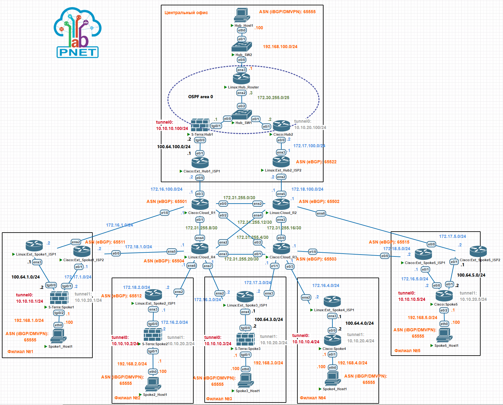

# Построение территориально распределенной сети компании при помощи технологии DMVPN на оборудовании "С-Терра Шлюз" 5.0 и маршрутизаторах Cisco Systems

## Цель

Проверить на совместимость реализацию технологии DMVPN в оборудовании "С-Терра Шлюз" 5.0 с маршрутизаторами Cisco Systems на типовых схемах

## Задание

1. Настроить DMVPN на необходимых устройствах "С-Терра Шлюз" 5.0 и Cisco Router
1. Все устройства в LAN сегментах должны иметь IP связность

## Топология

## Схема для импорта в PNETlab

[Схема для импорта в PNETlab](media/_Exports_pnetlab_export-20250319-232456.zip)

## Версии ПО

- PNETlab - 5.3.11
- "С-Терра Шлюз" версии 5.0
- Роутеры - Cisco IOS Software, Linux Software (I86BI_LINUX-ADVENTERPRISEK9-M), Version 15.4(2)T4
- Коммутаторы - Cisco IOS Software, Linux Software (I86BI_LINUXL2-ADVENTERPRISEK9-M), Version 15.2(CML_NIGHTLY_20150703)
- ПК - VPC

## Общее описание

1. В центральном офисе размещаются два хаба, один на криптошлюзе "С-Терра Шлюз" 5.0 (имя устройства на схеме - S-Terra:Hub1), второй на Cisco Router (Cisco:Hub2).  
      - Архитектура DMVPN - Dual Hub Dual Cloud, Phase 2, iBGP.  
      - Первый хаб S-Terra:Hub1 обслуживает cloud\mGRE - 10.10.10.0/24, второй хаб Cisco:Hub2 - обслуживает cloud\mGRE - 10.10.20.0/24.
      Хабы подключены к двум разным Интернет провайдерам.  
      - Первый хаб S-Terra:Hub1 находится за статическим NAT (реализуется на устройстве Cisco:Ext_Hub1_ISP1),  
      для трафика второго хаба Cisco:Hub2 трансляция адресов (NAT) не осуществляется.  
      - NBMA (WAN) адреса первого и второго Интернет провайдера, соответственно 172.16.100.2/24 и 172.17.100.2/24.  
      - Защищаемая LAN подсеть - 192.168.100.0/24.

1. Где-то в сети Интернет, которая эмулируется устройствами Cloud_R1, Cloud_R2, Cloud_R3, Cloud_R4, размещаются филиальные устройства (споки).  
      Спок в первом филиале, представлен устройством "С-Терра Шлюз" 5.0 (имя устройства на схеме - S-Terra:Spoke1) и подключен к двум разным  Интернет провайдерам (устройства
      Cisco:Ext_Spoke1_ISP1 и Cisco:Ext_Spoke1_ISP2) в режиме основной\резервный. Устройство Cisco:Ext_Spoke1_ISP1 осуществляет статическую трансляцию адресов (NAT).  
      - Защищаемая LAN подсеть - 192.168.1.0/24.  
      - NBMA (WAN) адреса первого и второго Интернет провайдера, соответственно 172.16.1.2/24 и 172.17.1.2/24.

1. Спок во втором филиале, представлен устройством "С-Терра Шлюз" 5.0 (имя устройства на схеме - S-Terra:Spoke2) и подключен к одному Интернет провайдеру (устройство
      Cisco:Ext_Spoke2_ISP1). Устройство Cisco:Ext_Spoke2_ISP1 не осуществляет трансляцию адресов (NAT).
      - Защищаемая LAN подсеть - 192.168.2.0/24.
      - NBMA (WAN) адрес 172.16.2.2/24.

1. Спок в третьем филиале, представлен устройством "С-Терра Шлюз" 5.0 (имя устройства на схеме - S-Terra:Spoke3) и подключен к двум разным Интернет провайдерам, но посредством  одного роутера (устройство Linux:Ext_Spoke3_ISP1), в режиме основной\резервный. Устройство Linux:Ext_Spoke3_ISP1 осуществляет статическую трансляцию адресов (NAT).
      - Защищаемая LAN подсеть - 192.168.3.0/24.
      - NBMA (WAN) адреса первого и второго Интернет провайдера, соответственно 172.16.3.2/24 и 172.17.3.2/24.

1. Спок в четвертом филиале, представлен устройством Cisco Router (имя устройства на схеме - Cisco:Spoke4) и подключен к одному Интернет провайдеру (устройство
Linux:Ext_Spoke4_ISP1). Устройство Linux:Ext_Spoke4_ISP осуществляет статическую трансляцию адресов (NAT).
      - Защищаемая LAN подсеть - 192.168.4.0/24.
      - NBMA (WAN) адрес 172.16.4.2/24.

1. Спок в пятом филиале, представлен устройством Cisco Router (имя устройства на схеме - Cisco:Spoke5) и подключен к двум разным Интернет провайдерам (устройства
Cisco:Ext_Spoke5_ISP1 и Cisco:Ext_Spoke5_ISP2) в режиме основной\резервный. Устройство Cisco:Ext_Spoke5_ISP1 осуществляет статическую трансляцию адресов (NAT), Cisco:Ext_Spoke5_ISP2 не осуществляет.
      - Защищаемая LAN подсеть - 192.168.5.0/24.
      - NBMA (WAN) адреса первого и второго Интернет провайдера, соответственно 172.16.5.2/24 и 172.17.5.2/24.