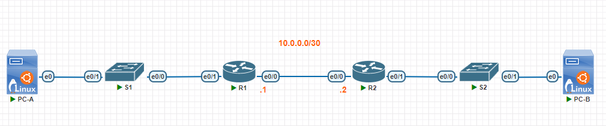

# Настройка DHCPv4/v6 

## Задание

[Ссылка на документ #1](media/lab03#1.docx)

[Ссылка на документ #2](media/lab03#2.docx)

## Топология




[Схема для импорта в PNETlab](media/otus_cource_lab3_dhcp_pnetlab_export-20241019-154224.zip)

## Версии ПО

- PNETlab - 5.3.11
- Роутеры - Cisco IOS Software [Dublin], Linux Software (X86_64BI_LINUX-ADVENTERPRISEK9-M), Version  17.12.1, RELEASE SOFTWARE (fc5)
- Коммутаторы - Cisco IOS Software [Dublin], Linux Software (X86_64BI_LINUX_L2-ADVENTERPRISEK9-M), Version 17.12.1, RELEASE SOFTWARE (fc5)
- ПК - Debian 12 x86_64

## Таблица №1. Адресация (IPv4)

Device | Interface	| IP Address | Subnet Mask	| Default Gateway
--- | --- | --- | --- | ---
R1 | e0/0 | 10.0.0.1 | 255.255.255.252	| N/A
R1 | e0/1 | N/A | N/A	| N/A
R1 | e0/1.100 | 192.168.1.1 | 255.255.255.192 (/26) | N/A
R1 | e0/1.200 | 192.168.1.65| 255.255.255.224 (/27) | N/A
R1 | e0/1.1000 |N/A	| N/A | N/A
R2 | e0/0	| 10.0.0.2	| 255.255.255.252 | N/A
R2 | e0/1	| 192.168.1.97 | 255.255.255.240 (/28) | N/A
S1 | VLAN 200 |	192.168.1.66 | 255.255.255.224 (/27) | 192.168.1.65 | 
S2 | VLAN 1	| 192.168.1.98 | 255.255.255.240 (/28)| 192.168.1.97
PC-A |	NIC | DHCP | DHCP | DHCP
PC-B |	NIC | DHCP | DHCP | DHCP

## Таблица №2. Адресация (IPv6)

Device | Interface	| IPv6 Address | Default Gateway
--- | --- | --- | --- 
R1 | e0/0 | 2001:db8:acad:2::1/64, fe80::1 | N/A
R1 | e0/1 | N/A | N/A
R1 | e0/1.100 | 2001:db8:acad:1::1/64, fe80::1 | N/A
R1 | e0/1.200 | N/A | N/A 
R1 | e0/1.1000 | N/A	| N/A
R2 | e0/0	| 2001:db8:acad:2::2/64, fe80::2	| N/A
R2 | e0/1	| 2001:db8:acad:3::1 /64, fe80::1 | N/A
S1 | VLAN 200 |	N/A | N/A 
S2 | VLAN 1	| N/A | N/A
PC-A |	NIC | DHCP | DHCP
PC-B |	NIC | DHCP | DHCP

## Таблица №3. VLAN

VLAN | Name	| Interface Assigned
--- | --- | ---
1	| N/A	| S2: e0/1
100	| Clients | S1: e0/1
200	| Management| S1: VLAN 200 
999	| Parking |	S1: e0/2-3
1000 | Native | N/A

## Проверка IPv4

### Проверим получение сетевых настроек (IPv4) на устройстве `PC-A`
```
root@PC-A:~# ip a
1: lo: <LOOPBACK,UP,LOWER_UP> mtu 65536 qdisc noqueue state UNKNOWN group default qlen 
1000
    link/loopback 00:00:00:00:00:00 brd 00:00:00:00:00:00
    inet 127.0.0.1/8 scope host lo
       valid_lft forever preferred_lft forever
    inet6 ::1/128 scope host noprefixroute 
       valid_lft forever preferred_lft forever
2: ens3: <BROADCAST,MULTICAST,UP,LOWER_UP> mtu 1500 qdisc fq_codel state UP group defau
lt qlen 1000
    link/ether 50:34:2e:00:29:00 brd ff:ff:ff:ff:ff:ff
    altname enp0s3
    inet 192.168.1.6/26 brd 192.168.1.63 scope global dynamic ens3
       valid_lft 217544sec preferred_lft 217544sec
    inet6 fe80::5234:2eff:fe00:2900/64 scope link 
       valid_lft forever preferred_lft forever
```

```
root@PC-A:~# ip r
default via 192.168.1.1 dev ens3 
192.168.1.0/26 dev ens3 proto kernel scope link src 192.168.1.6 
```

```
root@PC-A:~# ping 192.168.1.1 -c 4
PING 192.168.1.1 (192.168.1.1) 56(84) bytes of data.
64 bytes from 192.168.1.1: icmp_seq=1 ttl=255 time=1.08 ms
64 bytes from 192.168.1.1: icmp_seq=2 ttl=255 time=1.03 ms
64 bytes from 192.168.1.1: icmp_seq=3 ttl=255 time=1.08 ms
64 bytes from 192.168.1.1: icmp_seq=4 ttl=255 time=1.09 ms

--- 192.168.1.1 ping statistics ---
4 packets transmitted, 4 received, 0% packet loss, time 3004ms
rtt min/avg/max/mdev = 1.033/1.072/1.093/0.023 ms
```

### Проверим получение сетевых настроек (IPv4) на устройстве `PC-B`

```
root@PC-B:~# ifup ens3 
Internet Systems Consortium DHCP Client 4.4.3-P1
Copyright 2004-2022 Internet Systems Consortium.
All rights reserved.
For info, please visit https://www.isc.org/software/dhcp/

Listening on LPF/ens3/50:77:d8:00:2a:00
Sending on   LPF/ens3/50:77:d8:00:2a:00
Sending on   Socket/fallback
DHCPDISCOVER on ens3 to 255.255.255.255 port 67 interval 4
DHCPOFFER of 192.168.1.102 from 192.168.1.97
DHCPREQUEST for 192.168.1.102 on ens3 to 255.255.255.255 port 67
DHCPACK of 192.168.1.102 from 192.168.1.97
bound to 192.168.1.102 -- renewal in 84819 seconds.
```

```
root@PC-B:~# ip a
1: lo: <LOOPBACK,UP,LOWER_UP> mtu 65536 qdisc noqueue state UNKNOWN group default qlen 
1000
    link/loopback 00:00:00:00:00:00 brd 00:00:00:00:00:00
    inet 127.0.0.1/8 scope host lo
       valid_lft forever preferred_lft forever
    inet6 ::1/128 scope host noprefixroute 
       valid_lft forever preferred_lft forever
2: ens3: <BROADCAST,MULTICAST,UP,LOWER_UP> mtu 1500 qdisc fq_codel state UP group defau
lt qlen 1000
    link/ether 50:77:d8:00:2a:00 brd ff:ff:ff:ff:ff:ff
    altname enp0s3
    inet 192.168.1.102/28 brd 192.168.1.111 scope global dynamic ens3
       valid_lft 217721sec preferred_lft 217721sec
    inet6 fe80::5277:d8ff:fe00:2a00/64 scope link 
       valid_lft forever preferred_lft forever
```

```
root@PC-B:~# ip r
default via 192.168.1.97 dev ens3 
192.168.1.96/28 dev ens3 proto kernel scope link src 192.168.1.102 
```

```
root@PC-B:~# ping 192.168.1.97 -c 4
PING 192.168.1.97 (192.168.1.97) 56(84) bytes of data.
64 bytes from 192.168.1.97: icmp_seq=1 ttl=255 time=1.07 ms
64 bytes from 192.168.1.97: icmp_seq=2 ttl=255 time=1.03 ms
64 bytes from 192.168.1.97: icmp_seq=3 ttl=255 time=1.03 ms
64 bytes from 192.168.1.97: icmp_seq=4 ttl=255 time=0.999 ms

--- 192.168.1.97 ping statistics ---
4 packets transmitted, 4 received, 0% packet loss, time 3005ms
rtt min/avg/max/mdev = 0.999/1.031/1.067/0.024 ms
```

### Проверим информацию о работе DHCP сервера (IPv4) на устройстве `R1`

```
R1#show ip dhcp pool    

Pool R1_Client_LAN :
 Utilization mark (high/low)    : 100 / 0
 Subnet size (first/next)       : 0 / 0 
 Total addresses                : 62
 Leased addresses               : 1
 Excluded addresses             : 5
 Pending event                  : none
 1 subnet is currently in the pool :
 Current index        IP address range                    Leased/Excluded/Total
 192.168.1.7          192.168.1.1      - 192.168.1.62      1     / 5     / 62   

Pool R2_Client_LAN :
 Utilization mark (high/low)    : 100 / 0
 Subnet size (first/next)       : 0 / 0 
 Total addresses                : 14
 Leased addresses               : 1
 Excluded addresses             : 5
 Pending event                  : none
 1 subnet is currently in the pool :
 Current index        IP address range                    Leased/Excluded/Total
 192.168.1.103        192.168.1.97     - 192.168.1.110     1     / 5     / 14   
```

```
R1#show ip dhcp binding 
Bindings from all pools not associated with VRF:
IP address      Client-ID/ Lease expiration Type       State      Interface
Hardware address/
User name
192.168.1.6     ff2e.0029.0000.0100.    Oct 22 2024 04:53 AM    Automatic  Active     Ethernet0/1.100
                012e.a699.7750.342e.
                0029.00
192.168.1.102   ffd8.002a.0000.0100.    Oct 22 2024 05:08 AM    Automatic  Active     Ethernet0/0
                012e.a69c.5050.77d8.
                002a.00
```

Видно, что оба устройства `PC-A` и `PC-B` успешно получили сетевые настройки от DHCP сервера на `R1`.

## Проверка IPv6

### Проверим получение сетевых настроек (IPv6) при помощи SLAAC на устройстве `PC-A`

```
root@PC-A:~# cat /etc/network/interfaces
# This file describes the network interfaces available on your system
# and how to activate them. For more information, see interfaces(5).

source /etc/network/interfaces.d/*

# The loopback network interface
auto lo
iface lo inet loopback

# The primary network interface
allow-hotplug ens3
iface ens3 inet dhcp
iface ens3 inet6 auto 
```

```
root@PC-A:~# ip a
1: lo: <LOOPBACK,UP,LOWER_UP> mtu 65536 qdisc noqueue state UNKNOWN group default qlen 100
0
    link/loopback 00:00:00:00:00:00 brd 00:00:00:00:00:00
    inet 127.0.0.1/8 scope host lo
       valid_lft forever preferred_lft forever
    inet6 ::1/128 scope host noprefixroute 
       valid_lft forever preferred_lft forever
2: ens3: <BROADCAST,MULTICAST,UP,LOWER_UP> mtu 1500 qdisc fq_codel state UP group default 
qlen 1000
    link/ether 50:34:2e:00:29:00 brd ff:ff:ff:ff:ff:ff
    altname enp0s3
    inet 192.168.1.6/26 brd 192.168.1.63 scope global dynamic ens3
       valid_lft 216632sec preferred_lft 216632sec
    inet6 2001:db8:acad:1:5234:2eff:fe00:2900/64 scope global dynamic mngtmpaddr 
       valid_lft 2591968sec preferred_lft 604768sec
    inet6 fe80::5234:2eff:fe00:2900/64 scope link 
       valid_lft forever preferred_lft forever
```

```
root@PC-A:~# ip -6 r
2001:db8:acad:1::/64 dev ens3 proto kernel metric 256 expires 2591959sec pref medium
fe80::/64 dev ens3 proto kernel metric 256 pref medium
default via fe80::1 dev ens3 proto ra metric 1024 expires 1759sec hoplimit 64 pref medium
```


Видно, что адрес и маршрут по умолчанию успешно получены.

### Проверим получение сетевых настроек (IPv6) при помощи SLAAC + stateless DHCPv6 на устройстве `PC-A`

```
root@PC-A:~# cat /etc/network/interfaces
# This file describes the network interfaces available on your system
# and how to activate them. For more information, see interfaces(5).

source /etc/network/interfaces.d/*

# The loopback network interface
auto lo
iface lo inet loopback

# The primary network interface
allow-hotplug ens3
iface ens3 inet dhcp
iface ens3 inet6 auto 
 # Use stateless DHCPv6
 dhcp 1
```

```
root@PC-A:~# ip a
1: lo: <LOOPBACK,UP,LOWER_UP> mtu 65536 qdisc noqueue state UNKNOWN group default qlen 1
000
    link/loopback 00:00:00:00:00:00 brd 00:00:00:00:00:00
    inet 127.0.0.1/8 scope host lo
       valid_lft forever preferred_lft forever
    inet6 ::1/128 scope host noprefixroute 
       valid_lft forever preferred_lft forever
2: ens3: <BROADCAST,MULTICAST,UP,LOWER_UP> mtu 1500 qdisc fq_codel state UP group defaul
t qlen 1000
    link/ether 50:34:2e:00:29:00 brd ff:ff:ff:ff:ff:ff
    altname enp0s3
    inet 192.168.1.6/26 brd 192.168.1.63 scope global dynamic ens3
       valid_lft 216770sec preferred_lft 216770sec
    inet6 2001:db8:acad:1:5234:2eff:fe00:2900/64 scope global dynamic mngtmpaddr 
       valid_lft 2591959sec preferred_lft 604759sec
    inet6 fe80::5234:2eff:fe00:2900/64 scope link 
       valid_lft forever preferred_lft forever
```

```
root@PC-A:~# ip -6 r
2001:db8:acad:1::/64 dev ens3 proto kernel metric 256 expires 2591949sec pref medium
fe80::/64 dev ens3 proto kernel metric 256 pref medium
default via fe80::1 dev ens3 proto ra metric 1024 expires 1749sec hoplimit 64 pref medium
```

```
root@PC-A:~# cat /etc/resolv.conf 
search otus-labv6-stateless.com.
nameserver 2001:db8:acad::254
```

```
R1#show ipv6 dhcp statistics 
Messages received  41
Messages sent  41
Messages discarded  0
Messages could not be sent  0

Messages  Received
SOLICIT               35
INFORMATION-REQUEST   6

Messages  Sent
ADVERTISE             35
REPLY                 6
```

Видно, что адрес, маршрут по умолчанию, DNS сервер и domain-name успешно получены. Маршрутизатор `R1` отвечает по DHCPv6.

### Проверим получение сетевых настроек (IPv6) при помощи stateful DHCPv6 на устройстве `PC-B`

```
root@PC-B:~# cat /etc/network/interfaces
# This file describes the network interfaces available on your system
# and how to activate them. For more information, see interfaces(5).

source /etc/network/interfaces.d/*

# The loopback network interface
auto lo
iface lo inet loopback

# The primary network interface
allow-hotplug ens3
iface ens3 inet dhcp
iface ens3 inet6 dhcp 
 autoconf 0
# Disable Privacy Extensions for Stateless Address Autoconfiguration in IPv6 (RFC 4941|RFC 8981) 
up sysctl -w net.ipv6.conf.ens3.use_tempaddr=0
```

```
root@PC-B:~# ip a
1: lo: <LOOPBACK,UP,LOWER_UP> mtu 65536 qdisc noqueue state UNKNOWN group default qlen 
1000
    link/loopback 00:00:00:00:00:00 brd 00:00:00:00:00:00
    inet 127.0.0.1/8 scope host lo
       valid_lft forever preferred_lft forever
    inet6 ::1/128 scope host noprefixroute 
       valid_lft forever preferred_lft forever
2: ens3: <BROADCAST,MULTICAST,UP,LOWER_UP> mtu 1500 qdisc fq_codel state UP group defau
lt qlen 1000
    link/ether 50:77:d8:00:2a:00 brd ff:ff:ff:ff:ff:ff
    altname enp0s3
    inet 192.168.1.102/28 brd 192.168.1.111 scope global dynamic ens3
       valid_lft 217706sec preferred_lft 217706sec
    inet6 2001:db8:acad:3:aaa:ceae:28aa:cdf4/128 scope global dynamic 
       valid_lft 172706sec preferred_lft 86306sec
    inet6 fe80::5277:d8ff:fe00:2a00/64 scope link 
       valid_lft forever preferred_lft forever
```

```
root@PC-B:~# ip -6 r
2001:db8:acad:3:aaa:ceae:28aa:cdf4 dev ens3 proto kernel metric 256 expires 172680sec p
ref medium
2001:db8:acad:3::/64 dev ens3 proto kernel metric 256 expires 2591879sec pref medium
fe80::/64 dev ens3 proto kernel metric 256 pref medium
default via fe80::1 dev ens3 proto ra metric 1024 expires 1679sec hoplimit 64 pref medium
```

```
root@PC-B:~# cat /etc/resolv.conf 
search otus-labv6-stateful.com.
nameserver 2001:db8:acad::254
```

```
R1#show ipv6 dhcp binding 
Client: FE80::5277:D8FF:FE00:2A00 
  DUID: 000100012EA69C505077D8002A00
  Username : unassigned
  VRF : default
  IA NA: IA ID 0xD8002A00, T1 0, T2 0
    Address: 2001:DB8:ACAD:3:AAA:CEAE:28AA:CDF4
            preferred lifetime 86400, valid lifetime 172800
            expires at Oct 22 2024 02:03 PM (157504 seconds)
```


Видно, что адрес, маршрут по умолчанию, DNS сервер и domain-name успешно получены. Маршрутизатор `R1` выдал настройки по DHCPv6 (`2001:DB8:ACAD:3:AAA:CEAE:28AA:CDF4` - IPv6 адрес `PC-B`).

```
root@PC-B:~# ping 2001:DB8:ACAD:1::1 -c 4
PING 2001:DB8:ACAD:1::1(2001:db8:acad:1::1) 56 data bytes
64 bytes from 2001:db8:acad:1::1: icmp_seq=1 ttl=63 time=1.47 ms
64 bytes from 2001:db8:acad:1::1: icmp_seq=2 ttl=63 time=1.17 ms
64 bytes from 2001:db8:acad:1::1: icmp_seq=3 ttl=63 time=1.45 ms
64 bytes from 2001:db8:acad:1::1: icmp_seq=4 ttl=63 time=1.27 ms

--- 2001:DB8:ACAD:1::1 ping statistics ---
4 packets transmitted, 4 received, 0% packet loss, time 3005ms
rtt min/avg/max/mdev = 1.167/1.336/1.466/0.124 ms
```

```
root@PC-B:~# ping 2001:db8:acad:1:5234:2eff:fe00:2900 -c 4
PING 2001:db8:acad:1:5234:2eff:fe00:2900(2001:db8:acad:1:5234:2eff:fe00:2900) 56 data bytes
64 bytes from 2001:db8:acad:1:5234:2eff:fe00:2900: icmp_seq=1 ttl=62 time=2.16 ms
64 bytes from 2001:db8:acad:1:5234:2eff:fe00:2900: icmp_seq=2 ttl=62 time=2.04 ms
64 bytes from 2001:db8:acad:1:5234:2eff:fe00:2900: icmp_seq=3 ttl=62 time=1.98 ms
64 bytes from 2001:db8:acad:1:5234:2eff:fe00:2900: icmp_seq=4 ttl=62 time=1.95 ms

--- 2001:db8:acad:1:5234:2eff:fe00:2900 ping statistics ---
4 packets transmitted, 4 received, 0% packet loss, time 3006ms
rtt min/avg/max/mdev = 1.946/2.032/2.162/0.082 ms
```

Также видно, что с устройства `PC-B` доступны интерфейс `e0/1.100` роутера `R1` и устройство `PC-A`.

## Конфигурации устройств

### PC-A

<details>
  <summary>Конфигурация</summary>

```

Не фиксированы и меняются по ходу выполнения лабораторной работы (см. выше в примерах, файл /etc/network/interfaces)

```
</details>

### PC-B

<details>
  <summary>Конфигурация</summary>

```

Не фиксированы и меняются по ходу выполнения лабораторной работы (см. выше в примерах, файл /etc/network/interfaces)

```
</details>


### S1

<details>
  <summary>Конфигурация</summary>

```

!
! Last configuration change at 18:00:40 UTC Wed Oct 30 2024
!
version 17.12
service timestamps debug datetime msec
service timestamps log datetime msec
service password-encryption
!
hostname S1
!
boot-start-marker
boot-end-marker
!
!
no aaa new-model
!
!
!
no ip icmp rate-limit unreachable
!
!
!         
!
!
!
!
!
!
!
ip audit notify log
ip audit po max-events 100
no ip domain lookup
ip cef
login on-success log
no ipv6 cef
!
!
!
!
!
!
!
vtp version 1
multilink bundle-name authenticated
!         
crypto pki trustpoint TP-self-signed-67196929
 enrollment selfsigned
 subject-name cn=IOS-Self-Signed-Certificate-67196929
 revocation-check none
 rsakeypair TP-self-signed-67196929
 hash sha256
!
!
crypto pki certificate chain TP-self-signed-67196929
 certificate self-signed 01
  3082032C 30820214 A0030201 02020101 300D0609 2A864886 F70D0101 0B050030 
  2F312D30 2B060355 04030C24 494F532D 53656C66 2D536967 6E65642D 43657274 
  69666963 6174652D 36373139 36393239 301E170D 32343130 33303137 33353439 
  5A170D33 34313033 30313733 3534395A 302F312D 302B0603 5504030C 24494F53 
  2D53656C 662D5369 676E6564 2D436572 74696669 63617465 2D363731 39363932 
  39308201 22300D06 092A8648 86F70D01 01010500 0382010F 00308201 0A028201 
  0100BE40 4BCDC88E 27ABDBEB 95605A66 5391CEEF F2DAE9F6 09EBB464 2EF29FB2 
  0C144F7E 3E5879DD D828943F B67EF55A A7C4DD7C B6765C8E 6474B9E7 7B66B5E4 
  3E761D26 F734E12D 01FC8B94 CFE2B0E8 B9051342 1DC08DC8 BB938F42 D84324A9 
  00812259 5D089219 3682080A AC3C8517 2770701E 124E0824 00FA2FD7 8E14025D 
  8294A609 7A302FAB A43AABB1 5C39E8D4 B41693CD 9F9D5CEE 2617D10D 244D2C1E 
  1968C809 A888A8E3 E1D4B077 C293246A 950F2CDB B83F806D 4CEEFEF5 8916FA31 
  EEB232B6 EF7A9234 4DED821D 4B0C49AB 05391DCF 9DEDAB64 48ED95B5 B45B8D91 
  3FBD2477 6C191DC2 6D63E6D0 2128EBD3 4F27967C C26EAD93 0F0606D6 7C73391F 
  D8B10203 010001A3 53305130 1D060355 1D0E0416 0414CD89 3F2A59E0 CCE9FC32 
  FE088510 2FDB3E69 CF7E301F 0603551D 23041830 168014CD 893F2A59 E0CCE9FC 
  32FE0885 102FDB3E 69CF7E30 0F060355 1D130101 FF040530 030101FF 300D0609 
  2A864886 F70D0101 0B050003 82010100 3ECC83F2 E8C33E95 8702FFB6 BA5E5E7F 
  958A62B0 4BDC4597 050001D9 EF21E028 6F65A776 C349142F A2E7889F F7885EDD 
  877897BB 94C7DCE2 93AB6674 41BF41CC 07F90139 8B138561 505C3E05 7610F907 
  435ED529 7A973C7F 62ECE532 319E5073 C60DA118 A2C176B1 B37E8AE3 D17295E2 
  11D54E35 5CD6C9CC 724BA153 5960B37D 44A82DF6 2E96D55A 12860EF7 4CA8EB1B 
  7995684B 87D11F2C 24A2DCD2 638ACC5A 5CC00A0F 4834B6AD 2C91E8A2 AD023EB1 
  6F1D8074 1A9E4EDF 91FBD304 E25B743A 52379E00 25518B13 96BDC810 7B0E2EFA 
  4D13BCBB CD564FA7 8CA8A856 61383E50 C6B3ACDC F8496834 9E86D725 C1644BD4 
  B159C2EF A3419721 1B09FF3B CA92CB50
  quit
!
!
memory free low-watermark processor 80589
!
!
spanning-tree mode rapid-pvst
spanning-tree extend system-id
enable secret 9 $9$qCbcn8rSrppGU.$.XG6MN6mDba9gCU87suDtw9k2TkotTWgCsUEiPmqArI
!         
!
vlan internal allocation policy ascending
no cdp log mismatch duplex
!
!
!
!
!
interface Ethernet0/0
 switchport trunk encapsulation dot1q
 switchport trunk native vlan 1000
 switchport trunk allowed vlan 1,100,200,1000
 switchport mode trunk
!
interface Ethernet0/1
 switchport access vlan 100
!
interface Ethernet0/2
 switchport access vlan 999
 switchport mode access
 shutdown
!
interface Ethernet0/3
 switchport access vlan 999
 switchport mode access
 shutdown
!
interface Vlan200
 description Management
 ip address 192.168.1.66 255.255.255.224
!
ip forward-protocol nd
!
!
ip tcp synwait-time 5
ip http server
ip http secure-server
ip ssh bulk-mode 131072
ip route 0.0.0.0 0.0.0.0 192.168.1.65
!
!
!
!
!
!
control-plane
!
!
banner motd ^CC 
Unauthorized access is strictly prohibited and prosecuted to the full extent of the law
.
^C
!
line con 0
 exec-timeout 0 0
 privilege level 15
 password 7 060506324F41
 logging synchronous
line aux 0
 exec-timeout 0 0
 privilege level 15
 logging synchronous
line vty 0 4
 password 7 060506324F41
 login
 transport input ssh
!
!
end       


```
</details>

### S2

<details>
  <summary>Конфигурация</summary>

```
!
! Last configuration change at 16:05:27 UTC Sat Oct 19 2024
!
version 17.12
service timestamps debug datetime msec
service timestamps log datetime msec
service password-encryption
!
hostname S2
!
boot-start-marker
boot-end-marker
!
!
no aaa new-model
!
!
!
no ip icmp rate-limit unreachable
!
!
!         
!
!
!
!
!
!
!
ip audit notify log
ip audit po max-events 100
no ip domain lookup
ip cef
login on-success log
no ipv6 cef
!
!
!
!
!
!
!
vtp version 1
multilink bundle-name authenticated
!         
!
!
!
memory free low-watermark processor 80589
!
!
spanning-tree mode rapid-pvst
spanning-tree extend system-id
enable secret 9 $9$g37H4lgSqYNCHk$VqKK4v/PFlQ0N6z7XzP7aUribbmPLuu3MwGSxarBcAw
!
!
vlan internal allocation policy ascending
no cdp log mismatch duplex
!
!
!
!
!
interface Ethernet0/0
!
interface Ethernet0/1
!
interface Ethernet0/2
 switchport access vlan 999
 switchport mode access
 shutdown
!
interface Ethernet0/3
 switchport access vlan 999
 switchport mode access
 shutdown
!
interface Vlan1
 ip address 192.168.1.98 255.255.255.240
!
ip forward-protocol nd
!
!
ip tcp synwait-time 5
ip http server
ip http secure-server
ip ssh bulk-mode 131072
ip route 0.0.0.0 0.0.0.0 192.168.1.97
!
!         
!
!
!
control-plane
!
!
banner motd ^CC 
Unauthorized access is strictly prohibited and prosecuted to the full extent of the law.
^C
!
line con 0
 exec-timeout 0 0
 privilege level 15
 password 7 02050D480809
 logging synchronous
line aux 0
 exec-timeout 0 0
 privilege level 15
 logging synchronous
line vty 0 4
 password 7 060506324F41
 login    
 transport input ssh
!
!
end

```
</details>

### R1

<details>
  <summary>Конфигурация</summary>

```

!
! Last configuration change at 15:28:48 UTC Sun Oct 20 2024
!
version 17.12
service timestamps debug datetime msec
service timestamps log datetime msec
service password-encryption
!
hostname R1
!
boot-start-marker
boot-end-marker
!
!
no aaa new-model
!
!
!
no ip icmp rate-limit unreachable
!
!
!         
!
!
!
!
ip dhcp excluded-address 192.168.1.1 192.168.1.5
ip dhcp excluded-address 192.168.1.97 192.168.1.101
!
ip dhcp pool R1_Client_LAN
 network 192.168.1.0 255.255.255.192
 domain-name otus-lab.com
 default-router 192.168.1.1 
 lease 2 12 30
!
ip dhcp pool R2_Client_LAN
 network 192.168.1.96 255.255.255.240
 domain-name otus-lab.com
 default-router 192.168.1.97 
 lease 2 12 30
!
!
!
no ip domain lookup
ip cef    
login on-success log
ipv6 unicast-routing
ipv6 dhcp pool R1-STATELESS
 dns-server 2001:DB8:ACAD::254
 domain-name otus-labv6-stateless.com
!
ipv6 dhcp pool R2-STATEFUL
 address prefix 2001:DB8:ACAD:3:AAA::/80
 dns-server 2001:DB8:ACAD::254
 domain-name otus-labv6-stateful.com
!
ipv6 cef
!
!
!
!
!
!
!
!
multilink bundle-name authenticated
!
!         
!
!
!
memory free low-watermark processor 81225
!
!
spanning-tree mode rapid-pvst
!
enable secret 9 $9$BslQEJTy6e3oGU$RhW42o0m2bznTWp1t3dhe1jGmo975simSuWIjMiWb1c
!
!
!
!
!
no cdp log mismatch duplex
!
! 
!
!
!
!
!
!         
!
!
!
!
!
!
!
!
!
interface Ethernet0/0
 ip address 10.0.0.1 255.255.255.252
 ipv6 address FE80::1 link-local
 ipv6 address 2001:DB8:ACAD:2::1/64
 ipv6 dhcp server R2-STATEFUL
!
interface Ethernet0/1
 no ip address
 ipv6 nd other-config-flag
 ipv6 dhcp server R1-STATELESS
!
interface Ethernet0/1.100
 description Clients
 encapsulation dot1Q 100
 ip address 192.168.1.1 255.255.255.192
 ipv6 address FE80::1 link-local
 ipv6 address 2001:DB8:ACAD:1::1/64
 ipv6 nd other-config-flag
 ipv6 dhcp server R1-STATELESS
!
interface Ethernet0/1.200
 description Management
 encapsulation dot1Q 200
 ip address 192.168.1.65 255.255.255.224
!
interface Ethernet0/1.1000
 description Native
 encapsulation dot1Q 1000 native
!
interface Ethernet0/2
 no ip address
!
interface Ethernet0/3
 no ip address
!
ip forward-protocol nd
!         
ip tcp synwait-time 5
!
ip http server
ip http secure-server
ip route 0.0.0.0 0.0.0.0 10.0.0.2
ip ssh bulk-mode 131072
!
ipv6 route 2001:DB8:ACAD::254/128 Null0
ipv6 route ::/0 2001:DB8:ACAD:2::2
!
!
!
!
control-plane
!
!
banner motd ^CC 
Unauthorized access is strictly prohibited and prosecuted to the full extent of the law.
^C
!
line con 0
 exec-timeout 0 0
 privilege level 15
 password 7 00071A150754
 logging synchronous
line aux 0
 exec-timeout 0 0
 privilege level 15
 logging synchronous
line vty 0 4
 password 7 05080F1C2243
 login
 transport input ssh
!
!
!
!
end

```
</details>

### R2

<details>
  <summary>Конфигурация</summary>

```

!
! Last configuration change at 14:02:55 UTC Sun Oct 20 2024
!
version 17.12
service timestamps debug datetime msec
service timestamps log datetime msec
service password-encryption
!
hostname R2
!
boot-start-marker
boot-end-marker
!
!
no aaa new-model
!
!
!
no ip icmp rate-limit unreachable
!
!
!         
!
!
!
!
!
!
!
no ip domain lookup
ip cef
login on-success log
ipv6 unicast-routing
ipv6 cef
!
!
!
!
!
!
!
!
multilink bundle-name authenticated
!
!         
!
!
!
memory free low-watermark processor 81225
!
!
spanning-tree mode rapid-pvst
!
enable secret 9 $9$auCQL.1mehoAv.$vOLKM2i14qBaWnjOTFcAuqK6Z3rI7a04duhbax6a3iQ
!
!
!
!
!
no cdp log mismatch duplex
!
! 
!
!
!
!
!
!         
!
!
!
!
!
!
!
!
!
interface Ethernet0/0
 ip address 10.0.0.2 255.255.255.252
 ipv6 address FE80::2 link-local
 ipv6 address 2001:DB8:ACAD:2::2/64
!
interface Ethernet0/1
 ip address 192.168.1.97 255.255.255.240
 ip helper-address 10.0.0.1
 ipv6 address FE80::1 link-local
 ipv6 address 2001:DB8:ACAD:3::1/64
 ipv6 nd managed-config-flag
 ipv6 dhcp relay destination 2001:DB8:ACAD:2::1 Ethernet0/0
!
interface Ethernet0/2
 no ip address
!
interface Ethernet0/3
 no ip address
!
ip forward-protocol nd
!
ip tcp synwait-time 5
!
ip http server
ip http secure-server
ip route 0.0.0.0 0.0.0.0 10.0.0.1
ip ssh bulk-mode 131072
!
ipv6 route ::/0 2001:DB8:ACAD:2::1
!
!
!
!
control-plane
!
!
banner motd ^CC 
Unauthorized access is strictly prohibited and prosecuted to the full extent of the law.
^C
!
line con 0
 exec-timeout 0 0
 privilege level 15
 password 7 00071A150754
 logging synchronous
line aux 0
 exec-timeout 0 0
 privilege level 15
 logging synchronous
line vty 0 4
 password 7 060506324F41
 login
 transport input ssh
!
!
!
!
end
     

```
</details>
