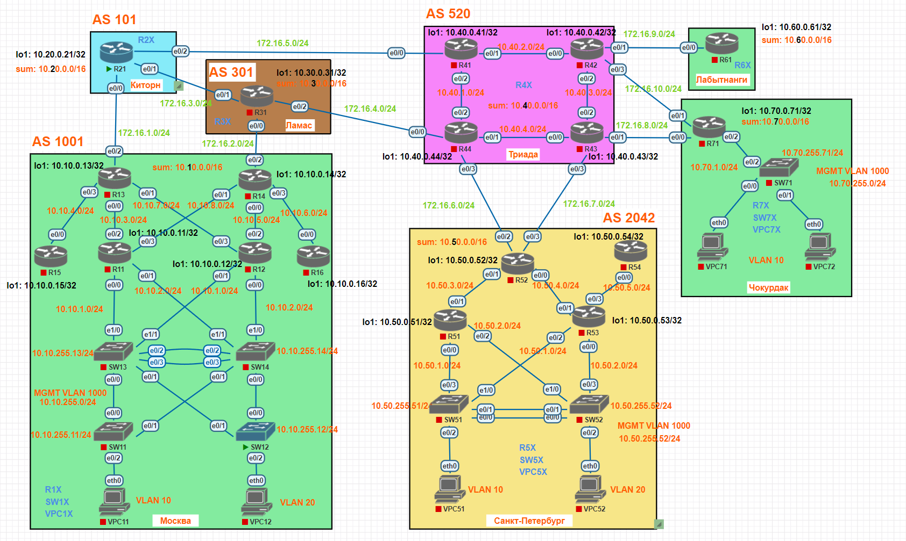

# Планирование адресного пространства 

## Задание

В данной работе необходимо распланировать адресное пространство.
Адресное пространство должно быть задокументировано.

## Топология

[Схема для импорта в PNETlab](media/otus_cource_lab4_net_planning_pnetlab_export-20241215-175132.zip)

## Версии ПО

- PNETlab - 5.3.11
- Роутеры - Cisco IOS Software, Linux Software (I86BI_LINUX-ADVENTERPRISEK9-M), Version 15.4(2)T4
- Коммутаторы - Cisco IOS Software, Linux Software (I86BI_LINUXL2-ADVENTERPRISEK9-M), Version 15.2(CML_NIGHTLY_20150703)
- ПК - VPC

## План адресного пространства
В данной работе используется только IPv4.  

### Подсети для офисов и наименование устройств
Для офисов выделены подсети с префиксом 16 (для маленьких офисов это с большим запасом).
1. Для Офиса "Москва" выделена подсеть 10.10.0.0/16, наименование устройств R1X, SW1X,VPC1X.
1. Для Офиса "Киторн" выделена подсеть 10.20.0.0/16, наименование устройств R2X, SW2X, VPC2X.
1. Для Офиса "Ламас" выделена подсеть 10.30.0.0/16, наименование устройств R3X, SW3X,VPC3X. 
1. Для Офиса "Триада" выделена подсеть 10.40.0.0/16, наименование устройств R4X, SW4X, VPC4X.
1. Для Офиса "Санкт-Петербург" выделена подсеть 10.50.0.0/16, наименование устройств R5X, SW5X, VPC5X.
1. Для Офиса "Лабытнанги " выделена подсеть 10.60.0.0/16, наименование устройств R6X, SW6X, VPC6X.
1. Для Офиса "Чокурдак " выделена подсеть 10.70.0.0/16, наименование устройств R7X, SW7X, VPC7X.

### Подсети линков между офисами
Для взаимодействия между офисами используются подсети 172.16.1.0/24 - 172.16.10.0/24

### Таблица с планом адресного пространства
Location | Device | Interface | IPv4 | IPv4 sum net | IPv6 | IPv6 sum net 
--- | --- | --- | --- | --- | --- | ---
Москва | R11 | lo1 | 10.10.0.11/32 | 10.10.0.0/16 | - | - 
Москва | R11 | e0/0.10 | 10.10.1.253/24 | 10.10.0.0/16 | - | - 
Москва | R11 | e0/0.1000 | 10.10.255.253/24 | 10.10.0.0/16 | - | - 
Москва | R11 | e0/0.20 | 10.10.2.253/24 | 10.10.0.0/16 | - | - 
Москва | R11 | e0/1 | 10.10.9.11/24 | 10.10.0.0/16 | - | - 
Москва | R11 | e0/2 | 10.10.3.11/24 | 10.10.0.0/16 | - | - 
Москва | R11 | e0/3 | 10.10.8.11/24 | 10.10.0.0/16 | - | - 
Москва | R12 | lo1 | 10.10.0.12/32 | 10.10.0.0/16 | - | - 
Москва | R12 | e0/0.20 | 10.10.2.254/24 | 10.10.0.0/16 | - | - 
Москва | R12 | e0/0.1000 | 10.10.255.254/24 | 10.10.0.0/16 | - | - 
Москва | R12 | e0/0.10 | 10.10.1.254/24 | 10.10.0.0/16 | - | - 
Москва | R12 | e0/1 | 10.10.9.12/24 | 10.10.0.0/16 | - | - 
Москва | R12 | e0/2 | 10.10.5.12/24 | 10.10.0.0/16 | - | - 
Москва | R12 | e0/3 | 10.10.7.12/24 | 10.10.0.0/16 | - | -
Москва | R13 | lo1 | 10.10.0.13/32 | 10.10.0.0/16 | - | - 
Москва | R13 | e0/0 | 10.10.3.13/24 | 10.10.0.0/16 | - | - 
Москва | R13 | e0/1 | 10.10.7.13/24 | 10.10.0.0/16 | - | - 
Москва | R13 | e0/2 | 172.16.1.13/24 | - | - | - 
Москва | R13 | e0/3 | 10.10.4.13/24 | 10.10.0.0/16 | - | -  
Москва | R14 | lo1 | 10.10.0.14/32 | 10.10.0.0/16 | - | - 
Москва | R14 | e0/0 | 10.10.5.14/24 | 10.10.0.0/16 | - | - 
Москва | R14 | e0/1 | 10.10.8.14/24 | 10.10.0.0/16 | - | - 
Москва | R14 | e0/2 | 172.16.2.14/24 | - | - | - 
Москва | R14 | e0/3 | 10.10.6.14/24 | 10.10.0.0/16 | - | -  
Москва | R15 | lo1 | 10.10.0.15/32 | 10.10.0.0/16 | - | - 
Москва | R15 | e0/0 | 10.10.4.15/24 | 10.10.0.0/16 | - | - 
Москва | R16 | lo1 | 10.10.0.16/32 | 10.10.0.0/16 | - | - 
Москва | R16 | e0/0 | 10.10.6.16/24 | 10.10.0.0/16 | - | - 
Москва | SW11 | vlan1000 | 10.10.255.11/24 | 10.10.0.0/16 | - | - 
Москва | SW12 | vlan1000 | 10.10.255.12/24 | 10.10.0.0/16 | - | - 
Москва | SW13 | vlan1000 | 10.10.255.13/24 | 10.10.0.0/16 | - | - 
Москва | SW14 | vlan1000 | 10.10.255.14/24 | 10.10.0.0/16 | - | - 
Москва | VPC11 | eth0 | 10.10.1.11/24 | 10.10.0.0/16 | - | - 
Москва | VPC12 | eth0 | 10.10.2.12/24 | 10.10.0.0/16 | - | - 
Киторн | R21 | lo1 | 10.20.0.21/32 | 10.20.0.0/16 | - | - 
Киторн | R21 | e0/0 | 172.16.1.21/24 | - | - | - 
Киторн | R21 | e0/1 | 172.16.3.21/24 | - | - | - 
Киторн | R21 | e0/2 | 172.16.5.21/24 | - | - | - 
Ламас | R31 | lo1 | 10.30.0.21/32 | 10.30.0.0/16 | - | - 
Ламас | R31 | e0/0 | 172.16.2.31/24 | - | - | - 
Ламас | R31 | e0/1 | 172.16.3.31/24 | - | - | - 
Ламас | R31 | e0/2 | 172.16.4.31/24 | - | - | - 
Триада | R41 | lo1 | 10.40.0.41/32 | 10.40.0.0/16 | - | - 
Триада | R41 | e0/0 | 172.16.5.41/24 | - | - | - 
Триада | R41 | e0/1 | 10.40.2.41/24 | 10.40.0.0/16 | - | - 
Триада | R41 | e0/2 | 10.40.1.41/24 | 10.40.0.0/16 | - | - 
Триада | R42 | lo1 | 10.40.0.42/32 | 10.40.0.0/16 | - | - 
Триада | R42 | e0/0 | 10.40.2.42/24 | - | - | - 
Триада | R42 | e0/1 | 172.16.9.42/24 | - | - | - 
Триада | R42 | e0/2 | 10.40.3.42/24 | 10.40.0.0/16 | - | - 
Триада | R42 | e0/3 | 172.16.10.42/24 | - | - | - 
Триада | R43 | lo1 | 10.40.0.43/32 | 10.40.0.0/16 | - | - 
Триада | R43 | e0/0 | 10.40.4.43/24 | 10.40.0.0/16 | - | - 
Триада | R43 | e0/1 | 172.16.8.43/24 | - | - | - 
Триада | R43 | e0/2 | 10.40.3.43/24 | 10.40.0.0/16 | - | - 
Триада | R43 | e0/3 | 172.16.7.43/24 | - | - | - 
Триада | R44 | lo1 | 10.40.0.44/32 | 10.40.0.0/16 | - | - 
Триада | R44 | e0/0 | 172.16.4.44/24| - | - | - 
Триада | R44 | e0/1 | 10.40.4.44/24 | 10.40.0.0/16 | - | - 
Триада | R44 | e0/2 | 10.40.1.44/24 | 10.40.0.0/16 | - | - 
Триада | R44 | e0/3 | 172.16.6.44/24 | - | - | - 
Санкт-Петербург | R51 | lo1 | 10.50.0.51/32 | 10.50.0.0/16 | - | - 
Санкт-Петербург | R51 | e0/0.10 | 10.50.1.253/24 | 10.50.0.0/16 | - | - 
Санкт-Петербург | R51 | e0/0.20 | 10.50.2.253/24 | 10.50.0.0/16 | - | - 
Санкт-Петербург | R51 | e0/0.1000 | 10.50.255.253/24 | 10.50.0.0/16 | - | - 
Санкт-Петербург | R51 | e0/1 | 10.50.3.51/24 | 10.50.0.0/16 | - | - 
Санкт-Петербург | R51 | e0/2 | 10.50.6.51/24 | 10.50.0.0/16 | - | - 
Санкт-Петербург | R52 | lo1 | 10.50.0.52/32 | 10.50.0.0/16 | - | - 
Санкт-Петербург | R52 | e0/0 | 10.50.4.52/24 | 10.50.0.0/16 | - | - 
Санкт-Петербург | R52 | e0/1 | 10.50.3.52/24 | 10.50.0.0/16 | - | - 
Санкт-Петербург | R52 | e0/2 | 172.16.6.52/24 | - | - | - 
Санкт-Петербург | R52 | e0/3 | 172.16.7.52/24 | - | - | - 
Санкт-Петербург | R53 | lo1 | 10.50.0.53/32 | 10.50.0.0/16 | - | - 
Санкт-Петербург | R53 | e0/0.10 | 10.50.1.254/24 | 10.50.0.0/16 | - | - 
Санкт-Петербург | R53 | e0/0.20 | 10.50.2.254/24 | 10.50.0.0/16 | - | - 
Санкт-Петербург | R53 | e0/0.1000 | 10.50.255.254/24 | 10.50.0.0/16 | - | - 
Санкт-Петербург | R53 | e0/1 | 10.50.4.53/24 | 10.50.0.0/16 | - | - 
Санкт-Петербург | R53 | e0/2 | 10.50.6.53/24 | 10.50.0.0/16 | - | - 
Санкт-Петербург | R53 | e0/3 | 10.50.5.53/24 | 10.50.0.0/16 | - | - 
Санкт-Петербург | R54 | lo1 | 10.50.0.54/32 | 10.50.0.0/16 | - | - 
Санкт-Петербург | R54 | e0/0 | 10.50.5.54/24 | 10.50.0.0/16 | - | - 
Санкт-Петербург | SW51 | vlan1000 | 10.50.255.51/24 | 10.50.0.0/16 | - | - 
Санкт-Петербург | SW52 | vlan1000 | 10.50.255.52/24 | 10.50.0.0/16 | - | - 
Санкт-Петербург | VPC51 | eth0 | 10.50.1.51/24 | 10.50.0.0/16 | - | - 
Санкт-Петербург | VPC52 | eth0 | 10.50.2.52/24 | 10.50.0.0/16 | - | - 
Лабытнанги | R61 | lo1 | 10.60.0.61/32 | 10.60.0.0/16 | - | - 
Лабытнанги | R61 | e0/0 | 172.16.9.61/24 | - | - | - 
Чокурдак | R71 | lo1 | 10.70.0.71/32 | 10.70.0.0/16 | - | - 
Чокурдак | R71 | e0/0 | 172.16.8.71/24 | - | - | - 
Чокурдак | R71 | e0/1 | 172.16.10.71/24 | - | - | - 
Чокурдак | R71 | e0/2.10 | 10.70.1.1/24 | 10.70.0.0/16 | - | - 
Чокурдак | R71 | e0/2.1000 | 10.70.255.1/24 | 10.70.0.0/16 | - | - 
Чокурдак | SW71 | vlan1000 | 10.70.255.71/24 | 10.70.0.0/16 | - | -
Чокурдак | VPC71 | eth0 | 10.70.1.71/24 | 10.70.0.0/16 | - | - 
Чокурдак | VPC72 | eth0 | 10.70.1.72/24 | 10.70.0.0/16 | - | -
