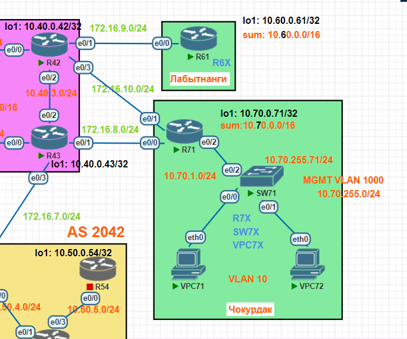

# IP SLA и PBR

## Задание

1. Настроить в офисе Чокурдах адресацию и политику маршрутизации, распределив трафик между двумя каналами (провайдерами\ISP) при помощи механизмов IP SLA и PBR.
2. Настроить в офисе Лабытнанги адресацию и маршрут по умолчанию.

## Топология



[Схема для импорта в PNETlab](media/otus_cource_lab5_ip_sla_pbr_pnetlab_export-20241117-174525.zip)

## Версии ПО

- PNETlab - 5.3.11
- Роутеры - Cisco IOS Software, Linux Software (I86BI_LINUX-ADVENTERPRISEK9-M), Version 15.4(2)T4
- Коммутаторы - Cisco IOS Software, Linux Software (I86BI_LINUXL2-ADVENTERPRISEK9-M), Version 15.2(CML_NIGHTLY_20150703)
- ПК - VPC

## Логика работы IP SLA и PBR в офисе Чокурдак на R71

### Задача:
Настроить резервирование маршрута по умолчанию в логике основной (172.16.8.43)\резервный (172.16.10.42).

### Решение с пояснением:
Пингуем хост 10.40.0.43 (Loopback1 на R43) с интерфейса Loopback1 раз в 1 секунду с таймаутом 1 в секунду с ToS 46 (EF).  
Если в течении 10 секунд объект мониторинга перешел в состояние down и не поднялся в течение 10 секунд, переводим track в состояние down.  
Если объект был в состоянии down, но поднялся и находится в поднятом состоянии в течении 10 секунд, переводим track в состояние up.  
PBR (local) используется для того, чтобы проверять доступность хоста 10.40.0.43 исключительно через next-hop (172.16.8.43) основного провайдера.  
Это нужно чтобы объект track не переходил в up, когда маршрут по умолчанию будет через резервного провайдера, так как хост 10.40.0.43 также доступен через него.  

### Конфигурация на R71
```
ip sla 1
 icmp-echo 10.40.0.43 source-interface Loopback1
 tos 46
 threshold 1000
 timeout 1000
 frequency 1
ip sla schedule 1 life forever start-time now
!
track 1 ip sla 1 reachability
 delay down 10 up 10
!
ip route 0.0.0.0 0.0.0.0 172.16.8.43 track 1
ip route 0.0.0.0 0.0.0.0 172.16.10.42 100
!
ip access-list extended SLA
 permit icmp host 10.70.0.71 host 10.40.0.43
!
route-map SLA permit 10
 description SLA
 match ip address SLA
 set ip next-hop 172.16.8.43
!
ip local policy route-map SLA
!
```

## Конфигурации устройств

### R42

<details>
  <summary>Конфигурация</summary>

```

version 15.4
service timestamps debug datetime msec
service timestamps log datetime msec
no service password-encryption
!
hostname R42
!
boot-start-marker
boot-end-marker
!
!
!
no aaa new-model
mmi polling-interval 60
no mmi auto-configure
no mmi pvc
mmi snmp-timeout 180
!
!
!
!
!
!
!
!


!
!
!
!
no ip domain lookup
ip cef
no ipv6 cef
!
multilink bundle-name authenticated
!
!
!
!
!
!
!
!
!
redundancy
!
!
!
!
!
!
!
!
!
!
!
!
!
!
!
interface Loopback1
 ip address 10.40.0.42 255.255.255.255
!
interface Ethernet0/0
 no ip address
 shutdown
!
interface Ethernet0/1
 ip address 172.16.9.42 255.255.255.0
!
interface Ethernet0/2
 no ip address
 shutdown
!
interface Ethernet0/3
 ip address 172.16.10.42 255.255.255.0
!
interface Ethernet1/0
 no ip address
 shutdown
!
interface Ethernet1/1
 no ip address
 shutdown
!
interface Ethernet1/2
 no ip address
 shutdown
!
interface Ethernet1/3
 no ip address
 shutdown
!
ip forward-protocol nd
!
!
no ip http server
no ip http secure-server
ip route 10.60.0.0 255.255.0.0 172.16.9.61
ip route 10.70.0.0 255.255.0.0 172.16.10.71
!
!
!
!
control-plane
!
!
!
!
!
!
!
!
line con 0
 logging synchronous
line aux 0
line vty 0 4
 login
 transport input none
!
!
end


```
</details>

### R43

<details>
  <summary>Конфигурация</summary>

```

version 15.4
service timestamps debug datetime msec
service timestamps log datetime msec
no service password-encryption
!
hostname R43
!
boot-start-marker
boot-end-marker
!
!
!
no aaa new-model
mmi polling-interval 60
no mmi auto-configure
no mmi pvc
mmi snmp-timeout 180
!
!
!
!
!
!
!
!


!
!
!
!
no ip domain lookup
ip cef
no ipv6 cef
!
multilink bundle-name authenticated
!
!
!
!
!
!
!
!
!
redundancy
!
!
!
!
!
!
!
!
!
!
!
!
!
!
!
interface Loopback1
 ip address 10.40.0.43 255.255.255.255
!
interface Ethernet0/0
 no ip address
 shutdown
!
interface Ethernet0/1
 ip address 172.16.8.43 255.255.255.0
!
interface Ethernet0/2
 no ip address
 shutdown
!
interface Ethernet0/3
 no ip address
 shutdown
!
interface Ethernet1/0
 no ip address
 shutdown
!
interface Ethernet1/1
 no ip address
 shutdown
!
interface Ethernet1/2
 no ip address
 shutdown
!
interface Ethernet1/3
 no ip address
 shutdown
!
ip forward-protocol nd
!
!
no ip http server
no ip http secure-server
ip route 10.70.0.0 255.255.0.0 172.16.8.71
!
!
!
!
control-plane
!
!
!
!
!
!
!
!
line con 0
 logging synchronous
line aux 0
line vty 0 4
 login
 transport input none
!
!
end


```
</details>

### R61

<details>
  <summary>Конфигурация</summary>

```

version 15.4
service timestamps debug datetime msec
service timestamps log datetime msec
no service password-encryption
!
hostname R61
!
boot-start-marker
boot-end-marker
!
!
!
no aaa new-model
mmi polling-interval 60
no mmi auto-configure
no mmi pvc
mmi snmp-timeout 180
!
!
!
!
!
!
!
!


!
!
!
!
no ip domain lookup
ip cef
no ipv6 cef
!
multilink bundle-name authenticated
!
!
!
!
!
!
!
!
!
redundancy
!
!
!
!
!
!
!
!
!
!
!
!
!
!
!
interface Loopback1
 ip address 10.60.0.61 255.255.255.255
!
interface Ethernet0/0
 ip address 172.16.9.61 255.255.255.0
!
interface Ethernet0/1
 no ip address
 shutdown
!
interface Ethernet0/2
 no ip address
 shutdown
!
interface Ethernet0/3
 no ip address
 shutdown
!
interface Ethernet1/0
 no ip address
 shutdown
!
interface Ethernet1/1
 no ip address
 shutdown
!
interface Ethernet1/2
 no ip address
 shutdown
!
interface Ethernet1/3
 no ip address
 shutdown
!
ip forward-protocol nd
!
!
no ip http server
no ip http secure-server
ip route 0.0.0.0 0.0.0.0 172.16.9.42
!
!
!
!
control-plane
!
!
!
!
!
!
!
!
line con 0
 logging synchronous
line aux 0
line vty 0 4
 login
 transport input none
!
!
end


```
</details>

### R71

<details>
  <summary>Конфигурация</summary>

```

version 15.4
service timestamps debug datetime msec
service timestamps log datetime msec
no service password-encryption
!
hostname R71
!
boot-start-marker
boot-end-marker
!
!
!
no aaa new-model
mmi polling-interval 60
no mmi auto-configure
no mmi pvc
mmi snmp-timeout 180
!
!
!
!
!
!
!
!


!
!
!
!
no ip domain lookup
ip cef
no ipv6 cef
!
multilink bundle-name authenticated
!
!
!
!
!
!
!
!
!
redundancy
!
!
track 1 ip sla 1 reachability
 delay down 10 up 10
!
!
!
!
!
!
!
!
!
!
!
!
!
!
interface Loopback1
 ip address 10.70.0.71 255.255.255.255
!
interface Ethernet0/0
 ip address 172.16.8.71 255.255.255.0
!
interface Ethernet0/1
 ip address 172.16.10.71 255.255.255.0
!
interface Ethernet0/2
 no ip address
!
interface Ethernet0/2.10
 encapsulation dot1Q 10
 ip address 10.70.1.1 255.255.255.0
!
interface Ethernet0/2.1000
 encapsulation dot1Q 1000
 ip address 10.70.255.1 255.255.255.0
!
interface Ethernet0/3
 no ip address
 shutdown
!
interface Ethernet1/0
 no ip address
 shutdown
!
interface Ethernet1/1
 no ip address
 shutdown
!
interface Ethernet1/2
 no ip address
 shutdown
!
interface Ethernet1/3
 no ip address
 shutdown
!
ip local policy route-map SLA
ip forward-protocol nd
!
!
no ip http server
no ip http secure-server
ip route 0.0.0.0 0.0.0.0 172.16.8.43 track 1
ip route 0.0.0.0 0.0.0.0 172.16.10.42 100
!
ip access-list extended SLA
 permit icmp host 10.70.0.71 host 10.40.0.43
!
ip sla 1
 icmp-echo 10.40.0.43 source-interface Loopback1
 tos 46
 threshold 1000
 timeout 1000
 frequency 1
ip sla schedule 1 life forever start-time now
!
route-map SLA permit 10
 description SLA
 match ip address SLA
 set ip next-hop 172.16.8.43
!
!
!
control-plane
!
!
!
!
!
!
!
!
line con 0
 logging synchronous
line aux 0
line vty 0 4
 login
 transport input none
!
!
end


```
</details>

### SW71

<details>
  <summary>Конфигурация</summary>

```

version 15.2
service timestamps debug datetime msec
service timestamps log datetime msec
no service password-encryption
service compress-config
!
hostname SW71
!
boot-start-marker
boot-end-marker
!
!
!
no aaa new-model
!
!
!
!
!
!
!
!
ip cef
no ipv6 cef
!
!
spanning-tree mode pvst
spanning-tree extend system-id
!
vlan internal allocation policy ascending
!
!
!
!
!
!
!
!
!
!
!
!
!
interface Ethernet0/0
 switchport access vlan 10
 switchport mode access
!
interface Ethernet0/1
 switchport access vlan 10
 switchport mode access
!
interface Ethernet0/2
 switchport trunk encapsulation dot1q
 switchport mode trunk
!
interface Ethernet0/3
!
interface Vlan1000
 ip address 10.70.255.71 255.255.255.0
!
ip forward-protocol nd
!
no ip http server
no ip http secure-server
!
!
!
!
!
!
control-plane
!
!
line con 0
 logging synchronous
line aux 0
line vty 0 4
!
!
end


```
</details>

### VPC71

<details>
  <summary>Конфигурация</summary>

```

VPC71> show

NAME   IP/MASK              GATEWAY                             GATEWAY
VPC71  10.70.1.71/24        10.70.1.1
       fe80::250:79ff:fe66:681d/64


```
</details>

### VPC72

<details>
  <summary>Конфигурация</summary>

```

VPC72> show

NAME   IP/MASK              GATEWAY                             GATEWAY
VPC72  10.70.1.72/24        10.70.1.1
       fe80::250:79ff:fe66:681e/64


```
</details>

