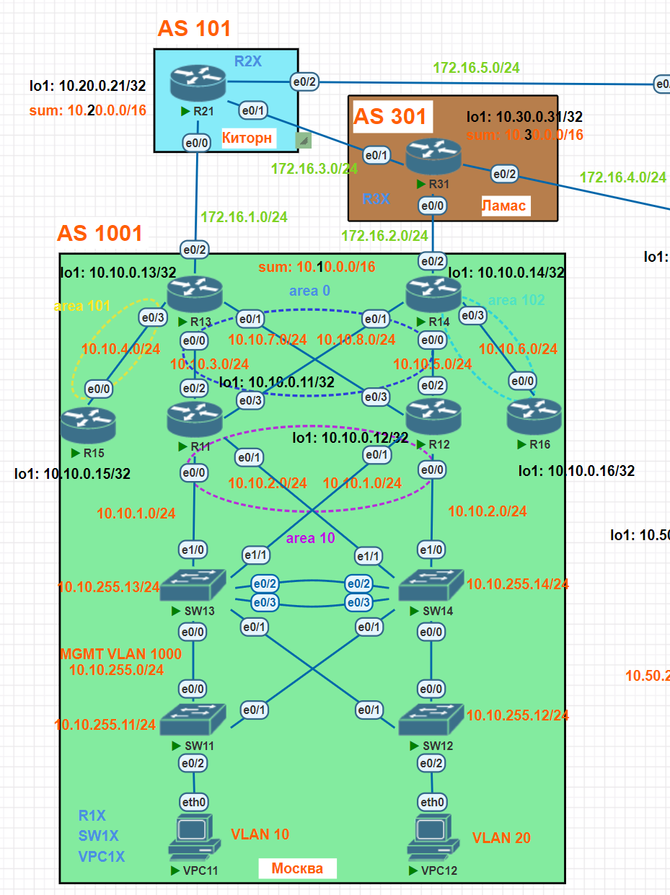
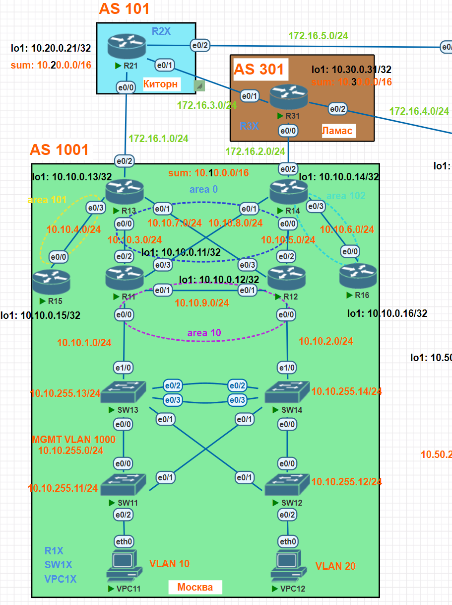

# Планирование адресного пространства 

## Задание

В офисе Москва нужно настроить:
1. Сетевую IPv4 адресацию на всех устройствах.
1. На коммутаторах SW13 и SW14 между соответствующими интерфейсами протокол LACP.
1. На коммутаторах SW11-SW14 протокол PVRSTP.
1. На маршрутизаторах R13 и R14 маршрут по умолчанию через R21 и R31 соответственно.
1. На маршрутизаторах R11 и R12 протокол VRRP на саб интерфейсах для VLAN 10, 20, 1000.
1. Протокол OSPF:
- Маршрутизаторы R13-R14 должны находиться в зоне 0 (backbone).
- Маршрутизаторы R11-R12 должны находиться в зоне 10. Дополнительно к маршрутам должны получать маршрут по умолчанию.
- Маршрутизатор R15 должен находиться в зоне 101 и получать только маршрут по умолчанию.
- Маршрутизатор R16 должн находиться в зоне 102 и получать все маршруты, кроме маршрутов до сетей зоны 101.
- Настройки для IPv6 (если используется) повторяет логику IPv4.

## Исходная топология



## Измененная топология

Из-за того, что при отключении SW13 роутер R12 не мог обрабатывать трафик на саб интерфейсах e0/1 (подробные настройки представлены в конфигурациях ниже) - были удалены прямые линки между R11 и SW14, а также R12 и SW13, и добавлен прямой линк между R11 и R12.



[Схема для импорта в PNETlab](media/otus_cource_lab6_OSPF_pnetlab_export-20241201-143344.zip)

## Версии ПО

- PNETlab - 5.3.11
- Роутеры - Cisco IOS Software, Linux Software (I86BI_LINUX-ADVENTERPRISEK9-M), Version 15.4(2)T4
- Коммутаторы - Cisco IOS Software, Linux Software (I86BI_LINUXL2-ADVENTERPRISEK9-M), Version 15.2(CML_NIGHTLY_20150703)
- ПК - VPC

## Решение
### Настройка сетевой IPv4 адресации на всех устройствах
Настройка сетевой IPv4 адресации на всех устройствах осуществляется в соответствии с разработанным ранее планом адресации ([см. тут](https://github.com/skydevil56/otus_network_engineer_professional/tree/main/labs/lab04)).

### Настройка протокола LACP на коммутаторах SW13 и SW14 между соответствующими интерфейсами
Протокол LACP настраивается на интерфейсах e0/2 и e0/3 (подробные настройки представлены в конфигурациях ниже).

### Настройка протокола PVRSTP на коммутаторах SW11-SW14
В качестве корневого коммутатора (priority 0) для vlan 10,20,1000 будет назначен SW13, следующим по приоритету (priority 4096) будет назначен SW14 (подробные настройки представлены в конфигурациях ниже).

### Настройка маршрута по умолчанию на маршрутизаторах R13 и R14 через R21 и R31 соответственно
Пока между автономными системами AS1001 и AS101, AS1001 и AS201 не настроен eBGP, то на маршрутизаторах R13 и R14 будет задан  статический маршрут по умолчанию через R21 и R31 соответственно (подробные настройки представлены в конфигурациях ниже).

### Настройка протокола VRRP (на саб интерфейсах для VLAN 10, 20, 1000) на маршрутизаторах R11 и R12
Маршрутизаторы R11 и R12 будут иметь три VRRP инстанса, под одному на каждый VLAN (саб интерфейс).  
VRRP инстансы на R11 будут иметь приоритет 150 (чем больше тем выше приоритет), VRRP инстансы на R12 будут иметь приоритет 50.  
VRRP IP (кластерный адрес) для VLAN 10, 20, 1000 соответственно 10.10.1.1, 10.10.2.1, 10.10.255.1 (подробные настройки представлены в конфигурациях ниже).

### Настройка протокола OSPF
1. Интерфейсы e0/1, e0/1 маршрутизаторов R13 и R14 будут в зоне 0 (backbone), интерфейсы e0/2, e0/3 маршрутизаторов R11 и R12 будут в зоне 0.
1. Интерфейсы e0/0.10, e0/0.20, e0/0.1000, e0/1 маршрутизаторов R11 и R12 будут в зоне 10. Дополнительно к маршрутам от других зон будут получать маршрут по умолчанию (default-information originate на R13 и R14).
1. Интерфейс e0/0 маршрутизатора R15 будет находиться в зоне 101 и сам маршрутизатор будет получать только маршрут по умолчанию (default-information originate на R13 и настройка области 101 как stab R15 и totally stab на R13).
1. Интерфейс e0/0 маршрутизатора R16 будет находиться в зоне 102 и cам маршрутизатор будет получать маршрут по умолчанию и все маршруты других зон, кроме маршрутов до сетей зоны 101 (default-information originate и настройка фильтрации на R14).

## Конфигурации устройств

### R11

<details>
  <summary>Конфигурация</summary>

```

R11#sh run
Building configuration...

Current configuration : 1688 bytes
!
version 15.4
service timestamps debug datetime msec
service timestamps log datetime msec
no service password-encryption
!
hostname R11
!
boot-start-marker
boot-end-marker
!
!
!
no aaa new-model
mmi polling-interval 60
no mmi auto-configure
no mmi pvc
mmi snmp-timeout 180
!
!
!
!
!
!
!
!


!
!
!
!
no ip domain lookup
ip cef
no ipv6 cef
!
multilink bundle-name authenticated
!
!
!
!
!
!
!
!
!
redundancy
!
!
!
!
!
!
!
!
!
!
!
!
!
!
!
interface Loopback1
 ip address 10.10.0.11 255.255.255.255
 ip ospf 1 area 10
!
interface Ethernet0/0
 no ip address
!
interface Ethernet0/0.10
 encapsulation dot1Q 10
 ip address 10.10.1.253 255.255.255.0
 ip ospf 1 area 10
 vrrp 1 ip 10.10.1.1
 vrrp 1 priority 150
!
interface Ethernet0/0.20
 encapsulation dot1Q 20
 ip address 10.10.2.253 255.255.255.0
 ip ospf 1 area 10
 vrrp 3 ip 10.10.2.1
 vrrp 3 priority 150
!
interface Ethernet0/0.1000
 encapsulation dot1Q 1000
 ip address 10.10.255.253 255.255.255.0
 ip ospf 1 area 10
 vrrp 2 ip 10.10.255.1
 vrrp 2 priority 150
!
interface Ethernet0/1
 ip address 10.10.9.11 255.255.255.0
 ip ospf 1 area 10
!
interface Ethernet0/2
 ip address 10.10.3.11 255.255.255.0
 ip ospf 1 area 0
!
interface Ethernet0/3
 ip address 10.10.8.11 255.255.255.0
 ip ospf 1 area 0
!
interface Ethernet1/0
 no ip address
 shutdown
!
interface Ethernet1/1
 no ip address
 shutdown
!
interface Ethernet1/2
 no ip address
 shutdown
!
interface Ethernet1/3
 no ip address
 shutdown
!
router ospf 1
 router-id 10.10.0.11
!
ip forward-protocol nd
!
!
no ip http server
no ip http secure-server
!
!
!
!
control-plane
!
!
!
!
!
!
!
!
line con 0
 logging synchronous
line aux 0
line vty 0 4
 login
 transport input none
!
!
end

R11#
R11#
R11#
R11#show ip interface brief
Interface                  IP-Address      OK? Method Status                Protocol
Ethernet0/0                unassigned      YES NVRAM  up                    up
Ethernet0/0.10             10.10.1.253     YES NVRAM  up                    up
Ethernet0/0.20             10.10.2.253     YES NVRAM  up                    up
Ethernet0/0.1000           10.10.255.253   YES NVRAM  up                    up
Ethernet0/1                10.10.9.11      YES NVRAM  up                    up
Ethernet0/2                10.10.3.11      YES NVRAM  up                    up
Ethernet0/3                10.10.8.11      YES NVRAM  up                    up
Ethernet1/0                unassigned      YES NVRAM  administratively down down
Ethernet1/1                unassigned      YES NVRAM  administratively down down
Ethernet1/2                unassigned      YES NVRAM  administratively down down
Ethernet1/3                unassigned      YES NVRAM  administratively down down
Loopback1                  10.10.0.11      YES NVRAM  up                    up
R11#
R11#
R11#
R11#
R11#show ip route
Codes: L - local, C - connected, S - static, R - RIP, M - mobile, B - BGP
       D - EIGRP, EX - EIGRP external, O - OSPF, IA - OSPF inter area
       N1 - OSPF NSSA external type 1, N2 - OSPF NSSA external type 2
       E1 - OSPF external type 1, E2 - OSPF external type 2
       i - IS-IS, su - IS-IS summary, L1 - IS-IS level-1, L2 - IS-IS level-2
       ia - IS-IS inter area, * - candidate default, U - per-user static route
       o - ODR, P - periodic downloaded static route, H - NHRP, l - LISP
       a - application route
       + - replicated route, % - next hop override

Gateway of last resort is 10.10.8.14 to network 0.0.0.0

O*E2  0.0.0.0/0 [110/1] via 10.10.8.14, 00:11:41, Ethernet0/3
                [110/1] via 10.10.3.13, 00:15:43, Ethernet0/2
      10.0.0.0/8 is variably subnetted, 22 subnets, 2 masks
C        10.10.0.11/32 is directly connected, Loopback1
O        10.10.0.12/32 [110/11] via 10.10.255.254, 00:11:14, Ethernet0/0.1000
                       [110/11] via 10.10.9.12, 00:11:41, Ethernet0/1
                       [110/11] via 10.10.2.254, 00:11:14, Ethernet0/0.20
                       [110/11] via 10.10.1.254, 00:11:04, Ethernet0/0.10
O        10.10.0.13/32 [110/11] via 10.10.3.13, 00:15:43, Ethernet0/2
O        10.10.0.14/32 [110/11] via 10.10.8.14, 00:11:41, Ethernet0/3
O IA     10.10.0.15/32 [110/21] via 10.10.3.13, 00:15:43, Ethernet0/2
O IA     10.10.0.16/32 [110/21] via 10.10.8.14, 00:11:41, Ethernet0/3
C        10.10.1.0/24 is directly connected, Ethernet0/0.10
L        10.10.1.253/32 is directly connected, Ethernet0/0.10
C        10.10.2.0/24 is directly connected, Ethernet0/0.20
L        10.10.2.253/32 is directly connected, Ethernet0/0.20
C        10.10.3.0/24 is directly connected, Ethernet0/2
L        10.10.3.11/32 is directly connected, Ethernet0/2
O IA     10.10.4.0/24 [110/20] via 10.10.3.13, 00:15:43, Ethernet0/2
O        10.10.5.0/24 [110/20] via 10.10.8.14, 00:11:41, Ethernet0/3
O IA     10.10.6.0/24 [110/20] via 10.10.8.14, 00:11:41, Ethernet0/3
O        10.10.7.0/24 [110/20] via 10.10.3.13, 00:12:53, Ethernet0/2
C        10.10.8.0/24 is directly connected, Ethernet0/3
L        10.10.8.11/32 is directly connected, Ethernet0/3
C        10.10.9.0/24 is directly connected, Ethernet0/1
L        10.10.9.11/32 is directly connected, Ethernet0/1
C        10.10.255.0/24 is directly connected, Ethernet0/0.1000
L        10.10.255.253/32 is directly connected, Ethernet0/0.1000
R11#
R11#
R11#
R11#
R11#show vrrp brief
Interface          Grp Pri Time  Own Pre State   Master addr     Group addr
Et0/0.10           1   150 3414       Y  Master  10.10.1.253     10.10.1.1
Et0/0.20           3   150 3414       Y  Master  10.10.2.253     10.10.2.1
Et0/0.1000         2   150 3414       Y  Master  10.10.255.253   10.10.255.1
R11#
R11#
R11#
R11#
R11#show ip ospf
 Routing Process "ospf 1" with ID 10.10.0.11
 Start time: 00:00:04.433, Time elapsed: 00:16:32.611
 Supports only single TOS(TOS0) routes
 Supports opaque LSA
 Supports Link-local Signaling (LLS)
 Supports area transit capability
 Supports NSSA (compatible with RFC 3101)
 Event-log enabled, Maximum number of events: 1000, Mode: cyclic
 It is an area border router
 Router is not originating router-LSAs with maximum metric
 Initial SPF schedule delay 5000 msecs
 Minimum hold time between two consecutive SPFs 10000 msecs
 Maximum wait time between two consecutive SPFs 10000 msecs
 Incremental-SPF disabled
 Minimum LSA interval 5 secs
 Minimum LSA arrival 1000 msecs
 LSA group pacing timer 240 secs
 Interface flood pacing timer 33 msecs
 Retransmission pacing timer 66 msecs
 Number of external LSA 2. Checksum Sum 0x00F8E6
 Number of opaque AS LSA 0. Checksum Sum 0x000000
 Number of DCbitless external and opaque AS LSA 0
 Number of DoNotAge external and opaque AS LSA 0
 Number of areas in this router is 2. 2 normal 0 stub 0 nssa
 Number of areas transit capable is 0
 External flood list length 0
 IETF NSF helper support enabled
 Cisco NSF helper support enabled
 Reference bandwidth unit is 100 mbps
    Area BACKBONE(0)
        Number of interfaces in this area is 2
        Area has no authentication
        SPF algorithm last executed 00:11:13.616 ago
        SPF algorithm executed 9 times
        Area ranges are
        Number of LSA 24. Checksum Sum 0x0E310D
        Number of opaque link LSA 0. Checksum Sum 0x000000
        Number of DCbitless LSA 0
        Number of indication LSA 0
        Number of DoNotAge LSA 0
        Flood list length 0
    Area 10
        Number of interfaces in this area is 5 (1 loopback)
        Area has no authentication
        SPF algorithm last executed 00:11:03.616 ago
        SPF algorithm executed 10 times
        Area ranges are
        Number of LSA 30. Checksum Sum 0x0E0377
        Number of opaque link LSA 0. Checksum Sum 0x000000
        Number of DCbitless LSA 0
        Number of indication LSA 0
        Number of DoNotAge LSA 0
        Flood list length 0

R11#
R11#
R11#
R11#
R11#show ip ospf neighbor

Neighbor ID     Pri   State           Dead Time   Address         Interface
10.10.0.14        1   FULL/BDR        00:00:34    10.10.8.14      Ethernet0/3
10.10.0.13        1   FULL/DR         00:00:35    10.10.3.13      Ethernet0/2
10.10.0.12        1   FULL/BDR        00:00:31    10.10.9.12      Ethernet0/1
10.10.0.12        1   FULL/BDR        00:00:33    10.10.255.254   Ethernet0/0.1000
10.10.0.12        1   FULL/BDR        00:00:31    10.10.2.254     Ethernet0/0.20
10.10.0.12        1   FULL/BDR        00:00:31    10.10.1.254     Ethernet0/0.10
R11#
R11#
R11#
R11#
R11#show ip ospf database

            OSPF Router with ID (10.10.0.11) (Process ID 1)

                Router Link States (Area 0)

Link ID         ADV Router      Age         Seq#       Checksum Link count
10.10.0.11      10.10.0.11      713         0x80000141 0x009863 2
10.10.0.12      10.10.0.12      680         0x80000140 0x0023D0 2
10.10.0.13      10.10.0.13      716         0x80000147 0x007F3A 3
10.10.0.14      10.10.0.14      679         0x80000018 0x00CB14 3

                Net Link States (Area 0)

Link ID         ADV Router      Age         Seq#       Checksum
10.10.3.13      10.10.0.13      948         0x80000001 0x00A212
10.10.5.14      10.10.0.14      679         0x80000001 0x00941A
10.10.7.13      10.10.0.13      716         0x80000001 0x00842B
10.10.8.11      10.10.0.11      713         0x80000001 0x00A111

                Summary Net Link States (Area 0)

Link ID         ADV Router      Age         Seq#       Checksum
10.10.0.11      10.10.0.11      985         0x8000000B 0x0029CA
10.10.0.11      10.10.0.12      709         0x80000003 0x009759
10.10.0.12      10.10.0.11      700         0x80000001 0x00975B
10.10.0.12      10.10.0.12      717         0x8000000C 0x0017D9
10.10.0.15      10.10.0.13      982         0x8000000D 0x00558C
10.10.0.16      10.10.0.14      707         0x80000011 0x003D9E
10.10.1.0       10.10.0.11      977         0x8000000D 0x00E210
10.10.1.0       10.10.0.12      709         0x80000003 0x00F00B
10.10.2.0       10.10.0.11      977         0x8000000D 0x00D71A
10.10.2.0       10.10.0.12      709         0x8000000D 0x00D11F
10.10.4.0       10.10.0.13      982         0x8000000D 0x00B538
10.10.6.0       10.10.0.14      707         0x80000011 0x009155
10.10.9.0       10.10.0.11      977         0x80000003 0x009E56
10.10.9.0       10.10.0.12      709         0x80000003 0x00985B
10.10.255.0     10.10.0.11      977         0x8000000D 0x00ED06
10.10.255.0     10.10.0.12      709         0x8000000D 0x00E70B

                Router Link States (Area 10)

Link ID         ADV Router      Age         Seq#       Checksum Link count
10.10.0.11      10.10.0.11      672         0x80000152 0x00DB7E 5
10.10.0.12      10.10.0.12      673         0x80000153 0x0084CD 5

                Net Link States (Area 10)

Link ID         ADV Router      Age         Seq#       Checksum
10.10.1.253     10.10.0.11      676         0x80000001 0x005573
10.10.2.253     10.10.0.11      677         0x80000001 0x004A7D
10.10.9.11      10.10.0.11      715         0x80000001 0x007A39
10.10.255.253   10.10.0.11      677         0x80000001 0x006069

                Summary Net Link States (Area 10)

Link ID         ADV Router      Age         Seq#       Checksum
10.10.0.13      10.10.0.11      942         0x8000000D 0x007570
10.10.0.13      10.10.0.12      708         0x80000003 0x00836B
10.10.0.14      10.10.0.11      700         0x80000001 0x00836D
10.10.0.14      10.10.0.12      674         0x8000000E 0x00637F
10.10.0.15      10.10.0.11      942         0x8000000D 0x00C514
10.10.0.15      10.10.0.12      708         0x80000003 0x00D30F
10.10.0.16      10.10.0.11      700         0x80000001 0x00D311
10.10.0.16      10.10.0.12      674         0x8000000E 0x00B323
10.10.3.0       10.10.0.11      982         0x8000000B 0x00D022
10.10.3.0       10.10.0.12      708         0x80000003 0x003FB0
10.10.4.0       10.10.0.11      942         0x8000000D 0x0026BF
10.10.4.0       10.10.0.12      708         0x80000003 0x0034BA
10.10.5.0       10.10.0.11      700         0x80000002 0x0031BE
10.10.5.0       10.10.0.12      713         0x8000000C 0x00B23C
10.10.6.0       10.10.0.11      700         0x80000001 0x0028C7
10.10.6.0       10.10.0.12      674         0x8000000E 0x0008D9
10.10.7.0       10.10.0.11      942         0x8000000D 0x0005DD
10.10.7.0       10.10.0.12      713         0x8000000C 0x009C50
10.10.8.0       10.10.0.11      982         0x8000000B 0x009954
10.10.8.0       10.10.0.12      674         0x8000000E 0x00F1ED

                Summary ASB Link States (Area 10)

Link ID         ADV Router      Age         Seq#       Checksum
10.10.0.13      10.10.0.11      937         0x8000000E 0x005B89
10.10.0.13      10.10.0.12      708         0x80000003 0x006B83
10.10.0.14      10.10.0.11      700         0x80000001 0x006B85
10.10.0.14      10.10.0.12      669         0x8000000F 0x004998

                Type-5 AS External Link States

Link ID         ADV Router      Age         Seq#       Checksum Tag
0.0.0.0         10.10.0.13      989         0x80000133 0x00DA83 1
0.0.0.0         10.10.0.14      715         0x80000010 0x001E63 1

```
</details>

### R12

<details>
  <summary>Конфигурация</summary>

```

R12#sh run
Building configuration...

Current configuration : 1683 bytes
!
version 15.4
service timestamps debug datetime msec
service timestamps log datetime msec
no service password-encryption
!
hostname R12
!
boot-start-marker
boot-end-marker
!
!
!
no aaa new-model
mmi polling-interval 60
no mmi auto-configure
no mmi pvc
mmi snmp-timeout 180
!
!
!
!
!
!
!
!


!
!
!
!
no ip domain lookup
ip cef
no ipv6 cef
!
multilink bundle-name authenticated
!
!
!
!
!
!
!
!
!
redundancy
!
!
!
!
!
!
!
!
!
!
!
!
!
!
!
interface Loopback1
 ip address 10.10.0.12 255.255.255.0
 ip ospf 1 area 10
!
interface Ethernet0/0
 no ip address
!
interface Ethernet0/0.10
 encapsulation dot1Q 10
 ip address 10.10.1.254 255.255.255.0
 ip ospf 1 area 10
 vrrp 1 ip 10.10.1.1
 vrrp 1 priority 50
!
interface Ethernet0/0.20
 encapsulation dot1Q 20
 ip address 10.10.2.254 255.255.255.0
 ip ospf 1 area 10
 vrrp 3 ip 10.10.2.1
 vrrp 3 priority 50
!
interface Ethernet0/0.1000
 encapsulation dot1Q 1000
 ip address 10.10.255.254 255.255.255.0
 ip ospf 1 area 10
 vrrp 2 ip 10.10.255.1
 vrrp 2 priority 50
!
interface Ethernet0/1
 ip address 10.10.9.12 255.255.255.0
 ip ospf 1 area 10
!
interface Ethernet0/2
 ip address 10.10.5.12 255.255.255.0
 ip ospf 1 area 0
!
interface Ethernet0/3
 ip address 10.10.7.12 255.255.255.0
 ip ospf 1 area 0
!
interface Ethernet1/0
 no ip address
 shutdown
!
interface Ethernet1/1
 no ip address
 shutdown
!
interface Ethernet1/2
 no ip address
 shutdown
!
interface Ethernet1/3
 no ip address
 shutdown
!
router ospf 1
 router-id 10.10.0.12
!
ip forward-protocol nd
!
!
no ip http server
no ip http secure-server
!
!
!
!
control-plane
!
!
!
!
!
!
!
!
line con 0
 logging synchronous
line aux 0
line vty 0 4
 login
 transport input none
!
!
end

R12#
R12#
R12#
R12#show ip interface brief
Interface                  IP-Address      OK? Method Status                Protocol
Ethernet0/0                unassigned      YES NVRAM  up                    up
Ethernet0/0.10             10.10.1.254     YES NVRAM  up                    up
Ethernet0/0.20             10.10.2.254     YES NVRAM  up                    up
Ethernet0/0.1000           10.10.255.254   YES NVRAM  up                    up
Ethernet0/1                10.10.9.12      YES NVRAM  up                    up
Ethernet0/2                10.10.5.12      YES NVRAM  up                    up
Ethernet0/3                10.10.7.12      YES NVRAM  up                    up
Ethernet1/0                unassigned      YES NVRAM  administratively down down
Ethernet1/1                unassigned      YES NVRAM  administratively down down
Ethernet1/2                unassigned      YES NVRAM  administratively down down
Ethernet1/3                unassigned      YES NVRAM  administratively down down
Loopback1                  10.10.0.12      YES NVRAM  up                    up
R12#
R12#
R12#
R12#
R12#show ip route
Codes: L - local, C - connected, S - static, R - RIP, M - mobile, B - BGP
       D - EIGRP, EX - EIGRP external, O - OSPF, IA - OSPF inter area
       N1 - OSPF NSSA external type 1, N2 - OSPF NSSA external type 2
       E1 - OSPF external type 1, E2 - OSPF external type 2
       i - IS-IS, su - IS-IS summary, L1 - IS-IS level-1, L2 - IS-IS level-2
       ia - IS-IS inter area, * - candidate default, U - per-user static route
       o - ODR, P - periodic downloaded static route, H - NHRP, l - LISP
       a - application route
       + - replicated route, % - next hop override

Gateway of last resort is 10.10.7.13 to network 0.0.0.0

O*E2  0.0.0.0/0 [110/1] via 10.10.7.13, 00:12:40, Ethernet0/3
                [110/1] via 10.10.5.14, 00:12:07, Ethernet0/2
      10.0.0.0/8 is variably subnetted, 23 subnets, 2 masks
C        10.10.0.0/24 is directly connected, Loopback1
O        10.10.0.11/32 [110/11] via 10.10.255.253, 00:12:07, Ethernet0/0.1000
                       [110/11] via 10.10.9.11, 00:12:40, Ethernet0/1
                       [110/11] via 10.10.2.253, 00:12:07, Ethernet0/0.20
                       [110/11] via 10.10.1.253, 00:11:57, Ethernet0/0.10
L        10.10.0.12/32 is directly connected, Loopback1
O        10.10.0.13/32 [110/11] via 10.10.7.13, 00:12:40, Ethernet0/3
O        10.10.0.14/32 [110/11] via 10.10.5.14, 00:12:07, Ethernet0/2
O IA     10.10.0.15/32 [110/21] via 10.10.7.13, 00:12:40, Ethernet0/3
O IA     10.10.0.16/32 [110/21] via 10.10.5.14, 00:12:07, Ethernet0/2
C        10.10.1.0/24 is directly connected, Ethernet0/0.10
L        10.10.1.254/32 is directly connected, Ethernet0/0.10
C        10.10.2.0/24 is directly connected, Ethernet0/0.20
L        10.10.2.254/32 is directly connected, Ethernet0/0.20
O        10.10.3.0/24 [110/20] via 10.10.7.13, 00:12:40, Ethernet0/3
O IA     10.10.4.0/24 [110/20] via 10.10.7.13, 00:12:40, Ethernet0/3
C        10.10.5.0/24 is directly connected, Ethernet0/2
L        10.10.5.12/32 is directly connected, Ethernet0/2
O IA     10.10.6.0/24 [110/20] via 10.10.5.14, 00:12:07, Ethernet0/2
C        10.10.7.0/24 is directly connected, Ethernet0/3
L        10.10.7.12/32 is directly connected, Ethernet0/3
O        10.10.8.0/24 [110/20] via 10.10.5.14, 00:12:07, Ethernet0/2
C        10.10.9.0/24 is directly connected, Ethernet0/1
L        10.10.9.12/32 is directly connected, Ethernet0/1
C        10.10.255.0/24 is directly connected, Ethernet0/0.1000
L        10.10.255.254/32 is directly connected, Ethernet0/0.1000
R12#
R12#
R12#
R12#
R12#show vrrp brief
Interface          Grp Pri Time  Own Pre State   Master addr     Group addr
Et0/0.10           1   50  3804       Y  Backup  10.10.1.253     10.10.1.1
Et0/0.20           3   50  3804       Y  Backup  10.10.2.253     10.10.2.1
Et0/0.1000         2   50  3804       Y  Backup  10.10.255.253   10.10.255.1
R12#
R12#
R12#
R12#
R12#show ip ospf
 Routing Process "ospf 1" with ID 10.10.0.12
 Start time: 00:00:04.429, Time elapsed: 00:12:54.755
 Supports only single TOS(TOS0) routes
 Supports opaque LSA
 Supports Link-local Signaling (LLS)
 Supports area transit capability
 Supports NSSA (compatible with RFC 3101)
 Event-log enabled, Maximum number of events: 1000, Mode: cyclic
 It is an area border router
 Router is not originating router-LSAs with maximum metric
 Initial SPF schedule delay 5000 msecs
 Minimum hold time between two consecutive SPFs 10000 msecs
 Maximum wait time between two consecutive SPFs 10000 msecs
 Incremental-SPF disabled
 Minimum LSA interval 5 secs
 Minimum LSA arrival 1000 msecs
 LSA group pacing timer 240 secs
 Interface flood pacing timer 33 msecs
 Retransmission pacing timer 66 msecs
 Number of external LSA 2. Checksum Sum 0x00F8E6
 Number of opaque AS LSA 0. Checksum Sum 0x000000
 Number of DCbitless external and opaque AS LSA 0
 Number of DoNotAge external and opaque AS LSA 0
 Number of areas in this router is 2. 2 normal 0 stub 0 nssa
 Number of areas transit capable is 0
 External flood list length 0
 IETF NSF helper support enabled
 Cisco NSF helper support enabled
 Reference bandwidth unit is 100 mbps
    Area BACKBONE(0)
        Number of interfaces in this area is 2
        Area has no authentication
        SPF algorithm last executed 00:12:06.190 ago
        SPF algorithm executed 4 times
        Area ranges are
        Number of LSA 24. Checksum Sum 0x0E310D
        Number of opaque link LSA 0. Checksum Sum 0x000000
        Number of DCbitless LSA 0
        Number of indication LSA 0
        Number of DoNotAge LSA 0
        Flood list length 0
    Area 10
        Number of interfaces in this area is 5 (1 loopback)
        Area has no authentication
        SPF algorithm last executed 00:11:56.190 ago
        SPF algorithm executed 4 times
        Area ranges are
        Number of LSA 30. Checksum Sum 0x0E0377
        Number of opaque link LSA 0. Checksum Sum 0x000000
        Number of DCbitless LSA 0
        Number of indication LSA 0
        Number of DoNotAge LSA 0
        Flood list length 0

R12#
R12#
R12#
R12#
R12#show ip ospf neighbor

Neighbor ID     Pri   State           Dead Time   Address         Interface
10.10.0.13        1   FULL/DR         00:00:36    10.10.7.13      Ethernet0/3
10.10.0.14        1   FULL/DR         00:00:39    10.10.5.14      Ethernet0/2
10.10.0.11        1   FULL/DR         00:00:32    10.10.9.11      Ethernet0/1
10.10.0.11        1   FULL/DR         00:00:39    10.10.255.253   Ethernet0/0.1000
10.10.0.11        1   FULL/DR         00:00:39    10.10.2.253     Ethernet0/0.20
10.10.0.11        1   FULL/DR         00:00:32    10.10.1.253     Ethernet0/0.10
R12#
R12#
R12#
R12#
R12#show ip ospf database

            OSPF Router with ID (10.10.0.12) (Process ID 1)

                Router Link States (Area 0)

Link ID         ADV Router      Age         Seq#       Checksum Link count
10.10.0.11      10.10.0.11      768         0x80000141 0x009863 2
10.10.0.12      10.10.0.12      731         0x80000140 0x0023D0 2
10.10.0.13      10.10.0.13      768         0x80000147 0x007F3A 3
10.10.0.14      10.10.0.14      732         0x80000018 0x00CB14 3

                Net Link States (Area 0)

Link ID         ADV Router      Age         Seq#       Checksum
10.10.3.13      10.10.0.13      1000        0x80000001 0x00A212
10.10.5.14      10.10.0.14      732         0x80000001 0x00941A
10.10.7.13      10.10.0.13      768         0x80000001 0x00842B
10.10.8.11      10.10.0.11      768         0x80000001 0x00A111

                Summary Net Link States (Area 0)

Link ID         ADV Router      Age         Seq#       Checksum
10.10.0.11      10.10.0.11      1042        0x8000000B 0x0029CA
10.10.0.11      10.10.0.12      759         0x80000003 0x009759
10.10.0.12      10.10.0.11      755         0x80000001 0x00975B
10.10.0.12      10.10.0.12      767         0x8000000C 0x0017D9
10.10.0.15      10.10.0.13      1032        0x8000000D 0x00558C
10.10.0.16      10.10.0.14      761         0x80000011 0x003D9E
10.10.1.0       10.10.0.11      1033        0x8000000D 0x00E210
10.10.1.0       10.10.0.12      759         0x80000003 0x00F00B
10.10.2.0       10.10.0.11      1033        0x8000000D 0x00D71A
10.10.2.0       10.10.0.12      759         0x8000000D 0x00D11F
10.10.4.0       10.10.0.13      1032        0x8000000D 0x00B538
10.10.6.0       10.10.0.14      761         0x80000011 0x009155
10.10.9.0       10.10.0.11      1033        0x80000003 0x009E56
10.10.9.0       10.10.0.12      759         0x80000003 0x00985B
10.10.255.0     10.10.0.11      1033        0x8000000D 0x00ED06
10.10.255.0     10.10.0.12      759         0x8000000D 0x00E70B

                Router Link States (Area 10)

Link ID         ADV Router      Age         Seq#       Checksum Link count
10.10.0.11      10.10.0.11      726         0x80000152 0x00DB7E 5
10.10.0.12      10.10.0.12      725         0x80000153 0x0084CD 5

                Net Link States (Area 10)

Link ID         ADV Router      Age         Seq#       Checksum
10.10.1.253     10.10.0.11      730         0x80000001 0x005573
10.10.2.253     10.10.0.11      730         0x80000001 0x004A7D
10.10.9.11      10.10.0.11      768         0x80000001 0x007A39
10.10.255.253   10.10.0.11      730         0x80000001 0x006069

                Summary Net Link States (Area 10)

Link ID         ADV Router      Age         Seq#       Checksum
10.10.0.13      10.10.0.11      995         0x8000000D 0x007570
10.10.0.13      10.10.0.12      759         0x80000003 0x00836B
10.10.0.14      10.10.0.11      754         0x80000001 0x00836D
10.10.0.14      10.10.0.12      726         0x8000000E 0x00637F
10.10.0.15      10.10.0.11      995         0x8000000D 0x00C514
10.10.0.15      10.10.0.12      759         0x80000003 0x00D30F
10.10.0.16      10.10.0.11      754         0x80000001 0x00D311
10.10.0.16      10.10.0.12      726         0x8000000E 0x00B323
10.10.3.0       10.10.0.11      1035        0x8000000B 0x00D022
10.10.3.0       10.10.0.12      759         0x80000003 0x003FB0
10.10.4.0       10.10.0.11      995         0x8000000D 0x0026BF
10.10.4.0       10.10.0.12      759         0x80000003 0x0034BA
10.10.5.0       10.10.0.11      754         0x80000002 0x0031BE
10.10.5.0       10.10.0.12      764         0x8000000C 0x00B23C
10.10.6.0       10.10.0.11      754         0x80000001 0x0028C7
10.10.6.0       10.10.0.12      726         0x8000000E 0x0008D9
10.10.7.0       10.10.0.11      995         0x8000000D 0x0005DD
10.10.7.0       10.10.0.12      764         0x8000000C 0x009C50
10.10.8.0       10.10.0.11      1035        0x8000000B 0x009954
10.10.8.0       10.10.0.12      726         0x8000000E 0x00F1ED

                Summary ASB Link States (Area 10)

Link ID         ADV Router      Age         Seq#       Checksum
10.10.0.13      10.10.0.11      990         0x8000000E 0x005B89
10.10.0.13      10.10.0.12      759         0x80000003 0x006B83
10.10.0.14      10.10.0.11      754         0x80000001 0x006B85
10.10.0.14      10.10.0.12      721         0x8000000F 0x004998

                Type-5 AS External Link States

Link ID         ADV Router      Age         Seq#       Checksum Tag
0.0.0.0         10.10.0.13      1040        0x80000133 0x00DA83 1
0.0.0.0         10.10.0.14      768         0x80000010 0x001E63 1


```
</details>

### R13

<details>
  <summary>Конфигурация</summary>

```

R13#sh run
Building configuration...

Current configuration : 1212 bytes
!
! Last configuration change at 12:46:42 UTC Sun Dec 1 2024
!
version 15.4
service timestamps debug datetime msec
service timestamps log datetime msec
no service password-encryption
!
hostname R13
!
boot-start-marker
boot-end-marker
!
!
!
no aaa new-model
mmi polling-interval 60
no mmi auto-configure
no mmi pvc
mmi snmp-timeout 180
!
!
!
!
!
!
!
!


!
!
!
!
no ip domain lookup
ip cef
no ipv6 cef
!
multilink bundle-name authenticated
!
!
!
!
!
!
!
!
!
redundancy
!
!
!
!
!
!
!
!
!
!
!
!
!
!
!
interface Loopback1
 ip address 10.10.0.13 255.255.255.255
 ip ospf 1 area 0
!
interface Ethernet0/0
 ip address 10.10.3.13 255.255.255.0
 ip ospf 1 area 0
!
interface Ethernet0/1
 ip address 10.10.7.13 255.255.255.0
 ip ospf 1 area 0
!
interface Ethernet0/2
 ip address 172.16.1.13 255.255.255.0
!
interface Ethernet0/3
 ip address 10.10.4.13 255.255.255.0
 ip ospf 1 area 101
!
router ospf 1
 router-id 10.10.0.13
 area 101 stub no-summary
 default-information originate
!
ip forward-protocol nd
!
!
no ip http server
no ip http secure-server
ip route 0.0.0.0 0.0.0.0 172.16.1.21
!
!
!
!
control-plane
!
!
!
!
!
!
!
!
line con 0
 logging synchronous
line aux 0
line vty 0 4
 login
 transport input none
!
!
end

R13#
R13#
R13#
R13#show ip interface brief
Interface                  IP-Address      OK? Method Status                Protocol
Ethernet0/0                10.10.3.13      YES manual up                    up
Ethernet0/1                10.10.7.13      YES manual up                    up
Ethernet0/2                172.16.1.13     YES manual up                    up
Ethernet0/3                10.10.4.13      YES manual up                    up
Loopback1                  10.10.0.13      YES manual up                    up
R13#
R13#
R13#
R13#
R13#show ip route
Codes: L - local, C - connected, S - static, R - RIP, M - mobile, B - BGP
       D - EIGRP, EX - EIGRP external, O - OSPF, IA - OSPF inter area
       N1 - OSPF NSSA external type 1, N2 - OSPF NSSA external type 2
       E1 - OSPF external type 1, E2 - OSPF external type 2
       i - IS-IS, su - IS-IS summary, L1 - IS-IS level-1, L2 - IS-IS level-2
       ia - IS-IS inter area, * - candidate default, U - per-user static route
       o - ODR, P - periodic downloaded static route, H - NHRP, l - LISP
       a - application route
       + - replicated route, % - next hop override

Gateway of last resort is 172.16.1.21 to network 0.0.0.0

S*    0.0.0.0/0 [1/0] via 172.16.1.21
      10.0.0.0/8 is variably subnetted, 18 subnets, 2 masks
O IA     10.10.0.11/32 [110/11] via 10.10.3.11, 00:05:43, Ethernet0/0
O IA     10.10.0.12/32 [110/11] via 10.10.7.12, 00:04:54, Ethernet0/1
C        10.10.0.13/32 is directly connected, Loopback1
O        10.10.0.14/32 [110/21] via 10.10.7.12, 00:41:41, Ethernet0/1
                       [110/21] via 10.10.3.11, 00:41:41, Ethernet0/0
O        10.10.0.15/32 [110/11] via 10.10.4.15, 00:41:41, Ethernet0/3
O IA     10.10.0.16/32 [110/31] via 10.10.7.12, 00:41:41, Ethernet0/1
                       [110/31] via 10.10.3.11, 00:41:41, Ethernet0/0
O IA     10.10.1.0/24 [110/20] via 10.10.7.12, 00:04:54, Ethernet0/1
                      [110/20] via 10.10.3.11, 00:05:43, Ethernet0/0
O IA     10.10.2.0/24 [110/20] via 10.10.7.12, 00:04:54, Ethernet0/1
                      [110/20] via 10.10.3.11, 00:05:43, Ethernet0/0
C        10.10.3.0/24 is directly connected, Ethernet0/0
L        10.10.3.13/32 is directly connected, Ethernet0/0
C        10.10.4.0/24 is directly connected, Ethernet0/3
L        10.10.4.13/32 is directly connected, Ethernet0/3
O        10.10.5.0/24 [110/20] via 10.10.7.12, 00:04:59, Ethernet0/1
O IA     10.10.6.0/24 [110/30] via 10.10.7.12, 00:41:41, Ethernet0/1
                      [110/30] via 10.10.3.11, 00:41:41, Ethernet0/0
C        10.10.7.0/24 is directly connected, Ethernet0/1
L        10.10.7.13/32 is directly connected, Ethernet0/1
O        10.10.8.0/24 [110/20] via 10.10.3.11, 00:05:49, Ethernet0/0
O IA     10.10.255.0/24 [110/20] via 10.10.7.12, 00:04:54, Ethernet0/1
                        [110/20] via 10.10.3.11, 00:05:43, Ethernet0/0
      172.16.0.0/16 is variably subnetted, 2 subnets, 2 masks
C        172.16.1.0/24 is directly connected, Ethernet0/2
L        172.16.1.13/32 is directly connected, Ethernet0/2
R13#
R13#
R13#
R13#
R13#show vrrp brief
Interface          Grp Pri Time  Own Pre State   Master addr     Group addr
R13#
R13#
R13#
R13#
R13#show ip ospf
 Routing Process "ospf 1" with ID 10.10.0.13
 Start time: 02:51:54.442, Time elapsed: 1w0d
 Supports only single TOS(TOS0) routes
 Supports opaque LSA
 Supports Link-local Signaling (LLS)
 Supports area transit capability
 Supports NSSA (compatible with RFC 3101)
 Event-log enabled, Maximum number of events: 1000, Mode: cyclic
 It is an area border and autonomous system boundary router
 Redistributing External Routes from,
 Router is not originating router-LSAs with maximum metric
 Initial SPF schedule delay 5000 msecs
 Minimum hold time between two consecutive SPFs 10000 msecs
 Maximum wait time between two consecutive SPFs 10000 msecs
 Incremental-SPF disabled
 Minimum LSA interval 5 secs
 Minimum LSA arrival 1000 msecs
 LSA group pacing timer 240 secs
 Interface flood pacing timer 33 msecs
 Retransmission pacing timer 66 msecs
 Number of external LSA 2. Checksum Sum 0x0122D1
 Number of opaque AS LSA 0. Checksum Sum 0x000000
 Number of DCbitless external and opaque AS LSA 0
 Number of DoNotAge external and opaque AS LSA 0
 Number of areas in this router is 2. 1 normal 1 stub 0 nssa
 Number of areas transit capable is 0
 External flood list length 0
 IETF NSF helper support enabled
 Cisco NSF helper support enabled
 Reference bandwidth unit is 100 mbps
    Area BACKBONE(0)
        Number of interfaces in this area is 3 (1 loopback)
        Area has no authentication
        SPF algorithm last executed 00:04:59.125 ago
        SPF algorithm executed 4 times
        Area ranges are
        Number of LSA 22. Checksum Sum 0x0D1EE8
        Number of opaque link LSA 0. Checksum Sum 0x000000
        Number of DCbitless LSA 0
        Number of indication LSA 0
        Number of DoNotAge LSA 0
        Flood list length 0
    Area 101
        Number of interfaces in this area is 1
        It is a stub area, no summary LSA in this area
        Generates stub default route with cost 1
        Area has no authentication
        SPF algorithm last executed 00:41:41.066 ago
        SPF algorithm executed 2 times
        Area ranges are
        Number of LSA 4. Checksum Sum 0x02C56C
        Number of opaque link LSA 0. Checksum Sum 0x000000
        Number of DCbitless LSA 0
        Number of indication LSA 0
        Number of DoNotAge LSA 0
        Flood list length 0

R13#
R13#
R13#
R13#
R13#show ip ospf neighbor

Neighbor ID     Pri   State           Dead Time   Address         Interface
10.10.0.11        1   FULL/BDR        00:00:37    10.10.3.11      Ethernet0/0
10.10.0.12        1   FULL/BDR        00:00:34    10.10.7.12      Ethernet0/1
10.10.0.15        1   FULL/DR         00:00:32    10.10.4.15      Ethernet0/3
R13#
R13#
R13#
R13#
R13#show ip ospf database

            OSPF Router with ID (10.10.0.13) (Process ID 1)

                Router Link States (Area 0)

Link ID         ADV Router      Age         Seq#       Checksum Link count
10.10.0.11      10.10.0.11      356         0x80000134 0x00D035 2
10.10.0.12      10.10.0.12      306         0x80000132 0x00639E 2
10.10.0.13      10.10.0.13      303         0x80000138 0x00FDCA 3
10.10.0.14      10.10.0.14      305         0x80000009 0x002CBF 3

                Net Link States (Area 0)

Link ID         ADV Router      Age         Seq#       Checksum
10.10.3.13      10.10.0.13      353         0x80000001 0x00A212
10.10.5.14      10.10.0.14      305         0x80000001 0x00941A
10.10.7.13      10.10.0.13      303         0x80000001 0x00842B
10.10.8.14      10.10.0.14      355         0x80000001 0x006547

                Summary Net Link States (Area 0)

Link ID         ADV Router      Age         Seq#       Checksum
10.10.0.11      10.10.0.11      344         0x80000001 0x003DC0
10.10.0.11      10.10.0.12      295         0x80000001 0x009B57
10.10.0.12      10.10.0.11      344         0x80000001 0x00975B
10.10.0.12      10.10.0.12      295         0x80000001 0x002DCE
10.10.0.15      10.10.0.13      546         0x80000002 0x006B81
10.10.0.16      10.10.0.14      687         0x80000005 0x005592
10.10.1.0       10.10.0.11      344         0x80000001 0x00FA04
10.10.1.0       10.10.0.12      295         0x80000001 0x00F409
10.10.2.0       10.10.0.11      344         0x80000001 0x00EF0E
10.10.2.0       10.10.0.12      295         0x80000001 0x00E913
10.10.4.0       10.10.0.13      546         0x80000002 0x00CB2D
10.10.6.0       10.10.0.14      687         0x80000005 0x00A949
10.10.255.0     10.10.0.11      344         0x80000001 0x0006F9
10.10.255.0     10.10.0.12      295         0x80000001 0x00FFFE

                Router Link States (Area 101)

Link ID         ADV Router      Age         Seq#       Checksum Link count
10.10.0.13      10.10.0.13      546         0x80000135 0x00F076 1
10.10.0.15      10.10.0.15      655         0x80000136 0x00AE7E 2

                Net Link States (Area 101)

Link ID         ADV Router      Age         Seq#       Checksum
10.10.4.15      10.10.0.15      655         0x80000129 0x007212

                Summary Net Link States (Area 101)

Link ID         ADV Router      Age         Seq#       Checksum
0.0.0.0         10.10.0.13      546         0x80000003 0x00B466

                Type-5 AS External Link States

Link ID         ADV Router      Age         Seq#       Checksum Tag
0.0.0.0         10.10.0.13      546         0x80000129 0x00EE79 1
0.0.0.0         10.10.0.14      687         0x80000005 0x003458 1


```
</details>

### R14

<details>
  <summary>Конфигурация</summary>

```

R14#sh run
Building configuration...

Current configuration : 1280 bytes
!
version 15.4
service timestamps debug datetime msec
service timestamps log datetime msec
no service password-encryption
!
hostname R14
!
boot-start-marker
boot-end-marker
!
!
!
no aaa new-model
mmi polling-interval 60
no mmi auto-configure
no mmi pvc
mmi snmp-timeout 180
!
!
!
!
!
!
!
!


!
!
!
!
no ip domain lookup
ip cef
no ipv6 cef
!
multilink bundle-name authenticated
!
!
!
!
!
!
!
!
!
redundancy
!
!
!
!
!
!
!
!
!
!
!
!
!
!
!
interface Loopback1
 ip address 10.10.0.14 255.255.255.255
 ip ospf 1 area 0
!
interface Ethernet0/0
 ip address 10.10.5.14 255.255.255.0
 ip ospf 1 area 0
!
interface Ethernet0/1
 ip address 10.10.8.14 255.255.255.0
 ip ospf 1 area 0
!
interface Ethernet0/2
 ip address 172.16.2.14 255.255.255.0
!
interface Ethernet0/3
 ip address 10.10.6.14 255.255.255.0
 ip ospf 1 area 102
!
router ospf 1
 router-id 10.10.0.14
 area 102 filter-list prefix OSPF-FILTER in
 default-information originate
!
ip forward-protocol nd
!
!
no ip http server
no ip http secure-server
ip route 0.0.0.0 0.0.0.0 172.16.2.31
!
!
ip prefix-list OSPF-FILTER seq 10 deny 10.10.4.0/24
ip prefix-list OSPF-FILTER seq 20 permit 0.0.0.0/0 le 32
!
!
!
control-plane
!
!
!
!
!
!
!
!
line con 0
 logging synchronous
line aux 0
line vty 0 4
 login
 transport input none
!
!
end

R14#
R14#
R14#
R14#show ip interface brief
Interface                  IP-Address      OK? Method Status                Protocol
Ethernet0/0                10.10.5.14      YES NVRAM  up                    up
Ethernet0/1                10.10.8.14      YES NVRAM  up                    up
Ethernet0/2                172.16.2.14     YES NVRAM  up                    up
Ethernet0/3                10.10.6.14      YES NVRAM  up                    up
Loopback1                  10.10.0.14      YES NVRAM  up                    up
R14#
R14#
R14#
R14#
R14#show ip route
Codes: L - local, C - connected, S - static, R - RIP, M - mobile, B - BGP
       D - EIGRP, EX - EIGRP external, O - OSPF, IA - OSPF inter area
       N1 - OSPF NSSA external type 1, N2 - OSPF NSSA external type 2
       E1 - OSPF external type 1, E2 - OSPF external type 2
       i - IS-IS, su - IS-IS summary, L1 - IS-IS level-1, L2 - IS-IS level-2
       ia - IS-IS inter area, * - candidate default, U - per-user static route
       o - ODR, P - periodic downloaded static route, H - NHRP, l - LISP
       a - application route
       + - replicated route, % - next hop override

Gateway of last resort is 172.16.2.31 to network 0.0.0.0

S*    0.0.0.0/0 [1/0] via 172.16.2.31
      10.0.0.0/8 is variably subnetted, 18 subnets, 2 masks
O IA     10.10.0.11/32 [110/11] via 10.10.8.11, 00:07:06, Ethernet0/1
O IA     10.10.0.12/32 [110/11] via 10.10.5.12, 00:06:16, Ethernet0/0
O        10.10.0.13/32 [110/21] via 10.10.8.11, 02:27:02, Ethernet0/1
                       [110/21] via 10.10.5.12, 02:27:02, Ethernet0/0
C        10.10.0.14/32 is directly connected, Loopback1
O IA     10.10.0.15/32 [110/31] via 10.10.8.11, 00:43:03, Ethernet0/1
                       [110/31] via 10.10.5.12, 00:43:03, Ethernet0/0
O        10.10.0.16/32 [110/11] via 10.10.6.16, 02:27:02, Ethernet0/3
O IA     10.10.1.0/24 [110/20] via 10.10.8.11, 00:07:06, Ethernet0/1
                      [110/20] via 10.10.5.12, 00:06:16, Ethernet0/0
O IA     10.10.2.0/24 [110/20] via 10.10.8.11, 00:07:06, Ethernet0/1
                      [110/20] via 10.10.5.12, 00:06:16, Ethernet0/0
O        10.10.3.0/24 [110/20] via 10.10.8.11, 00:07:11, Ethernet0/1
O IA     10.10.4.0/24 [110/30] via 10.10.8.11, 00:43:03, Ethernet0/1
                      [110/30] via 10.10.5.12, 00:43:03, Ethernet0/0
C        10.10.5.0/24 is directly connected, Ethernet0/0
L        10.10.5.14/32 is directly connected, Ethernet0/0
C        10.10.6.0/24 is directly connected, Ethernet0/3
L        10.10.6.14/32 is directly connected, Ethernet0/3
O        10.10.7.0/24 [110/20] via 10.10.5.12, 00:06:21, Ethernet0/0
C        10.10.8.0/24 is directly connected, Ethernet0/1
L        10.10.8.14/32 is directly connected, Ethernet0/1
O IA     10.10.255.0/24 [110/20] via 10.10.8.11, 00:07:06, Ethernet0/1
                        [110/20] via 10.10.5.12, 00:06:16, Ethernet0/0
      172.16.0.0/16 is variably subnetted, 2 subnets, 2 masks
C        172.16.2.0/24 is directly connected, Ethernet0/2
L        172.16.2.14/32 is directly connected, Ethernet0/2
R14#
R14#
R14#
R14#
R14#show vrrp brief
Interface          Grp Pri Time  Own Pre State   Master addr     Group addr
R14#
R14#
R14#
R14#
R14#show ip ospf
 Routing Process "ospf 1" with ID 10.10.0.14
 Start time: 00:00:04.351, Time elapsed: 02:27:16.939
 Supports only single TOS(TOS0) routes
 Supports opaque LSA
 Supports Link-local Signaling (LLS)
 Supports area transit capability
 Supports NSSA (compatible with RFC 3101)
 Event-log enabled, Maximum number of events: 1000, Mode: cyclic
 It is an area border and autonomous system boundary router
 Redistributing External Routes from,
 Router is not originating router-LSAs with maximum metric
 Initial SPF schedule delay 5000 msecs
 Minimum hold time between two consecutive SPFs 10000 msecs
 Maximum wait time between two consecutive SPFs 10000 msecs
 Incremental-SPF disabled
 Minimum LSA interval 5 secs
 Minimum LSA arrival 1000 msecs
 LSA group pacing timer 240 secs
 Interface flood pacing timer 33 msecs
 Retransmission pacing timer 66 msecs
 Number of external LSA 2. Checksum Sum 0x0122D1
 Number of opaque AS LSA 0. Checksum Sum 0x000000
 Number of DCbitless external and opaque AS LSA 0
 Number of DoNotAge external and opaque AS LSA 0
 Number of areas in this router is 2. 2 normal 0 stub 0 nssa
 Number of areas transit capable is 0
 External flood list length 0
 IETF NSF helper support enabled
 Cisco NSF helper support enabled
 Reference bandwidth unit is 100 mbps
    Area BACKBONE(0)
        Number of interfaces in this area is 3 (1 loopback)
        Area has no authentication
        SPF algorithm last executed 00:06:21.166 ago
        SPF algorithm executed 5 times
        Area ranges are
        Number of LSA 22. Checksum Sum 0x0D1EE8
        Number of opaque link LSA 0. Checksum Sum 0x000000
        Number of DCbitless LSA 0
        Number of indication LSA 0
        Number of DoNotAge LSA 0
        Flood list length 0
    Area 102
        Number of interfaces in this area is 1
        Area has no authentication
        SPF algorithm last executed 02:27:01.922 ago
        SPF algorithm executed 2 times
        Area ranges are
        Area-filter OSPF-FILTER in
        Number of LSA 16. Checksum Sum 0x063200
        Number of opaque link LSA 0. Checksum Sum 0x000000
        Number of DCbitless LSA 0
        Number of indication LSA 0
        Number of DoNotAge LSA 0
        Flood list length 0

R14#
R14#
R14#
R14#
R14#show ip ospf neighbor

Neighbor ID     Pri   State           Dead Time   Address         Interface
10.10.0.11        1   FULL/BDR        00:00:32    10.10.8.11      Ethernet0/1
10.10.0.12        1   FULL/BDR        00:00:35    10.10.5.12      Ethernet0/0
10.10.0.16        1   FULL/DR         00:00:38    10.10.6.16      Ethernet0/3
R14#
R14#
R14#
R14#
R14#show ip ospf database

            OSPF Router with ID (10.10.0.14) (Process ID 1)

                Router Link States (Area 0)

Link ID         ADV Router      Age         Seq#       Checksum Link count
10.10.0.11      10.10.0.11      436         0x80000134 0x00D035 2
10.10.0.12      10.10.0.12      386         0x80000132 0x00639E 2
10.10.0.13      10.10.0.13      387         0x80000138 0x00FDCA 3
10.10.0.14      10.10.0.14      385         0x80000009 0x002CBF 3

                Net Link States (Area 0)

Link ID         ADV Router      Age         Seq#       Checksum
10.10.3.13      10.10.0.13      437         0x80000001 0x00A212
10.10.5.14      10.10.0.14      385         0x80000001 0x00941A
10.10.7.13      10.10.0.13      387         0x80000001 0x00842B
10.10.8.14      10.10.0.14      435         0x80000001 0x006547

                Summary Net Link States (Area 0)

Link ID         ADV Router      Age         Seq#       Checksum
10.10.0.11      10.10.0.11      426         0x80000001 0x003DC0
10.10.0.11      10.10.0.12      377         0x80000001 0x009B57
10.10.0.12      10.10.0.11      426         0x80000001 0x00975B
10.10.0.12      10.10.0.12      377         0x80000001 0x002DCE
10.10.0.15      10.10.0.13      630         0x80000002 0x006B81
10.10.0.16      10.10.0.14      767         0x80000005 0x005592
10.10.1.0       10.10.0.11      426         0x80000001 0x00FA04
10.10.1.0       10.10.0.12      377         0x80000001 0x00F409
10.10.2.0       10.10.0.11      426         0x80000001 0x00EF0E
10.10.2.0       10.10.0.12      377         0x80000001 0x00E913
10.10.4.0       10.10.0.13      630         0x80000002 0x00CB2D
10.10.6.0       10.10.0.14      767         0x80000005 0x00A949
10.10.255.0     10.10.0.11      426         0x80000001 0x0006F9
10.10.255.0     10.10.0.12      377         0x80000001 0x00FFFE

                Router Link States (Area 102)

Link ID         ADV Router      Age         Seq#       Checksum Link count
10.10.0.14      10.10.0.14      767         0x80000007 0x006C1E 1
10.10.0.16      10.10.0.16      818         0x8000012F 0x002504 2

                Net Link States (Area 102)

Link ID         ADV Router      Age         Seq#       Checksum
10.10.6.16      10.10.0.16      818         0x80000005 0x009110

                Summary Net Link States (Area 102)

Link ID         ADV Router      Age         Seq#       Checksum
10.10.0.11      10.10.0.14      425         0x80000007 0x008367
10.10.0.12      10.10.0.14      376         0x80000007 0x007970
10.10.0.13      10.10.0.14      767         0x80000005 0x00D709
10.10.0.14      10.10.0.14      767         0x80000005 0x0005EE
10.10.0.15      10.10.0.14      767         0x80000004 0x002AAB
10.10.1.0       10.10.0.14      767         0x80000005 0x0045A8
10.10.2.0       10.10.0.14      767         0x80000005 0x003AB2
10.10.3.0       10.10.0.14      767         0x80000005 0x002FBC
10.10.5.0       10.10.0.14      767         0x80000005 0x00B43F
10.10.7.0       10.10.0.14      767         0x80000005 0x0003E4
10.10.8.0       10.10.0.14      767         0x80000005 0x00935D
10.10.255.0     10.10.0.14      767         0x80000005 0x00509E

                Summary ASB Link States (Area 102)

Link ID         ADV Router      Age         Seq#       Checksum
10.10.0.13      10.10.0.14      767         0x80000005 0x00BF21

                Type-5 AS External Link States

Link ID         ADV Router      Age         Seq#       Checksum Tag
0.0.0.0         10.10.0.13      630         0x80000129 0x00EE79 1
0.0.0.0         10.10.0.14      767         0x80000005 0x003458 1


```
</details>

### R15

<details>
  <summary>Конфигурация</summary>

```

R15#sh run
Building configuration...

Current configuration : 1062 bytes
!
! Last configuration change at 12:44:14 UTC Sun Dec 1 2024
!
version 15.4
service timestamps debug datetime msec
service timestamps log datetime msec
no service password-encryption
!
hostname R15
!
boot-start-marker
boot-end-marker
!
!
!
no aaa new-model
mmi polling-interval 60
no mmi auto-configure
no mmi pvc
mmi snmp-timeout 180
!
!
!
!
!
!
!
!


!
!
!
!
no ip domain lookup
ip cef
no ipv6 cef
!
multilink bundle-name authenticated
!
!
!
!
!
!
!
!
!
redundancy
!
!
!
!
!
!
!
!
!
!
!
!
!
!
!
interface Loopback1
 ip address 10.10.0.15 255.255.255.255
 ip ospf 1 area 101
!
interface Ethernet0/0
 ip address 10.10.4.15 255.255.255.0
 ip ospf 1 area 101
!
interface Ethernet0/1
 no ip address
 shutdown
!
interface Ethernet0/2
 no ip address
 shutdown
!
interface Ethernet0/3
 no ip address
 shutdown
!
router ospf 1
 router-id 10.10.0.15
 area 101 stub
!
ip forward-protocol nd
!
!
no ip http server
no ip http secure-server
!
!
!
!
control-plane
!
!
!
!
!
!
!
!
line con 0
 logging synchronous
line aux 0
line vty 0 4
 login
 transport input none
!
!
end

R15#
R15#
R15#
R15#show ip interface brief
Interface                  IP-Address      OK? Method Status                Protocol
Ethernet0/0                10.10.4.15      YES manual up                    up
Ethernet0/1                unassigned      YES unset  administratively down down
Ethernet0/2                unassigned      YES unset  administratively down down
Ethernet0/3                unassigned      YES unset  administratively down down
Loopback1                  10.10.0.15      YES manual up                    up
R15#
R15#
R15#
R15#
R15#show ip route
Codes: L - local, C - connected, S - static, R - RIP, M - mobile, B - BGP
       D - EIGRP, EX - EIGRP external, O - OSPF, IA - OSPF inter area
       N1 - OSPF NSSA external type 1, N2 - OSPF NSSA external type 2
       E1 - OSPF external type 1, E2 - OSPF external type 2
       i - IS-IS, su - IS-IS summary, L1 - IS-IS level-1, L2 - IS-IS level-2
       ia - IS-IS inter area, * - candidate default, U - per-user static route
       o - ODR, P - periodic downloaded static route, H - NHRP, l - LISP
       a - application route
       + - replicated route, % - next hop override

Gateway of last resort is 10.10.4.13 to network 0.0.0.0

O*IA  0.0.0.0/0 [110/11] via 10.10.4.13, 00:44:31, Ethernet0/0
      10.0.0.0/8 is variably subnetted, 3 subnets, 2 masks
C        10.10.0.15/32 is directly connected, Loopback1
C        10.10.4.0/24 is directly connected, Ethernet0/0
L        10.10.4.15/32 is directly connected, Ethernet0/0
R15#
R15#
R15#
R15#
R15#show vrrp brief
Interface          Grp Pri Time  Own Pre State   Master addr     Group addr
R15#
R15#
R15#
R15#
R15#show ip ospf
 Routing Process "ospf 1" with ID 10.10.0.15
 Start time: 04:03:27.299, Time elapsed: 6d23h
 Supports only single TOS(TOS0) routes
 Supports opaque LSA
 Supports Link-local Signaling (LLS)
 Supports area transit capability
 Supports NSSA (compatible with RFC 3101)
 Event-log enabled, Maximum number of events: 1000, Mode: cyclic
 Router is not originating router-LSAs with maximum metric
 Initial SPF schedule delay 5000 msecs
 Minimum hold time between two consecutive SPFs 10000 msecs
 Maximum wait time between two consecutive SPFs 10000 msecs
 Incremental-SPF disabled
 Minimum LSA interval 5 secs
 Minimum LSA arrival 1000 msecs
 LSA group pacing timer 240 secs
 Interface flood pacing timer 33 msecs
 Retransmission pacing timer 66 msecs
 Number of external LSA 0. Checksum Sum 0x000000
 Number of opaque AS LSA 0. Checksum Sum 0x000000
 Number of DCbitless external and opaque AS LSA 0
 Number of DoNotAge external and opaque AS LSA 0
 Number of areas in this router is 1. 0 normal 1 stub 0 nssa
 Number of areas transit capable is 0
 External flood list length 0
 IETF NSF helper support enabled
 Cisco NSF helper support enabled
 Reference bandwidth unit is 100 mbps
    Area 101
        Number of interfaces in this area is 2 (1 loopback)
        It is a stub area
        Area has no authentication
        SPF algorithm last executed 00:44:30.358 ago
        SPF algorithm executed 9 times
        Area ranges are
        Number of LSA 4. Checksum Sum 0x02C56C
        Number of opaque link LSA 0. Checksum Sum 0x000000
        Number of DCbitless LSA 0
        Number of indication LSA 0
        Number of DoNotAge LSA 0
        Flood list length 0

R15#
R15#
R15#
R15#
R15#show ip ospf neighbor

Neighbor ID     Pri   State           Dead Time   Address         Interface
10.10.0.13        1   FULL/BDR        00:00:38    10.10.4.13      Ethernet0/0
R15#
R15#
R15#
R15#
R15#show ip ospf database

            OSPF Router with ID (10.10.0.15) (Process ID 1)

                Router Link States (Area 101)

Link ID         ADV Router      Age         Seq#       Checksum Link count
10.10.0.13      10.10.0.13      711         0x80000135 0x00F076 1
10.10.0.15      10.10.0.15      819         0x80000136 0x00AE7E 2

                Net Link States (Area 101)

Link ID         ADV Router      Age         Seq#       Checksum
10.10.4.15      10.10.0.15      819         0x80000129 0x007212

                Summary Net Link States (Area 101)

Link ID         ADV Router      Age         Seq#       Checksum
0.0.0.0         10.10.0.13      711         0x80000003 0x00B466


```
</details>

### R16

<details>
  <summary>Конфигурация</summary>

```

R16#sh run
Building configuration...

Current configuration : 1026 bytes
!
! Last configuration change at 14:36:24 UTC Sun Nov 24 2024
!
version 15.4
service timestamps debug datetime msec
service timestamps log datetime msec
no service password-encryption
!
hostname R16
!
boot-start-marker
boot-end-marker
!
!
!
no aaa new-model
mmi polling-interval 60
no mmi auto-configure
no mmi pvc
mmi snmp-timeout 180
!
!
!
!
!
!
!
!


!
!
!
!
ip cef
no ipv6 cef
!
multilink bundle-name authenticated
!
!
!
!
!
!
!
!
!
redundancy
!
!
!
!
!
!
!
!
!
!
!
!
!
!
!
interface Loopback1
 ip address 10.10.0.16 255.255.255.0
 ip ospf 1 area 102
!
interface Ethernet0/0
 ip address 10.10.6.16 255.255.255.0
 ip ospf 1 area 102
!
interface Ethernet0/1
 no ip address
 shutdown
!
interface Ethernet0/2
 no ip address
 shutdown
!
interface Ethernet0/3
 no ip address
 shutdown
!
router ospf 1
 router-id 10.10.0.16
!
ip forward-protocol nd
!
!
no ip http server
no ip http secure-server
!
!
!
!
control-plane
!
!
!
!
!
!
!
!
line con 0
 logging synchronous
line aux 0
line vty 0 4
 login
 transport input none
!
!
end

R16#
R16#
R16#
R16#show ip interface brief
Interface                  IP-Address      OK? Method Status                Protocol
Ethernet0/0                10.10.6.16      YES manual up                    up
Ethernet0/1                unassigned      YES unset  administratively down down
Ethernet0/2                unassigned      YES unset  administratively down down
Ethernet0/3                unassigned      YES unset  administratively down down
Loopback1                  10.10.0.16      YES manual up                    up
R16#
R16#
R16#
R16#
R16#show ip route
Codes: L - local, C - connected, S - static, R - RIP, M - mobile, B - BGP
       D - EIGRP, EX - EIGRP external, O - OSPF, IA - OSPF inter area
       N1 - OSPF NSSA external type 1, N2 - OSPF NSSA external type 2
       E1 - OSPF external type 1, E2 - OSPF external type 2
       i - IS-IS, su - IS-IS summary, L1 - IS-IS level-1, L2 - IS-IS level-2
       ia - IS-IS inter area, * - candidate default, U - per-user static route
       o - ODR, P - periodic downloaded static route, H - NHRP, l - LISP
       a - application route
       + - replicated route, % - next hop override

Gateway of last resort is 10.10.6.14 to network 0.0.0.0

O*E2  0.0.0.0/0 [110/1] via 10.10.6.14, 02:29:06, Ethernet0/0
      10.0.0.0/8 is variably subnetted, 16 subnets, 2 masks
C        10.10.0.0/24 is directly connected, Loopback1
O IA     10.10.0.11/32 [110/21] via 10.10.6.14, 00:09:07, Ethernet0/0
O IA     10.10.0.12/32 [110/21] via 10.10.6.14, 00:08:17, Ethernet0/0
O IA     10.10.0.13/32 [110/31] via 10.10.6.14, 02:29:03, Ethernet0/0
O IA     10.10.0.14/32 [110/11] via 10.10.6.14, 02:29:03, Ethernet0/0
O IA     10.10.0.15/32 [110/41] via 10.10.6.14, 00:45:04, Ethernet0/0
L        10.10.0.16/32 is directly connected, Loopback1
O IA     10.10.1.0/24 [110/30] via 10.10.6.14, 02:29:03, Ethernet0/0
O IA     10.10.2.0/24 [110/30] via 10.10.6.14, 02:29:03, Ethernet0/0
O IA     10.10.3.0/24 [110/30] via 10.10.6.14, 02:29:03, Ethernet0/0
O IA     10.10.5.0/24 [110/20] via 10.10.6.14, 02:29:03, Ethernet0/0
C        10.10.6.0/24 is directly connected, Ethernet0/0
L        10.10.6.16/32 is directly connected, Ethernet0/0
O IA     10.10.7.0/24 [110/30] via 10.10.6.14, 02:29:03, Ethernet0/0
O IA     10.10.8.0/24 [110/20] via 10.10.6.14, 02:29:03, Ethernet0/0
O IA     10.10.255.0/24 [110/30] via 10.10.6.14, 02:29:03, Ethernet0/0
R16#
R16#
R16#
R16#
R16#show vrrp brief
Interface          Grp Pri Time  Own Pre State   Master addr     Group addr
R16#
R16#
R16#
R16#
R16#show ip ospf
 Routing Process "ospf 1" with ID 10.10.0.16
 Start time: 04:14:45.195, Time elapsed: 6d22h
 Supports only single TOS(TOS0) routes
 Supports opaque LSA
 Supports Link-local Signaling (LLS)
 Supports area transit capability
 Supports NSSA (compatible with RFC 3101)
 Event-log enabled, Maximum number of events: 1000, Mode: cyclic
 Router is not originating router-LSAs with maximum metric
 Initial SPF schedule delay 5000 msecs
 Minimum hold time between two consecutive SPFs 10000 msecs
 Maximum wait time between two consecutive SPFs 10000 msecs
 Incremental-SPF disabled
 Minimum LSA interval 5 secs
 Minimum LSA arrival 1000 msecs
 LSA group pacing timer 240 secs
 Interface flood pacing timer 33 msecs
 Retransmission pacing timer 66 msecs
 Number of external LSA 2. Checksum Sum 0x0122D1
 Number of opaque AS LSA 0. Checksum Sum 0x000000
 Number of DCbitless external and opaque AS LSA 0
 Number of DoNotAge external and opaque AS LSA 0
 Number of areas in this router is 1. 1 normal 0 stub 0 nssa
 Number of areas transit capable is 0
 External flood list length 0
 IETF NSF helper support enabled
 Cisco NSF helper support enabled
 Reference bandwidth unit is 100 mbps
    Area 102
        Number of interfaces in this area is 2 (1 loopback)
        Area has no authentication
        SPF algorithm last executed 02:29:06.514 ago
        SPF algorithm executed 6 times
        Area ranges are
        Number of LSA 16. Checksum Sum 0x063200
        Number of opaque link LSA 0. Checksum Sum 0x000000
        Number of DCbitless LSA 0
        Number of indication LSA 0
        Number of DoNotAge LSA 0
        Flood list length 0

R16#
R16#
R16#
R16#
R16#show ip ospf neighbor

Neighbor ID     Pri   State           Dead Time   Address         Interface
10.10.0.14        1   FULL/BDR        00:00:38    10.10.6.14      Ethernet0/0
R16#
R16#
R16#
R16#
R16#show ip ospf database

            OSPF Router with ID (10.10.0.16) (Process ID 1)

                Router Link States (Area 102)

Link ID         ADV Router      Age         Seq#       Checksum Link count
10.10.0.14      10.10.0.14      889         0x80000007 0x006C1E 1
10.10.0.16      10.10.0.16      938         0x8000012F 0x002504 2

                Net Link States (Area 102)

Link ID         ADV Router      Age         Seq#       Checksum
10.10.6.16      10.10.0.16      938         0x80000005 0x009110

                Summary Net Link States (Area 102)

Link ID         ADV Router      Age         Seq#       Checksum
10.10.0.11      10.10.0.14      547         0x80000007 0x008367
10.10.0.12      10.10.0.14      498         0x80000007 0x007970
10.10.0.13      10.10.0.14      889         0x80000005 0x00D709
10.10.0.14      10.10.0.14      889         0x80000005 0x0005EE
10.10.0.15      10.10.0.14      889         0x80000004 0x002AAB
10.10.1.0       10.10.0.14      889         0x80000005 0x0045A8
10.10.2.0       10.10.0.14      889         0x80000005 0x003AB2
10.10.3.0       10.10.0.14      889         0x80000005 0x002FBC
10.10.5.0       10.10.0.14      889         0x80000005 0x00B43F
10.10.7.0       10.10.0.14      889         0x80000005 0x0003E4
10.10.8.0       10.10.0.14      889         0x80000005 0x00935D
10.10.255.0     10.10.0.14      889         0x80000005 0x00509E

                Summary ASB Link States (Area 102)

Link ID         ADV Router      Age         Seq#       Checksum
10.10.0.13      10.10.0.14      889         0x80000005 0x00BF21

                Type-5 AS External Link States

Link ID         ADV Router      Age         Seq#       Checksum Tag
0.0.0.0         10.10.0.13      752         0x80000129 0x00EE79 1
0.0.0.0         10.10.0.14      889         0x80000005 0x003458 1


```
</details>

### SW11

<details>
  <summary>Конфигурация</summary>

```

SW11#sh run
Building configuration...

Current configuration : 1252 bytes
!
! Last configuration change at 10:43:54 UTC Sun Dec 1 2024
!
version 15.2
service timestamps debug datetime msec
service timestamps log datetime msec
no service password-encryption
service compress-config
!
hostname SW11
!
boot-start-marker
boot-end-marker
!
!
!
no aaa new-model
!
!
!
!
!
no ip icmp rate-limit unreachable
!
!
!
no ip domain-lookup
ip cef
no ipv6 cef
!
!
spanning-tree mode pvst
spanning-tree extend system-id
!
vlan internal allocation policy ascending
!
ip tcp synwait-time 5
!
!
!
!
!
!
!
!
!
!
!
!
interface Ethernet0/0
 switchport trunk encapsulation dot1q
 switchport mode trunk
!
interface Ethernet0/1
 switchport trunk encapsulation dot1q
 switchport mode trunk
!
interface Ethernet0/2
 switchport access vlan 10
 switchport mode access
!
interface Ethernet0/3
!
interface Ethernet1/0
!
interface Ethernet1/1
!
interface Ethernet1/2
!
interface Ethernet1/3
!
interface Vlan1000
 ip address 10.10.255.11 255.255.255.0
!
ip forward-protocol nd
!
no ip http server
no ip http secure-server
!
ip route 0.0.0.0 0.0.0.0 10.10.255.1
!
!
!
!
!
control-plane
!
!
line con 0
 exec-timeout 0 0
 privilege level 15
 logging synchronous
line aux 0
 exec-timeout 0 0
 privilege level 15
 logging synchronous
line vty 0 4
 login
!
!
end

SW11#
SW11#
SW11#
SW11#show vlan

VLAN Name                             Status    Ports
---- -------------------------------- --------- -------------------------------
1    default                          active    Et0/3, Et1/0, Et1/1, Et1/2
                                                Et1/3
10   VLAN0010                         active    Et0/2
20   VLAN0020                         active
1000 MGMT                             active
1002 fddi-default                     act/unsup
1003 token-ring-default               act/unsup
1004 fddinet-default                  act/unsup
1005 trnet-default                    act/unsup

VLAN Type  SAID       MTU   Parent RingNo BridgeNo Stp  BrdgMode Trans1 Trans2
---- ----- ---------- ----- ------ ------ -------- ---- -------- ------ ------
1    enet  100001     1500  -      -      -        -    -        0      0
10   enet  100010     1500  -      -      -        -    -        0      0
20   enet  100020     1500  -      -      -        -    -        0      0
1000 enet  101000     1500  -      -      -        -    -        0      0
1002 fddi  101002     1500  -      -      -        -    -        0      0
1003 tr    101003     1500  -      -      -        -    -        0      0
1004 fdnet 101004     1500  -      -      -        ieee -        0      0
1005 trnet 101005     1500  -      -      -        ibm  -        0      0

Primary Secondary Type              Ports
------- --------- ----------------- ------------------------------------------

SW11#
SW11#
SW11#
SW11#show spanning-tree vlan 10,20,1000

VLAN0010
  Spanning tree enabled protocol ieee
  Root ID    Priority    10
             Address     aabb.cc00.0300
             Cost        100
             Port        1 (Ethernet0/0)
             Hello Time   2 sec  Max Age 20 sec  Forward Delay 15 sec

  Bridge ID  Priority    32778  (priority 32768 sys-id-ext 10)
             Address     aabb.cc00.0200
             Hello Time   2 sec  Max Age 20 sec  Forward Delay 15 sec
             Aging Time  300 sec

Interface           Role Sts Cost      Prio.Nbr Type
------------------- ---- --- --------- -------- --------------------------------
Et0/0               Root FWD 100       128.1    Shr
Et0/1               Altn BLK 100       128.2    Shr
Et0/2               Desg FWD 100       128.3    Shr


VLAN0020
  Spanning tree enabled protocol ieee
  Root ID    Priority    20
             Address     aabb.cc00.0300
             Cost        100
             Port        1 (Ethernet0/0)
             Hello Time   2 sec  Max Age 20 sec  Forward Delay 15 sec

  Bridge ID  Priority    32788  (priority 32768 sys-id-ext 20)
             Address     aabb.cc00.0200
             Hello Time   2 sec  Max Age 20 sec  Forward Delay 15 sec
             Aging Time  300 sec

Interface           Role Sts Cost      Prio.Nbr Type
------------------- ---- --- --------- -------- --------------------------------
Et0/0               Root FWD 100       128.1    Shr
Et0/1               Altn BLK 100       128.2    Shr


VLAN1000
  Spanning tree enabled protocol ieee
  Root ID    Priority    1000
             Address     aabb.cc00.0300
             Cost        100
             Port        1 (Ethernet0/0)
             Hello Time   2 sec  Max Age 20 sec  Forward Delay 15 sec

  Bridge ID  Priority    33768  (priority 32768 sys-id-ext 1000)
             Address     aabb.cc00.0200
             Hello Time   2 sec  Max Age 20 sec  Forward Delay 15 sec
             Aging Time  300 sec

Interface           Role Sts Cost      Prio.Nbr Type
------------------- ---- --- --------- -------- --------------------------------
Et0/0               Root FWD 100       128.1    Shr
Et0/1               Altn BLK 100       128.2    Shr

```
</details>

### SW12

<details>
  <summary>Конфигурация</summary>

```

SW12#sh run
Building configuration...

Current configuration : 1092 bytes
!
! Last configuration change at 10:43:41 UTC Sun Dec 1 2024
!
version 15.2
service timestamps debug datetime msec
service timestamps log datetime msec
no service password-encryption
service compress-config
!
hostname SW12
!
boot-start-marker
boot-end-marker
!
!
!
no aaa new-model
!
!
!
!
!
!
!
!
no ip domain-lookup
ip cef
no ipv6 cef
!
!
spanning-tree mode pvst
spanning-tree extend system-id
!
vlan internal allocation policy ascending
!
!
!
!
!
!
!
!
!
!
!
!
!
interface Ethernet0/0
 switchport trunk encapsulation dot1q
 switchport mode trunk
!
interface Ethernet0/1
 switchport trunk encapsulation dot1q
 switchport mode trunk
!
interface Ethernet0/2
 switchport access vlan 20
 switchport mode access
!
interface Ethernet0/3
!
interface Ethernet1/0
!
interface Ethernet1/1
!
interface Ethernet1/2
!
interface Ethernet1/3
!
interface Vlan1000
 ip address 10.10.255.12 255.255.255.0
!
ip forward-protocol nd
!
no ip http server
no ip http secure-server
!
ip route 0.0.0.0 0.0.0.0 10.10.255.1
!
!
!
!
!
control-plane
!
!
line con 0
 logging synchronous
line aux 0
line vty 0 4
!
!
end

SW12#
SW12#
SW12#
SW12#
SW12#
SW12#show vlan

VLAN Name                             Status    Ports
---- -------------------------------- --------- -------------------------------
1    default                          active    Et0/3, Et1/0, Et1/1, Et1/2
                                                Et1/3
10   VLAN0010                         active
20   VLAN0020                         active    Et0/2
1000 MGMT                             active
1002 fddi-default                     act/unsup
1003 token-ring-default               act/unsup
1004 fddinet-default                  act/unsup
1005 trnet-default                    act/unsup

VLAN Type  SAID       MTU   Parent RingNo BridgeNo Stp  BrdgMode Trans1 Trans2
---- ----- ---------- ----- ------ ------ -------- ---- -------- ------ ------
1    enet  100001     1500  -      -      -        -    -        0      0
10   enet  100010     1500  -      -      -        -    -        0      0
20   enet  100020     1500  -      -      -        -    -        0      0
1000 enet  101000     1500  -      -      -        -    -        0      0
1002 fddi  101002     1500  -      -      -        -    -        0      0
1003 tr    101003     1500  -      -      -        -    -        0      0
1004 fdnet 101004     1500  -      -      -        ieee -        0      0
1005 trnet 101005     1500  -      -      -        ibm  -        0      0

Primary Secondary Type              Ports
------- --------- ----------------- ------------------------------------------
SW12#
SW12#
SW12#
SW12#
SW12#show spanning-tree vlan 10,20,1000

VLAN0010
  Spanning tree enabled protocol ieee
  Root ID    Priority    10
             Address     aabb.cc00.0300
             Cost        100
             Port        2 (Ethernet0/1)
             Hello Time   2 sec  Max Age 20 sec  Forward Delay 15 sec

  Bridge ID  Priority    32778  (priority 32768 sys-id-ext 10)
             Address     aabb.cc00.0100
             Hello Time   2 sec  Max Age 20 sec  Forward Delay 15 sec
             Aging Time  300 sec

Interface           Role Sts Cost      Prio.Nbr Type
------------------- ---- --- --------- -------- --------------------------------
Et0/0               Altn BLK 100       128.1    Shr
Et0/1               Root FWD 100       128.2    Shr


VLAN0020
  Spanning tree enabled protocol ieee
  Root ID    Priority    20
             Address     aabb.cc00.0300
             Cost        100
             Port        2 (Ethernet0/1)
             Hello Time   2 sec  Max Age 20 sec  Forward Delay 15 sec

  Bridge ID  Priority    32788  (priority 32768 sys-id-ext 20)
             Address     aabb.cc00.0100
             Hello Time   2 sec  Max Age 20 sec  Forward Delay 15 sec
             Aging Time  300 sec

Interface           Role Sts Cost      Prio.Nbr Type
------------------- ---- --- --------- -------- --------------------------------
Et0/0               Altn BLK 100       128.1    Shr
Et0/1               Root FWD 100       128.2    Shr
Et0/2               Desg FWD 100       128.3    Shr


VLAN1000
  Spanning tree enabled protocol ieee
  Root ID    Priority    1000
             Address     aabb.cc00.0300
             Cost        100
             Port        2 (Ethernet0/1)
             Hello Time   2 sec  Max Age 20 sec  Forward Delay 15 sec

  Bridge ID  Priority    33768  (priority 32768 sys-id-ext 1000)
             Address     aabb.cc00.0100
             Hello Time   2 sec  Max Age 20 sec  Forward Delay 15 sec
             Aging Time  300 sec

Interface           Role Sts Cost      Prio.Nbr Type
------------------- ---- --- --------- -------- --------------------------------
Et0/0               Altn BLK 100       128.1    Shr
Et0/1               Root FWD 100       128.2    Shr

```
</details>

### SW13

<details>
  <summary>Конфигурация</summary>

```

SW13#sh run
Building configuration...

Current configuration : 1419 bytes
!
! Last configuration change at 18:56:34 UTC Sun Dec 1 2024
!
version 15.2
service timestamps debug datetime msec
service timestamps log datetime msec
no service password-encryption
service compress-config
!
hostname SW13
!
boot-start-marker
boot-end-marker
!
!
!
no aaa new-model
!
!
!
!
!
!
!
!
no ip domain-lookup
ip cef
no ipv6 cef
!
!
!
spanning-tree mode pvst
spanning-tree extend system-id
spanning-tree vlan 10,20,1000 priority 0
!
vlan internal allocation policy ascending
!
!
!
!
!
!
!
!
!
!
!
!
!
interface Port-channel1
 switchport trunk encapsulation dot1q
 switchport mode trunk
!
interface Ethernet0/0
 switchport trunk encapsulation dot1q
 switchport mode trunk
!
interface Ethernet0/1
 switchport trunk encapsulation dot1q
 switchport mode trunk
!
interface Ethernet0/2
 switchport trunk encapsulation dot1q
 switchport mode trunk
 channel-group 1 mode active
!
interface Ethernet0/3
 switchport trunk encapsulation dot1q
 switchport mode trunk
 channel-group 1 mode active
!
interface Ethernet1/0
 switchport trunk encapsulation dot1q
 switchport mode trunk
!
interface Ethernet1/1
!
interface Ethernet1/2
!
interface Ethernet1/3
!
interface Vlan1000
 ip address 10.10.255.13 255.255.255.0
!
ip forward-protocol nd
!
no ip http server
no ip http secure-server
!
ip route 0.0.0.0 0.0.0.0 10.10.255.1
!
!
!
!
!
control-plane
!
!
line con 0
 logging synchronous
line aux 0
line vty 0 4
 login
!
!
end

SW13#
SW13#
SW13#
SW13#show vlan

VLAN Name                             Status    Ports
---- -------------------------------- --------- -------------------------------
1    default                          active    Et1/1, Et1/2, Et1/3
10   VLAN0010                         active
20   VLAN0020                         active
1000 MGMT                             active
1002 fddi-default                     act/unsup
1003 token-ring-default               act/unsup
1004 fddinet-default                  act/unsup
1005 trnet-default                    act/unsup

VLAN Type  SAID       MTU   Parent RingNo BridgeNo Stp  BrdgMode Trans1 Trans2
---- ----- ---------- ----- ------ ------ -------- ---- -------- ------ ------
1    enet  100001     1500  -      -      -        -    -        0      0
10   enet  100010     1500  -      -      -        -    -        0      0
20   enet  100020     1500  -      -      -        -    -        0      0
1000 enet  101000     1500  -      -      -        -    -        0      0
1002 fddi  101002     1500  -      -      -        -    -        0      0
1003 tr    101003     1500  -      -      -        -    -        0      0
1004 fdnet 101004     1500  -      -      -        ieee -        0      0
1005 trnet 101005     1500  -      -      -        ibm  -        0      0

Primary Secondary Type              Ports
------- --------- ----------------- ------------------------------------------

SW13#
SW13#
SW13#
SW13#
SW13#show spanning-tree vlan 10,20,1000

VLAN0010
  Spanning tree enabled protocol ieee
  Root ID    Priority    10
             Address     aabb.cc00.0300
             This bridge is the root
             Hello Time   2 sec  Max Age 20 sec  Forward Delay 15 sec

  Bridge ID  Priority    10     (priority 0 sys-id-ext 10)
             Address     aabb.cc00.0300
             Hello Time   2 sec  Max Age 20 sec  Forward Delay 15 sec
             Aging Time  300 sec

Interface           Role Sts Cost      Prio.Nbr Type
------------------- ---- --- --------- -------- --------------------------------
Et0/0               Desg FWD 100       128.1    Shr
Et0/1               Desg FWD 100       128.2    Shr
Et1/0               Desg FWD 100       128.5    Shr
Po1                 Desg FWD 56        128.65   Shr


VLAN0020
  Spanning tree enabled protocol ieee
  Root ID    Priority    20
             Address     aabb.cc00.0300
             This bridge is the root
             Hello Time   2 sec  Max Age 20 sec  Forward Delay 15 sec

  Bridge ID  Priority    20     (priority 0 sys-id-ext 20)
             Address     aabb.cc00.0300
             Hello Time   2 sec  Max Age 20 sec  Forward Delay 15 sec
             Aging Time  300 sec

Interface           Role Sts Cost      Prio.Nbr Type
------------------- ---- --- --------- -------- --------------------------------
Et0/0               Desg FWD 100       128.1    Shr
Et0/1               Desg FWD 100       128.2    Shr
Et1/0               Desg FWD 100       128.5    Shr
Po1                 Desg FWD 56        128.65   Shr


VLAN1000
  Spanning tree enabled protocol ieee
  Root ID    Priority    1000
             Address     aabb.cc00.0300
             This bridge is the root
             Hello Time   2 sec  Max Age 20 sec  Forward Delay 15 sec

  Bridge ID  Priority    1000   (priority 0 sys-id-ext 1000)
             Address     aabb.cc00.0300
             Hello Time   2 sec  Max Age 20 sec  Forward Delay 15 sec
             Aging Time  300 sec

Interface           Role Sts Cost      Prio.Nbr Type
------------------- ---- --- --------- -------- --------------------------------
Et0/0               Desg FWD 100       128.1    Shr
Et0/1               Desg FWD 100       128.2    Shr
Et1/0               Desg FWD 100       128.5    Shr
Po1                 Desg FWD 56        128.65   Shr


```
</details>

### SW14

<details>
  <summary>Конфигурация</summary>

```

SW14#sh run
Building configuration...

Current configuration : 1402 bytes
!
! Last configuration change at 18:59:51 UTC Sun Dec 1 2024
!
version 15.2
service timestamps debug datetime msec
service timestamps log datetime msec
no service password-encryption
service compress-config
!
hostname SW14
!
boot-start-marker
boot-end-marker
!
!
!
no aaa new-model
!
!
!
!
!
!
!
!
ip cef
no ipv6 cef
!
!
!
spanning-tree mode pvst
spanning-tree extend system-id
spanning-tree vlan 10,20,1000 priority 4096
!
vlan internal allocation policy ascending
!
!
!
!
!
!
!
!
!
!
!
!
!
interface Port-channel1
 switchport trunk encapsulation dot1q
 switchport mode trunk
!
interface Ethernet0/0
 switchport trunk encapsulation dot1q
 switchport mode trunk
!
interface Ethernet0/1
 switchport trunk encapsulation dot1q
 switchport mode trunk
!
interface Ethernet0/2
 switchport trunk encapsulation dot1q
 switchport mode trunk
 channel-group 1 mode active
!
interface Ethernet0/3
 switchport trunk encapsulation dot1q
 switchport mode trunk
 channel-group 1 mode active
!
interface Ethernet1/0
 switchport trunk encapsulation dot1q
 switchport mode trunk
!
interface Ethernet1/1
!
interface Ethernet1/2
!
interface Ethernet1/3
!
interface Vlan1000
 ip address 10.10.255.14 255.255.255.0
!
ip forward-protocol nd
!
no ip http server
no ip http secure-server
!
ip route 0.0.0.0 0.0.0.0 10.10.255.1
!
!
!
!
!
control-plane
!
!
line con 0
 logging synchronous
line aux 0
line vty 0 4
 login
!
!
end

SW14#
SW14#
SW14#
SW14#show vlan

VLAN Name                             Status    Ports
---- -------------------------------- --------- -------------------------------
1    default                          active    Et1/1, Et1/2, Et1/3
10   VLAN0010                         active
20   VLAN0020                         active
1000 MGMT                             active
1002 fddi-default                     act/unsup
1003 token-ring-default               act/unsup
1004 fddinet-default                  act/unsup
1005 trnet-default                    act/unsup

VLAN Type  SAID       MTU   Parent RingNo BridgeNo Stp  BrdgMode Trans1 Trans2
---- ----- ---------- ----- ------ ------ -------- ---- -------- ------ ------
1    enet  100001     1500  -      -      -        -    -        0      0
10   enet  100010     1500  -      -      -        -    -        0      0
20   enet  100020     1500  -      -      -        -    -        0      0
1000 enet  101000     1500  -      -      -        -    -        0      0
1002 fddi  101002     1500  -      -      -        -    -        0      0
1003 tr    101003     1500  -      -      -        -    -        0      0
1004 fdnet 101004     1500  -      -      -        ieee -        0      0
1005 trnet 101005     1500  -      -      -        ibm  -        0      0

Primary Secondary Type              Ports
------- --------- ----------------- ------------------------------------------

SW14#
SW14#
SW14#
SW14#
SW14#show spanning-tree vlan 10,20,1000

VLAN0010
  Spanning tree enabled protocol ieee
  Root ID    Priority    10
             Address     aabb.cc00.0300
             Cost        56
             Port        65 (Port-channel1)
             Hello Time   2 sec  Max Age 20 sec  Forward Delay 15 sec

  Bridge ID  Priority    4106   (priority 4096 sys-id-ext 10)
             Address     aabb.cc00.0400
             Hello Time   2 sec  Max Age 20 sec  Forward Delay 15 sec
             Aging Time  300 sec

Interface           Role Sts Cost      Prio.Nbr Type
------------------- ---- --- --------- -------- --------------------------------
Et0/0               Desg FWD 100       128.1    Shr
Et0/1               Desg FWD 100       128.2    Shr
Et1/0               Desg FWD 100       128.5    Shr
Po1                 Root FWD 56        128.65   Shr


VLAN0020
  Spanning tree enabled protocol ieee
  Root ID    Priority    20
             Address     aabb.cc00.0300
             Cost        56
             Port        65 (Port-channel1)
             Hello Time   2 sec  Max Age 20 sec  Forward Delay 15 sec

  Bridge ID  Priority    4116   (priority 4096 sys-id-ext 20)
             Address     aabb.cc00.0400
             Hello Time   2 sec  Max Age 20 sec  Forward Delay 15 sec
             Aging Time  300 sec

Interface           Role Sts Cost      Prio.Nbr Type
------------------- ---- --- --------- -------- --------------------------------
Et0/0               Desg FWD 100       128.1    Shr
Et0/1               Desg FWD 100       128.2    Shr
Et1/0               Desg FWD 100       128.5    Shr
Po1                 Root FWD 56        128.65   Shr


VLAN1000
  Spanning tree enabled protocol ieee
  Root ID    Priority    1000
             Address     aabb.cc00.0300
             Cost        56
             Port        65 (Port-channel1)
             Hello Time   2 sec  Max Age 20 sec  Forward Delay 15 sec

  Bridge ID  Priority    5096   (priority 4096 sys-id-ext 1000)
             Address     aabb.cc00.0400
             Hello Time   2 sec  Max Age 20 sec  Forward Delay 15 sec
             Aging Time  300 sec

Interface           Role Sts Cost      Prio.Nbr Type
------------------- ---- --- --------- -------- --------------------------------
Et0/0               Desg FWD 100       128.1    Shr
Et0/1               Desg FWD 100       128.2    Shr
Et1/0               Desg FWD 100       128.5    Shr
Po1                 Root FWD 56        128.65   Shr

```
</details>

### VPC11

<details>
  <summary>Конфигурация</summary>

```

VPC11> show

NAME   IP/MASK              GATEWAY                             GATEWAY
VPC11  10.10.1.11/24        10.10.1.1
       fe80::250:79ff:fe66:6807/64


```
</details>

### VPC12

<details>
  <summary>Конфигурация</summary>

```

VPC12> show

NAME   IP/MASK              GATEWAY                             GATEWAY
VPC12  10.10.2.12/24        10.10.2.1
       fe80::250:79ff:fe66:6808/64


```
</details>

