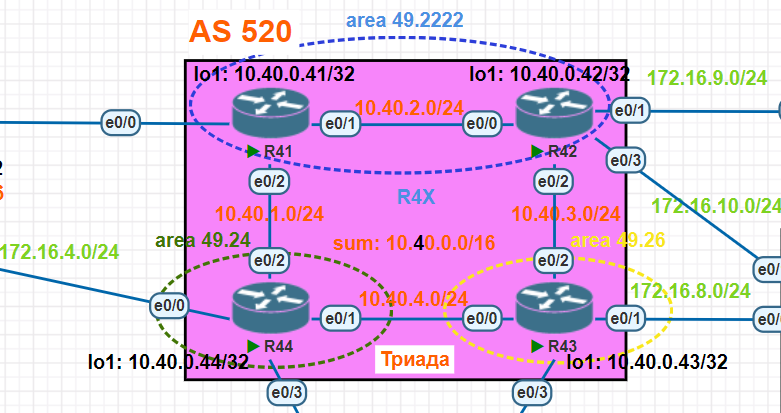

# Протокол IS-IS

## Задание


Настроить IS-IS офисе Триада (ISP):
1. Сетевую IPv4 адресацию на всех устройствах.
1. Протокол IS-IS:
- R41 и R42 находятся в зоне 2222.
- R43 находится в зоне 26.
- R44 находится в зоне 24.
- Настройки для IPv6 (если используется) повторяет логику IPv4.

## Топология



## Схема для импорта в PNETlab

[Схема для импорта в PNETlab](media/otus_cource_lab7_ISIS_pnetlab_export-20241214-141740.zip)

## Версии ПО

- PNETlab - 5.3.11
- Роутеры - Cisco IOS Software, Linux Software (I86BI_LINUX-ADVENTERPRISEK9-M), Version 15.4(2)T4
- Коммутаторы - Cisco IOS Software, Linux Software (I86BI_LINUXL2-ADVENTERPRISEK9-M), Version 15.2(CML_NIGHTLY_20150703)
- ПК - VPC

## Решение

### Настройка сетевой IPv4 адресации на всех устройствах

Настройка сетевой IPv4 адресации на всех устройствах осуществляется в соответствии с разработанным ранее планом адресации ([см. тут](https://github.com/skydevil56/otus_network_engineer_professional/tree/main/labs/lab04)).

### Настройка протокола IS-IS

1. R41 (net 49.2222.0000.0000.0041.00) и R42 (net 49.2222.0000.0000.0042.00) находятся в зоне 2222.
 - На R41 протокол IS-IS включен на интерфейсах lo1, e0/1, e0/2.
 - На R42 протокол IS-IS включен на интерфейсах lo1, e0/0, e0/2.
1. R43 (net 49.26.0000.0000.0043.00) находится в зоне 26.
- Протокол IS-IS включена на интерфейсах lo1, e0/0, e0/2.
1. R44 (net 49.24.0000.0000.0044.00) находится в зоне 24.
- Протокол IS-IS включена на интерфейсах lo1, e0/1, e0/2.

## Конфигурации устройств

### R41

<details>
  <summary>Конфигурация</summary>

```

R41#sh run
Building configuration...

Current configuration : 1287 bytes
!
! Last configuration change at 12:45:21 UTC Sat Dec 14 2024
!
version 15.4
service timestamps debug datetime msec
service timestamps log datetime msec
no service password-encryption
!
hostname R41
!
boot-start-marker
boot-end-marker
!
!
!
no aaa new-model
mmi polling-interval 60
no mmi auto-configure
no mmi pvc
mmi snmp-timeout 180
!
!
!
!
!
!
!
!


!
!
!
!
no ip domain lookup
ip cef
no ipv6 cef
!
multilink bundle-name authenticated
!
!
!
!
!
!
!
!
!
redundancy
!
!
!
!
!
!
!
!
!
!
!
!
!
!
!
interface Loopback1
 ip address 10.40.0.41 255.255.255.255
 ip router isis
!
interface Ethernet0/0
 ip address 172.16.5.41 255.255.255.0
!
interface Ethernet0/1
 ip address 10.40.2.41 255.255.255.0
 ip router isis
!
interface Ethernet0/2
 ip address 10.40.1.41 255.255.255.0
 ip router isis
!
interface Ethernet0/3
 no ip address
 shutdown
!
interface Ethernet1/0
 no ip address
 shutdown
!
interface Ethernet1/1
 no ip address
 shutdown
!
interface Ethernet1/2
 no ip address
 shutdown
!
interface Ethernet1/3
 no ip address
 shutdown
!
router isis
 net 49.2222.0000.0000.0041.00
!
ip forward-protocol nd
!
!
no ip http server
no ip http secure-server
!
!
!
!
control-plane
!
!
!
!
!
!
!
!
line con 0
 logging synchronous
line aux 0
line vty 0 4
 login
 transport input none
!
!
end

R41#
R41#
R41#
R41#show ip interface brief
Interface                  IP-Address      OK? Method Status                Protocol
Ethernet0/0                172.16.5.41     YES manual up                    up
Ethernet0/1                10.40.2.41      YES manual up                    up
Ethernet0/2                10.40.1.41      YES manual up                    up
Ethernet0/3                unassigned      YES unset  administratively down down
Ethernet1/0                unassigned      YES unset  administratively down down
Ethernet1/1                unassigned      YES unset  administratively down down
Ethernet1/2                unassigned      YES unset  administratively down down
Ethernet1/3                unassigned      YES unset  administratively down down
Loopback1                  10.40.0.41      YES manual up                    up
R41#
R41#
R41#
R41#
R41#show ip route
Codes: L - local, C - connected, S - static, R - RIP, M - mobile, B - BGP
       D - EIGRP, EX - EIGRP external, O - OSPF, IA - OSPF inter area
       N1 - OSPF NSSA external type 1, N2 - OSPF NSSA external type 2
       E1 - OSPF external type 1, E2 - OSPF external type 2
       i - IS-IS, su - IS-IS summary, L1 - IS-IS level-1, L2 - IS-IS level-2
       ia - IS-IS inter area, * - candidate default, U - per-user static route
       o - ODR, P - periodic downloaded static route, H - NHRP, l - LISP
       a - application route
       + - replicated route, % - next hop override

Gateway of last resort is not set

      10.0.0.0/8 is variably subnetted, 10 subnets, 2 masks
C        10.40.0.41/32 is directly connected, Loopback1
i L1     10.40.0.42/32 [115/20] via 10.40.2.42, 00:24:51, Ethernet0/1
i L2     10.40.0.43/32 [115/30] via 10.40.2.42, 00:13:55, Ethernet0/1
                       [115/30] via 10.40.1.44, 00:13:55, Ethernet0/2
i L2     10.40.0.44/32 [115/20] via 10.40.1.44, 00:15:28, Ethernet0/2
C        10.40.1.0/24 is directly connected, Ethernet0/2
L        10.40.1.41/32 is directly connected, Ethernet0/2
C        10.40.2.0/24 is directly connected, Ethernet0/1
L        10.40.2.41/32 is directly connected, Ethernet0/1
i L1     10.40.3.0/24 [115/20] via 10.40.2.42, 00:24:51, Ethernet0/1
i L2     10.40.4.0/24 [115/20] via 10.40.1.44, 00:15:28, Ethernet0/2
      172.16.0.0/16 is variably subnetted, 2 subnets, 2 masks
C        172.16.5.0/24 is directly connected, Ethernet0/0
L        172.16.5.41/32 is directly connected, Ethernet0/0
R41#
R41#
R41#
R41#
R41#show isis database detail

IS-IS Level-1 Link State Database:
LSPID                 LSP Seq Num  LSP Checksum  LSP Holdtime      ATT/P/OL
R41.00-00           * 0x00000008   0xECCA        811               1/0/0
  Area Address: 49.2222
  NLPID:        0xCC
  Hostname: R41
  IP Address:   10.40.0.41
  Metric: 10         IP 10.40.2.0 255.255.255.0
  Metric: 10         IP 10.40.1.0 255.255.255.0
  Metric: 10         IP 10.40.0.41 255.255.255.255
  Metric: 10         IS R42.01
R42.00-00             0x00000007   0x961C        880               1/0/0
  Area Address: 49.2222
  NLPID:        0xCC
  Hostname: R42
  IP Address:   10.40.0.42
  Metric: 10         IP 10.40.2.0 255.255.255.0
  Metric: 10         IP 10.40.3.0 255.255.255.0
  Metric: 10         IP 10.40.0.42 255.255.255.255
  Metric: 10         IS R42.01
R42.01-00             0x00000003   0x424C        1133              0/0/0
  Metric: 0          IS R42.00
  Metric: 0          IS R41.00
IS-IS Level-2 Link State Database:
LSPID                 LSP Seq Num  LSP Checksum  LSP Holdtime      ATT/P/OL
R41.00-00           * 0x0000000B   0x7397        358               0/0/0
  Area Address: 49.2222
  NLPID:        0xCC
  Hostname: R41
  IP Address:   10.40.0.41
  Metric: 10         IS R42.01
  Metric: 10         IS R44.02
  Metric: 10         IP 10.40.0.41 255.255.255.255
  Metric: 20         IP 10.40.0.42 255.255.255.255
  Metric: 10         IP 10.40.1.0 255.255.255.0
  Metric: 10         IP 10.40.2.0 255.255.255.0
  Metric: 20         IP 10.40.3.0 255.255.255.0
R42.00-00             0x00000009   0xCE3D        779               0/0/0
  Area Address: 49.2222
  NLPID:        0xCC
  Hostname: R42
  IP Address:   10.40.0.42
  Metric: 10         IS R42.01
  Metric: 10         IS R43.01
  Metric: 20         IP 10.40.0.41 255.255.255.255
  Metric: 10         IP 10.40.0.42 255.255.255.255
  Metric: 20         IP 10.40.1.0 255.255.255.0
  Metric: 10         IP 10.40.2.0 255.255.255.0
  Metric: 10         IP 10.40.3.0 255.255.255.0
R42.01-00             0x00000003   0xD145        1130              0/0/0
  Metric: 0          IS R42.00
  Metric: 0          IS R41.00
R43.00-00             0x0000000D   0xF2FE        1112              0/0/0
  Area Address: 49.26
  NLPID:        0xCC
  Hostname: R43
  IP Address:   10.40.0.43
  Metric: 10         IS R43.02
  Metric: 10         IS R43.01
  Metric: 10         IP 10.40.0.43 255.255.255.255
  Metric: 10         IP 10.40.3.0 255.255.255.0
  Metric: 10         IP 10.40.4.0 255.255.255.0
R43.01-00             0x00000002   0xF222        794               0/0/0
  Metric: 0          IS R43.00
  Metric: 0          IS R42.00
R43.02-00             0x00000003   0x1CF4        1129              0/0/0
  Metric: 0          IS R43.00
  Metric: 0          IS R44.00
R44.00-00             0x0000000C   0x04EC        1127              0/0/0
  Area Address: 49.24
  NLPID:        0xCC
  Hostname: R44
  IP Address:   10.40.0.44
  Metric: 10         IS R44.02
  Metric: 10         IS R43.02
  Metric: 10         IP 10.40.0.44 255.255.255.255
  Metric: 10         IP 10.40.1.0 255.255.255.0
  Metric: 10         IP 10.40.4.0 255.255.255.0
R44.02-00             0x00000002   0xD83A        354               0/0/0
  Metric: 0          IS R44.00
  Metric: 0          IS R41.00
R41#
R41#
R41#
R41#
R41#
R41#show isis rib


IPv4 local RIB for IS-IS process

IPV4 unicast topology base (TID 0, TOPOID 0x0) =================

10.40.0.41/32
  [115/L2/30] via 10.40.2.42(Ethernet0/1), from 10.40.0.42, tag 0, LSP[6/14]

10.40.0.42/32
  [115/L1/20] via 10.40.2.42(Ethernet0/1), from 10.40.0.42, tag 0, LSP[3/6]
              (installed)
  [115/L2/20] via 10.40.2.42(Ethernet0/1), from 10.40.0.42, tag 0, LSP[6/14]

10.40.0.43/32
  [115/L2/30] via 10.40.2.42(Ethernet0/1), from 10.40.0.43, tag 0, LSP[7/12]
              (installed)
  [115/L2/30] via 10.40.1.44(Ethernet0/2), from 10.40.0.43, tag 0, LSP[7/12]
              (installed)

10.40.0.44/32
  [115/L2/20] via 10.40.1.44(Ethernet0/2), from 10.40.0.44, tag 0, LSP[10/11]
              (installed)

10.40.1.0/24
  [115/L2/20] via 10.40.1.44(Ethernet0/2), from 10.40.0.44, tag 0, LSP[10/11]
  [115/L2/30] via 10.40.2.42(Ethernet0/1), from 10.40.0.42, tag 0, LSP[6/14]

10.40.2.0/24
  [115/L1/20] via 10.40.2.42(Ethernet0/1), from 10.40.0.42, tag 0, LSP[3/6]
  [115/L2/20] via 10.40.2.42(Ethernet0/1), from 10.40.0.42, tag 0, LSP[6/14]

10.40.3.0/24
  [115/L1/20] via 10.40.2.42(Ethernet0/1), from 10.40.0.42, tag 0, LSP[3/6]
              (installed)
  [115/L2/20] via 10.40.2.42(Ethernet0/1), from 10.40.0.42, tag 0, LSP[6/14]
  [115/L2/30] via 10.40.2.42(Ethernet0/1), from 10.40.0.43, tag 0, LSP[7/12]
  [115/L2/30] via 10.40.1.44(Ethernet0/2), from 10.40.0.43, tag 0, LSP[7/12]

10.40.4.0/24
  [115/L2/20] via 10.40.1.44(Ethernet0/2), from 10.40.0.44, tag 0, LSP[10/11]
              (installed)
  [115/L2/30] via 10.40.2.42(Ethernet0/1), from 10.40.0.43, tag 0, LSP[7/12]
  [115/L2/30] via 10.40.1.44(Ethernet0/2), from 10.40.0.43, tag 0, LSP[7/12]
R41#
R41#
R41#
R41#
R41#show isis neighbors detail

System Id      Type Interface   IP Address      State Holdtime Circuit Id
R42            L1   Et0/1       10.40.2.42      UP    8        R42.01
  Area Address(es): 49.2222
  SNPA: aabb.cc00.1400
  State Changed: 00:25:15
  LAN Priority: 64
  Format: Phase V
  Remote TID: 0
  Local TID:  0
  Interface name: Ethernet0/1
R42            L2   Et0/1       10.40.2.42      UP    8        R42.01
  Area Address(es): 49.2222
  SNPA: aabb.cc00.1400
  State Changed: 00:25:14
  LAN Priority: 64
  Format: Phase V
  Remote TID: 0
  Local TID:  0
  Interface name: Ethernet0/1
R44            L2   Et0/2       10.40.1.44      UP    7        R44.02
  Area Address(es): 49.24
  SNPA: aabb.cc00.1320
  State Changed: 00:14:06
  LAN Priority: 64
  Format: Phase V
  Remote TID: 0
  Local TID:  0
  Interface name: Ethernet0/2
R41#


```
</details>

### R42

<details>
  <summary>Конфигурация</summary>

```

R42#sh run
Building configuration...

Current configuration : 1388 bytes
!
! Last configuration change at 12:43:05 UTC Sat Dec 14 2024
!
version 15.4
service timestamps debug datetime msec
service timestamps log datetime msec
no service password-encryption
!
hostname R42
!
boot-start-marker
boot-end-marker
!
!
!
no aaa new-model
mmi polling-interval 60
no mmi auto-configure
no mmi pvc
mmi snmp-timeout 180
!
!
!
!
!
!
!
!


!
!
!
!
no ip domain lookup
ip cef
no ipv6 cef
!
multilink bundle-name authenticated
!
!
!
!
!
!
!
!
!
redundancy
!
!
!
!
!
!
!
!
!
!
!
!
!
!
!
interface Loopback1
 ip address 10.40.0.42 255.255.255.255
 ip router isis
!
interface Ethernet0/0
 ip address 10.40.2.42 255.255.255.0
 ip router isis
!
interface Ethernet0/1
 ip address 172.16.9.42 255.255.255.0
!
interface Ethernet0/2
 ip address 10.40.3.42 255.255.255.0
 ip router isis
!
interface Ethernet0/3
 ip address 172.16.10.42 255.255.255.0
!
interface Ethernet1/0
 no ip address
 shutdown
!
interface Ethernet1/1
 no ip address
 shutdown
!
interface Ethernet1/2
 no ip address
 shutdown
!
interface Ethernet1/3
 no ip address
 shutdown
!
router isis
 net 49.2222.0000.0000.0042.00
!
ip forward-protocol nd
!
!
no ip http server
no ip http secure-server
ip route 10.60.0.0 255.255.0.0 172.16.9.61
ip route 10.70.0.0 255.255.0.0 172.16.10.71
!
!
!
!
control-plane
!
!
!
!
!
!
!
!
line con 0
 logging synchronous
line aux 0
line vty 0 4
 login
 transport input none
!
!
end

R42#
R42#
R42#
R42#show ip interface brief
Interface                  IP-Address      OK? Method Status                Protocol
Ethernet0/0                10.40.2.42      YES manual up                    up
Ethernet0/1                172.16.9.42     YES manual up                    up
Ethernet0/2                10.40.3.42      YES manual up                    up
Ethernet0/3                172.16.10.42    YES manual up                    up
Ethernet1/0                unassigned      YES unset  administratively down down
Ethernet1/1                unassigned      YES unset  administratively down down
Ethernet1/2                unassigned      YES unset  administratively down down
Ethernet1/3                unassigned      YES unset  administratively down down
Loopback1                  10.40.0.42      YES manual up                    up
R42#
R42#
R42#
R42#
R42#show ip route
Codes: L - local, C - connected, S - static, R - RIP, M - mobile, B - BGP
       D - EIGRP, EX - EIGRP external, O - OSPF, IA - OSPF inter area
       N1 - OSPF NSSA external type 1, N2 - OSPF NSSA external type 2
       E1 - OSPF external type 1, E2 - OSPF external type 2
       i - IS-IS, su - IS-IS summary, L1 - IS-IS level-1, L2 - IS-IS level-2
       ia - IS-IS inter area, * - candidate default, U - per-user static route
       o - ODR, P - periodic downloaded static route, H - NHRP, l - LISP
       a - application route
       + - replicated route, % - next hop override

Gateway of last resort is not set

      10.0.0.0/8 is variably subnetted, 12 subnets, 3 masks
i L1     10.40.0.41/32 [115/20] via 10.40.2.41, 00:24:16, Ethernet0/0
C        10.40.0.42/32 is directly connected, Loopback1
i L2     10.40.0.43/32 [115/20] via 10.40.3.43, 00:21:17, Ethernet0/2
i L2     10.40.0.44/32 [115/30] via 10.40.3.43, 00:15:14, Ethernet0/2
                       [115/30] via 10.40.2.41, 00:15:14, Ethernet0/0
i L1     10.40.1.0/24 [115/20] via 10.40.2.41, 00:26:55, Ethernet0/0
C        10.40.2.0/24 is directly connected, Ethernet0/0
L        10.40.2.42/32 is directly connected, Ethernet0/0
C        10.40.3.0/24 is directly connected, Ethernet0/2
L        10.40.3.42/32 is directly connected, Ethernet0/2
i L2     10.40.4.0/24 [115/20] via 10.40.3.43, 00:21:11, Ethernet0/2
S        10.60.0.0/16 [1/0] via 172.16.9.61
S        10.70.0.0/16 [1/0] via 172.16.10.71
      172.16.0.0/16 is variably subnetted, 4 subnets, 2 masks
C        172.16.9.0/24 is directly connected, Ethernet0/1
L        172.16.9.42/32 is directly connected, Ethernet0/1
C        172.16.10.0/24 is directly connected, Ethernet0/3
L        172.16.10.42/32 is directly connected, Ethernet0/3
R42#
R42#
R42#
R42#
R42#show isis database detail

IS-IS Level-1 Link State Database:
LSPID                 LSP Seq Num  LSP Checksum  LSP Holdtime      ATT/P/OL
R41.00-00             0x00000008   0xECCA        702               1/0/0
  Area Address: 49.2222
  NLPID:        0xCC
  Hostname: R41
  IP Address:   10.40.0.41
  Metric: 10         IP 10.40.2.0 255.255.255.0
  Metric: 10         IP 10.40.1.0 255.255.255.0
  Metric: 10         IP 10.40.0.41 255.255.255.255
  Metric: 10         IS R42.01
R42.00-00           * 0x00000007   0x961C        776               1/0/0
  Area Address: 49.2222
  NLPID:        0xCC
  Hostname: R42
  IP Address:   10.40.0.42
  Metric: 10         IP 10.40.2.0 255.255.255.0
  Metric: 10         IP 10.40.3.0 255.255.255.0
  Metric: 10         IP 10.40.0.42 255.255.255.255
  Metric: 10         IS R42.01
R42.01-00           * 0x00000003   0x424C        1029              0/0/0
  Metric: 0          IS R42.00
  Metric: 0          IS R41.00
IS-IS Level-2 Link State Database:
LSPID                 LSP Seq Num  LSP Checksum  LSP Holdtime      ATT/P/OL
R41.00-00             0x0000000C   0x7198        1122              0/0/0
  Area Address: 49.2222
  NLPID:        0xCC
  Hostname: R41
  IP Address:   10.40.0.41
  Metric: 10         IS R42.01
  Metric: 10         IS R44.02
  Metric: 10         IP 10.40.0.41 255.255.255.255
  Metric: 20         IP 10.40.0.42 255.255.255.255
  Metric: 10         IP 10.40.1.0 255.255.255.0
  Metric: 10         IP 10.40.2.0 255.255.255.0
  Metric: 20         IP 10.40.3.0 255.255.255.0
R42.00-00           * 0x00000009   0xCE3D        675               0/0/0
  Area Address: 49.2222
  NLPID:        0xCC
  Hostname: R42
  IP Address:   10.40.0.42
  Metric: 10         IS R42.01
  Metric: 10         IS R43.01
  Metric: 20         IP 10.40.0.41 255.255.255.255
  Metric: 10         IP 10.40.0.42 255.255.255.255
  Metric: 20         IP 10.40.1.0 255.255.255.0
  Metric: 10         IP 10.40.2.0 255.255.255.0
  Metric: 10         IP 10.40.3.0 255.255.255.0
R42.01-00           * 0x00000003   0xD145        1026              0/0/0
  Metric: 0          IS R42.00
  Metric: 0          IS R41.00
R43.00-00             0x0000000D   0xF2FE        1008              0/0/0
  Area Address: 49.26
  NLPID:        0xCC
  Hostname: R43
  IP Address:   10.40.0.43
  Metric: 10         IS R43.02
  Metric: 10         IS R43.01
  Metric: 10         IP 10.40.0.43 255.255.255.255
  Metric: 10         IP 10.40.3.0 255.255.255.0
  Metric: 10         IP 10.40.4.0 255.255.255.0
R43.01-00             0x00000002   0xF222        690               0/0/0
  Metric: 0          IS R43.00
  Metric: 0          IS R42.00
R43.02-00             0x00000003   0x1CF4        1024              0/0/0
  Metric: 0          IS R43.00
  Metric: 0          IS R44.00
R44.00-00             0x0000000C   0x04EC        1019              0/0/0
  Area Address: 49.24
  NLPID:        0xCC
  Hostname: R44
  IP Address:   10.40.0.44
  Metric: 10         IS R44.02
  Metric: 10         IS R43.02
  Metric: 10         IP 10.40.0.44 255.255.255.255
  Metric: 10         IP 10.40.1.0 255.255.255.0
  Metric: 10         IP 10.40.4.0 255.255.255.0
R44.02-00             0x00000003   0xD63B        1121              0/0/0
  Metric: 0          IS R44.00
  Metric: 0          IS R41.00
R42#
R42#
R42#
R42#
R42#
R42#show isis rib


IPv4 local RIB for IS-IS process

IPV4 unicast topology base (TID 0, TOPOID 0x0) =================

10.40.0.41/32
  [115/L1/20] via 10.40.2.41(Ethernet0/0), from 10.40.0.41, tag 0, LSP[3/4]
              (installed)
  [115/L2/20] via 10.40.2.41(Ethernet0/0), from 10.40.0.41, tag 0, LSP[6/12]

10.40.0.42/32
  [115/L2/30] via 10.40.2.41(Ethernet0/0), from 10.40.0.41, tag 0, LSP[6/12]

10.40.0.43/32
  [115/L2/20] via 10.40.3.43(Ethernet0/2), from 10.40.0.43, tag 0, LSP[7/12]
              (installed)

10.40.0.44/32
  [115/L2/30] via 10.40.3.43(Ethernet0/2), from 10.40.0.44, tag 0, LSP[10/10]
              (installed)
  [115/L2/30] via 10.40.2.41(Ethernet0/0), from 10.40.0.44, tag 0, LSP[10/10]
              (installed)

10.40.1.0/24
  [115/L1/20] via 10.40.2.41(Ethernet0/0), from 10.40.0.41, tag 0, LSP[3/4]
              (installed)
  [115/L2/20] via 10.40.2.41(Ethernet0/0), from 10.40.0.41, tag 0, LSP[6/12]
  [115/L2/30] via 10.40.3.43(Ethernet0/2), from 10.40.0.44, tag 0, LSP[10/10]
  [115/L2/30] via 10.40.2.41(Ethernet0/0), from 10.40.0.44, tag 0, LSP[10/10]

10.40.2.0/24
  [115/L1/20] via 10.40.2.41(Ethernet0/0), from 10.40.0.41, tag 0, LSP[3/4]
  [115/L2/20] via 10.40.2.41(Ethernet0/0), from 10.40.0.41, tag 0, LSP[6/12]

10.40.3.0/24
  [115/L2/20] via 10.40.3.43(Ethernet0/2), from 10.40.0.43, tag 0, LSP[7/12]
  [115/L2/30] via 10.40.2.41(Ethernet0/0), from 10.40.0.41, tag 0, LSP[6/12]

10.40.4.0/24
  [115/L2/20] via 10.40.3.43(Ethernet0/2), from 10.40.0.43, tag 0, LSP[7/12]
              (installed)
  [115/L2/30] via 10.40.3.43(Ethernet0/2), from 10.40.0.44, tag 0, LSP[10/10]
  [115/L2/30] via 10.40.2.41(Ethernet0/0), from 10.40.0.44, tag 0, LSP[10/10]
R42#
R42#
R42#
R42#
R42#show isis neighbors detail

System Id      Type Interface   IP Address      State Holdtime Circuit Id
R41            L1   Et0/0       10.40.2.41      UP    22       R42.01
  Area Address(es): 49.2222
  SNPA: aabb.cc00.1210
  State Changed: 00:27:00
  LAN Priority: 64
  Format: Phase V
  Remote TID: 0
  Local TID:  0
  Interface name: Ethernet0/0
R41            L2   Et0/0       10.40.2.41      UP    26       R42.01
  Area Address(es): 49.2222
  SNPA: aabb.cc00.1210
  State Changed: 00:26:59
  LAN Priority: 64
  Format: Phase V
  Remote TID: 0
  Local TID:  0
  Interface name: Ethernet0/0
R43            L2   Et0/2       10.40.3.43      UP    9        R43.01
  Area Address(es): 49.26
  SNPA: aabb.cc00.1520
  State Changed: 00:21:53
  LAN Priority: 64
  Format: Phase V
  Remote TID: 0
  Local TID:  0
  Interface name: Ethernet0/2
R42#


```
</details>

### R43

<details>
  <summary>Конфигурация</summary>

```

R43#sh run
Building configuration...

Current configuration : 1340 bytes
!
! Last configuration change at 12:48:28 UTC Sat Dec 14 2024
!
version 15.4
service timestamps debug datetime msec
service timestamps log datetime msec
no service password-encryption
!
hostname R43
!
boot-start-marker
boot-end-marker
!
!
!
no aaa new-model
mmi polling-interval 60
no mmi auto-configure
no mmi pvc
mmi snmp-timeout 180
!
!
!
!
!
!
!
!


!
!
!
!
no ip domain lookup
ip cef
no ipv6 cef
!
multilink bundle-name authenticated
!
!
!
!
!
!
!
!
!
redundancy
!
!
!
!
!
!
!
!
!
!
!
!
!
!
!
interface Loopback1
 ip address 10.40.0.43 255.255.255.255
 ip router isis
!
interface Ethernet0/0
 ip address 10.40.4.43 255.255.255.0
 ip router isis
!
interface Ethernet0/1
 ip address 172.16.8.43 255.255.255.0
!
interface Ethernet0/2
 ip address 10.40.3.43 255.255.255.0
 ip router isis
!
interface Ethernet0/3
 ip address 172.16.7.43 255.255.255.0
!
interface Ethernet1/0
 no ip address
 shutdown
!
interface Ethernet1/1
 no ip address
 shutdown
!
interface Ethernet1/2
 no ip address
 shutdown
!
interface Ethernet1/3
 no ip address
 shutdown
!
router isis
 net 49.2600.0000.0000.4300
!
ip forward-protocol nd
!
!
no ip http server
no ip http secure-server
ip route 10.70.0.0 255.255.0.0 172.16.8.71
!
!
!
!
control-plane
!
!
!
!
!
!
!
!
line con 0
 logging synchronous
line aux 0
line vty 0 4
 login
 transport input none
!
!
end

R43#
R43#
R43#
R43#show ip interface brief
Interface                  IP-Address      OK? Method Status                Protocol
Ethernet0/0                10.40.4.43      YES manual up                    up
Ethernet0/1                172.16.8.43     YES manual up                    up
Ethernet0/2                10.40.3.43      YES manual up                    up
Ethernet0/3                172.16.7.43     YES manual up                    up
Ethernet1/0                unassigned      YES unset  administratively down down
Ethernet1/1                unassigned      YES unset  administratively down down
Ethernet1/2                unassigned      YES unset  administratively down down
Ethernet1/3                unassigned      YES unset  administratively down down
Loopback1                  10.40.0.43      YES manual up                    up
R43#
R43#
R43#
R43#
R43#show ip route
Codes: L - local, C - connected, S - static, R - RIP, M - mobile, B - BGP
       D - EIGRP, EX - EIGRP external, O - OSPF, IA - OSPF inter area
       N1 - OSPF NSSA external type 1, N2 - OSPF NSSA external type 2
       E1 - OSPF external type 1, E2 - OSPF external type 2
       i - IS-IS, su - IS-IS summary, L1 - IS-IS level-1, L2 - IS-IS level-2
       ia - IS-IS inter area, * - candidate default, U - per-user static route
       o - ODR, P - periodic downloaded static route, H - NHRP, l - LISP
       a - application route
       + - replicated route, % - next hop override

Gateway of last resort is not set

      10.0.0.0/8 is variably subnetted, 11 subnets, 3 masks
i L2     10.40.0.41/32 [115/30] via 10.40.4.44, 00:18:45, Ethernet0/0
                       [115/30] via 10.40.3.42, 00:18:45, Ethernet0/2
i L2     10.40.0.42/32 [115/20] via 10.40.3.42, 00:23:20, Ethernet0/2
C        10.40.0.43/32 is directly connected, Loopback1
i L2     10.40.0.44/32 [115/20] via 10.40.4.44, 00:16:51, Ethernet0/0
i L2     10.40.1.0/24 [115/20] via 10.40.4.44, 00:16:51, Ethernet0/0
i L2     10.40.2.0/24 [115/20] via 10.40.3.42, 00:23:20, Ethernet0/2
C        10.40.3.0/24 is directly connected, Ethernet0/2
L        10.40.3.43/32 is directly connected, Ethernet0/2
C        10.40.4.0/24 is directly connected, Ethernet0/0
L        10.40.4.43/32 is directly connected, Ethernet0/0
S        10.70.0.0/16 [1/0] via 172.16.8.71
      172.16.0.0/16 is variably subnetted, 4 subnets, 2 masks
C        172.16.7.0/24 is directly connected, Ethernet0/3
L        172.16.7.43/32 is directly connected, Ethernet0/3
C        172.16.8.0/24 is directly connected, Ethernet0/1
L        172.16.8.43/32 is directly connected, Ethernet0/1
R43#
R43#
R43#
R43#
R43#show isis database detail

IS-IS Level-1 Link State Database:
LSPID                 LSP Seq Num  LSP Checksum  LSP Holdtime      ATT/P/OL
R43.00-00           * 0x00000008   0x069F        951               1/0/0
  Area Address: 49.26
  NLPID:        0xCC
  Hostname: R43
  IP Address:   10.40.0.43
  Metric: 10         IP 10.40.3.0 255.255.255.0
  Metric: 10         IP 10.40.0.43 255.255.255.255
  Metric: 10         IP 10.40.4.0 255.255.255.0
R43.02-00           * 0x00000001   0xD8DD        0 (183)           0/0/0
R44.00-00             0x00000007   0x6EE7        120               1/0/0
  Area Address: 49.26
  Area Address: 49.24
  NLPID:        0xCC
  Hostname: R44
  IP Address:   10.40.0.44
  Metric: 10         IP 10.40.0.44 255.255.255.255
  Metric: 10         IP 10.40.4.0 255.255.255.0
  Metric: 10         IP 10.40.1.0 255.255.255.0
  Metric: 10         IS R43.02
IS-IS Level-2 Link State Database:
LSPID                 LSP Seq Num  LSP Checksum  LSP Holdtime      ATT/P/OL
R41.00-00             0x0000000C   0x7198        1029              0/0/0
  Area Address: 49.2222
  NLPID:        0xCC
  Hostname: R41
  IP Address:   10.40.0.41
  Metric: 10         IS R42.01
  Metric: 10         IS R44.02
  Metric: 10         IP 10.40.0.41 255.255.255.255
  Metric: 20         IP 10.40.0.42 255.255.255.255
  Metric: 10         IP 10.40.1.0 255.255.255.0
  Metric: 10         IP 10.40.2.0 255.255.255.0
  Metric: 20         IP 10.40.3.0 255.255.255.0
R42.00-00             0x00000009   0xCE3D        582               0/0/0
  Area Address: 49.2222
  NLPID:        0xCC
  Hostname: R42
  IP Address:   10.40.0.42
  Metric: 10         IS R42.01
  Metric: 10         IS R43.01
  Metric: 20         IP 10.40.0.41 255.255.255.255
  Metric: 10         IP 10.40.0.42 255.255.255.255
  Metric: 20         IP 10.40.1.0 255.255.255.0
  Metric: 10         IP 10.40.2.0 255.255.255.0
  Metric: 10         IP 10.40.3.0 255.255.255.0
R42.01-00             0x00000003   0xD145        933               0/0/0
  Metric: 0          IS R42.00
  Metric: 0          IS R41.00
R43.00-00           * 0x0000000D   0xF2FE        919               0/0/0
  Area Address: 49.26
  NLPID:        0xCC
  Hostname: R43
  IP Address:   10.40.0.43
  Metric: 10         IS R43.02
  Metric: 10         IS R43.01
  Metric: 10         IP 10.40.0.43 255.255.255.255
  Metric: 10         IP 10.40.3.0 255.255.255.0
  Metric: 10         IP 10.40.4.0 255.255.255.0
R43.01-00           * 0x00000002   0xF222        601               0/0/0
  Metric: 0          IS R43.00
  Metric: 0          IS R42.00
R43.02-00           * 0x00000003   0x1CF4        935               0/0/0
  Metric: 0          IS R43.00
  Metric: 0          IS R44.00
R44.00-00             0x0000000C   0x04EC        930               0/0/0
  Area Address: 49.24
  NLPID:        0xCC
  Hostname: R44
  IP Address:   10.40.0.44
  Metric: 10         IS R44.02
  Metric: 10         IS R43.02
  Metric: 10         IP 10.40.0.44 255.255.255.255
  Metric: 10         IP 10.40.1.0 255.255.255.0
  Metric: 10         IP 10.40.4.0 255.255.255.0
R44.02-00             0x00000003   0xD63B        1032              0/0/0
  Metric: 0          IS R44.00
  Metric: 0          IS R41.00
R43#
R43#
R43#
R43#
R43#
R43#show isis rib


IPv4 local RIB for IS-IS process

IPV4 unicast topology base (TID 0, TOPOID 0x0) =================

10.40.0.41/32
  [115/L2/30] via 10.40.3.42(Ethernet0/2), from 10.40.0.42, tag 0, LSP[3/8]
              (installed)
  [115/L2/30] via 10.40.3.42(Ethernet0/2), from 10.40.0.41, tag 0, LSP[5/7]
  [115/L2/30] via 10.40.4.44(Ethernet0/0), from 10.40.0.41, tag 0, LSP[5/7]
              (installed)

10.40.0.42/32
  [115/L2/20] via 10.40.3.42(Ethernet0/2), from 10.40.0.42, tag 0, LSP[3/8]
              (installed)
  [115/L2/40] via 10.40.3.42(Ethernet0/2), from 10.40.0.41, tag 0, LSP[5/7]
  [115/L2/40] via 10.40.4.44(Ethernet0/0), from 10.40.0.41, tag 0, LSP[5/7]

10.40.0.44/32
  [115/L2/20] via 10.40.4.44(Ethernet0/0), from 10.40.0.44, tag 0, LSP[10/9]
              (installed)

10.40.1.0/24
  [115/L2/20] via 10.40.4.44(Ethernet0/0), from 10.40.0.44, tag 0, LSP[10/9]
              (installed)
  [115/L2/30] via 10.40.3.42(Ethernet0/2), from 10.40.0.42, tag 0, LSP[3/8]
  [115/L2/30] via 10.40.3.42(Ethernet0/2), from 10.40.0.41, tag 0, LSP[5/7]
  [115/L2/30] via 10.40.4.44(Ethernet0/0), from 10.40.0.41, tag 0, LSP[5/7]

10.40.2.0/24
  [115/L2/20] via 10.40.3.42(Ethernet0/2), from 10.40.0.42, tag 0, LSP[3/8]
              (installed)
  [115/L2/30] via 10.40.3.42(Ethernet0/2), from 10.40.0.41, tag 0, LSP[5/7]
  [115/L2/30] via 10.40.4.44(Ethernet0/0), from 10.40.0.41, tag 0, LSP[5/7]

10.40.3.0/24
  [115/L2/20] via 10.40.3.42(Ethernet0/2), from 10.40.0.42, tag 0, LSP[3/8]
  [115/L2/40] via 10.40.3.42(Ethernet0/2), from 10.40.0.41, tag 0, LSP[5/7]
  [115/L2/40] via 10.40.4.44(Ethernet0/0), from 10.40.0.41, tag 0, LSP[5/7]

10.40.4.0/24
  [115/L2/20] via 10.40.4.44(Ethernet0/0), from 10.40.0.44, tag 0, LSP[10/9]
R43#
R43#
R43#
R43#
R43#show isis neighbors detail

System Id      Type Interface   IP Address      State Holdtime Circuit Id
R42            L2   Et0/2       10.40.3.42      UP    28       R43.01
  Area Address(es): 49.2222
  SNPA: aabb.cc00.1420
  State Changed: 00:23:25
  LAN Priority: 64
  Format: Phase V
  Remote TID: 0
  Local TID:  0
  Interface name: Ethernet0/2
R44            L2   Et0/0       10.40.4.44      UP    23       R43.02
  Area Address(es): 49.24
  SNPA: aabb.cc00.1310
  State Changed: 00:17:23
  LAN Priority: 64
  Format: Phase V
  Remote TID: 0
  Local TID:  0
  Interface name: Ethernet0/0
R43#


```
</details>

### R44

<details>
  <summary>Конфигурация</summary>

```

R44#sh run
Building configuration...

Current configuration : 1297 bytes
!
! Last configuration change at 12:53:48 UTC Sat Dec 14 2024
!
version 15.4
service timestamps debug datetime msec
service timestamps log datetime msec
no service password-encryption
!
hostname R44
!
boot-start-marker
boot-end-marker
!
!
!
no aaa new-model
mmi polling-interval 60
no mmi auto-configure
no mmi pvc
mmi snmp-timeout 180
!
!
!
!
!
!
!
!


!
!
!
!
no ip domain lookup
ip cef
no ipv6 cef
!
multilink bundle-name authenticated
!
!
!
!
!
!
!
!
!
redundancy
!
!
!
!
!
!
!
!
!
!
!
!
!
!
!
interface Loopback1
 ip address 10.40.0.44 255.255.255.255
 ip router isis
!
interface Ethernet0/0
 ip address 172.16.4.44 255.255.255.0
!
interface Ethernet0/1
 ip address 10.40.4.44 255.255.255.0
 ip router isis
!
interface Ethernet0/2
 ip address 10.40.1.44 255.255.255.0
 ip router isis
!
interface Ethernet0/3
 ip address 172.16.6.44 255.255.255.0
!
interface Ethernet1/0
 no ip address
 shutdown
!
interface Ethernet1/1
 no ip address
 shutdown
!
interface Ethernet1/2
 no ip address
 shutdown
!
interface Ethernet1/3
 no ip address
 shutdown
!
router isis
 net 49.2400.0000.0000.4400
!
ip forward-protocol nd
!
!
no ip http server
no ip http secure-server
!
!
!
!
control-plane
!
!
!
!
!
!
!
!
line con 0
 logging synchronous
line aux 0
line vty 0 4
 login
 transport input none
!
!
end

R44#
R44#
R44#
R44#show ip interface brief
Interface                  IP-Address      OK? Method Status                Protocol
Ethernet0/0                172.16.4.44     YES manual up                    up
Ethernet0/1                10.40.4.44      YES manual up                    up
Ethernet0/2                10.40.1.44      YES manual up                    up
Ethernet0/3                172.16.6.44     YES manual up                    up
Ethernet1/0                unassigned      YES unset  administratively down down
Ethernet1/1                unassigned      YES unset  administratively down down
Ethernet1/2                unassigned      YES unset  administratively down down
Ethernet1/3                unassigned      YES unset  administratively down down
Loopback1                  10.40.0.44      YES manual up                    up
R44#
R44#
R44#
R44#
R44#show ip route
Codes: L - local, C - connected, S - static, R - RIP, M - mobile, B - BGP
       D - EIGRP, EX - EIGRP external, O - OSPF, IA - OSPF inter area
       N1 - OSPF NSSA external type 1, N2 - OSPF NSSA external type 2
       E1 - OSPF external type 1, E2 - OSPF external type 2
       i - IS-IS, su - IS-IS summary, L1 - IS-IS level-1, L2 - IS-IS level-2
       ia - IS-IS inter area, * - candidate default, U - per-user static route
       o - ODR, P - periodic downloaded static route, H - NHRP, l - LISP
       a - application route
       + - replicated route, % - next hop override

Gateway of last resort is not set

      10.0.0.0/8 is variably subnetted, 10 subnets, 2 masks
i L2     10.40.0.41/32 [115/20] via 10.40.1.41, 00:19:47, Ethernet0/2
i L2     10.40.0.42/32 [115/30] via 10.40.4.43, 00:19:47, Ethernet0/1
                       [115/30] via 10.40.1.41, 00:19:47, Ethernet0/2
i L2     10.40.0.43/32 [115/20] via 10.40.4.43, 00:18:22, Ethernet0/1
C        10.40.0.44/32 is directly connected, Loopback1
C        10.40.1.0/24 is directly connected, Ethernet0/2
L        10.40.1.44/32 is directly connected, Ethernet0/2
i L2     10.40.2.0/24 [115/20] via 10.40.1.41, 00:19:47, Ethernet0/2
i L2     10.40.3.0/24 [115/20] via 10.40.4.43, 00:18:22, Ethernet0/1
C        10.40.4.0/24 is directly connected, Ethernet0/1
L        10.40.4.44/32 is directly connected, Ethernet0/1
      172.16.0.0/16 is variably subnetted, 4 subnets, 2 masks
C        172.16.4.0/24 is directly connected, Ethernet0/0
L        172.16.4.44/32 is directly connected, Ethernet0/0
C        172.16.6.0/24 is directly connected, Ethernet0/3
L        172.16.6.44/32 is directly connected, Ethernet0/3
R44#
R44#
R44#
R44#
R44#show isis database detail

IS-IS Level-1 Link State Database:
LSPID                 LSP Seq Num  LSP Checksum  LSP Holdtime      ATT/P/OL
R43.00-00             0x00000006   0xE4C6        0 (32)            1/0/0
R43.02-00             0x00000001   0xD8DD        0 (33)            0/0/0
R44.00-00           * 0x00000009   0xD7CC        976               1/0/0
  Area Address: 49.24
  NLPID:        0xCC
  Hostname: R44
  IP Address:   10.40.0.44
  Metric: 10         IP 10.40.0.44 255.255.255.255
  Metric: 10         IP 10.40.4.0 255.255.255.0
  Metric: 10         IP 10.40.1.0 255.255.255.0
IS-IS Level-2 Link State Database:
LSPID                 LSP Seq Num  LSP Checksum  LSP Holdtime      ATT/P/OL
R41.00-00             0x0000000C   0x7198        969               0/0/0
  Area Address: 49.2222
  NLPID:        0xCC
  Hostname: R41
  IP Address:   10.40.0.41
  Metric: 10         IS R42.01
  Metric: 10         IS R44.02
  Metric: 10         IP 10.40.0.41 255.255.255.255
  Metric: 20         IP 10.40.0.42 255.255.255.255
  Metric: 10         IP 10.40.1.0 255.255.255.0
  Metric: 10         IP 10.40.2.0 255.255.255.0
  Metric: 20         IP 10.40.3.0 255.255.255.0
R42.00-00             0x00000009   0xCE3D        517               0/0/0
  Area Address: 49.2222
  NLPID:        0xCC
  Hostname: R42
  IP Address:   10.40.0.42
  Metric: 10         IS R42.01
  Metric: 10         IS R43.01
  Metric: 20         IP 10.40.0.41 255.255.255.255
  Metric: 10         IP 10.40.0.42 255.255.255.255
  Metric: 20         IP 10.40.1.0 255.255.255.0
  Metric: 10         IP 10.40.2.0 255.255.255.0
  Metric: 10         IP 10.40.3.0 255.255.255.0
R42.01-00             0x00000003   0xD145        868               0/0/0
  Metric: 0          IS R42.00
  Metric: 0          IS R41.00
R43.00-00             0x0000000D   0xF2FE        854               0/0/0
  Area Address: 49.26
  NLPID:        0xCC
  Hostname: R43
  IP Address:   10.40.0.43
  Metric: 10         IS R43.02
  Metric: 10         IS R43.01
  Metric: 10         IP 10.40.0.43 255.255.255.255
  Metric: 10         IP 10.40.3.0 255.255.255.0
  Metric: 10         IP 10.40.4.0 255.255.255.0
R43.01-00             0x00000002   0xF222        536               0/0/0
  Metric: 0          IS R43.00
  Metric: 0          IS R42.00
R43.02-00             0x00000003   0x1CF4        871               0/0/0
  Metric: 0          IS R43.00
  Metric: 0          IS R44.00
R44.00-00           * 0x0000000C   0x04EC        869               0/0/0
  Area Address: 49.24
  NLPID:        0xCC
  Hostname: R44
  IP Address:   10.40.0.44
  Metric: 10         IS R44.02
  Metric: 10         IS R43.02
  Metric: 10         IP 10.40.0.44 255.255.255.255
  Metric: 10         IP 10.40.1.0 255.255.255.0
  Metric: 10         IP 10.40.4.0 255.255.255.0
R44.02-00           * 0x00000003   0xD63B        971               0/0/0
  Metric: 0          IS R44.00
  Metric: 0          IS R41.00
R44#
R44#
R44#
R44#
R44#
R44#show isis rib


IPv4 local RIB for IS-IS process

IPV4 unicast topology base (TID 0, TOPOID 0x0) =================

10.40.0.41/32
  [115/L2/20] via 10.40.1.41(Ethernet0/2), from 10.40.0.41, tag 0, LSP[10/7]
              (installed)
  [115/L2/40] via 10.40.4.43(Ethernet0/1), from 10.40.0.42, tag 0, LSP[9/7]
  [115/L2/40] via 10.40.1.41(Ethernet0/2), from 10.40.0.42, tag 0, LSP[9/7]

10.40.0.42/32
  [115/L2/30] via 10.40.4.43(Ethernet0/1), from 10.40.0.42, tag 0, LSP[9/7]
              (installed)
  [115/L2/30] via 10.40.1.41(Ethernet0/2), from 10.40.0.41, tag 0, LSP[10/7]
              (installed)
  [115/L2/30] via 10.40.1.41(Ethernet0/2), from 10.40.0.42, tag 0, LSP[9/7]

10.40.0.43/32
  [115/L2/20] via 10.40.4.43(Ethernet0/1), from 10.40.0.43, tag 0, LSP[6/8]
              (installed)

10.40.1.0/24
  [115/L2/20] via 10.40.1.41(Ethernet0/2), from 10.40.0.41, tag 0, LSP[10/7]
  [115/L2/40] via 10.40.4.43(Ethernet0/1), from 10.40.0.42, tag 0, LSP[9/7]
  [115/L2/40] via 10.40.1.41(Ethernet0/2), from 10.40.0.42, tag 0, LSP[9/7]

10.40.2.0/24
  [115/L2/20] via 10.40.1.41(Ethernet0/2), from 10.40.0.41, tag 0, LSP[10/7]
              (installed)
  [115/L2/30] via 10.40.4.43(Ethernet0/1), from 10.40.0.42, tag 0, LSP[9/7]
  [115/L2/30] via 10.40.1.41(Ethernet0/2), from 10.40.0.42, tag 0, LSP[9/7]

10.40.3.0/24
  [115/L2/20] via 10.40.4.43(Ethernet0/1), from 10.40.0.43, tag 0, LSP[6/8]
              (installed)
  [115/L2/30] via 10.40.4.43(Ethernet0/1), from 10.40.0.42, tag 0, LSP[9/7]
  [115/L2/30] via 10.40.1.41(Ethernet0/2), from 10.40.0.41, tag 0, LSP[10/7]
  [115/L2/30] via 10.40.1.41(Ethernet0/2), from 10.40.0.42, tag 0, LSP[9/7]

10.40.4.0/24
  [115/L2/20] via 10.40.4.43(Ethernet0/1), from 10.40.0.43, tag 0, LSP[6/8]
R44#
R44#
R44#
R44#
R44#show isis neighbors detail

System Id      Type Interface   IP Address      State Holdtime Circuit Id
R41            L2   Et0/2       10.40.1.41      UP    27       R44.02
  Area Address(es): 49.2222
  SNPA: aabb.cc00.1220
  State Changed: 00:18:25
  LAN Priority: 64
  Format: Phase V
  Remote TID: 0
  Local TID:  0
  Interface name: Ethernet0/2
R43            L2   Et0/1       10.40.4.43      UP    8        R43.02
  Area Address(es): 49.26
  SNPA: aabb.cc00.1500
  State Changed: 00:18:25
  LAN Priority: 64
  Format: Phase V
  Remote TID: 0
  Local TID:  0
  Interface name: Ethernet0/1
R44#


```
</details>

