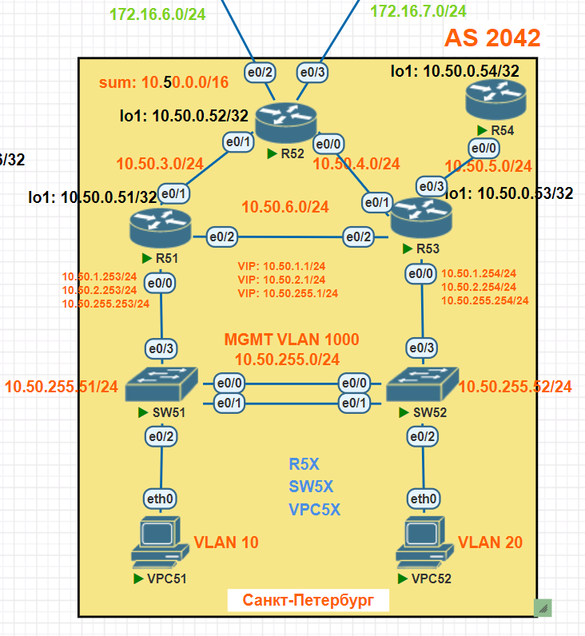

# Протокол EIGRP

## Задание

В офисе Санкт-Петербург нужно настроить:
1. Сетевую IPv4 адресацию на всех устройствах.
1. На коммутаторах SW51, SW52 протокол PVRSTP и протокол LACP на интерфейсах e0/0 и e0/1.
1. На маршрутизаторах R51 и R53 протокол VRRP на саб интерфейсах e0/0 для VLAN 10, 20, 1000.
1. Протокол EIGRP:
- Использовать named EIGRP.
- R54 получает только маршрут по умолчанию.
- По возможности на R51, R53 настроить анонсирование суммаризованных префиксов.
- Настройки для IPv6 (если используется) повторяет логику IPv4.

## Топология



## Схема для импорта в PNETlab

[Схема для импорта в PNETlab](media/otus_cource_lab8_EIGRP_pnetlab_export-20241215-175132.zip)

## Версии ПО

- PNETlab - 5.3.11
- Роутеры - Cisco IOS Software, Linux Software (I86BI_LINUX-ADVENTERPRISEK9-M), Version 15.4(2)T4
- Коммутаторы - Cisco IOS Software, Linux Software (I86BI_LINUXL2-ADVENTERPRISEK9-M), Version 15.2(CML_NIGHTLY_20150703)
- ПК - VPC

## Решение

### Настройка сетевой IPv4 адресации на всех устройствах

Настройка сетевой IPv4 адресации на всех устройствах осуществляется в соответствии с разработанным ранее планом адресации ([см. тут](https://github.com/skydevil56/otus_network_engineer_professional/tree/main/labs/lab04)).

### Настройка протокола EIGRP

1. R51, R52, R53, R54 находятся в автономной системе №1, именованный инстанс - SPB.
1. На R51 протокол EIGRP включен на интерфейсах lo1, e0/0.10, e0/0.20, e0/0.1000, e0/1, e0/2.
1. На R52 протокол EIGRP включен на интерфейсах lo1, e0/0, e0/1.
1. На R53 протокол EIGRP включен на интерфейсах lo1, e0/0.10, e0/0.20, e0/0.1000, e0/1, e0/2, e0/3.
- на интерфейсе e0/3 настроено анонсирование маршрута по умолчанию (при помощи суммаризации) для R54.
1. На R54 протокол EIGRP включен на интерфейсах lo1, e0/0.
1. Анонсирование суммаризованнх маршрутов на R51 и R53 не настраивалась в силу того, как была спланирована IP адресация.

## Конфигурации устройств

### R51

<details>
  <summary>Конфигурация</summary>

```

R51#sh run
Building configuration...

Current configuration : 1716 bytes
!
! Last configuration change at 16:10:14 UTC Sun Dec 15 2024
!
version 15.4
service timestamps debug datetime msec
service timestamps log datetime msec
no service password-encryption
!
hostname R51
!
boot-start-marker
boot-end-marker
!
!
!
no aaa new-model
mmi polling-interval 60
no mmi auto-configure
no mmi pvc
mmi snmp-timeout 180
!
!
!
!
!
!
!
!


!
!
!
!
no ip domain lookup
ip cef
no ipv6 cef
!
multilink bundle-name authenticated
!
!
!
!
!
!
!
!
!
redundancy
!
!
!
!
!
!
!
!
!
!
!
!
!
!
!
interface Loopback1
 ip address 10.50.0.51 255.255.255.255
!
interface Ethernet0/0
 no ip address
!
interface Ethernet0/0.10
 encapsulation dot1Q 10
 ip address 10.50.1.253 255.255.255.0
 vrrp 1 ip 10.50.1.1
 vrrp 1 priority 150
!
interface Ethernet0/0.20
 encapsulation dot1Q 20
 ip address 10.50.2.253 255.255.255.0
 vrrp 3 ip 10.50.2.1
 vrrp 3 priority 150
!
interface Ethernet0/0.1000
 encapsulation dot1Q 1000
 ip address 10.50.255.253 255.255.255.0
 vrrp 2 ip 10.50.255.1
 vrrp 2 priority 150
!
interface Ethernet0/1
 ip address 10.50.3.51 255.255.255.0
!
interface Ethernet0/2
 ip address 10.50.6.51 255.255.255.0
!
interface Ethernet0/3
 no ip address
 shutdown
!
!
router eigrp SPB
 !
 address-family ipv4 unicast autonomous-system 1
  !
  topology base
  exit-af-topology
  network 10.50.0.51 0.0.0.0
  network 10.50.1.0 0.0.0.255
  network 10.50.2.0 0.0.0.255
  network 10.50.3.0 0.0.0.255
  network 10.50.6.0 0.0.0.255
  network 10.50.255.0 0.0.0.255
  eigrp router-id 10.50.0.51
 exit-address-family
!
ip forward-protocol nd
!
!
no ip http server
no ip http secure-server
!
!
!
!
control-plane
!
!
!
!
!
!
!
!
line con 0
 logging synchronous
line aux 0
line vty 0 4
 login
 transport input none
!
!
end

R51#
R51#
R51#
R51#show ip interface brief
Interface                  IP-Address      OK? Method Status                Protocol
Ethernet0/0                unassigned      YES NVRAM  up                    up
Ethernet0/0.10             10.50.1.253     YES NVRAM  up                    up
Ethernet0/0.20             10.50.2.253     YES NVRAM  up                    up
Ethernet0/0.1000           10.50.255.253   YES NVRAM  up                    up
Ethernet0/1                10.50.3.51      YES NVRAM  up                    up
Ethernet0/2                10.50.6.51      YES NVRAM  up                    up
Ethernet0/3                unassigned      YES NVRAM  administratively down down
Loopback1                  10.50.0.51      YES NVRAM  up                    up
R51#
R51#
R51#
R51#
R51#show ip route
Codes: L - local, C - connected, S - static, R - RIP, M - mobile, B - BGP
       D - EIGRP, EX - EIGRP external, O - OSPF, IA - OSPF inter area
       N1 - OSPF NSSA external type 1, N2 - OSPF NSSA external type 2
       E1 - OSPF external type 1, E2 - OSPF external type 2
       i - IS-IS, su - IS-IS summary, L1 - IS-IS level-1, L2 - IS-IS level-2
       ia - IS-IS inter area, * - candidate default, U - per-user static route
       o - ODR, P - periodic downloaded static route, H - NHRP, l - LISP
       a - application route
       + - replicated route, % - next hop override

Gateway of last resort is not set

      10.0.0.0/8 is variably subnetted, 16 subnets, 2 masks
C        10.50.0.51/32 is directly connected, Loopback1
D        10.50.0.52/32 [90/1024640] via 10.50.3.52, 00:27:49, Ethernet0/1
D        10.50.0.53/32
           [90/1024640] via 10.50.255.254, 00:27:49, Ethernet0/0.1000
           [90/1024640] via 10.50.6.53, 00:27:49, Ethernet0/2
           [90/1024640] via 10.50.2.254, 00:27:49, Ethernet0/0.20
           [90/1024640] via 10.50.1.254, 00:27:49, Ethernet0/0.10
D        10.50.0.54/32
           [90/1536640] via 10.50.255.254, 00:27:49, Ethernet0/0.1000
           [90/1536640] via 10.50.6.53, 00:27:49, Ethernet0/2
           [90/1536640] via 10.50.2.254, 00:27:49, Ethernet0/0.20
           [90/1536640] via 10.50.1.254, 00:27:49, Ethernet0/0.10
C        10.50.1.0/24 is directly connected, Ethernet0/0.10
L        10.50.1.253/32 is directly connected, Ethernet0/0.10
C        10.50.2.0/24 is directly connected, Ethernet0/0.20
L        10.50.2.253/32 is directly connected, Ethernet0/0.20
C        10.50.3.0/24 is directly connected, Ethernet0/1
L        10.50.3.51/32 is directly connected, Ethernet0/1
D        10.50.4.0/24
           [90/1536000] via 10.50.255.254, 00:27:49, Ethernet0/0.1000
           [90/1536000] via 10.50.6.53, 00:27:49, Ethernet0/2
           [90/1536000] via 10.50.3.52, 00:27:49, Ethernet0/1
           [90/1536000] via 10.50.1.254, 00:27:49, Ethernet0/0.10
D        10.50.5.0/24
           [90/1536000] via 10.50.255.254, 00:27:49, Ethernet0/0.1000
           [90/1536000] via 10.50.6.53, 00:27:49, Ethernet0/2
           [90/1536000] via 10.50.2.254, 00:27:49, Ethernet0/0.20
           [90/1536000] via 10.50.1.254, 00:27:49, Ethernet0/0.10
C        10.50.6.0/24 is directly connected, Ethernet0/2
L        10.50.6.51/32 is directly connected, Ethernet0/2
C        10.50.255.0/24 is directly connected, Ethernet0/0.1000
L        10.50.255.253/32 is directly connected, Ethernet0/0.1000
R51#
R51#
R51#
R51#
R51#show ip eigrp neighbors
EIGRP-IPv4 VR(SPB) Address-Family Neighbors for AS(1)
H   Address                 Interface              Hold Uptime   SRTT   RTO  Q  Seq
                                                   (sec)         (ms)       Cnt Num
4   10.50.255.254           Et0/0.1000               13 05:30:53    1   100  0  132
3   10.50.2.254             Et0/0.20                 11 05:30:54    1   100  0  133
2   10.50.1.254             Et0/0.10                 11 05:30:54    1   100  0  134
1   10.50.6.53              Et0/2                    12 05:37:28    1   100  0  136
0   10.50.3.52              Et0/1                    11 21:07:43    1   100  0  53
R51#
R51#
R51#
R51#
R51#show ip eigrp interfaces
EIGRP-IPv4 VR(SPB) Address-Family Interfaces for AS(1)
                              Xmit Queue   PeerQ        Mean   Pacing Time   Multicast    Pending
Interface              Peers  Un/Reliable  Un/Reliable  SRTT   Un/Reliable   Flow Timer   Routes
Et0/2                    1        0/0       0/0           1       0/2           50           0
Et0/1                    1        0/0       0/0           1       0/2           50           0
Lo1                      0        0/0       0/0           0       0/0            0           0
Et0/0.10                 1        0/0       0/0           1       0/2           50           0
Et0/0.20                 1        0/0       0/0           1       0/2           50           0
Et0/0.1000               1        0/0       0/0           1       0/2           50           0
R51#
R51#
R51#
R51#
R51#show ip eigrp topology
EIGRP-IPv4 VR(SPB) Topology Table for AS(1)/ID(10.50.0.51)
Codes: P - Passive, A - Active, U - Update, Q - Query, R - Reply,
       r - reply Status, s - sia Status

P 10.50.1.0/24, 1 successors, FD is 131072000
        via Connected, Ethernet0/0.10
P 10.50.0.54/32, 4 successors, FD is 196689920
        via 10.50.1.254 (196689920/131153920), Ethernet0/0.10
        via 10.50.2.254 (196689920/131153920), Ethernet0/0.20
        via 10.50.6.53 (196689920/131153920), Ethernet0/2
        via 10.50.255.254 (196689920/131153920), Ethernet0/0.1000
P 10.50.255.0/24, 1 successors, FD is 131072000
        via Connected, Ethernet0/0.1000
P 10.50.0.53/32, 4 successors, FD is 131153920
        via 10.50.1.254 (131153920/163840), Ethernet0/0.10
        via 10.50.2.254 (131153920/163840), Ethernet0/0.20
        via 10.50.6.53 (131153920/163840), Ethernet0/2
        via 10.50.255.254 (131153920/163840), Ethernet0/0.1000
P 10.50.2.0/24, 1 successors, FD is 131072000
        via Connected, Ethernet0/0.20
P 10.50.0.52/32, 1 successors, FD is 131153920
        via 10.50.3.52 (131153920/163840), Ethernet0/1
P 10.50.6.0/24, 1 successors, FD is 131072000
        via Connected, Ethernet0/2
P 10.50.4.0/24, 4 successors, FD is 196608000
        via 10.50.1.254 (196608000/131072000), Ethernet0/0.10
        via 10.50.3.52 (196608000/131072000), Ethernet0/1
        via 10.50.6.53 (196608000/131072000), Ethernet0/2
        via 10.50.255.254 (196608000/131072000), Ethernet0/0.1000
        via 10.50.2.254 (196608000/131072000), Ethernet0/0.20
P 10.50.0.51/32, 1 successors, FD is 163840
        via Connected, Loopback1
P 10.50.5.0/24, 4 successors, FD is 196608000
        via 10.50.1.254 (196608000/131072000), Ethernet0/0.10
        via 10.50.2.254 (196608000/131072000), Ethernet0/0.20
        via 10.50.6.53 (196608000/131072000), Ethernet0/2
        via 10.50.255.254 (196608000/131072000), Ethernet0/0.1000
P 10.50.3.0/24, 1 successors, FD is 131072000
        via Connected, Ethernet0/1


```
</details>

### R52

<details>
  <summary>Конфигурация</summary>

```

R52#sh run
Building configuration...

Current configuration : 1259 bytes
!
! Last configuration change at 19:21:46 UTC Sat Dec 14 2024
!
version 15.4
service timestamps debug datetime msec
service timestamps log datetime msec
no service password-encryption
!
hostname R52
!
boot-start-marker
boot-end-marker
!
!
!
no aaa new-model
mmi polling-interval 60
no mmi auto-configure
no mmi pvc
mmi snmp-timeout 180
!
!
!
!
!
!
!
!


!
!
!
!
no ip domain lookup
ip cef
no ipv6 cef
!
multilink bundle-name authenticated
!
!
!
!
!
!
!
!
!
redundancy
!
!
!
!
!
!
!
!
!
!
!
!
!
!
!
interface Loopback1
 ip address 10.50.0.52 255.255.255.255
!
interface Ethernet0/0
 ip address 10.50.4.52 255.255.255.0
!
interface Ethernet0/1
 ip address 10.50.3.52 255.255.255.0
!
interface Ethernet0/2
 ip address 172.16.6.52 255.255.255.0
!
interface Ethernet0/3
 ip address 172.16.7.52 255.255.255.0
!
!
router eigrp SPB
 !
 address-family ipv4 unicast autonomous-system 1
  !
  topology base
  exit-af-topology
  network 10.50.0.52 0.0.0.0
  network 10.50.3.0 0.0.0.255
  network 10.50.4.0 0.0.0.255
  eigrp router-id 10.50.0.52
 exit-address-family
!
ip forward-protocol nd
!
!
no ip http server
no ip http secure-server
!
!
!
!
control-plane
!
!
!
!
!
!
!
!
line con 0
 logging synchronous
line aux 0
line vty 0 4
 login
 transport input none
!
!
end

R52#
R52#
R52#
R52#show ip interface brief
Interface                  IP-Address      OK? Method Status                Protocol
Ethernet0/0                10.50.4.52      YES manual up                    up
Ethernet0/1                10.50.3.52      YES manual up                    up
Ethernet0/2                172.16.6.52     YES manual up                    up
Ethernet0/3                172.16.7.52     YES manual up                    up
Loopback1                  10.50.0.52      YES manual up                    up
R52#
R52#
R52#
R52#
R52#show ip route
Codes: L - local, C - connected, S - static, R - RIP, M - mobile, B - BGP
       D - EIGRP, EX - EIGRP external, O - OSPF, IA - OSPF inter area
       N1 - OSPF NSSA external type 1, N2 - OSPF NSSA external type 2
       E1 - OSPF external type 1, E2 - OSPF external type 2
       i - IS-IS, su - IS-IS summary, L1 - IS-IS level-1, L2 - IS-IS level-2
       ia - IS-IS inter area, * - candidate default, U - per-user static route
       o - ODR, P - periodic downloaded static route, H - NHRP, l - LISP
       a - application route
       + - replicated route, % - next hop override

Gateway of last resort is not set

      10.0.0.0/8 is variably subnetted, 13 subnets, 2 masks
D        10.50.0.51/32 [90/1024640] via 10.50.3.51, 00:28:46, Ethernet0/1
C        10.50.0.52/32 is directly connected, Loopback1
D        10.50.0.53/32 [90/1024640] via 10.50.4.53, 00:28:46, Ethernet0/0
D        10.50.0.54/32 [90/1536640] via 10.50.4.53, 00:28:46, Ethernet0/0
D        10.50.1.0/24 [90/1536000] via 10.50.4.53, 00:28:46, Ethernet0/0
                      [90/1536000] via 10.50.3.51, 00:28:46, Ethernet0/1
D        10.50.2.0/24 [90/1536000] via 10.50.4.53, 00:28:46, Ethernet0/0
                      [90/1536000] via 10.50.3.51, 00:28:46, Ethernet0/1
C        10.50.3.0/24 is directly connected, Ethernet0/1
L        10.50.3.52/32 is directly connected, Ethernet0/1
C        10.50.4.0/24 is directly connected, Ethernet0/0
L        10.50.4.52/32 is directly connected, Ethernet0/0
D        10.50.5.0/24 [90/1536000] via 10.50.4.53, 00:28:46, Ethernet0/0
D        10.50.6.0/24 [90/1536000] via 10.50.4.53, 00:28:46, Ethernet0/0
                      [90/1536000] via 10.50.3.51, 00:28:46, Ethernet0/1
D        10.50.255.0/24 [90/1536000] via 10.50.4.53, 00:28:46, Ethernet0/0
                        [90/1536000] via 10.50.3.51, 00:28:46, Ethernet0/1
      172.16.0.0/16 is variably subnetted, 4 subnets, 2 masks
C        172.16.6.0/24 is directly connected, Ethernet0/2
L        172.16.6.52/32 is directly connected, Ethernet0/2
C        172.16.7.0/24 is directly connected, Ethernet0/3
L        172.16.7.52/32 is directly connected, Ethernet0/3
R52#
R52#
R52#
R52#
R52#show ip eigrp neighbors
EIGRP-IPv4 VR(SPB) Address-Family Neighbors for AS(1)
H   Address                 Interface              Hold Uptime   SRTT   RTO  Q  Seq
                                                   (sec)         (ms)       Cnt Num
1   10.50.4.53              Et0/0                    10 05:39:00    1   100  0  135
0   10.50.3.51              Et0/1                    14 21:09:19    1   100  0  134
R52#
R52#
R52#
R52#
R52#show ip eigrp interfaces
EIGRP-IPv4 VR(SPB) Address-Family Interfaces for AS(1)
                              Xmit Queue   PeerQ        Mean   Pacing Time   Multicast    Pending
Interface              Peers  Un/Reliable  Un/Reliable  SRTT   Un/Reliable   Flow Timer   Routes
Et0/1                    1        0/0       0/0           1       0/2           50           0
Et0/0                    1        0/0       0/0           1       0/2           50           0
Lo1                      0        0/0       0/0           0       0/0            0           0
R52#
R52#
R52#
R52#
R52#show ip eigrp topology
EIGRP-IPv4 VR(SPB) Topology Table for AS(1)/ID(10.50.0.52)
Codes: P - Passive, A - Active, U - Update, Q - Query, R - Reply,
       r - reply Status, s - sia Status

P 10.50.1.0/24, 2 successors, FD is 196608000
        via 10.50.3.51 (196608000/131072000), Ethernet0/1
        via 10.50.4.53 (196608000/131072000), Ethernet0/0
P 10.50.0.54/32, 1 successors, FD is 196689920
        via 10.50.4.53 (196689920/131153920), Ethernet0/0
P 10.50.255.0/24, 2 successors, FD is 196608000
        via 10.50.3.51 (196608000/131072000), Ethernet0/1
        via 10.50.4.53 (196608000/131072000), Ethernet0/0
P 10.50.0.53/32, 1 successors, FD is 131153920
        via 10.50.4.53 (131153920/163840), Ethernet0/0
P 10.50.2.0/24, 2 successors, FD is 196608000
        via 10.50.3.51 (196608000/131072000), Ethernet0/1
        via 10.50.4.53 (196608000/131072000), Ethernet0/0
P 10.50.0.52/32, 1 successors, FD is 163840
        via Connected, Loopback1
P 10.50.6.0/24, 2 successors, FD is 196608000
        via 10.50.3.51 (196608000/131072000), Ethernet0/1
        via 10.50.4.53 (196608000/131072000), Ethernet0/0
P 10.50.4.0/24, 1 successors, FD is 131072000
        via Connected, Ethernet0/0
P 10.50.0.51/32, 1 successors, FD is 131153920
        via 10.50.3.51 (131153920/163840), Ethernet0/1
P 10.50.5.0/24, 1 successors, FD is 196608000
        via 10.50.4.53 (196608000/131072000), Ethernet0/0
P 10.50.3.0/24, 1 successors, FD is 131072000
        via Connected, Ethernet0/1

R52#


```
</details>

### R53

<details>
  <summary>Конфигурация</summary>

```

R53#sh run
Building configuration...

Current configuration : 1755 bytes
!
! Last configuration change at 16:10:38 UTC Sun Dec 15 2024
!
version 15.4
service timestamps debug datetime msec
service timestamps log datetime msec
no service password-encryption
!
hostname R53
!
boot-start-marker
boot-end-marker
!
!
!
no aaa new-model
mmi polling-interval 60
no mmi auto-configure
no mmi pvc
mmi snmp-timeout 180
!
!
!
!
!
!
!
!


!
!
!
!
no ip domain lookup
ip cef
no ipv6 cef
!
multilink bundle-name authenticated
!
!
!
!
!
!
!
!
!
redundancy
!
!
!
!
!
!
!
!
!
!
!
!
!
!
!
interface Loopback1
 ip address 10.50.0.53 255.255.255.255
!
interface Ethernet0/0
 no ip address
!
interface Ethernet0/0.10
 encapsulation dot1Q 10
 ip address 10.50.1.254 255.255.255.0
 vrrp 1 ip 10.50.1.1
 vrrp 1 priority 50
!
interface Ethernet0/0.20
 encapsulation dot1Q 20
 ip address 10.50.2.254 255.255.255.0
 vrrp 3 ip 10.50.2.1
 vrrp 3 priority 50
!
interface Ethernet0/0.1000
 encapsulation dot1Q 1000
 ip address 10.50.255.254 255.255.255.0
 vrrp 2 ip 10.50.255.1
 vrrp 2 priority 50
!
interface Ethernet0/1
 ip address 10.50.4.53 255.255.255.0
!
interface Ethernet0/2
 ip address 10.50.6.53 255.255.255.0
!
interface Ethernet0/3
 ip address 10.50.5.53 255.255.255.0
!
!
router eigrp SPB
 !
 address-family ipv4 unicast autonomous-system 1
  !
  topology base
  exit-af-topology
  network 10.50.0.53 0.0.0.0
  network 10.50.1.0 0.0.0.255
  network 10.50.2.0 0.0.0.255
  network 10.50.4.0 0.0.0.255
  network 10.50.5.0 0.0.0.255
  network 10.50.6.0 0.0.0.255
  network 10.50.255.0 0.0.0.255
  eigrp router-id 10.50.0.53
 exit-address-family
!
ip forward-protocol nd
!
!
no ip http server
no ip http secure-server
!
!
!
!
control-plane
!
!
!
!
!
!
!
!
line con 0
 logging synchronous
line aux 0
line vty 0 4
 login
 transport input none
!
!
end

R53#
R53#
R53#
R53#show ip interface brief
Interface                  IP-Address      OK? Method Status                Protocol
Ethernet0/0                unassigned      YES unset  up                    up
Ethernet0/0.10             10.50.1.254     YES manual up                    up
Ethernet0/0.20             10.50.2.254     YES manual up                    up
Ethernet0/0.1000           10.50.255.254   YES manual up                    up
Ethernet0/1                10.50.4.53      YES manual up                    up
Ethernet0/2                10.50.6.53      YES manual up                    up
Ethernet0/3                10.50.5.53      YES manual up                    up
Loopback1                  10.50.0.53      YES manual up                    up
R53#
R53#
R53#
R53#
R53#show ip route
Codes: L - local, C - connected, S - static, R - RIP, M - mobile, B - BGP
       D - EIGRP, EX - EIGRP external, O - OSPF, IA - OSPF inter area
       N1 - OSPF NSSA external type 1, N2 - OSPF NSSA external type 2
       E1 - OSPF external type 1, E2 - OSPF external type 2
       i - IS-IS, su - IS-IS summary, L1 - IS-IS level-1, L2 - IS-IS level-2
       ia - IS-IS inter area, * - candidate default, U - per-user static route
       o - ODR, P - periodic downloaded static route, H - NHRP, l - LISP
       a - application route
       + - replicated route, % - next hop override

Gateway of last resort is not set

      10.0.0.0/8 is variably subnetted, 17 subnets, 2 masks
D        10.50.0.51/32
           [90/1024640] via 10.50.255.253, 00:29:20, Ethernet0/0.1000
           [90/1024640] via 10.50.6.51, 00:29:20, Ethernet0/2
           [90/1024640] via 10.50.2.253, 00:29:20, Ethernet0/0.20
           [90/1024640] via 10.50.1.253, 00:29:20, Ethernet0/0.10
D        10.50.0.52/32 [90/1024640] via 10.50.4.52, 00:29:20, Ethernet0/1
C        10.50.0.53/32 is directly connected, Loopback1
D        10.50.0.54/32 [90/1024640] via 10.50.5.54, 00:30:02, Ethernet0/3
C        10.50.1.0/24 is directly connected, Ethernet0/0.10
L        10.50.1.254/32 is directly connected, Ethernet0/0.10
C        10.50.2.0/24 is directly connected, Ethernet0/0.20
L        10.50.2.254/32 is directly connected, Ethernet0/0.20
D        10.50.3.0/24
           [90/1536000] via 10.50.255.253, 00:29:20, Ethernet0/0.1000
           [90/1536000] via 10.50.4.52, 00:29:20, Ethernet0/1
           [90/1536000] via 10.50.2.253, 00:29:20, Ethernet0/0.20
           [90/1536000] via 10.50.1.253, 00:29:20, Ethernet0/0.10
C        10.50.4.0/24 is directly connected, Ethernet0/1
L        10.50.4.53/32 is directly connected, Ethernet0/1
C        10.50.5.0/24 is directly connected, Ethernet0/3
L        10.50.5.53/32 is directly connected, Ethernet0/3
C        10.50.6.0/24 is directly connected, Ethernet0/2
L        10.50.6.53/32 is directly connected, Ethernet0/2
C        10.50.255.0/24 is directly connected, Ethernet0/0.1000
L        10.50.255.254/32 is directly connected, Ethernet0/0.1000
R53#
R53#
R53#
R53#
R53#show ip eigrp neighbors
EIGRP-IPv4 VR(SPB) Address-Family Neighbors for AS(1)
H   Address                 Interface              Hold Uptime   SRTT   RTO  Q  Seq
                                                   (sec)         (ms)       Cnt Num
5   10.50.255.253           Et0/0.1000               10 05:33:06    2   100  0  131
4   10.50.2.253             Et0/0.20                 12 05:33:07    1   100  0  132
3   10.50.1.253             Et0/0.10                 13 05:33:07    1   100  0  133
2   10.50.5.54              Et0/3                    11 05:35:33    1   100  0  20
1   10.50.4.52              Et0/1                    13 05:39:36    1   100  0  55
0   10.50.6.51              Et0/2                    14 05:39:41    1   100  0  130
R53#
R53#
R53#
R53#
R53#show ip eigrp interfaces
EIGRP-IPv4 VR(SPB) Address-Family Interfaces for AS(1)
                              Xmit Queue   PeerQ        Mean   Pacing Time   Multicast    Pending
Interface              Peers  Un/Reliable  Un/Reliable  SRTT   Un/Reliable   Flow Timer   Routes
Lo1                      0        0/0       0/0           0       0/0            0           0
Et0/2                    1        0/0       0/0           1       0/2           50           0
Et0/1                    1        0/0       0/0           1       0/2           50           0
Et0/3                    1        0/0       0/0           1       0/2           50           0
Et0/0.10                 1        0/0       0/0           1       0/2           50           0
Et0/0.20                 1        0/0       0/0           1       0/2           50           0
Et0/0.1000               1        0/0       0/0           2       0/2           50           0
R53#
R53#
R53#
R53#
R53#show ip eigrp topology
EIGRP-IPv4 VR(SPB) Topology Table for AS(1)/ID(10.50.0.53)
Codes: P - Passive, A - Active, U - Update, Q - Query, R - Reply,
       r - reply Status, s - sia Status

P 10.50.1.0/24, 1 successors, FD is 131072000
        via Connected, Ethernet0/0.10
P 10.50.0.54/32, 1 successors, FD is 131153920
        via 10.50.5.54 (131153920/163840), Ethernet0/3
P 10.50.255.0/24, 1 successors, FD is 131072000
        via Connected, Ethernet0/0.1000
P 10.50.0.53/32, 1 successors, FD is 163840
        via Connected, Loopback1
P 10.50.2.0/24, 1 successors, FD is 131072000
        via Connected, Ethernet0/0.20
P 10.50.0.52/32, 1 successors, FD is 131153920
        via 10.50.4.52 (131153920/163840), Ethernet0/1
P 10.50.6.0/24, 1 successors, FD is 131072000
        via Connected, Ethernet0/2
P 10.50.4.0/24, 1 successors, FD is 131072000
        via Connected, Ethernet0/1
P 10.50.0.51/32, 4 successors, FD is 131153920
        via 10.50.1.253 (131153920/163840), Ethernet0/0.10
        via 10.50.2.253 (131153920/163840), Ethernet0/0.20
        via 10.50.6.51 (131153920/163840), Ethernet0/2
        via 10.50.255.253 (131153920/163840), Ethernet0/0.1000
P 10.50.5.0/24, 1 successors, FD is 131072000
        via Connected, Ethernet0/3
P 10.50.3.0/24, 4 successors, FD is 196608000
        via 10.50.1.253 (196608000/131072000), Ethernet0/0.10
        via 10.50.2.253 (196608000/131072000), Ethernet0/0.20
        via 10.50.4.52 (196608000/131072000), Ethernet0/1
        via 10.50.255.253 (196608000/131072000), Ethernet0/0.1000
        via 10.50.6.51 (196608000/131072000), Ethernet0/2

R53#


```
</details>

### SW51

<details>
  <summary>Конфигурация</summary>

```

SW51#sh run
Building configuration...

Current configuration : 1348 bytes
!
! Last configuration change at 19:01:09 UTC Sat Dec 14 2024
!
version 15.2
service timestamps debug datetime msec
service timestamps log datetime msec
no service password-encryption
service compress-config
!
hostname SW51
!
boot-start-marker
boot-end-marker
!
!
!
no aaa new-model
!
!
!
!
!
!
!
!
no ip domain-lookup
ip cef
no ipv6 cef
!
!
!
spanning-tree mode rapid-pvst
spanning-tree extend system-id
spanning-tree vlan 10,20,1000 priority 0
!
vlan internal allocation policy ascending
!
!
!
!
!
!
!
!
!
!
!
!
!
interface Port-channel1
 switchport trunk encapsulation dot1q
 switchport mode trunk
!
interface Ethernet0/0
 switchport trunk encapsulation dot1q
 switchport mode trunk
 channel-group 1 mode active
!
interface Ethernet0/1
 switchport trunk encapsulation dot1q
 switchport mode trunk
 channel-group 1 mode active
!
interface Ethernet0/2
 switchport access vlan 10
 switchport mode access
!
interface Ethernet0/3
 switchport trunk encapsulation dot1q
 switchport mode trunk
!
interface Ethernet1/0
!
interface Ethernet1/1
!
interface Ethernet1/2
!
interface Ethernet1/3
!
interface Vlan1000
 ip address 10.50.255.51 255.255.255.0
!
ip forward-protocol nd
!
no ip http server
no ip http secure-server
!
ip route 0.0.0.0 0.0.0.0 10.50.255.1
!
!
!
!
!
control-plane
!
!
line con 0
 logging synchronous
line aux 0
line vty 0 4
!
!
end

SW51#
SW51#
SW51#
SW51#
SW51#show vlan

VLAN Name                             Status    Ports
---- -------------------------------- --------- -------------------------------
1    default                          active    Et1/0, Et1/1, Et1/2, Et1/3
10   VLAN0010                         active    Et0/2
20   VLAN0020                         active
1000 VLAN1000                         active
1002 fddi-default                     act/unsup
1003 token-ring-default               act/unsup
1004 fddinet-default                  act/unsup
1005 trnet-default                    act/unsup

VLAN Type  SAID       MTU   Parent RingNo BridgeNo Stp  BrdgMode Trans1 Trans2
---- ----- ---------- ----- ------ ------ -------- ---- -------- ------ ------
1    enet  100001     1500  -      -      -        -    -        0      0
10   enet  100010     1500  -      -      -        -    -        0      0
20   enet  100020     1500  -      -      -        -    -        0      0
1000 enet  101000     1500  -      -      -        -    -        0      0
1002 fddi  101002     1500  -      -      -        -    -        0      0
1003 tr    101003     1500  -      -      -        -    -        0      0
1004 fdnet 101004     1500  -      -      -        ieee -        0      0
1005 trnet 101005     1500  -      -      -        ibm  -        0      0

Primary Secondary Type              Ports
------- --------- ----------------- ------------------------------------------

SW51#
SW51#
SW51#
SW51#
SW51#show ip interface brief
Interface              IP-Address      OK? Method Status                Protocol
Ethernet0/0            unassigned      YES unset  up                    up
Ethernet0/1            unassigned      YES unset  up                    up
Ethernet0/2            unassigned      YES unset  up                    up
Ethernet0/3            unassigned      YES unset  up                    up
Ethernet1/0            unassigned      YES unset  down                  down
Ethernet1/1            unassigned      YES unset  down                  down
Ethernet1/2            unassigned      YES unset  down                  down
Ethernet1/3            unassigned      YES unset  down                  down
Port-channel1          unassigned      YES unset  up                    up
Vlan1000               10.50.255.51    YES manual up                    up
SW51#
SW51#
SW51#
SW51#
SW51#show etherchannel 1 summary
Flags:  D - down        P - bundled in port-channel
        I - stand-alone s - suspended
        H - Hot-standby (LACP only)
        R - Layer3      S - Layer2
        U - in use      f - failed to allocate aggregator

        M - not in use, minimum links not met
        u - unsuitable for bundling
        w - waiting to be aggregated
        d - default port


Number of channel-groups in use: 1
Number of aggregators:           1

Group  Port-channel  Protocol    Ports
------+-------------+-----------+-----------------------------------------------
1      Po1(SU)         LACP      Et0/0(P)    Et0/1(P)

SW51#
SW51#
SW51#
SW51#
SW51#show spanning-tree vlan 10,20,1000

VLAN0010
  Spanning tree enabled protocol rstp
  Root ID    Priority    10
             Address     aabb.cc00.0500
             This bridge is the root
             Hello Time   2 sec  Max Age 20 sec  Forward Delay 15 sec

  Bridge ID  Priority    10     (priority 0 sys-id-ext 10)
             Address     aabb.cc00.0500
             Hello Time   2 sec  Max Age 20 sec  Forward Delay 15 sec
             Aging Time  300 sec

Interface           Role Sts Cost      Prio.Nbr Type
------------------- ---- --- --------- -------- --------------------------------
Et0/2               Desg FWD 100       128.3    Shr
Et0/3               Desg FWD 100       128.4    Shr
Po1                 Desg FWD 56        128.65   Shr


VLAN0020
  Spanning tree enabled protocol rstp
  Root ID    Priority    20
             Address     aabb.cc00.0500
             This bridge is the root
             Hello Time   2 sec  Max Age 20 sec  Forward Delay 15 sec

  Bridge ID  Priority    20     (priority 0 sys-id-ext 20)
             Address     aabb.cc00.0500
             Hello Time   2 sec  Max Age 20 sec  Forward Delay 15 sec
             Aging Time  300 sec

Interface           Role Sts Cost      Prio.Nbr Type
------------------- ---- --- --------- -------- --------------------------------
Et0/3               Desg FWD 100       128.4    Shr
Po1                 Desg FWD 56        128.65   Shr


VLAN1000
  Spanning tree enabled protocol rstp
  Root ID    Priority    1000
             Address     aabb.cc00.0500
             This bridge is the root
             Hello Time   2 sec  Max Age 20 sec  Forward Delay 15 sec

  Bridge ID  Priority    1000   (priority 0 sys-id-ext 1000)
             Address     aabb.cc00.0500
             Hello Time   2 sec  Max Age 20 sec  Forward Delay 15 sec
             Aging Time  300 sec

Interface           Role Sts Cost      Prio.Nbr Type
------------------- ---- --- --------- -------- --------------------------------
Et0/3               Desg FWD 100       128.4    Shr
Po1                 Desg FWD 56        128.65   Shr


SW51#
SW51#
SW51#
SW51#
SW51#show ip route
Codes: L - local, C - connected, S - static, R - RIP, M - mobile, B - BGP
       D - EIGRP, EX - EIGRP external, O - OSPF, IA - OSPF inter area
       N1 - OSPF NSSA external type 1, N2 - OSPF NSSA external type 2
       E1 - OSPF external type 1, E2 - OSPF external type 2
       i - IS-IS, su - IS-IS summary, L1 - IS-IS level-1, L2 - IS-IS level-2
       ia - IS-IS inter area, * - candidate default, U - per-user static route
       o - ODR, P - periodic downloaded static route, H - NHRP, l - LISP
       a - application route
       + - replicated route, % - next hop override

Gateway of last resort is 10.50.255.1 to network 0.0.0.0

S*    0.0.0.0/0 [1/0] via 10.50.255.1
      10.0.0.0/8 is variably subnetted, 2 subnets, 2 masks
C        10.50.255.0/24 is directly connected, Vlan1000
L        10.50.255.51/32 is directly connected, Vlan1000
SW51#


```
</details>

### SW52

<details>
  <summary>Конфигурация</summary>

```

SW52#sh run
Building configuration...

Current configuration : 1307 bytes
!
! Last configuration change at 19:02:04 UTC Sat Dec 14 2024
!
version 15.2
service timestamps debug datetime msec
service timestamps log datetime msec
no service password-encryption
service compress-config
!
hostname SW52
!
boot-start-marker
boot-end-marker
!
!
!
no aaa new-model
!
!
!
!
!
!
!
!
no ip domain-lookup
ip cef
no ipv6 cef
!
!
!
spanning-tree mode rapid-pvst
spanning-tree extend system-id
!
vlan internal allocation policy ascending
!
!
!
!
!
!
!
!
!
!
!
!
!
interface Port-channel1
 switchport trunk encapsulation dot1q
 switchport mode trunk
!
interface Ethernet0/0
 switchport trunk encapsulation dot1q
 switchport mode trunk
 channel-group 1 mode active
!
interface Ethernet0/1
 switchport trunk encapsulation dot1q
 switchport mode trunk
 channel-group 1 mode active
!
interface Ethernet0/2
 switchport access vlan 20
 switchport mode access
!
interface Ethernet0/3
 switchport trunk encapsulation dot1q
 switchport mode trunk
!
interface Ethernet1/0
!
interface Ethernet1/1
!
interface Ethernet1/2
!
interface Ethernet1/3
!
interface Vlan1000
 ip address 10.50.255.52 255.255.255.0
!
ip forward-protocol nd
!
no ip http server
no ip http secure-server
!
ip route 0.0.0.0 0.0.0.0 10.50.255.1
!
!
!
!
!
control-plane
!
!
line con 0
 logging synchronous
line aux 0
line vty 0 4
!
!
end

SW52#
SW52#
SW52#
SW52#
SW52#show vlan

VLAN Name                             Status    Ports
---- -------------------------------- --------- -------------------------------
1    default                          active    Et1/0, Et1/1, Et1/2, Et1/3
10   VLAN0010                         active
20   VLAN0020                         active    Et0/2
1000 VLAN1000                         active
1002 fddi-default                     act/unsup
1003 token-ring-default               act/unsup
1004 fddinet-default                  act/unsup
1005 trnet-default                    act/unsup

VLAN Type  SAID       MTU   Parent RingNo BridgeNo Stp  BrdgMode Trans1 Trans2
---- ----- ---------- ----- ------ ------ -------- ---- -------- ------ ------
1    enet  100001     1500  -      -      -        -    -        0      0
10   enet  100010     1500  -      -      -        -    -        0      0
20   enet  100020     1500  -      -      -        -    -        0      0
1000 enet  101000     1500  -      -      -        -    -        0      0
1002 fddi  101002     1500  -      -      -        -    -        0      0
1003 tr    101003     1500  -      -      -        -    -        0      0
1004 fdnet 101004     1500  -      -      -        ieee -        0      0
1005 trnet 101005     1500  -      -      -        ibm  -        0      0

Primary Secondary Type              Ports
------- --------- ----------------- ------------------------------------------

SW52#
SW52#
SW52#
SW52#
SW52#show ip interface brief
Interface              IP-Address      OK? Method Status                Protocol
Ethernet0/0            unassigned      YES unset  up                    up
Ethernet0/1            unassigned      YES unset  up                    up
Ethernet0/2            unassigned      YES unset  up                    up
Ethernet0/3            unassigned      YES unset  up                    up
Ethernet1/0            unassigned      YES unset  down                  down
Ethernet1/1            unassigned      YES unset  down                  down
Ethernet1/2            unassigned      YES unset  down                  down
Ethernet1/3            unassigned      YES unset  down                  down
Port-channel1          unassigned      YES unset  up                    up
Vlan1000               10.50.255.52    YES manual up                    up
SW52#
SW52#
SW52#
SW52#
SW52#show etherchannel 1 summary
Flags:  D - down        P - bundled in port-channel
        I - stand-alone s - suspended
        H - Hot-standby (LACP only)
        R - Layer3      S - Layer2
        U - in use      f - failed to allocate aggregator

        M - not in use, minimum links not met
        u - unsuitable for bundling
        w - waiting to be aggregated
        d - default port


Number of channel-groups in use: 1
Number of aggregators:           1

Group  Port-channel  Protocol    Ports
------+-------------+-----------+-----------------------------------------------
1      Po1(SU)         LACP      Et0/0(P)    Et0/1(P)

SW52#
SW52#
SW52#
SW52#
SW52#show spanning-tree vlan 10,20,1000

VLAN0010
  Spanning tree enabled protocol rstp
  Root ID    Priority    10
             Address     aabb.cc00.0500
             Cost        56
             Port        65 (Port-channel1)
             Hello Time   2 sec  Max Age 20 sec  Forward Delay 15 sec

  Bridge ID  Priority    32778  (priority 32768 sys-id-ext 10)
             Address     aabb.cc00.0600
             Hello Time   2 sec  Max Age 20 sec  Forward Delay 15 sec
             Aging Time  300 sec

Interface           Role Sts Cost      Prio.Nbr Type
------------------- ---- --- --------- -------- --------------------------------
Et0/3               Desg FWD 100       128.4    Shr
Po1                 Root FWD 56        128.65   Shr


VLAN0020
  Spanning tree enabled protocol rstp
  Root ID    Priority    20
             Address     aabb.cc00.0500
             Cost        56
             Port        65 (Port-channel1)
             Hello Time   2 sec  Max Age 20 sec  Forward Delay 15 sec

  Bridge ID  Priority    32788  (priority 32768 sys-id-ext 20)
             Address     aabb.cc00.0600
             Hello Time   2 sec  Max Age 20 sec  Forward Delay 15 sec
             Aging Time  300 sec

Interface           Role Sts Cost      Prio.Nbr Type
------------------- ---- --- --------- -------- --------------------------------
Et0/2               Desg FWD 100       128.3    Shr
Et0/3               Desg FWD 100       128.4    Shr
Po1                 Root FWD 56        128.65   Shr


VLAN1000
  Spanning tree enabled protocol rstp
  Root ID    Priority    1000
             Address     aabb.cc00.0500
             Cost        56
             Port        65 (Port-channel1)
             Hello Time   2 sec  Max Age 20 sec  Forward Delay 15 sec

  Bridge ID  Priority    33768  (priority 32768 sys-id-ext 1000)
             Address     aabb.cc00.0600
             Hello Time   2 sec  Max Age 20 sec  Forward Delay 15 sec
             Aging Time  300 sec

Interface           Role Sts Cost      Prio.Nbr Type
------------------- ---- --- --------- -------- --------------------------------
Et0/3               Desg FWD 100       128.4    Shr
Po1                 Root FWD 56        128.65   Shr


SW52#
SW52#
SW52#
SW52#
SW52#show ip route
Codes: L - local, C - connected, S - static, R - RIP, M - mobile, B - BGP
       D - EIGRP, EX - EIGRP external, O - OSPF, IA - OSPF inter area
       N1 - OSPF NSSA external type 1, N2 - OSPF NSSA external type 2
       E1 - OSPF external type 1, E2 - OSPF external type 2
       i - IS-IS, su - IS-IS summary, L1 - IS-IS level-1, L2 - IS-IS level-2
       ia - IS-IS inter area, * - candidate default, U - per-user static route
       o - ODR, P - periodic downloaded static route, H - NHRP, l - LISP
       a - application route
       + - replicated route, % - next hop override

Gateway of last resort is 10.50.255.1 to network 0.0.0.0

S*    0.0.0.0/0 [1/0] via 10.50.255.1
      10.0.0.0/8 is variably subnetted, 2 subnets, 2 masks
C        10.50.255.0/24 is directly connected, Vlan1000
L        10.50.255.52/32 is directly connected, Vlan1000
SW52#


```
</details>

### VPC51

<details>
  <summary>Конфигурация</summary>

```

VPC51> show

NAME   IP/MASK              GATEWAY                             GATEWAY
VPC51  10.50.1.51/24        10.50.1.1
       fe80::250:79ff:fe66:6809/64


```
</details>

### VPC52

<details>
  <summary>Конфигурация</summary>

```


VPC52> show

NAME   IP/MASK              GATEWAY                             GATEWAY
VPC52  10.50.2.52/24        10.50.2.1
       fe80::250:79ff:fe66:680a/64


```
</details>
