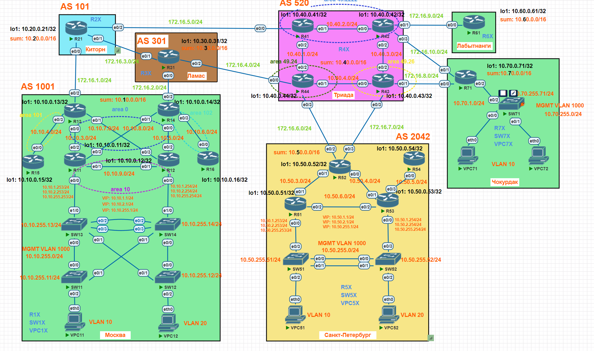

# Протокол BGP. Фильтрация

## Цели

1. Настроить фильтрацию для офисе Москва
1. Настроить фильтрацию для офисе Санкт-Петербург

## Задание

1. Настроить фильтрацию при помощи (As-path filtering) в офисе Москва так, чтобы не появилось транзитного трафика.
1. Настроить фильтрацию при помощи (Prefix-list filtering) в офисе Санкт-Петербург так, чтобы не появилось транзитного трафика.
1. Настроить провайдера Киторн так, чтобы в офис Москва отдавался только маршрут по умолчанию.
1. Настроить провайдера Ламас так, чтобы в офис Москва отдавался только маршрут по умолчанию и подсети офиса Санкт-Петербург.
1. Все сети в лабораторной работе должны иметь IP связность.

## Топология



## Схема для импорта в PNETlab

[Схема для импорта в PNETlab](media/otus_cource_lab10_iBGP_pnetlab_export-20250125-185611.zip)

## Версии ПО

- PNETlab - 5.3.11
- Роутеры - Cisco IOS Software, Linux Software (I86BI_LINUX-ADVENTERPRISEK9-M), Version 15.4(2)T4
- Коммутаторы - Cisco IOS Software, Linux Software (I86BI_LINUXL2-ADVENTERPRISEK9-M), Version 15.2(CML_NIGHTLY_20150703)
- ПК - VPC

## Решение

1. Настроить фильтрацию при помощи (As-path filtering) в офисе Москва так, чтобы не появилось транзитного трафика.

      Нужно в сторону провайдеров аноносировать только подсети из своей автономной системы (^$ - пустой список AS).

      На R13:
      ```

      ip as-path access-list 1 permit ^$

      router bgp 1001
       neighbor 172.16.1.21 filter-list 1 out

      ```

      На R14:
      ```

      ip as-path access-list 1 permit ^$

      router bgp 1001
       neighbor 172.16.2.31 filter-list 1 out

      ```

1. Настроить фильтрацию при помощи (Prefix-list filtering) в офисе Санкт-Петербург так, чтобы не появилось транзитного трафика.

      Нужно в сторону провайдера аноносировать только подсети из своей автономной системы (подсеть 10.50.0.0/16 Санкт-Петербурга).

1. Настроить провайдера Киторн так, чтобы в офис Москва отдавался только маршрут по умолчанию.

      Нужно в сторону офиса Москва проанонсировать default и разрешить при помощи route-map только маршрут 0.0.0.0/0

      ```

      router bgp 101
      neighbor 172.16.1.13 default-originate
      neighbor 172.16.1.13 route-map EBGP-R13-OUT out
      !
      ip prefix-list DEFAULT_ONLY seq 5 permit 0.0.0.0/0
      !
      route-map EBGP-R13-OUT permit 10
      match ip address prefix-list DEFAULT_ONLY
      !

      ```      

1. Настроить провайдера Ламас так, чтобы в офис Москва отдавался только маршрут по умолчанию и подсети офиса Санкт-Петербург.

      Нужно в сторону офиса Москва проанонсировать default и разрешить (при помощи As-path filtering) только маршруты из автономной системы офиса Санкт-Петербург (2042)

      ```

      router bgp 301
      neighbor 172.16.2.14 default-originate
      neighbor 172.16.2.14 filter-list 1 out
      !
      ip as-path access-list 1 permit _2042$

      ```      

1. Все сети в лабораторной работе должны иметь IP связность.

      Специальных настроек не требуется.


## Проверка работоспособности

Проверка будет осуществляться с устройста VPC11 в Москве.

1. Выполним проверку IP адресов на loopback интерфейсах роутеров R21, R31, R41-44, R52, R61, R71:

```
VPC11> ping 10.20.0.21

84 bytes from 10.20.0.21 icmp_seq=1 ttl=253 time=0.998 ms
84 bytes from 10.20.0.21 icmp_seq=2 ttl=253 time=1.121 ms
84 bytes from 10.20.0.21 icmp_seq=3 ttl=253 time=1.038 ms
84 bytes from 10.20.0.21 icmp_seq=4 ttl=253 time=1.252 ms
84 bytes from 10.20.0.21 icmp_seq=5 ttl=253 time=1.469 ms

VPC11> ping 10.30.0.31

84 bytes from 10.30.0.31 icmp_seq=1 ttl=253 time=1.296 ms
84 bytes from 10.30.0.31 icmp_seq=2 ttl=253 time=0.981 ms
84 bytes from 10.30.0.31 icmp_seq=3 ttl=253 time=1.038 ms
84 bytes from 10.30.0.31 icmp_seq=4 ttl=253 time=1.004 ms
84 bytes from 10.30.0.31 icmp_seq=5 ttl=253 time=1.092 ms

VPC11> ping 10.40.0.41

84 bytes from 10.40.0.41 icmp_seq=1 ttl=252 time=1.215 ms
84 bytes from 10.40.0.41 icmp_seq=2 ttl=252 time=1.475 ms
84 bytes from 10.40.0.41 icmp_seq=3 ttl=252 time=1.309 ms
84 bytes from 10.40.0.41 icmp_seq=4 ttl=252 time=1.372 ms
84 bytes from 10.40.0.41 icmp_seq=5 ttl=252 time=1.343 ms

VPC11> ping 10.40.0.42

84 bytes from 10.40.0.42 icmp_seq=1 ttl=251 time=1.478 ms
84 bytes from 10.40.0.42 icmp_seq=2 ttl=251 time=1.478 ms
84 bytes from 10.40.0.42 icmp_seq=3 ttl=251 time=1.556 ms
84 bytes from 10.40.0.42 icmp_seq=4 ttl=251 time=1.668 ms
84 bytes from 10.40.0.42 icmp_seq=5 ttl=251 time=1.517 ms

VPC11> ping 10.40.0.43

84 bytes from 10.40.0.43 icmp_seq=1 ttl=250 time=1.621 ms
84 bytes from 10.40.0.43 icmp_seq=2 ttl=250 time=1.775 ms
84 bytes from 10.40.0.43 icmp_seq=3 ttl=250 time=1.491 ms
84 bytes from 10.40.0.43 icmp_seq=4 ttl=250 time=1.665 ms
84 bytes from 10.40.0.43 icmp_seq=5 ttl=250 time=1.624 ms

VPC11> ping 10.40.0.44

84 bytes from 10.40.0.44 icmp_seq=1 ttl=252 time=1.552 ms
84 bytes from 10.40.0.44 icmp_seq=2 ttl=252 time=1.561 ms
84 bytes from 10.40.0.44 icmp_seq=3 ttl=252 time=1.507 ms
84 bytes from 10.40.0.44 icmp_seq=4 ttl=252 time=1.689 ms
84 bytes from 10.40.0.44 icmp_seq=5 ttl=252 time=1.707 ms

VPC11> ping 10.50.0.52

84 bytes from 10.50.0.52 icmp_seq=1 ttl=251 time=1.424 ms
84 bytes from 10.50.0.52 icmp_seq=2 ttl=251 time=1.414 ms
84 bytes from 10.50.0.52 icmp_seq=3 ttl=251 time=1.455 ms
84 bytes from 10.50.0.52 icmp_seq=4 ttl=251 time=1.487 ms
84 bytes from 10.50.0.52 icmp_seq=5 ttl=251 time=1.333 ms

VPC11> ping 10.60.0.61

84 bytes from 10.60.0.61 icmp_seq=1 ttl=250 time=1.633 ms
84 bytes from 10.60.0.61 icmp_seq=2 ttl=250 time=1.662 ms
84 bytes from 10.60.0.61 icmp_seq=3 ttl=250 time=1.822 ms
84 bytes from 10.60.0.61 icmp_seq=4 ttl=250 time=1.541 ms
84 bytes from 10.60.0.61 icmp_seq=5 ttl=250 time=1.659 ms

VPC11> ping 10.70.0.71

84 bytes from 10.70.0.71 icmp_seq=1 ttl=250 time=1.814 ms
84 bytes from 10.70.0.71 icmp_seq=2 ttl=250 time=1.658 ms
84 bytes from 10.70.0.71 icmp_seq=3 ttl=250 time=1.868 ms
84 bytes from 10.70.0.71 icmp_seq=4 ttl=250 time=1.589 ms
84 bytes from 10.70.0.71 icmp_seq=5 ttl=250 time=1.537 ms

```

2. Выполним проверку IP адресов устройств VPC51, VPC52, VPC71, VPC72:

```

VPC11> ping 10.50.1.51

84 bytes from 10.50.1.51 icmp_seq=1 ttl=58 time=3.008 ms
84 bytes from 10.50.1.51 icmp_seq=2 ttl=58 time=1.844 ms
84 bytes from 10.50.1.51 icmp_seq=3 ttl=58 time=2.305 ms
84 bytes from 10.50.1.51 icmp_seq=4 ttl=58 time=1.862 ms
84 bytes from 10.50.1.51 icmp_seq=5 ttl=58 time=1.979 ms

VPC11> ping 10.50.2.52

84 bytes from 10.50.2.52 icmp_seq=1 ttl=58 time=2.895 ms
84 bytes from 10.50.2.52 icmp_seq=2 ttl=58 time=4.064 ms
84 bytes from 10.50.2.52 icmp_seq=3 ttl=58 time=1.918 ms
84 bytes from 10.50.2.52 icmp_seq=4 ttl=58 time=1.724 ms
84 bytes from 10.50.2.52 icmp_seq=5 ttl=58 time=1.838 ms

VPC11> ping 10.70.1.71

84 bytes from 10.70.1.71 icmp_seq=1 ttl=57 time=3.253 ms
84 bytes from 10.70.1.71 icmp_seq=2 ttl=57 time=2.293 ms
84 bytes from 10.70.1.71 icmp_seq=3 ttl=57 time=2.591 ms
84 bytes from 10.70.1.71 icmp_seq=4 ttl=57 time=2.011 ms
84 bytes from 10.70.1.71 icmp_seq=5 ttl=57 time=2.100 ms

VPC11> ping 10.70.1.72

84 bytes from 10.70.1.72 icmp_seq=1 ttl=57 time=2.998 ms
84 bytes from 10.70.1.72 icmp_seq=2 ttl=57 time=1.798 ms
84 bytes from 10.70.1.72 icmp_seq=3 ttl=57 time=2.325 ms
84 bytes from 10.70.1.72 icmp_seq=4 ttl=57 time=1.965 ms
84 bytes from 10.70.1.72 icmp_seq=5 ttl=57 time=1.899 ms

```

Видим, что IP связность между всеми подсетями присутствует, цель задания достигнута.

## Конфигурации устройств

### R13

<details>
  <summary>Конфигурация</summary>

```


```
</details>

### R14

<details>
  <summary>Конфигурация</summary>

```


```
</details>

### R21

<details>
  <summary>Конфигурация</summary>

```


```
</details>

### R31

<details>
  <summary>Конфигурация</summary>

```


```
</details>