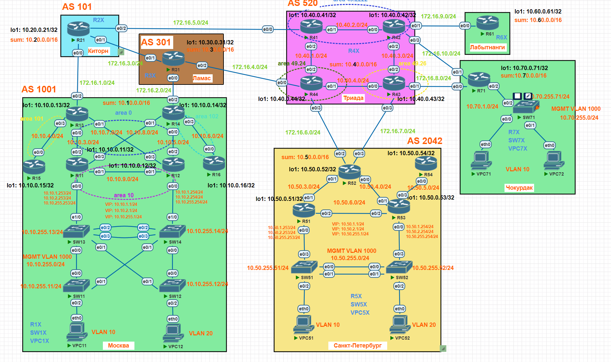

# Защита GRE при помощи IPsec. Защита сети DMVPN при помощи IPsec. ptpGRE/mGRE over IPsec

## Цели

1. Настроить IPsec для защиты GRE (GRE over IPsec) между офисами Москва и Санкт-Петербург
1. Настроить IPsec для защиты DMVPN сети между офисами Москва и Чокурдак, Лабытнанги

## Задание

1. Настроить IPsec* для защиты GRE (GRE over IPsec) между офисами Москва и Санкт-Петербург
1. Настроить IPsec** для защиты DMVPN сети между офисами Москва и Чокурдак, Лабытнанги
1. Все узлы в офисах в лабораторной работе должны иметь IP связность

*Аутентификация в IPsec должна быть при помощи предварительно распределенных ключей (preshared keys)  
**Аутентификация в IPsec должна быть при помощи цифровых сертификатов (PKI/x509)

## Топология



## Схема для импорта в PNETlab

[Схема для импорта в PNETlab](media/otus_cource_lab14_GRE_DMVPN_IPsec_IKEv2_pnetlab_export-20250302-161254.zip)

## Версии ПО

- PNETlab - 5.3.11
- Роутеры - Cisco IOS Software, Linux Software (I86BI_LINUX-ADVENTERPRISEK9-M), Version 15.4(2)T4
- Коммутаторы - Cisco IOS Software, Linux Software (I86BI_LINUXL2-ADVENTERPRISEK9-M), Version 15.2(CML_NIGHTLY_20150703)
- ПК - VPC

## Решение

1. Настроить IPsec для защиты GRE (GRE over IPsec) между офисами Москва и Санкт-Петербург

      В качестве аутентификации в IPsec будут использоваться предварительно распределенные ключи (preshared keys).  
      В качестве протокола согласования ключей будет использоваться IKEv2.

      1. Выполните на R14 создание политик IPsec (IKEv2) с аутентификацией на предварительно распределенных ключах:

            ```
            crypto ikev2 proposal IKEV2-PROPOSAL
             encryption aes-gcm-128
             prf sha256
             group 19
            !
            crypto ikev2 policy IKEV2-POLICY
             proposal IKEV2-PROPOSAL
            !
            crypto ikev2 keyring IKEV2-KEYRING1
             peer R52-ISP1
              description R14 on MSK
              address 10.50.52.126
              pre-shared-key local R52-R14
              pre-shared-key remote R52-R14
            !
             peer R52-ISP2
              description R14 on MSK
              address 10.50.52.254
              pre-shared-key local R52-R14
              pre-shared-key remote R52-R14
            !
            crypto ikev2 profile IKEV2-PROFILE
             match identity remote address 10.50.52.126 255.255.255.255
             match identity remote address 10.50.52.254 255.255.255.255
             authentication remote pre-share
             authentication local pre-share
             keyring local IKEV2-KEYRING1
            !
            crypto ipsec transform-set IKEV2-IPSEC-TRANSFORM esp-gcm
             mode tunnel
            !
            crypto ipsec profile IKEV2-IPSEC-PROFILE
             set transform-set IKEV2-IPSEC-TRANSFORM
             set ikev2-profile IKEV2-PROFILE
            !
            ```
            Обратите внимание, что в ikev2 keyring (в данном случае IKEV2-KEYRING1) обязательно нужно указать IP адреса и ключи партнеров по IPsec (в данном случае это роутер R52, подключенный к двум провайдерам, в Санкт-Петербурге).  
            В ikev2 profile (в данном случае IKEV2-PROFILE) также нужно указать IP адреса партнеров по IPsec, тип аутентификации и прикрепить ключи при помощи keyring local (в данном случае IKEV2-KEYRING1, созданный выше).
      
      1. Выполните на R13 и R52 создание политик IPsec (IKEv2) с аутентификацией на предварительно распределенных ключах по аналогии с R14.

      1. Прикрепите созданный ipsec profile под именем IKEV2-IPSEC-PROFILE к соответствующим TunnelN (mGRE) интерфейсам на  R13, R14, R52:

            ```
            interface TunnelN
             ...
             tunnel protection ipsec profile IKEV2-IPSEC-PROFILE
             ...
            ```

1. Настроить IPsec для защиты DMVPN сети между офисами Москва и Чокурдак, Лабытнанги

      В качестве аутентификации в IPsec будут использоваться цифровые сертификаты (PKI/x509). Удостоверяющий центр (CA) для выпуска сертификатов будет развернут в офисе Москва на роутере R14.
      В качестве протокола согласования ключей будет использоваться IKEv2.

      1. Выполните развертывание удостоверяющего центра (CA) офисе Москва на роутере R14:

            1. Сгенерируйте ключевую пару под именем CA для УЦ:

                  ```
                  R14(config)# crypto key generate rsa general-keys label CA modulus 2048 exportable
                  ```
            1. Задайте настройки для УЦ (имя УЦ - CA), введите пароль для закрытого ключа УЦ (сертификаты будут выдаваться автоматически), посмотрите получившиеся настройки и включите http сервер:

                  ```
                  14(config)#crypto pki server CA
                  R14(cs-server)#issuer-name CN=Test Root CA on Cisco Router R14
                  R14(cs-server)#grant auto
                  R14(cs-server)#no shutdown
                  *Mar  1 18:09:03.572: %PKI-6-CS_GRANT_AUTO: All enrollment requests will be automatically granted.
                  R14(cs-server)#no shutdown
                  
                  %Some server settings cannot be changed after CA certificate generation.
                  % Please enter a passphrase to protect the private key
                  % or type Return to exit
                  Password:

                  Re-enter password:

                  R14(cs-server)#show
                  serial-number 0x1
                  database level minimum
                  no database archive
                  issuer-name CN=Test Root CA on Cisco Router R14
                  grant auto
                  lifetime crl 6
                  lifetime certificate 365
                  lifetime ca-certificate 1095
                  lifetime enrollment-request 168
                  R14(cs-server)# exit

                  R14(config)#ip http server
                  R14(config)#
                  *Mar  1 18:29:36.377: %PKI-6-CS_ENABLED: Certificate server now enabled.         
                  ```

                  Обратите внимание, что автоматически будет создан trustpoint <CA_NAME>, где <CA_NAME> - имя УЦ, изменять его настройки не требуется:

                  ```
                  crypto pki trustpoint CA
                  revocation-check crl
                  rsakeypair CA                  
                  ```
                  Данный УЦ готов для выпуска сертификатов для маршрутизаторов. Маршрутизаторы должны иметь IP связность с R14. 
      
      1. Выполните на R14 генерацию закрытого ключа, настройку trustpoint'а, загрузку самоподписанного сертификата УЦ, выпуск локального сертификата на при помощи УЦ настроенного на R14, просмотр выпущенных сертификатов:
            ```
            R14(config) crypto key generate rsa general-keys label IPSEC modulus 2048 exportable

            R14(config)#crypto pki trustpoint CA_ON_R14
            R14(ca-trustpoint)#enrollment url http://10.10.14.254:80
            R14(ca-trustpoint)#subject-name CN=R14
            R14(ca-trustpoint)#revocation-check none
            R1(ca-trustpoint)#rsakeypair IPSEC
            R14(ca-trustpoint)#
            
            R14(config)#crypto pki authenticate CA_ON_R14

            R14(config)#crypto pki enroll CA_ON_R14
            %
            % Start certificate enrollment ..
            % Create a challenge password. You will need to verbally provide this
            password to the CA Administrator in order to revoke your certificate.
            For security reasons your password will not be saved in the configuration.
            Please make a note of it.

            Password:
            Re-enter password:

            % The subject name in the certificate will include: CN=R61
            % The subject name in the certificate will include: R61
            % Include the router serial number in the subject name? [yes/no]: no
            % Include an IP address in the subject name? [no]: no
            Request certificate from CA? [yes/no]: yes
            % Certificate request sent to Certificate Authority
            % The 'show crypto pki certificate verbose CA_ON_R14' command will show the fingerprint.

            R14(config)#
            *Mar  1 18:38:57.288: CRYPTO_PKI:  Certificate Request Fingerprint MD5: 17B772A8 B4BA0766 E9CC7020 2061A117
            *Mar  1 18:38:57.289: CRYPTO_PKI:  Certificate Request Fingerprint SHA1: 1D9BF8E7 A82626DA D0BAF09A 06F0A92A E9483340
            R61(config)#
            *Mar  1 18:38:57.420: %PKI-6-CERTRET: Certificate received from Certificate Authority

            R14(config)#do show crypto pki certificates
            Certificate
            Status: Available
            Certificate Serial Number (hex): 04
            Certificate Usage: General Purpose
            Issuer:
            cn=Test Root CA on Cisco Router R14
            Subject:
            Name: R14
            hostname=R14
            cn=R14
            Validity Date:
            start date: 18:51:03 UTC Mar 1 2025
            end   date: 18:51:03 UTC Mar 1 2026
            Associated Trustpoints: CA_ON_R14
            Storage: nvram:TestRootCAon#4.cer

            CA Certificate
            Status: Available
            Certificate Serial Number (hex): 01
            Certificate Usage: Signature
            Issuer:
            cn=Test Root CA on Cisco Router R14
            Subject:
            cn=Test Root CA on Cisco Router R14
            Validity Date:
            start date: 18:09:39 UTC Mar 1 2025
            end   date: 18:09:39 UTC Feb 29 2028
            Associated Trustpoints: CA_ON_R14 CA
            Storage: nvram:TestRootCAon#1CA.cer

            ```
      1. Выполните на R13, R61, R71 по аналогии с R14 генерацию закрытого ключа, настройку trustpoint'а, загрузку самоподписанного сертификата УЦ, выпуск локального сертификата на при помощи УЦ настроенного на R14. В качестве subject-name при настройке trustpoint'а нужно использовать CN=R13, CN=R61, CN=R71 соответственно.  

            После того как будут выпущены все сертификаты и созданы trustpoint'а можно приступать к настройке IPsec.

      1. Выполните на R14 создание политик IPsec (IKEv2) с аутентификацией на сертификатах:

            ```
            crypto ikev2 proposal IKEV2-PROPOSAL
             encryption aes-gcm-128
             prf sha256
             group 19
            !
            crypto ikev2 policy IKEV2-POLICY
             proposal IKEV2-PROPOSAL
            !
            crypto ikev2 profile IKEV2-PROFILE-SIG
             match identity remote any
             identity local dn
             authentication remote rsa-sig
             authentication local rsa-sig
             pki trustpoint CA_ON_R14
            !
            crypto ipsec transform-set IKEV2-IPSEC-TRANSFORM esp-gcm
             mode tunnel
            !
            crypto ipsec profile IKEV2-IPSEC-SIG-PROFILE
             set transform-set IKEV2-IPSEC-TRANSFORM
             set ikev2-profile IKEV2-PROFILE-SIG
            !            
            ```
            Обратите внимание, что в ikev2 profile (в данном случае IKEV2-PROFILE-SIG) обязательно нужно указать trustpoint, в рамках которого был создан локальный сертификат данного устройства.
      
      1. Выполните на R13, R61, R71 создание политик IPsec (IKEv2) с аутентификацией на сертификатах по аналогии с R14.

      1. Прикрепите созданный ipsec profile под именем IKEV2-IPSEC-SIG-PROFILE к соответствующим TunnelN (mGRE) интерфейсам на R13, R14, R61, R71:

            ```
            interface TunnelN
             ...
             tunnel protection ipsec profile IKEV2-IPSEC-SIG-PROFILE
             ...
            ```

## Проверка работоспособности стенда

1. Проверка GRE с шифрованием между офисами Москва и Санкт-Петербург.

      Выполним проверку доступности устройств VPC51 и VPC52 офиса Санкт-Петербург из офиса Москва.  
      Проверка будет выполняться с устройства VPC11. 

      ```
      VPC11> ping 10.50.1.51

      84 bytes from 10.50.1.51 icmp_seq=1 ttl=60 time=3.381 ms
      84 bytes from 10.50.1.51 icmp_seq=2 ttl=60 time=2.287 ms
      84 bytes from 10.50.1.51 icmp_seq=3 ttl=60 time=2.563 ms
      84 bytes from 10.50.1.51 icmp_seq=4 ttl=60 time=2.076 ms
      84 bytes from 10.50.1.51 icmp_seq=5 ttl=60 time=1.998 ms

      VPC11> ping 10.50.2.52

      84 bytes from 10.50.2.52 icmp_seq=1 ttl=60 time=3.335 ms
      84 bytes from 10.50.2.52 icmp_seq=2 ttl=60 time=2.292 ms
      84 bytes from 10.50.2.52 icmp_seq=3 ttl=60 time=2.397 ms
      84 bytes from 10.50.2.52 icmp_seq=4 ttl=60 time=2.034 ms
      84 bytes from 10.50.2.52 icmp_seq=5 ttl=60 time=2.176 ms

      VPC11>
      ```

      Видим, что проверка доступности выполнена успешно.  

      Выполним проверку IPsec туннелей на R13, R14 и R52:

      ```
      R13#show crypto ikev2 session
      IPv4 Crypto IKEv2 Session

      Session-id:3, Status:UP-ACTIVE, IKE count:1, CHILD count:1

      Tunnel-id Local                 Remote                fvrf/ivrf            Status
      1         10.10.13.254/500      10.50.52.126/500      none/none            READY
            Encr: AES-GCM, keysize: 128, PRF: SHA256, Hash: None, DH Grp:19, Auth sign: PSK, Auth verify: PSK
            Life/Active Time: 86400/86308 sec
      Child sa: local selector  10.10.13.254/0 - 10.10.13.254/65535
            remote selector 10.50.52.126/0 - 10.50.52.126/65535
            ESP spi in/out: 0xFC7E0124/0x39D295D1

      Session-id:4, Status:UP-ACTIVE, IKE count:1, CHILD count:1

      Tunnel-id Local                 Remote                fvrf/ivrf            Status
      2         10.10.13.254/500      10.50.52.254/500      none/none            READY
            Encr: AES-GCM, keysize: 128, PRF: SHA256, Hash: None, DH Grp:19, Auth sign: PSK, Auth verify: PSK
            Life/Active Time: 86400/86308 sec
      Child sa: local selector  10.10.13.254/0 - 10.10.13.254/65535
            remote selector 10.50.52.254/0 - 10.50.52.254/65535
            ESP spi in/out: 0x331A762E/0x5B7F9A4C

      Session-id:22, Status:UP-ACTIVE, IKE count:1, CHILD count:1

      Tunnel-id Local                 Remote                fvrf/ivrf            Status
      4         10.10.13.254/500      172.16.9.61/500       none/none            READY
            Encr: AES-GCM, keysize: 128, PRF: SHA256, Hash: None, DH Grp:19, Auth sign: RSA, Auth verify: RSA
            Life/Active Time: 86400/3920 sec
      Child sa: local selector  10.10.13.254/0 - 10.10.13.254/65535
            remote selector 172.16.9.61/0 - 172.16.9.61/65535
            ESP spi in/out: 0xC9FA00BC/0x1F9E3B74

      Session-id:8, Status:UP-ACTIVE, IKE count:1, CHILD count:1

      Tunnel-id Local                 Remote                fvrf/ivrf            Status
      3         10.10.13.254/500      172.16.10.71/500      none/none            READY
            Encr: AES-GCM, keysize: 128, PRF: SHA256, Hash: None, DH Grp:19, Auth sign: RSA, Auth verify: RSA
            Life/Active Time: 86400/70123 sec
      Child sa: local selector  10.10.13.254/0 - 10.10.13.254/65535
            remote selector 172.16.10.71/0 - 172.16.10.71/65535
            ESP spi in/out: 0xFEBD85C3/0x5804E7A0

      IPv6 Crypto IKEv2 Session

      ```

      ```
      R14#show crypto ikev2 session
      IPv4 Crypto IKEv2 Session

      Session-id:1, Status:UP-ACTIVE, IKE count:1, CHILD count:1

      Tunnel-id Local                 Remote                fvrf/ivrf            Status
      5         10.10.14.254/500      10.50.52.126/500      none/none            READY
            Encr: AES-GCM, keysize: 128, PRF: SHA256, Hash: None, DH Grp:19, Auth sign: PSK, Auth verify: PSK
            Life/Active Time: 86400/1072 sec
      Child sa: local selector  10.10.14.254/0 - 10.10.14.254/65535
            remote selector 10.50.52.126/0 - 10.50.52.126/65535
            ESP spi in/out: 0x3A3EEC6E/0xA3835AD9

      Session-id:9, Status:UP-ACTIVE, IKE count:1, CHILD count:1

      Tunnel-id Local                 Remote                fvrf/ivrf            Status
      2         10.10.14.254/500      10.50.52.254/500      none/none            READY
            Encr: AES-GCM, keysize: 128, PRF: SHA256, Hash: None, DH Grp:19, Auth sign: PSK, Auth verify: PSK
            Life/Active Time: 86400/44 sec
      Child sa: local selector  10.10.14.254/0 - 10.10.14.254/65535
            remote selector 10.50.52.254/0 - 10.50.52.254/65535
            ESP spi in/out: 0xF3896ED3/0x7E6EFA7

      Session-id:13, Status:UP-ACTIVE, IKE count:1, CHILD count:1

      Tunnel-id Local                 Remote                fvrf/ivrf            Status
      3         10.10.14.254/500      172.16.8.71/500       none/none            READY
            Encr: AES-GCM, keysize: 128, PRF: SHA256, Hash: None, DH Grp:19, Auth sign: RSA, Auth verify: RSA
            Life/Active Time: 86400/69846 sec
      Child sa: local selector  10.10.14.254/0 - 10.10.14.254/65535
            remote selector 172.16.8.71/0 - 172.16.8.71/65535
            ESP spi in/out: 0x654AA4E5/0xB2A8AAAB

      Session-id:12, Status:UP-ACTIVE, IKE count:1, CHILD count:1

      Tunnel-id Local                 Remote                fvrf/ivrf            Status
      4         10.10.14.254/500      172.16.9.61/500       none/none            READY
            Encr: AES-GCM, keysize: 128, PRF: SHA256, Hash: None, DH Grp:19, Auth sign: RSA, Auth verify: RSA
            Life/Active Time: 86400/71095 sec
      Child sa: local selector  10.10.14.254/0 - 10.10.14.254/65535
            remote selector 172.16.9.61/0 - 172.16.9.61/65535
            ESP spi in/out: 0xE351A30E/0x4BA5D1A1

      IPv6 Crypto IKEv2 Session

      ```

      ```
      R52#show crypto ikev2 sa
      IPv4 Crypto IKEv2  SA

      Tunnel-id Local                 Remote                fvrf/ivrf            Status
      3         10.50.52.126/500      10.10.13.254/500      none/none            READY
            Encr: AES-GCM, keysize: 128, PRF: SHA256, Hash: None, DH Grp:19, Auth sign: PSK, Auth verify: PSK
            Life/Active Time: 86400/86255 sec

      Tunnel-id Local                 Remote                fvrf/ivrf            Status
      5         10.50.52.126/500      10.10.14.254/500      none/none            READY
            Encr: AES-GCM, keysize: 128, PRF: SHA256, Hash: None, DH Grp:19, Auth sign: PSK, Auth verify: PSK
            Life/Active Time: 86400/1296 sec

      Tunnel-id Local                 Remote                fvrf/ivrf            Status
      4         10.50.52.254/500      10.10.13.254/500      none/none            READY
            Encr: AES-GCM, keysize: 128, PRF: SHA256, Hash: None, DH Grp:19, Auth sign: PSK, Auth verify: PSK
            Life/Active Time: 86400/86255 sec

      Tunnel-id Local                 Remote                fvrf/ivrf            Status
      6         10.50.52.254/500      10.10.14.254/500      none/none            READY
            Encr: AES-GCM, keysize: 128, PRF: SHA256, Hash: None, DH Grp:19, Auth sign: PSK, Auth verify: PSK
            Life/Active Time: 86400/268 sec

      IPv6 Crypto IKEv2  SA

      ```
      Видим, что необходимые IPsec туннели создны с нужными параметрами.
      Дополнительная информация о работе протокола GRE, IPsec приведена в главе "Конфигурации устройств".


1. Проверка DMVPN с шифрованием между офисами Москва и Чокурдак, Лабытнанги.

      Выполним проверку доступности устройств VPC71 и VPC72 офиса Чокурдак и роутера R61 офиса Лабытнанги из офиса Москва.  
      Проверка будет выполняться с устройства VPC11.

      ```
      VPC11> ping 10.70.1.71

      84 bytes from 10.70.1.71 icmp_seq=1 ttl=61 time=3.148 ms
      84 bytes from 10.70.1.71 icmp_seq=2 ttl=61 time=2.045 ms
      84 bytes from 10.70.1.71 icmp_seq=3 ttl=61 time=1.935 ms
      84 bytes from 10.70.1.71 icmp_seq=4 ttl=61 time=2.026 ms
      84 bytes from 10.70.1.71 icmp_seq=5 ttl=61 time=1.870 ms

      VPC11> ping 10.70.1.72

      84 bytes from 10.70.1.72 icmp_seq=1 ttl=61 time=3.121 ms
      84 bytes from 10.70.1.72 icmp_seq=2 ttl=61 time=1.972 ms
      84 bytes from 10.70.1.72 icmp_seq=3 ttl=61 time=1.856 ms
      84 bytes from 10.70.1.72 icmp_seq=4 ttl=61 time=2.246 ms
      84 bytes from 10.70.1.72 icmp_seq=5 ttl=61 time=2.174 ms

      VPC11> ping 10.60.0.61

      84 bytes from 10.60.0.61 icmp_seq=1 ttl=253 time=2.228 ms
      84 bytes from 10.60.0.61 icmp_seq=2 ttl=253 time=1.900 ms
      84 bytes from 10.60.0.61 icmp_seq=3 ttl=253 time=2.058 ms
      84 bytes from 10.60.0.61 icmp_seq=4 ttl=253 time=1.972 ms
      84 bytes from 10.60.0.61 icmp_seq=5 ttl=253 time=1.818 ms

      VPC11>
      ```
      Видим, что проверка доступности выполнена успешно.  

      Выполним проверку IPsec туннелей на R52, R61, R71:

      ```
      R52#show crypto ikev2 sa
      IPv4 Crypto IKEv2  SA

      Tunnel-id Local                 Remote                fvrf/ivrf            Status
      3         10.50.52.126/500      10.10.13.254/500      none/none            READY
            Encr: AES-GCM, keysize: 128, PRF: SHA256, Hash: None, DH Grp:19, Auth sign: PSK, Auth verify: PSK
            Life/Active Time: 86400/86255 sec

      Tunnel-id Local                 Remote                fvrf/ivrf            Status
      5         10.50.52.126/500      10.10.14.254/500      none/none            READY
            Encr: AES-GCM, keysize: 128, PRF: SHA256, Hash: None, DH Grp:19, Auth sign: PSK, Auth verify: PSK
            Life/Active Time: 86400/1296 sec

      Tunnel-id Local                 Remote                fvrf/ivrf            Status
      4         10.50.52.254/500      10.10.13.254/500      none/none            READY
            Encr: AES-GCM, keysize: 128, PRF: SHA256, Hash: None, DH Grp:19, Auth sign: PSK, Auth verify: PSK
            Life/Active Time: 86400/86255 sec

      Tunnel-id Local                 Remote                fvrf/ivrf            Status
      6         10.50.52.254/500      10.10.14.254/500      none/none            READY
            Encr: AES-GCM, keysize: 128, PRF: SHA256, Hash: None, DH Grp:19, Auth sign: PSK, Auth verify: PSK
            Life/Active Time: 86400/268 sec

      IPv6 Crypto IKEv2  SA

      ```

      ```
      R61#show crypto ikev2 sa
      IPv4 Crypto IKEv2  SA

      Tunnel-id Local                 Remote                fvrf/ivrf            Status
      3         172.16.9.61/500       10.10.13.254/500      none/none            READY
            Encr: AES-GCM, keysize: 128, PRF: SHA256, Hash: None, DH Grp:19, Auth sign: RSA, Auth verify: RSA
            Life/Active Time: 86400/4126 sec

      Tunnel-id Local                 Remote                fvrf/ivrf            Status
      1         172.16.9.61/500       10.10.14.254/500      none/none            READY
            Encr: AES-GCM, keysize: 128, PRF: SHA256, Hash: None, DH Grp:19, Auth sign: RSA, Auth verify: RSA
            Life/Active Time: 86400/71578 sec

      Tunnel-id Local                 Remote                fvrf/ivrf            Status
      4         172.16.9.61/500       172.16.8.71/500       none/none            READY
            Encr: AES-GCM, keysize: 128, PRF: SHA256, Hash: None, DH Grp:19, Auth sign: RSA, Auth verify: RSA
            Life/Active Time: 86400/5393 sec

      Tunnel-id Local                 Remote                fvrf/ivrf            Status
      2         172.16.9.61/500       10.10.13.254/500      none/none            DELETE
            Encr: AES-GCM, keysize: 128, PRF: SHA256, Hash: None, DH Grp:19, Auth sign: RSA, Auth verify: RSA
            Life/Active Time: 86400/14756 sec

      IPv6 Crypto IKEv2  SA
      ```

      ```
      R71#show crypto ikev2 sa
      IPv4 Crypto IKEv2  SA

      Tunnel-id Local                 Remote                fvrf/ivrf            Status
      2         172.16.10.71/500      10.10.13.254/500      none/none            READY
            Encr: AES-GCM, keysize: 128, PRF: SHA256, Hash: None, DH Grp:19, Auth sign: RSA, Auth verify: RSA
            Life/Active Time: 86400/70391 sec

      Tunnel-id Local                 Remote                fvrf/ivrf            Status
      3         172.16.8.71/500       172.16.9.61/500       none/none            READY
            Encr: AES-GCM, keysize: 128, PRF: SHA256, Hash: None, DH Grp:19, Auth sign: RSA, Auth verify: RSA
            Life/Active Time: 86400/5455 sec

      Tunnel-id Local                 Remote                fvrf/ivrf            Status
      1         172.16.8.71/500       10.10.14.254/500      none/none            READY
            Encr: AES-GCM, keysize: 128, PRF: SHA256, Hash: None, DH Grp:19, Auth sign: RSA, Auth verify: RSA
            Life/Active Time: 86400/70391 sec

      IPv6 Crypto IKEv2  SA

      ```      
      Видим, что необходимые IPsec туннели создны с нужными параметрами.
      Дополнительная информация о работе DMVPN, IPsec приведена в главе "Конфигурации устройств".

## Конфигурации устройств

### R13

<details>
  <summary>Конфигурация</summary>

```

R13#terminal length 0
R13#sh run
Building configuration...

Current configuration : 9578 bytes
!
! Last configuration change at 19:15:12 UTC Sat Mar 1 2025
!
version 15.4
service timestamps debug datetime msec
service timestamps log datetime msec
service password-encryption
!
hostname R13
!
boot-start-marker
boot-end-marker
!
!
!
aaa new-model
!
!
!
!
!
!
!
aaa session-id common
mmi polling-interval 60
no mmi auto-configure
no mmi pvc
mmi snmp-timeout 180
!
!
!
!
!
!
!
!


!
!
!
!
no ip domain lookup
ip domain name R13.local
ip cef
no ipv6 cef
!
multilink bundle-name authenticated
!
!
!
!
!
!
!
crypto pki trustpoint CA_ON_R14
 enrollment url http://10.10.14.254:80
 subject-name CN=R13
 revocation-check none
 rsakeypair IPSEC
!
!
crypto pki certificate chain CA_ON_R14
 certificate 05
  30820321 30820209 A0030201 02020105 300D0609 2A864886 F70D0101 05050030
  2B312930 27060355 04031320 54657374 20526F6F 74204341 206F6E20 43697363
  6F20526F 75746572 20523134 301E170D 32353033 30313139 31333136 5A170D32
  36303330 31313931 3331365A 302C310C 300A0603 55040313 03523133 311C301A
  06092A86 4886F70D 01090216 0D523133 2E523133 2E6C6F63 616C3082 0122300D
  06092A86 4886F70D 01010105 00038201 0F003082 010A0282 010100D4 06C588B4
  B42C4374 2BA4FEEC 8AD6378C 8905B618 B02210E4 EF9FFD3D 631ED3D4 901AA6F0
  9BB2C23D C3D70742 366AADE4 584E0B33 3F32BC04 950C1A71 33B3C1AF 1DBA2A14
  D96FC4BB F5E1FFD4 810E88DF 94E46DB3 5F19855B 36CDDE6F 14ECD112 A2B1A572
  E0B7DCBC FE09D4E2 20FF9263 478DD587 070430F1 816E8D15 78144108 C3CBA3DB
  E93BAA68 976114BD 0145D3AC C65755B1 1425040A 21E79360 00BFD71D 72DAC0DA
  A6D8020A F2E4950E 2791A300 AE319FD8 253CB77F B336A73D 49316115 CA6AE6FE
  E53A6476 0A321894 3A5680E3 12034D8D 271BB84D 88F12FE5 0E27606F 891BE885
  BCD6AF77 D0C3482A C3A3D746 2138DBC8 9C3C8B40 DBC3C5FD 9CF71B02 03010001
  A34F304D 300B0603 551D0F04 04030205 A0301F06 03551D23 04183016 80147E10
  E207A8B2 A42266DA 64CE4D59 27F1F8AD AAE4301D 0603551D 0E041604 14F10C01
  D7B7E7FC 2140D75F ACAB8C2B EAFBF25A 3F300D06 092A8648 86F70D01 01050500
  03820101 0012FFB6 EF4EDDD9 050EDBEB 589D0C57 03904AF1 E17D6149 30B23BF7
  0ADBF81D D0932152 BEE7C587 830A4CB3 B591B5C1 4B25D62A C2429340 31557294
  70A122AA C1E1EDBE AF65E359 B493D60D 0A92F048 A0F12CCA E4A153A6 B0A2E8C9
  5463C795 FFFE0FA6 CA7DC619 DC128A19 A9F3E15F 887DF681 C3FF854A 47AC5BC6
  7ED0936F 861FA1F5 C747BEC1 971D2507 DB8F36A0 3F223579 2B3570D3 3AD3544A
  71359B69 AD425D5E 4A812AA3 22CB150C DEA085DC 62E1C818 E265D56B 417FC778
  DAD97F65 914B12F8 E5E31337 CCE10CB6 1B2A07C1 4FB31FF2 C4B46F47 02C90A57
  41C3D99D 582206BA 4D1DD703 38C49084 B1219470 BB0AB6B2 76D1CC77 5BE46C78
  421E2629 C0
        quit
 certificate ca 01
  30820334 3082021C A0030201 02020101 300D0609 2A864886 F70D0101 04050030
  2B312930 27060355 04031320 54657374 20526F6F 74204341 206F6E20 43697363
  6F20526F 75746572 20523134 301E170D 32353033 30313138 30393339 5A170D32
  38303232 39313830 3933395A 302B3129 30270603 55040313 20546573 7420526F
  6F742043 41206F6E 20436973 636F2052 6F757465 72205231 34308201 22300D06
  092A8648 86F70D01 01010500 0382010F 00308201 0A028201 0100C8F4 93AAEA95
  A542C751 3FF82B6F 7B09733C 2A67C14E 55BE8C64 F5A54727 CB5C5253 A1865AD9
  C03A13A8 716FCD54 04642CF3 8EF84F79 DF6255FB 355E390E 0DB7F510 A22B114D
  5B09E58B 8010E004 836AEB4A CE23E116 D38386FE D4E7847D 3773DB4D E3D95BFF
  2BCF3FF0 FFB7E88E D99BC90E DA475B91 D69A2AE4 20018C9E EE6B002A ABB14E9E
  32630247 444731B4 4B9F12EF 75D0E2BE 7E734871 1D1D237C B3513ACC 5E415949
  C7FBA968 9CA5385A 76FC79AA 5512A23D 8B28F30E BAD12C3B 6297DA47 B4461E8F
  95A4A56A 2D02BB60 5D231F88 2B2A89B9 137D4FF2 C703681B B67E90FD B6E2B453
  96209E9E 5CED44F9 A07C463D C670EDCD 2064DEE4 FE0FF660 C10B0203 010001A3
  63306130 0F060355 1D130101 FF040530 030101FF 300E0603 551D0F01 01FF0404
  03020186 301F0603 551D2304 18301680 147E10E2 07A8B2A4 2266DA64 CE4D5927
  F1F8ADAA E4301D06 03551D0E 04160414 7E10E207 A8B2A422 66DA64CE 4D5927F1
  F8ADAAE4 300D0609 2A864886 F70D0101 04050003 82010100 A7FA396F 13EDCB30
  7E3F7C0E E7F0F168 785A4C10 80F42B2C C17BABF2 AAF9DB79 D5F2C54D 35C603F8
  D4C61929 8414E95A 0F2EE829 E7A05CAE 5ACA8AC0 92A2E58C E2790D1E 5159BC1B
  068CCD12 CEB4E4D6 DE7F7104 AC27F699 3B83173C A4C6E1CB D098F915 DF4FF00D
  170A4637 D6D7FB09 CAF57A5D E1188345 076715A1 3E4FA3CC F9DB7828 E4B9A478
  8EAF03F0 DCFB205E 5186ADFD DEB53619 F843D7CA 9D29345E 276F34ED 13C12D9F
  412BDA33 7405E766 74A22652 23FEF15A 51438D5D F4106E66 A9305310 910C363A
  10B45EB9 B575DE22 0B4DD2E2 84AB2F2F 0CA9ED38 91021B2E 89CCEAA3 20214E68
  3AA5B1DB E302160D F501417A FF14EF84 03B003F6 7AC328E2
        quit
username cisco privilege 15 password 7 02050D480809
!
redundancy
!
!
!
!
crypto ikev2 proposal IKEV2-PROPOSAL
 encryption aes-gcm-128
 prf sha256
 group 19
!
crypto ikev2 policy IKEV2-POLICY
 proposal IKEV2-PROPOSAL
!
crypto ikev2 keyring IKEV2-KEYRING1
 peer R52-ISP1
  description R14 on MSK
  address 10.50.52.126
  pre-shared-key local R52-R13
  pre-shared-key remote R52-R13
 !
 peer R52-ISP2
  description R14 on MSK
  address 10.50.52.254
  pre-shared-key local R52-R13
  pre-shared-key remote R52-R13
 !
!
!
crypto ikev2 profile IKEV2-PROFILE
 match identity remote address 10.50.52.126 255.255.255.255
 match identity remote address 10.50.52.254 255.255.255.255
 authentication remote pre-share
 authentication local pre-share
 keyring local IKEV2-KEYRING1
!
crypto ikev2 profile IKEV2-PROFILE-SIG
 match identity remote any
 identity local dn
 authentication remote rsa-sig
 authentication local rsa-sig
 pki trustpoint CA_ON_R14
!
!
!
crypto ipsec transform-set IKEV2-IPSEC-TRANSFORM esp-gcm
 mode tunnel
!
crypto ipsec profile IKEV2-IPSEC-PROFILE
 set transform-set IKEV2-IPSEC-TRANSFORM
 set ikev2-profile IKEV2-PROFILE
!
crypto ipsec profile IKEV2-IPSEC-SIG-PROFILE
 set transform-set IKEV2-IPSEC-TRANSFORM
 set ikev2-profile IKEV2-PROFILE-SIG
!
!
!
!
!
!
!
interface Loopback1
 ip address 10.10.0.13 255.255.255.255
 ip ospf 1 area 0
!
interface Tunnel0
 description to SPB ISP1
 ip address 192.168.3.1 255.255.255.0
 tunnel source 10.10.13.254
 tunnel destination 10.50.52.126
 tunnel key 2
 tunnel protection ipsec profile IKEV2-IPSEC-PROFILE
!
interface Tunnel1
 description to SPB ISP2
 ip address 192.168.4.1 255.255.255.0
 tunnel source 10.10.13.254
 tunnel destination 10.50.52.254
 tunnel key 2
 tunnel protection ipsec profile IKEV2-IPSEC-PROFILE
!
interface Tunnel10
 description MGRE to ISP2 (DMVPN)
 ip address 10.101.0.1 255.255.255.0
 no ip redirects
 ip nhrp authentication CISCO
 ip nhrp network-id 101
 ip nhrp holdtime 90
 tunnel source 10.10.13.254
 tunnel mode gre multipoint
 tunnel key 11
 tunnel route-via Ethernet0/2 preferred
 tunnel protection ipsec profile IKEV2-IPSEC-SIG-PROFILE
!
interface Ethernet0/0
 ip address 10.10.3.13 255.255.255.0
 ip nat enable
 ip ospf 1 area 0
!
interface Ethernet0/1
 ip address 10.10.7.13 255.255.255.0
 ip nat enable
 ip ospf 1 area 0
!
interface Ethernet0/2
 ip address 10.10.13.254 255.255.255.0 secondary
 ip address 172.16.1.13 255.255.255.0
 ip nat enable
!
interface Ethernet0/3
 ip address 10.10.4.13 255.255.255.0
 ip nat enable
 ip ospf 1 area 101
!
router ospf 1
 router-id 10.10.0.13
 area 101 filter-list prefix OSPF-FILTER in
 default-information originate
!
router bgp 1001
 bgp log-neighbor-changes
 bgp listen range 10.101.0.0/24 peer-group DMVPN-CLOUD2
 network 10.10.13.0 mask 255.255.255.0
 timers bgp 3 9
 redistribute ospf 1
 neighbor DMVPN-CLOUD2 peer-group
 neighbor DMVPN-CLOUD2 remote-as 1001
 neighbor DMVPN-CLOUD2 route-reflector-client
 neighbor DMVPN-CLOUD2 next-hop-self
 neighbor DMVPN-CLOUD2 prefix-list IBGP-DMVPN-GRE-FILTER out
 neighbor 172.16.1.21 remote-as 101
 neighbor 172.16.1.21 prefix-list EBGP-ISP-FILTER out
 neighbor 192.168.3.2 remote-as 2042
 neighbor 192.168.3.2 ebgp-multihop 255
 neighbor 192.168.3.2 update-source Tunnel0
 neighbor 192.168.3.2 prefix-list EBGP-GRE-FILTER out
 neighbor 192.168.3.2 route-map EBGP-GRE-LP in
 neighbor 192.168.3.2 filter-list 1 out
 neighbor 192.168.4.2 remote-as 2042
 neighbor 192.168.4.2 ebgp-multihop 255
 neighbor 192.168.4.2 update-source Tunnel1
 neighbor 192.168.4.2 prefix-list EBGP-GRE-FILTER out
 neighbor 192.168.4.2 filter-list 1 out
!
ip forward-protocol nd
!
ip as-path access-list 1 permit ^$
!
no ip http server
no ip http secure-server
ip nat pool PUBLIC_POOL 10.10.13.1 10.10.13.10 netmask 255.255.255.0
ip nat source route-map NAT_FOR_G0/2 pool PUBLIC_POOL overload
ip nat source static tcp 10.10.0.15 22 10.10.13.11 22 extendable
!
!
ip prefix-list ALL seq 5 permit 0.0.0.0/0 le 32
!
ip prefix-list EBGP-GRE-FILTER seq 10 deny 10.10.13.0/24
ip prefix-list EBGP-GRE-FILTER seq 20 deny 10.10.14.0/24
ip prefix-list EBGP-GRE-FILTER seq 25 deny 172.16.0.0/16 ge 24
ip prefix-list EBGP-GRE-FILTER seq 30 permit 0.0.0.0/0 le 32
!
ip prefix-list EBGP-ISP-FILTER seq 10 permit 10.10.13.0/24
!
ip prefix-list IBGP-DMVPN-GRE-FILTER seq 10 deny 10.10.13.0/24
ip prefix-list IBGP-DMVPN-GRE-FILTER seq 20 deny 10.10.14.0/24
ip prefix-list IBGP-DMVPN-GRE-FILTER seq 25 deny 172.16.0.0/16 ge 24
ip prefix-list IBGP-DMVPN-GRE-FILTER seq 30 permit 0.0.0.0/0 le 32
!
ip prefix-list OSPF-FILTER seq 10 deny 10.10.0.0/16 le 32
ip prefix-list OSPF-FILTER seq 20 permit 0.0.0.0/0 le 32
!
route-map EBGP-GRE-LP permit 10
 match ip address prefix-list ALL
 set local-preference 150
!
route-map NAT_FOR_G0/2 permit 10
 match ip address 2
 match interface Ethernet0/2
!
!
access-list 1 permit any
access-list 2 permit 10.10.0.0 0.0.255.255
!
!
!
control-plane
!
!
!
!
!
!
!
!
line con 0
 logging synchronous
line aux 0
line vty 0 4
 transport input ssh
!
!
end

R13#
R13#
R13#
R13#show ip interface brief
Interface                  IP-Address      OK? Method Status                Protocol
Ethernet0/0                10.10.3.13      YES NVRAM  up                    up
Ethernet0/1                10.10.7.13      YES NVRAM  up                    up
Ethernet0/2                172.16.1.13     YES manual up                    up
Ethernet0/3                10.10.4.13      YES NVRAM  up                    up
Loopback1                  10.10.0.13      YES NVRAM  up                    up
NVI0                       10.10.3.13      YES unset  up                    up
Tunnel0                    192.168.3.1     YES manual up                    up
Tunnel1                    192.168.4.1     YES manual up                    up
Tunnel10                   10.101.0.1      YES manual up                    up
R13#
R13#
R13#
R13#
R13#show ip route
Codes: L - local, C - connected, S - static, R - RIP, M - mobile, B - BGP
       D - EIGRP, EX - EIGRP external, O - OSPF, IA - OSPF inter area
       N1 - OSPF NSSA external type 1, N2 - OSPF NSSA external type 2
       E1 - OSPF external type 1, E2 - OSPF external type 2
       i - IS-IS, su - IS-IS summary, L1 - IS-IS level-1, L2 - IS-IS level-2
       ia - IS-IS inter area, * - candidate default, U - per-user static route
       o - ODR, P - periodic downloaded static route, H - NHRP, l - LISP
       a - application route
       + - replicated route, % - next hop override

Gateway of last resort is 172.16.1.21 to network 0.0.0.0

B*    0.0.0.0/0 [20/0] via 172.16.1.21, 1w6d
      10.0.0.0/8 is variably subnetted, 39 subnets, 4 masks
O IA     10.10.0.11/32 [110/11] via 10.10.3.11, 3w0d, Ethernet0/0
O IA     10.10.0.12/32 [110/11] via 10.10.7.12, 3w0d, Ethernet0/1
C        10.10.0.13/32 is directly connected, Loopback1
O        10.10.0.14/32 [110/12] via 10.10.7.12, 1w6d, Ethernet0/1
                       [110/12] via 10.10.3.11, 1w6d, Ethernet0/0
O        10.10.0.15/32 [110/11] via 10.10.4.15, 3w0d, Ethernet0/3
O IA     10.10.0.16/32 [110/22] via 10.10.7.12, 1w6d, Ethernet0/1
                       [110/22] via 10.10.3.11, 1w6d, Ethernet0/0
O IA     10.10.1.0/24 [110/20] via 10.10.7.12, 3w0d, Ethernet0/1
                      [110/20] via 10.10.3.11, 3w0d, Ethernet0/0
O IA     10.10.2.0/24 [110/20] via 10.10.7.12, 3w0d, Ethernet0/1
                      [110/20] via 10.10.3.11, 3w0d, Ethernet0/0
C        10.10.3.0/24 is directly connected, Ethernet0/0
L        10.10.3.13/32 is directly connected, Ethernet0/0
C        10.10.4.0/24 is directly connected, Ethernet0/3
L        10.10.4.13/32 is directly connected, Ethernet0/3
O        10.10.5.0/24 [110/11] via 10.10.7.12, 1w6d, Ethernet0/1
O IA     10.10.6.0/24 [110/21] via 10.10.7.12, 1w6d, Ethernet0/1
                      [110/21] via 10.10.3.11, 1w6d, Ethernet0/0
C        10.10.7.0/24 is directly connected, Ethernet0/1
L        10.10.7.13/32 is directly connected, Ethernet0/1
O        10.10.8.0/24 [110/11] via 10.10.3.11, 1w6d, Ethernet0/0
O IA     10.10.9.0/24 [110/20] via 10.10.7.12, 3w0d, Ethernet0/1
                      [110/20] via 10.10.3.11, 3w0d, Ethernet0/0
C        10.10.13.0/24 is directly connected, Ethernet0/2
L        10.10.13.11/32 is directly connected, Ethernet0/2
L        10.10.13.254/32 is directly connected, Ethernet0/2
O IA     10.10.255.0/24 [110/20] via 10.10.7.12, 3w0d, Ethernet0/1
                        [110/20] via 10.10.3.11, 3w0d, Ethernet0/0
B        10.50.0.51/32 [20/1024640] via 192.168.3.2, 1d00h
B        10.50.0.52/32 [20/0] via 192.168.3.2, 1d00h
B        10.50.0.53/32 [20/1024640] via 192.168.3.2, 1d00h
B        10.50.0.54/32 [20/1536640] via 192.168.3.2, 1d00h
B        10.50.1.0/24 [20/1536000] via 192.168.3.2, 1d00h
B        10.50.2.0/24 [20/1536000] via 192.168.3.2, 1d00h
B        10.50.3.0/24 [20/0] via 192.168.3.2, 1d00h
B        10.50.4.0/24 [20/0] via 192.168.3.2, 1d00h
B        10.50.5.0/24 [20/1536000] via 192.168.3.2, 1d00h
B        10.50.6.0/24 [20/1536000] via 192.168.3.2, 1d00h
B        10.50.255.0/24 [20/1536000] via 192.168.3.2, 1d00h
B        10.60.0.61/32 [200/0] via 10.101.0.2, 01:12:49
B        10.70.0.71/32 [200/0] via 10.101.0.3, 19:36:12
B        10.70.1.0/24 [200/0] via 10.101.0.3, 19:36:12
B        10.70.255.0/24 [200/0] via 10.101.0.3, 19:36:12
C        10.101.0.0/24 is directly connected, Tunnel10
L        10.101.0.1/32 is directly connected, Tunnel10
      172.16.0.0/16 is variably subnetted, 2 subnets, 2 masks
C        172.16.1.0/24 is directly connected, Ethernet0/2
L        172.16.1.13/32 is directly connected, Ethernet0/2
      192.168.3.0/24 is variably subnetted, 2 subnets, 2 masks
C        192.168.3.0/24 is directly connected, Tunnel0
L        192.168.3.1/32 is directly connected, Tunnel0
      192.168.4.0/24 is variably subnetted, 2 subnets, 2 masks
C        192.168.4.0/24 is directly connected, Tunnel1
L        192.168.4.1/32 is directly connected, Tunnel1
R13#
R13#
R13#
R13#
R13#show ip bgp
BGP table version is 208, local router ID is 10.10.0.13
Status codes: s suppressed, d damped, h history, * valid, > best, i - internal,
              r RIB-failure, S Stale, m multipath, b backup-path, f RT-Filter,
              x best-external, a additional-path, c RIB-compressed,
Origin codes: i - IGP, e - EGP, ? - incomplete
RPKI validation codes: V valid, I invalid, N Not found

     Network          Next Hop            Metric LocPrf Weight Path
 *>  0.0.0.0          172.16.1.21                            0 101 i
 *>  10.10.0.11/32    10.10.3.11              11         32768 ?
 *>  10.10.0.12/32    10.10.7.12              11         32768 ?
 *>  10.10.0.13/32    0.0.0.0                  0         32768 ?
 *>  10.10.0.14/32    10.10.3.11              12         32768 ?
 *>  10.10.0.15/32    10.10.4.15              11         32768 ?
 *>  10.10.0.16/32    10.10.3.11              22         32768 ?
 *>  10.10.1.0/24     10.10.3.11              20         32768 ?
 *>  10.10.2.0/24     10.10.3.11              20         32768 ?
 *>  10.10.3.0/24     0.0.0.0                  0         32768 ?
 *>  10.10.4.0/24     0.0.0.0                  0         32768 ?
 *>  10.10.5.0/24     10.10.7.12              11         32768 ?
 *>  10.10.6.0/24     10.10.3.11              21         32768 ?
 *>  10.10.7.0/24     0.0.0.0                  0         32768 ?
 *>  10.10.8.0/24     10.10.3.11              11         32768 ?
 *>  10.10.9.0/24     10.10.3.11              20         32768 ?
 *>  10.10.13.0/24    0.0.0.0                  0         32768 i
 *>  10.10.255.0/24   10.10.3.11              20         32768 ?
 *   10.50.0.51/32    192.168.4.2        1024640             0 2042 ?
 *>                   192.168.3.2        1024640    150      0 2042 ?
 *   10.50.0.52/32    192.168.4.2              0             0 2042 ?
 *>                   192.168.3.2              0    150      0 2042 ?
 *   10.50.0.53/32    192.168.4.2        1024640             0 2042 ?
 *>                   192.168.3.2        1024640    150      0 2042 ?
 *   10.50.0.54/32    192.168.4.2        1536640             0 2042 ?
 *>                   192.168.3.2        1536640    150      0 2042 ?
 *   10.50.1.0/24     192.168.4.2        1536000             0 2042 ?
 *>                   192.168.3.2        1536000    150      0 2042 ?
 *   10.50.2.0/24     192.168.4.2        1536000             0 2042 ?
 *>                   192.168.3.2        1536000    150      0 2042 ?
 *   10.50.3.0/24     192.168.4.2              0             0 2042 ?
 *>                   192.168.3.2              0    150      0 2042 ?
 *   10.50.4.0/24     192.168.4.2              0             0 2042 ?
 *>                   192.168.3.2              0    150      0 2042 ?
 *   10.50.5.0/24     192.168.4.2        1536000             0 2042 ?
 *>                   192.168.3.2        1536000    150      0 2042 ?
 *   10.50.6.0/24     192.168.4.2        1536000             0 2042 ?
 *>                   192.168.3.2        1536000    150      0 2042 ?
 *   10.50.255.0/24   192.168.4.2        1536000             0 2042 ?
 *>                   192.168.3.2        1536000    150      0 2042 ?
 *>i 10.60.0.61/32    10.101.0.2               0    100      0 i
 *>i 10.70.0.71/32    10.101.0.3               0    100      0 i
 *>i 10.70.1.0/24     10.101.0.3               0    100      0 i
 *>i 10.70.255.0/24   10.101.0.3               0    100      0 i
R13#
R13#
R13#
R13#
R13#show ip bgp summary
BGP router identifier 10.10.0.13, local AS number 1001
BGP table version is 208, main routing table version 208
33 network entries using 4620 bytes of memory
44 path entries using 3520 bytes of memory
17/13 BGP path/bestpath attribute entries using 2448 bytes of memory
2 BGP AS-PATH entries using 48 bytes of memory
0 BGP route-map cache entries using 0 bytes of memory
0 BGP filter-list cache entries using 0 bytes of memory
BGP using 10636 total bytes of memory
BGP activity 585/552 prefixes, 1380/1336 paths, scan interval 60 secs

Neighbor        V           AS MsgRcvd MsgSent   TblVer  InQ OutQ Up/Down  State/PfxRcd
*10.101.0.2     4         1001    1429    1441      208    0    0 01:12:48        1
*10.101.0.3     4         1001   22977   23025      208    0    0 19:36:12        3
172.16.1.21     4          101   21988   21988      208    0    0 1w6d            1
192.168.3.2     4         2042   28249   28274      208    0    0 1d00h          11
192.168.4.2     4         2042   28245   28271      208    0    0 1d00h          11
* Dynamically created based on a listen range command
Dynamically created neighbors: 2, Subnet ranges: 1

BGP peergroup DMVPN-CLOUD2 listen range group members:
  10.101.0.0/24

Total dynamically created neighbors: 2/(100 max), Subnet ranges: 1

R13#
R13#
R13#
R13#
R13#show ip nhrp traffic
Tunnel10: Max-send limit:100Pkts/10Sec, Usage:0%
   Sent: Total 45856
         3 Resolution Request  0 Resolution Reply  0 Registration Request
         45850 Registration Reply  2 Purge Request  1 Purge Reply
         0 Error Indication  0 Traffic Indication  0 Redirect Suppress
   Rcvd: Total 45856
         3 Resolution Request  0 Resolution Reply  45850 Registration Request
         0 Registration Reply  2 Purge Request  1 Purge Reply
         0 Error Indication  0 Traffic Indication  0 Redirect Suppress
R13#
R13#
R13#
R13#
R13#show ip nhrp detail
10.101.0.2/32 via 10.101.0.2
   Tunnel10 created 01:12:50, expire 00:01:04
   Type: dynamic, Flags: unique registered used nhop
   NBMA address: 172.16.9.61
10.101.0.3/32 via 10.101.0.3
   Tunnel10 created 19:36:12, expire 00:01:21
   Type: dynamic, Flags: unique registered used nhop
   NBMA address: 172.16.10.71
R13#
R13#
R13#
R13#
R13#show dmvpn
Legend: Attrb --> S - Static, D - Dynamic, I - Incomplete
        N - NATed, L - Local, X - No Socket
        # Ent --> Number of NHRP entries with same NBMA peer
        NHS Status: E --> Expecting Replies, R --> Responding, W --> Waiting
        UpDn Time --> Up or Down Time for a Tunnel
==========================================================================

Interface: Tunnel10, IPv4 NHRP Details
Type:Hub, NHRP Peers:2,

 # Ent  Peer NBMA Addr Peer Tunnel Add State  UpDn Tm Attrb
 ----- --------------- --------------- ----- -------- -----
     1 172.16.9.61          10.101.0.2    UP 01:12:50     D
     1 172.16.10.71         10.101.0.3    UP 19:36:12     D

R13#
R13#
R13#
R13#show crypto pki certificates
Certificate
  Status: Available
  Certificate Serial Number (hex): 05
  Certificate Usage: General Purpose
  Issuer:
    cn=Test Root CA on Cisco Router R14
  Subject:
    Name: R13.R13.local
    hostname=R13.R13.local
    cn=R13
  Validity Date:
    start date: 19:13:16 UTC Mar 1 2025
    end   date: 19:13:16 UTC Mar 1 2026
  Associated Trustpoints: CA_ON_R14
  Storage: nvram:TestRootCAon#5.cer

CA Certificate
  Status: Available
  Certificate Serial Number (hex): 01
  Certificate Usage: Signature
  Issuer:
    cn=Test Root CA on Cisco Router R14
  Subject:
    cn=Test Root CA on Cisco Router R14
  Validity Date:
    start date: 18:09:39 UTC Mar 1 2025
    end   date: 18:09:39 UTC Feb 29 2028
  Associated Trustpoints: CA_ON_R14
  Storage: nvram:TestRootCAon#1CA.cer


R13#
R13#
R13#
R13#show crypto ikev2 sa detailed
 IPv4 Crypto IKEv2  SA

Tunnel-id Local                 Remote                fvrf/ivrf            Status
6         10.10.13.254/500      10.50.52.254/500      none/none            READY
      Encr: AES-GCM, keysize: 128, PRF: SHA256, Hash: None, DH Grp:19, Auth sign: PSK, Auth verify: PSK
      Life/Active Time: 86400/418 sec
      CE id: 0, Session-id: 4
      Status Description: Negotiation done
      Local spi: 07ADA888C586B033       Remote spi: 54DB9D7359A31ADD
      Local id: 10.10.13.254
      Remote id: 10.50.52.254
      Local req msg id:  2              Remote req msg id:  0
      Local next msg id: 2              Remote next msg id: 0
      Local req queued:  2              Remote req queued:  0
      Local window:      5              Remote window:      5
      DPD configured for 0 seconds, retry 0
      Fragmentation not configured.
      Extended Authentication not configured.
      NAT-T is not detected
      Cisco Trust Security SGT is disabled
      Initiator of SA : No

Tunnel-id Local                 Remote                fvrf/ivrf            Status
5         10.10.13.254/500      10.50.52.126/500      none/none            READY
      Encr: AES-GCM, keysize: 128, PRF: SHA256, Hash: None, DH Grp:19, Auth sign: PSK, Auth verify: PSK
      Life/Active Time: 86400/423 sec
      CE id: 0, Session-id: 3
      Status Description: Negotiation done
      Local spi: 1EDF24729C9D7A17       Remote spi: A4F979A202747C0F
      Local id: 10.10.13.254
      Remote id: 10.50.52.126
      Local req msg id:  0              Remote req msg id:  0
      Local next msg id: 0              Remote next msg id: 0
      Local req queued:  0              Remote req queued:  0
      Local window:      5              Remote window:      5
      DPD configured for 0 seconds, retry 0
      Fragmentation not configured.
      Extended Authentication not configured.
      NAT-T is not detected
      Cisco Trust Security SGT is disabled
      Initiator of SA : No

Tunnel-id Local                 Remote                fvrf/ivrf            Status
3         10.10.13.254/500      172.16.10.71/500      none/none            READY
      Encr: AES-GCM, keysize: 128, PRF: SHA256, Hash: None, DH Grp:19, Auth sign: RSA, Auth verify: RSA
      Life/Active Time: 86400/70574 sec
      CE id: 1051, Session-id: 8
      Status Description: Negotiation done
      Local spi: 5F6C4752A0AD41B9       Remote spi: 0E278A966ABCA71F
      Local id: hostname=R13.R13.local,cn=R13
      Remote id: hostname=R71,cn=R71
      Local req msg id:  22             Remote req msg id:  20
      Local next msg id: 22             Remote next msg id: 20
      Local req queued:  22             Remote req queued:  20
      Local window:      5              Remote window:      5
      DPD configured for 0 seconds, retry 0
      Fragmentation not configured.
      Extended Authentication not configured.
      NAT-T is not detected
      Cisco Trust Security SGT is disabled
      Initiator of SA : No

Tunnel-id Local                 Remote                fvrf/ivrf            Status
4         10.10.13.254/500      172.16.9.61/500       none/none            READY
      Encr: AES-GCM, keysize: 128, PRF: SHA256, Hash: None, DH Grp:19, Auth sign: RSA, Auth verify: RSA
      Life/Active Time: 86400/4371 sec
      CE id: 1065, Session-id: 22
      Status Description: Negotiation done
      Local spi: 69237B1FF2825E44       Remote spi: 2B1E6516F0947BCA
      Local id: hostname=R13.R13.local,cn=R13
      Remote id: hostname=R61,cn=R61
      Local req msg id:  0              Remote req msg id:  4
      Local next msg id: 0              Remote next msg id: 4
      Local req queued:  0              Remote req queued:  4
      Local window:      5              Remote window:      5
      DPD configured for 0 seconds, retry 0
      Fragmentation not configured.
      Extended Authentication not configured.
      NAT-T is not detected
      Cisco Trust Security SGT is disabled
      Initiator of SA : No

 IPv6 Crypto IKEv2  SA


```
</details>

### R14

<details>
  <summary>Конфигурация</summary>

```

R14#terminal length 0
R14#sh run
Building configuration...

Current configuration : 11578 bytes
!
! Last configuration change at 14:25:09 UTC Sun Mar 2 2025
!
version 15.4
service timestamps debug datetime msec
service timestamps log datetime msec
no service password-encryption
!
hostname R14
!
boot-start-marker
boot-end-marker
!
!
!
no aaa new-model
mmi polling-interval 60
no mmi auto-configure
no mmi pvc
mmi snmp-timeout 180
!
!
!
!
!
!
!
!


!
!
!
!
no ip domain lookup
ip cef
no ipv6 cef
!
multilink bundle-name authenticated
!
!
!
!
!
!
!
crypto pki server CA
 no database archive
 issuer-name CN=Test Root CA on Cisco Router R14
 grant auto
!
crypto pki trustpoint CA
 revocation-check crl
 rsakeypair CA
!
crypto pki trustpoint CA_ON_R14
 enrollment url http://10.10.14.254:80
 subject-name CN=R14
 revocation-check none
 rsakeypair IPSEC
!
!
crypto pki certificate chain CA
 certificate ca 01
  30820334 3082021C A0030201 02020101 300D0609 2A864886 F70D0101 04050030
  2B312930 27060355 04031320 54657374 20526F6F 74204341 206F6E20 43697363
  6F20526F 75746572 20523134 301E170D 32353033 30313138 30393339 5A170D32
  38303232 39313830 3933395A 302B3129 30270603 55040313 20546573 7420526F
  6F742043 41206F6E 20436973 636F2052 6F757465 72205231 34308201 22300D06
  092A8648 86F70D01 01010500 0382010F 00308201 0A028201 0100C8F4 93AAEA95
  A542C751 3FF82B6F 7B09733C 2A67C14E 55BE8C64 F5A54727 CB5C5253 A1865AD9
  C03A13A8 716FCD54 04642CF3 8EF84F79 DF6255FB 355E390E 0DB7F510 A22B114D
  5B09E58B 8010E004 836AEB4A CE23E116 D38386FE D4E7847D 3773DB4D E3D95BFF
  2BCF3FF0 FFB7E88E D99BC90E DA475B91 D69A2AE4 20018C9E EE6B002A ABB14E9E
  32630247 444731B4 4B9F12EF 75D0E2BE 7E734871 1D1D237C B3513ACC 5E415949
  C7FBA968 9CA5385A 76FC79AA 5512A23D 8B28F30E BAD12C3B 6297DA47 B4461E8F
  95A4A56A 2D02BB60 5D231F88 2B2A89B9 137D4FF2 C703681B B67E90FD B6E2B453
  96209E9E 5CED44F9 A07C463D C670EDCD 2064DEE4 FE0FF660 C10B0203 010001A3
  63306130 0F060355 1D130101 FF040530 030101FF 300E0603 551D0F01 01FF0404
  03020186 301F0603 551D2304 18301680 147E10E2 07A8B2A4 2266DA64 CE4D5927
  F1F8ADAA E4301D06 03551D0E 04160414 7E10E207 A8B2A422 66DA64CE 4D5927F1
  F8ADAAE4 300D0609 2A864886 F70D0101 04050003 82010100 A7FA396F 13EDCB30
  7E3F7C0E E7F0F168 785A4C10 80F42B2C C17BABF2 AAF9DB79 D5F2C54D 35C603F8
  D4C61929 8414E95A 0F2EE829 E7A05CAE 5ACA8AC0 92A2E58C E2790D1E 5159BC1B
  068CCD12 CEB4E4D6 DE7F7104 AC27F699 3B83173C A4C6E1CB D098F915 DF4FF00D
  170A4637 D6D7FB09 CAF57A5D E1188345 076715A1 3E4FA3CC F9DB7828 E4B9A478
  8EAF03F0 DCFB205E 5186ADFD DEB53619 F843D7CA 9D29345E 276F34ED 13C12D9F
  412BDA33 7405E766 74A22652 23FEF15A 51438D5D F4106E66 A9305310 910C363A
  10B45EB9 B575DE22 0B4DD2E2 84AB2F2F 0CA9ED38 91021B2E 89CCEAA3 20214E68
  3AA5B1DB E302160D F501417A FF14EF84 03B003F6 7AC328E2
        quit
crypto pki certificate chain CA_ON_R14
 certificate 04
  30820317 308201FF A0030201 02020104 300D0609 2A864886 F70D0101 05050030
  2B312930 27060355 04031320 54657374 20526F6F 74204341 206F6E20 43697363
  6F20526F 75746572 20523134 301E170D 32353033 30313138 35313033 5A170D32
  36303330 31313835 3130335A 3022310C 300A0603 55040313 03523134 31123010
  06092A86 4886F70D 01090216 03523134 30820122 300D0609 2A864886 F70D0101
  01050003 82010F00 3082010A 02820101 00B986E6 51FF9D86 C35635F0 82EA5307
  7D34C3FA 1CF56809 675A874C D6CD96B5 88022A5E 3713AE9C 49ACEA8A B38F5E88
  415E3297 5292A448 34EE3028 EEAEEB64 BF7A3CFD EBD74B2A 415AD557 DF93CD56
  6400AA42 176CD6A2 F6CCBB84 02B60D48 640F96CB 1E9A6DC2 F3617D3A F2C7D106
  8BA11A47 C6366D2C C1663568 D4707E4A D6B48AF9 1660D713 9E82C6FC D1823DE5
  FFFAEFB9 F619AFC6 A70EAC70 692BCF7C 9D3FA2AB 08F94882 0F03264C C69F9109
  C9AA75F7 1D77C05F 1FC23CAA 47A0437E 86DA9C26 1A6FA253 908B2ED0 50F7FFA9
  BC056C9C A1644BA3 528ED252 B03D5FBF 9BA575E5 FBB581C5 809B9520 4E908C24
  E0590FE3 CE476A50 6E8A267A 5172ADCE 63020301 0001A34F 304D300B 0603551D
  0F040403 0205A030 1F060355 1D230418 30168014 7E10E207 A8B2A422 66DA64CE
  4D5927F1 F8ADAAE4 301D0603 551D0E04 16041449 A3744C23 665E5B77 9E8F50E1
  8D8219A0 CA538B30 0D06092A 864886F7 0D010105 05000382 010100AC 3E802793
  7953E7F3 8E9D4478 8C706AD5 4E046B94 8F1CF408 F36BEE9C 235F9285 28D0A49E
  5F205F9E F80DEFFE BB424BB2 5B8FBE52 D49E8575 029FBBF4 91F15FAA 6A12B42E
  EC0A1EF8 72156307 6300B55C 586A941C 677CDC2D 7AC2ADA2 12D2BF45 43D43831
  BC60FC54 7B19CD72 2530FEF7 81B644C0 1A6A5FD9 0761A9F6 542E3DCE AF7BFFD7
  2F711E0A 5A1F2484 C75F67D1 526E64BC 8C9DE5FF 5BEBBFB0 653E737C FB85FD03
  2498B310 C2EE3030 C15ED841 8D568115 60B5F141 371030E2 9B67EE7C D76FB374
  5E41A134 B4BFBF06 2C35C25E 90F12B74 B561C2A9 ADCC4CB2 0B982F6C 1DBE9573
  F3162045 BFE7E5F3 99E6E8CD BA630A35 D07733EA 42C3AC3F 916C74
        quit
 certificate ca 01
  30820334 3082021C A0030201 02020101 300D0609 2A864886 F70D0101 04050030
  2B312930 27060355 04031320 54657374 20526F6F 74204341 206F6E20 43697363
  6F20526F 75746572 20523134 301E170D 32353033 30313138 30393339 5A170D32
  38303232 39313830 3933395A 302B3129 30270603 55040313 20546573 7420526F
  6F742043 41206F6E 20436973 636F2052 6F757465 72205231 34308201 22300D06
  092A8648 86F70D01 01010500 0382010F 00308201 0A028201 0100C8F4 93AAEA95
  A542C751 3FF82B6F 7B09733C 2A67C14E 55BE8C64 F5A54727 CB5C5253 A1865AD9
  C03A13A8 716FCD54 04642CF3 8EF84F79 DF6255FB 355E390E 0DB7F510 A22B114D
  5B09E58B 8010E004 836AEB4A CE23E116 D38386FE D4E7847D 3773DB4D E3D95BFF
  2BCF3FF0 FFB7E88E D99BC90E DA475B91 D69A2AE4 20018C9E EE6B002A ABB14E9E
  32630247 444731B4 4B9F12EF 75D0E2BE 7E734871 1D1D237C B3513ACC 5E415949
  C7FBA968 9CA5385A 76FC79AA 5512A23D 8B28F30E BAD12C3B 6297DA47 B4461E8F
  95A4A56A 2D02BB60 5D231F88 2B2A89B9 137D4FF2 C703681B B67E90FD B6E2B453
  96209E9E 5CED44F9 A07C463D C670EDCD 2064DEE4 FE0FF660 C10B0203 010001A3
  63306130 0F060355 1D130101 FF040530 030101FF 300E0603 551D0F01 01FF0404
  03020186 301F0603 551D2304 18301680 147E10E2 07A8B2A4 2266DA64 CE4D5927
  F1F8ADAA E4301D06 03551D0E 04160414 7E10E207 A8B2A422 66DA64CE 4D5927F1
  F8ADAAE4 300D0609 2A864886 F70D0101 04050003 82010100 A7FA396F 13EDCB30
  7E3F7C0E E7F0F168 785A4C10 80F42B2C C17BABF2 AAF9DB79 D5F2C54D 35C603F8
  D4C61929 8414E95A 0F2EE829 E7A05CAE 5ACA8AC0 92A2E58C E2790D1E 5159BC1B
  068CCD12 CEB4E4D6 DE7F7104 AC27F699 3B83173C A4C6E1CB D098F915 DF4FF00D
  170A4637 D6D7FB09 CAF57A5D E1188345 076715A1 3E4FA3CC F9DB7828 E4B9A478
  8EAF03F0 DCFB205E 5186ADFD DEB53619 F843D7CA 9D29345E 276F34ED 13C12D9F
  412BDA33 7405E766 74A22652 23FEF15A 51438D5D F4106E66 A9305310 910C363A
  10B45EB9 B575DE22 0B4DD2E2 84AB2F2F 0CA9ED38 91021B2E 89CCEAA3 20214E68
  3AA5B1DB E302160D F501417A FF14EF84 03B003F6 7AC328E2
        quit
!
redundancy
!
!
!
!
crypto ikev2 proposal IKEV2-PROPOSAL
 encryption aes-gcm-128
 prf sha256
 group 19
!
crypto ikev2 policy IKEV2-POLICY
 proposal IKEV2-PROPOSAL
!
crypto ikev2 keyring IKEV2-KEYRING1
 peer R52-ISP1
  description R14 on MSK
  address 10.50.52.126
  pre-shared-key local R52-R14
  pre-shared-key remote R52-R14
 !
 peer R52-ISP2
  description R14 on MSK
  address 10.50.52.254
  pre-shared-key local R52-R14
  pre-shared-key remote R52-R14
 !
!
!
crypto ikev2 profile IKEV2-PROFILE
 match identity remote address 10.50.52.126 255.255.255.255
 match identity remote address 10.50.52.254 255.255.255.255
 authentication remote pre-share
 authentication local pre-share
 keyring local IKEV2-KEYRING1
!
crypto ikev2 profile IKEV2-PROFILE-SIG
 match identity remote any
 identity local dn
 authentication remote rsa-sig
 authentication local rsa-sig
 pki trustpoint CA_ON_R14
!
!
!
crypto ipsec transform-set IKEV2-IPSEC-TRANSFORM esp-gcm
 mode tunnel
!
crypto ipsec profile IKEV2-IPSEC-PROFILE
 set transform-set IKEV2-IPSEC-TRANSFORM
 set ikev2-profile IKEV2-PROFILE
!
crypto ipsec profile IKEV2-IPSEC-SIG-PROFILE
 set transform-set IKEV2-IPSEC-TRANSFORM
 set ikev2-profile IKEV2-PROFILE-SIG
!
!
!
!
!
!
!
interface Loopback1
 ip address 10.10.0.14 255.255.255.255
 ip ospf 1 area 0
!
interface Tunnel0
 description to SPB ISP1
 ip address 192.168.1.1 255.255.255.0
 tunnel source 10.10.14.254
 tunnel destination 10.50.52.126
 tunnel key 1
 tunnel protection ipsec profile IKEV2-IPSEC-PROFILE
!
interface Tunnel1
 description to SPB ISP2
 ip address 192.168.2.1 255.255.255.0
 tunnel source 10.10.14.254
 tunnel destination 10.50.52.254
 tunnel key 1
 tunnel protection ipsec profile IKEV2-IPSEC-PROFILE
!
interface Tunnel10
 description MGRE to ISP1 (DMVPN)
 ip address 10.100.0.1 255.255.255.0
 no ip redirects
 ip nhrp authentication CISCO
 ip nhrp network-id 100
 ip nhrp holdtime 90
 tunnel source 10.10.14.254
 tunnel mode gre multipoint
 tunnel key 10
 tunnel route-via Ethernet0/2 preferred
 tunnel protection ipsec profile IKEV2-IPSEC-SIG-PROFILE
!
interface Ethernet0/0
 ip address 10.10.5.14 255.255.255.0
 ip nat enable
 ip ospf 1 area 0
!
interface Ethernet0/1
 ip address 10.10.8.14 255.255.255.0
 ip nat enable
 ip ospf 1 area 0
!
interface Ethernet0/2
 ip address 10.10.14.254 255.255.255.0 secondary
 ip address 172.16.2.14 255.255.255.0
 ip nat enable
!
interface Ethernet0/3
 ip address 10.10.6.14 255.255.255.0
 ip nat enable
 ip ospf 1 area 102
!
router ospf 1
 router-id 10.10.0.14
 area 102 filter-list prefix OSPF-FILTER in
 default-information originate
!
router bgp 1001
 bgp log-neighbor-changes
 bgp listen range 10.100.0.0/24 peer-group DMVPN-CLOUD1
 network 10.10.14.0 mask 255.255.255.0
 timers bgp 3 9
 redistribute ospf 1
 neighbor DMVPN-CLOUD1 peer-group
 neighbor DMVPN-CLOUD1 remote-as 1001
 neighbor DMVPN-CLOUD1 route-reflector-client
 neighbor DMVPN-CLOUD1 next-hop-self
 neighbor DMVPN-CLOUD1 prefix-list IBGP-DMVPN-GRE-FILTER out
 neighbor 172.16.2.31 remote-as 301
 neighbor 172.16.2.31 prefix-list EBGP-ISP-FILTER out
 neighbor 192.168.1.2 remote-as 2042
 neighbor 192.168.1.2 ebgp-multihop 255
 neighbor 192.168.1.2 update-source Tunnel0
 neighbor 192.168.1.2 prefix-list EBGP-GRE-FILTER out
 neighbor 192.168.1.2 route-map EBGP-GRE-LP in
 neighbor 192.168.1.2 filter-list 1 out
 neighbor 192.168.2.2 remote-as 2042
 neighbor 192.168.2.2 ebgp-multihop 255
 neighbor 192.168.2.2 update-source Tunnel1
 neighbor 192.168.2.2 prefix-list EBGP-GRE-FILTER out
 neighbor 192.168.2.2 filter-list 1 out
!
ip forward-protocol nd
!
ip as-path access-list 1 permit ^$
!
ip http server
no ip http secure-server
ip nat pool PUBLIC_POOL 10.10.14.1 10.10.14.10 netmask 255.255.255.0
ip nat source route-map NAT_FOR_G0/2 pool PUBLIC_POOL overload
ip nat source static 10.10.0.16 10.10.14.11
!
!
ip prefix-list ALL seq 5 permit 0.0.0.0/0 le 32
!
ip prefix-list EBGP-GRE-FILTER seq 10 deny 10.10.13.0/24
ip prefix-list EBGP-GRE-FILTER seq 20 deny 10.10.14.0/24
ip prefix-list EBGP-GRE-FILTER seq 25 deny 172.16.0.0/16 ge 24
ip prefix-list EBGP-GRE-FILTER seq 30 permit 0.0.0.0/0 le 32
!
ip prefix-list EBGP-ISP-FILTER seq 10 permit 10.10.14.0/24
!
ip prefix-list IBGP-DMVPN-GRE-FILTER seq 10 deny 10.10.13.0/24
ip prefix-list IBGP-DMVPN-GRE-FILTER seq 20 deny 10.10.14.0/24
ip prefix-list IBGP-DMVPN-GRE-FILTER seq 25 deny 172.16.0.0/16 ge 24
ip prefix-list IBGP-DMVPN-GRE-FILTER seq 30 permit 0.0.0.0/0 le 32
!
ip prefix-list OSPF-FILTER seq 10 deny 10.10.4.0/24
ip prefix-list OSPF-FILTER seq 20 permit 0.0.0.0/0 le 32
!
route-map EBGP-GRE-LP permit 10
 match ip address prefix-list ALL
 set local-preference 150
!
route-map NAT_FOR_G0/2 permit 10
 match ip address 2
 match interface Ethernet0/2
!
!
access-list 1 permit any
access-list 2 permit 10.10.0.0 0.0.255.255
!
control-plane
!
!
!
!
!
!
!
!
line con 0
 logging synchronous
line aux 0
line vty 0 4
 login
 transport input none
!
!
end

R14#
R14#
R14#
R14#show ip interface brief
Interface                  IP-Address      OK? Method Status                Protocol
Ethernet0/0                10.10.5.14      YES NVRAM  up                    up
Ethernet0/1                10.10.8.14      YES NVRAM  up                    up
Ethernet0/2                172.16.2.14     YES NVRAM  up                    up
Ethernet0/3                10.10.6.14      YES NVRAM  up                    up
Loopback1                  10.10.0.14      YES NVRAM  up                    up
NVI0                       10.10.5.14      YES unset  up                    up
Tunnel0                    192.168.1.1     YES NVRAM  up                    up
Tunnel1                    192.168.2.1     YES NVRAM  up                    up
Tunnel10                   10.100.0.1      YES manual up                    up
R14#
R14#
R14#
R14#
R14#show ip route
Codes: L - local, C - connected, S - static, R - RIP, M - mobile, B - BGP
       D - EIGRP, EX - EIGRP external, O - OSPF, IA - OSPF inter area
       N1 - OSPF NSSA external type 1, N2 - OSPF NSSA external type 2
       E1 - OSPF external type 1, E2 - OSPF external type 2
       i - IS-IS, su - IS-IS summary, L1 - IS-IS level-1, L2 - IS-IS level-2
       ia - IS-IS inter area, * - candidate default, U - per-user static route
       o - ODR, P - periodic downloaded static route, H - NHRP, l - LISP
       a - application route
       + - replicated route, % - next hop override

Gateway of last resort is 172.16.2.31 to network 0.0.0.0

B*    0.0.0.0/0 [20/0] via 172.16.2.31, 1w6d
      10.0.0.0/8 is variably subnetted, 39 subnets, 2 masks
O IA     10.10.0.11/32 [110/11] via 10.10.8.11, 1w6d, Ethernet0/1
O IA     10.10.0.12/32 [110/11] via 10.10.5.12, 1w6d, Ethernet0/0
O        10.10.0.13/32 [110/21] via 10.10.8.11, 1w6d, Ethernet0/1
                       [110/21] via 10.10.5.12, 1w6d, Ethernet0/0
C        10.10.0.14/32 is directly connected, Loopback1
O IA     10.10.0.15/32 [110/31] via 10.10.8.11, 1w6d, Ethernet0/1
                       [110/31] via 10.10.5.12, 1w6d, Ethernet0/0
O        10.10.0.16/32 [110/11] via 10.10.6.16, 1w6d, Ethernet0/3
O IA     10.10.1.0/24 [110/20] via 10.10.8.11, 1w6d, Ethernet0/1
                      [110/20] via 10.10.5.12, 1w6d, Ethernet0/0
O IA     10.10.2.0/24 [110/20] via 10.10.8.11, 1w6d, Ethernet0/1
                      [110/20] via 10.10.5.12, 1w6d, Ethernet0/0
O        10.10.3.0/24 [110/20] via 10.10.8.11, 1w6d, Ethernet0/1
O IA     10.10.4.0/24 [110/30] via 10.10.8.11, 1w6d, Ethernet0/1
                      [110/30] via 10.10.5.12, 1w6d, Ethernet0/0
C        10.10.5.0/24 is directly connected, Ethernet0/0
L        10.10.5.14/32 is directly connected, Ethernet0/0
C        10.10.6.0/24 is directly connected, Ethernet0/3
L        10.10.6.14/32 is directly connected, Ethernet0/3
O        10.10.7.0/24 [110/20] via 10.10.5.12, 1w6d, Ethernet0/0
C        10.10.8.0/24 is directly connected, Ethernet0/1
L        10.10.8.14/32 is directly connected, Ethernet0/1
O IA     10.10.9.0/24 [110/20] via 10.10.8.11, 1w6d, Ethernet0/1
                      [110/20] via 10.10.5.12, 1w6d, Ethernet0/0
C        10.10.14.0/24 is directly connected, Ethernet0/2
L        10.10.14.11/32 is directly connected, Ethernet0/2
L        10.10.14.254/32 is directly connected, Ethernet0/2
O IA     10.10.255.0/24 [110/20] via 10.10.8.11, 1w6d, Ethernet0/1
                        [110/20] via 10.10.5.12, 1w6d, Ethernet0/0
B        10.50.0.51/32 [20/1024640] via 192.168.1.2, 1d00h
B        10.50.0.52/32 [20/0] via 192.168.1.2, 1d00h
B        10.50.0.53/32 [20/1024640] via 192.168.1.2, 1d00h
B        10.50.0.54/32 [20/1536640] via 192.168.1.2, 1d00h
B        10.50.1.0/24 [20/1536000] via 192.168.1.2, 1d00h
B        10.50.2.0/24 [20/1536000] via 192.168.1.2, 1d00h
B        10.50.3.0/24 [20/0] via 192.168.1.2, 1d00h
B        10.50.4.0/24 [20/0] via 192.168.1.2, 1d00h
B        10.50.5.0/24 [20/1536000] via 192.168.1.2, 1d00h
B        10.50.6.0/24 [20/1536000] via 192.168.1.2, 1d00h
B        10.50.255.0/24 [20/1536000] via 192.168.1.2, 1d00h
B        10.60.0.61/32 [200/0] via 10.100.0.2, 19:57:42
B        10.70.0.71/32 [200/0] via 10.100.0.3, 19:36:41
B        10.70.1.0/24 [200/0] via 10.100.0.3, 19:36:41
B        10.70.255.0/24 [200/0] via 10.100.0.3, 19:36:41
C        10.100.0.0/24 is directly connected, Tunnel10
L        10.100.0.1/32 is directly connected, Tunnel10
      172.16.0.0/16 is variably subnetted, 2 subnets, 2 masks
C        172.16.2.0/24 is directly connected, Ethernet0/2
L        172.16.2.14/32 is directly connected, Ethernet0/2
      192.168.1.0/24 is variably subnetted, 2 subnets, 2 masks
C        192.168.1.0/24 is directly connected, Tunnel0
L        192.168.1.1/32 is directly connected, Tunnel0
      192.168.2.0/24 is variably subnetted, 2 subnets, 2 masks
C        192.168.2.0/24 is directly connected, Tunnel1
L        192.168.2.1/32 is directly connected, Tunnel1
R14#
R14#
R14#
R14#
R14#show ip bgp
BGP table version is 153, local router ID is 10.10.0.14
Status codes: s suppressed, d damped, h history, * valid, > best, i - internal,
              r RIB-failure, S Stale, m multipath, b backup-path, f RT-Filter,
              x best-external, a additional-path, c RIB-compressed,
Origin codes: i - IGP, e - EGP, ? - incomplete
RPKI validation codes: V valid, I invalid, N Not found

     Network          Next Hop            Metric LocPrf Weight Path
 *>  0.0.0.0          172.16.2.31                            0 301 i
 *>  10.10.0.11/32    10.10.8.11              11         32768 ?
 *>  10.10.0.12/32    10.10.5.12              11         32768 ?
 *>  10.10.0.13/32    10.10.5.12              21         32768 ?
 *>  10.10.0.14/32    0.0.0.0                  0         32768 ?
 *>  10.10.0.15/32    10.10.5.12              31         32768 ?
 *>  10.10.0.16/32    10.10.6.16              11         32768 ?
 *>  10.10.1.0/24     10.10.5.12              20         32768 ?
 *>  10.10.2.0/24     10.10.5.12              20         32768 ?
 *>  10.10.3.0/24     10.10.8.11              20         32768 ?
 *>  10.10.4.0/24     10.10.5.12              30         32768 ?
 *>  10.10.5.0/24     0.0.0.0                  0         32768 ?
 *>  10.10.6.0/24     0.0.0.0                  0         32768 ?
 *>  10.10.7.0/24     10.10.5.12              20         32768 ?
 *>  10.10.8.0/24     0.0.0.0                  0         32768 ?
 *>  10.10.9.0/24     10.10.5.12              20         32768 ?
 *>  10.10.14.0/24    0.0.0.0                  0         32768 i
 *>  10.10.255.0/24   10.10.5.12              20         32768 ?
 *   10.50.0.51/32    192.168.2.2        1024640             0 2042 ?
 *>                   192.168.1.2        1024640    150      0 2042 ?
 *   10.50.0.52/32    192.168.2.2              0             0 2042 ?
 *>                   192.168.1.2              0    150      0 2042 ?
 *   10.50.0.53/32    192.168.2.2        1024640             0 2042 ?
 *>                   192.168.1.2        1024640    150      0 2042 ?
 *   10.50.0.54/32    192.168.2.2        1536640             0 2042 ?
 *>                   192.168.1.2        1536640    150      0 2042 ?
 *   10.50.1.0/24     192.168.2.2        1536000             0 2042 ?
 *>                   192.168.1.2        1536000    150      0 2042 ?
 *   10.50.2.0/24     192.168.2.2        1536000             0 2042 ?
 *>                   192.168.1.2        1536000    150      0 2042 ?
 *   10.50.3.0/24     192.168.2.2              0             0 2042 ?
 *>                   192.168.1.2              0    150      0 2042 ?
 *   10.50.4.0/24     192.168.2.2              0             0 2042 ?
 *>                   192.168.1.2              0    150      0 2042 ?
 *   10.50.5.0/24     192.168.2.2        1536000             0 2042 ?
 *>                   192.168.1.2        1536000    150      0 2042 ?
 *   10.50.6.0/24     192.168.2.2        1536000             0 2042 ?
 *>                   192.168.1.2        1536000    150      0 2042 ?
 *   10.50.255.0/24   192.168.2.2        1536000             0 2042 ?
 *>                   192.168.1.2        1536000    150      0 2042 ?
 *>i 10.60.0.61/32    10.100.0.2               0    100      0 i
 *>i 10.70.0.71/32    10.100.0.3               0    100      0 i
 *>i 10.70.1.0/24     10.100.0.3               0    100      0 i
 *>i 10.70.255.0/24   10.100.0.3               0    100      0 i
R14#
R14#
R14#
R14#
R14#show ip bgp summary
BGP router identifier 10.10.0.14, local AS number 1001
BGP table version is 153, main routing table version 153
33 network entries using 4620 bytes of memory
44 path entries using 3520 bytes of memory
17/13 BGP path/bestpath attribute entries using 2448 bytes of memory
2 BGP AS-PATH entries using 48 bytes of memory
0 BGP route-map cache entries using 0 bytes of memory
0 BGP filter-list cache entries using 0 bytes of memory
BGP using 10636 total bytes of memory
BGP activity 41/8 prefixes, 109/65 paths, scan interval 60 secs

Neighbor        V           AS MsgRcvd MsgSent   TblVer  InQ OutQ Up/Down  State/PfxRcd
*10.100.0.2     4         1001   23398   23412      153    0    0 19:57:42        1
*10.100.0.3     4         1001   22989   23001      153    0    0 19:36:40        3
172.16.2.31     4          301   21958   21945      153    0    0 1w6d            1
192.168.1.2     4         2042   28715   28720      153    0    0 1d00h          11
192.168.2.2     4         2042   28378   28384      153    0    0 1d00h          11
* Dynamically created based on a listen range command
Dynamically created neighbors: 2, Subnet ranges: 1

BGP peergroup DMVPN-CLOUD1 listen range group members:
  10.100.0.0/24

Total dynamically created neighbors: 2/(100 max), Subnet ranges: 1

R14#
R14#
R14#
R14#
R14#show ip nhrp traffic
Tunnel10: Max-send limit:100Pkts/10Sec, Usage:1%
   Sent: Total 45932
         14 Resolution Request  0 Resolution Reply  0 Registration Request
         45910 Registration Reply  4 Purge Request  3 Purge Reply
         1 Error Indication  0 Traffic Indication  0 Redirect Suppress
   Rcvd: Total 45932
         14 Resolution Request  0 Resolution Reply  45910 Registration Request
         0 Registration Reply  5 Purge Request  3 Purge Reply
         0 Error Indication  0 Traffic Indication  0 Redirect Suppress
R14#
R14#
R14#
R14#
R14#show ip nhrp detail
10.100.0.2/32 via 10.100.0.2
   Tunnel10 created 1w0d, expire 00:01:28
   Type: dynamic, Flags: unique registered used nhop
   NBMA address: 172.16.9.61
10.100.0.3/32 via 10.100.0.3
   Tunnel10 created 19:36:54, expire 00:01:05
   Type: dynamic, Flags: unique registered used nhop
   NBMA address: 172.16.8.71
R14#
R14#
R14#
R14#
R14#show dmvpn
Legend: Attrb --> S - Static, D - Dynamic, I - Incomplete
        N - NATed, L - Local, X - No Socket
        # Ent --> Number of NHRP entries with same NBMA peer
        NHS Status: E --> Expecting Replies, R --> Responding, W --> Waiting
        UpDn Time --> Up or Down Time for a Tunnel
==========================================================================

Interface: Tunnel10, IPv4 NHRP Details
Type:Hub, NHRP Peers:2,

 # Ent  Peer NBMA Addr Peer Tunnel Add State  UpDn Tm Attrb
 ----- --------------- --------------- ----- -------- -----
     1 172.16.9.61          10.100.0.2    UP     1w0d     D
     1 172.16.8.71          10.100.0.3    UP 19:36:54     D

R14#
R14#
R14#
R14#show crypto pki certificates
Certificate
  Status: Available
  Certificate Serial Number (hex): 04
  Certificate Usage: General Purpose
  Issuer:
    cn=Test Root CA on Cisco Router R14
  Subject:
    Name: R14
    hostname=R14
    cn=R14
  Validity Date:
    start date: 18:51:03 UTC Mar 1 2025
    end   date: 18:51:03 UTC Mar 1 2026
  Associated Trustpoints: CA_ON_R14
  Storage: nvram:TestRootCAon#4.cer

CA Certificate
  Status: Available
  Certificate Serial Number (hex): 01
  Certificate Usage: Signature
  Issuer:
    cn=Test Root CA on Cisco Router R14
  Subject:
    cn=Test Root CA on Cisco Router R14
  Validity Date:
    start date: 18:09:39 UTC Mar 1 2025
    end   date: 18:09:39 UTC Feb 29 2028
  Associated Trustpoints: CA_ON_R14 CA
  Storage: nvram:TestRootCAon#1CA.cer


R14#
R14#
R14#
R14#show crypto ikev2 sa detailed
 IPv4 Crypto IKEv2  SA

Tunnel-id Local                 Remote                fvrf/ivrf            Status
5         10.10.14.254/500      10.50.52.126/500      none/none            READY
      Encr: AES-GCM, keysize: 128, PRF: SHA256, Hash: None, DH Grp:19, Auth sign: PSK, Auth verify: PSK
      Life/Active Time: 86400/1841 sec
      CE id: 0, Session-id: 1
      Status Description: Negotiation done
      Local spi: 4396796BE3A43FED       Remote spi: AEA1FA0C7F0EDBE7
      Local id: 10.10.14.254
      Remote id: 10.50.52.126
      Local req msg id:  0              Remote req msg id:  0
      Local next msg id: 0              Remote next msg id: 0
      Local req queued:  0              Remote req queued:  0
      Local window:      5              Remote window:      5
      DPD configured for 0 seconds, retry 0
      Fragmentation not configured.
      Extended Authentication not configured.
      NAT-T is not detected
      Cisco Trust Security SGT is disabled
      Initiator of SA : No

Tunnel-id Local                 Remote                fvrf/ivrf            Status
2         10.10.14.254/500      10.50.52.254/500      none/none            READY
      Encr: AES-GCM, keysize: 128, PRF: SHA256, Hash: None, DH Grp:19, Auth sign: PSK, Auth verify: PSK
      Life/Active Time: 86400/813 sec
      CE id: 0, Session-id: 9
      Status Description: Negotiation done
      Local spi: 6D3215822917A526       Remote spi: BB7047692F46DF34
      Local id: 10.10.14.254
      Remote id: 10.50.52.254
      Local req msg id:  2              Remote req msg id:  0
      Local next msg id: 2              Remote next msg id: 0
      Local req queued:  2              Remote req queued:  0
      Local window:      5              Remote window:      5
      DPD configured for 0 seconds, retry 0
      Fragmentation not configured.
      Extended Authentication not configured.
      NAT-T is not detected
      Cisco Trust Security SGT is disabled
      Initiator of SA : Yes

Tunnel-id Local                 Remote                fvrf/ivrf            Status
4         10.10.14.254/500      172.16.9.61/500       none/none            READY
      Encr: AES-GCM, keysize: 128, PRF: SHA256, Hash: None, DH Grp:19, Auth sign: RSA, Auth verify: RSA
      Life/Active Time: 86400/71864 sec
      CE id: 1039, Session-id: 12
      Status Description: Negotiation done
      Local spi: 898051A3B42A22D2       Remote spi: 34E22EF99CED1BAE
      Local id: hostname=R14,cn=R14
      Remote id: hostname=R61,cn=R61
      Local req msg id:  30             Remote req msg id:  12
      Local next msg id: 30             Remote next msg id: 12
      Local req queued:  30             Remote req queued:  12
      Local window:      5              Remote window:      5
      DPD configured for 0 seconds, retry 0
      Fragmentation not configured.
      Extended Authentication not configured.
      NAT-T is not detected
      Cisco Trust Security SGT is disabled
      Initiator of SA : Yes

Tunnel-id Local                 Remote                fvrf/ivrf            Status
3         10.10.14.254/500      172.16.8.71/500       none/none            READY
      Encr: AES-GCM, keysize: 128, PRF: SHA256, Hash: None, DH Grp:19, Auth sign: RSA, Auth verify: RSA
      Life/Active Time: 86400/70615 sec
      CE id: 1064, Session-id: 13
      Status Description: Negotiation done
      Local spi: 92C7159BE4FBF189       Remote spi: 8768051ADCC2D4CF
      Local id: hostname=R14,cn=R14
      Remote id: hostname=R71,cn=R71
      Local req msg id:  22             Remote req msg id:  20
      Local next msg id: 22             Remote next msg id: 20
      Local req queued:  22             Remote req queued:  20
      Local window:      5              Remote window:      5
      DPD configured for 0 seconds, retry 0
      Fragmentation not configured.
      Extended Authentication not configured.
      NAT-T is not detected
      Cisco Trust Security SGT is disabled
      Initiator of SA : No

 IPv6 Crypto IKEv2  SA


```
</details>


### R52

<details>
  <summary>Конфигурация</summary>

```

R52#terminal length 0
R52#sh run
Building configuration...

Current configuration : 5608 bytes
!
! Last configuration change at 17:40:26 UTC Sat Mar 1 2025
!
version 15.4
service timestamps debug datetime msec
service timestamps log datetime msec
no service password-encryption
!
hostname R52
!
boot-start-marker
boot-end-marker
!
!
!
no aaa new-model
mmi polling-interval 60
no mmi auto-configure
no mmi pvc
mmi snmp-timeout 180
!
!
!
!
!
!
!
!


!
!
!
!
no ip domain lookup
ip cef
no ipv6 cef
!
multilink bundle-name authenticated
!
!
!
!
!
!
!
!
!
redundancy
!
!
!
!
crypto ikev2 proposal IKEV2-PROPOSAL
 encryption aes-gcm-128
 prf sha256
 group 19
!
crypto ikev2 policy IKEV2-POLICY
 proposal IKEV2-PROPOSAL
!
crypto ikev2 keyring IKEV2-KEYRING1
 peer R14
  description R14 on MSK
  address 10.10.14.254
  pre-shared-key local R52-R14
  pre-shared-key remote R52-R14
 !
 peer R13
  description R14 on MSK
  address 10.10.13.254
  pre-shared-key local R52-R13
  pre-shared-key remote R52-R13
 !
!
!
crypto ikev2 profile IKEV2-PROFILE
 match identity remote address 10.10.14.254 255.255.255.255
 match identity remote address 10.10.13.254 255.255.255.255
 authentication remote pre-share
 authentication local pre-share
 keyring local IKEV2-KEYRING1
!
!
!
crypto ipsec transform-set IKEV2-IPSEC-TRANSFORM esp-gcm
 mode tunnel
!
crypto ipsec profile IKEV2-IPSEC-PROFILE
 set transform-set IKEV2-IPSEC-TRANSFORM
 set ikev2-profile IKEV2-PROFILE
!
!
!
!
!
!
!
interface Loopback1
 ip address 10.50.0.52 255.255.255.255
!
interface Loopback2
 description NAT ISP 1
 ip address 10.50.52.126 255.255.255.128
 ip nat enable
!
interface Loopback3
 description NAT ISP 2
 ip address 10.50.52.254 255.255.255.128
 ip nat enable
!
interface Tunnel0
 description to MSK ISP1
 ip address 192.168.1.2 255.255.255.0
 tunnel source 10.50.52.126
 tunnel destination 10.10.14.254
 tunnel key 1
 tunnel protection ipsec profile IKEV2-IPSEC-PROFILE
!
interface Tunnel1
 description to MSK ISP1
 ip address 192.168.2.2 255.255.255.0
 tunnel source 10.50.52.254
 tunnel destination 10.10.14.254
 tunnel key 1
 tunnel protection ipsec profile IKEV2-IPSEC-PROFILE
!
interface Tunnel2
 description to MSK ISP2
 ip address 192.168.3.2 255.255.255.0
 tunnel source 10.50.52.126
 tunnel destination 10.10.13.254
 tunnel key 2
 tunnel protection ipsec profile IKEV2-IPSEC-PROFILE
!
interface Tunnel3
 description to MSK ISP2
 ip address 192.168.4.2 255.255.255.0
 tunnel source 10.50.52.254
 tunnel destination 10.10.13.254
 tunnel key 2
 tunnel protection ipsec profile IKEV2-IPSEC-PROFILE
!
interface Ethernet0/0
 ip address 10.50.4.52 255.255.255.0
 ip nat enable
!
interface Ethernet0/1
 ip address 10.50.3.52 255.255.255.0
 ip nat enable
!
interface Ethernet0/2
 ip address 172.16.6.52 255.255.255.0
 ip nat enable
!
interface Ethernet0/3
 ip address 172.16.7.52 255.255.255.0
 ip nat enable
!
!
router eigrp SPB
 !
 address-family ipv4 unicast autonomous-system 1
  !
  topology base
   redistribute bgp 2042 metric 1000 1 255 1 1500
  exit-af-topology
  network 10.50.0.52 0.0.0.0
  network 10.50.3.0 0.0.0.255
  network 10.50.4.0 0.0.0.255
  eigrp router-id 10.50.0.52
 exit-address-family
!
router bgp 2042
 bgp log-neighbor-changes
 network 10.50.52.0 mask 255.255.255.128
 network 10.50.52.128 mask 255.255.255.128
 timers bgp 3 9
 redistribute eigrp 1
 neighbor 172.16.6.44 remote-as 520
 neighbor 172.16.6.44 prefix-list EBGP-ISP1-FILTER out
 neighbor 172.16.7.43 remote-as 520
 neighbor 172.16.7.43 prefix-list EBGP-ISP2-FILTER out
 neighbor 192.168.1.1 remote-as 1001
 neighbor 192.168.1.1 ebgp-multihop 255
 neighbor 192.168.1.1 update-source Tunnel0
 neighbor 192.168.1.1 prefix-list EBGP-GRE-FILTER out
 neighbor 192.168.1.1 route-map EBGP-GRE-LP in
 neighbor 192.168.1.1 filter-list 1 out
 neighbor 192.168.2.1 remote-as 1001
 neighbor 192.168.2.1 ebgp-multihop 255
 neighbor 192.168.2.1 update-source Tunnel1
 neighbor 192.168.2.1 prefix-list EBGP-GRE-FILTER out
 neighbor 192.168.2.1 filter-list 1 out
 neighbor 192.168.3.1 remote-as 1001
 neighbor 192.168.3.1 ebgp-multihop 255
 neighbor 192.168.3.1 update-source Tunnel2
 neighbor 192.168.3.1 prefix-list EBGP-GRE-FILTER out
 neighbor 192.168.3.1 filter-list 1 out
 neighbor 192.168.4.1 remote-as 1001
 neighbor 192.168.4.1 ebgp-multihop 255
 neighbor 192.168.4.1 update-source Tunnel3
 neighbor 192.168.4.1 prefix-list EBGP-GRE-FILTER out
 neighbor 192.168.4.1 filter-list 1 out
 maximum-paths 2
!
ip forward-protocol nd
!
ip as-path access-list 1 permit ^$
!
no ip http server
no ip http secure-server
ip nat pool PUBLIC_POOL_G0/2 10.50.52.1 10.50.52.5 netmask 255.255.255.128
ip nat pool PUBLIC_POOL_G0/3 10.50.52.129 10.50.52.133 netmask 255.255.255.128
ip nat source route-map NAT_FOR_G0/2 pool PUBLIC_POOL_G0/2 overload
ip nat source route-map NAT_FOR_G0/3 pool PUBLIC_POOL_G0/3 overload
!
!
ip prefix-list ALL seq 5 permit 0.0.0.0/0 le 32
!
ip prefix-list EBGP-GRE-FILTER seq 10 deny 10.50.52.0/25
ip prefix-list EBGP-GRE-FILTER seq 20 deny 10.50.52.128/25
ip prefix-list EBGP-GRE-FILTER seq 25 deny 172.16.0.0/16 ge 24
ip prefix-list EBGP-GRE-FILTER seq 30 permit 0.0.0.0/0 le 32
!
ip prefix-list EBGP-ISP1-FILTER seq 10 permit 10.50.52.0/25
!
ip prefix-list EBGP-ISP2-FILTER seq 10 permit 10.50.52.128/25
!
route-map EBGP-GRE-LP permit 10
 match ip address prefix-list ALL
 set local-preference 150
!
route-map NAT_FOR_G0/2 permit 10
 match ip address 2
 match interface Ethernet0/2
!
route-map NAT_FOR_G0/3 permit 10
 match ip address 2
 match interface Ethernet0/3
!
!
access-list 2 permit 10.50.0.0 0.0.255.255
!
control-plane
!
!
!
!
!
!
!
!
line con 0
 logging synchronous
line aux 0
line vty 0 4
 login
 transport input none
!
!
end

R52#
R52#
R52#
R52#show ip interface brief
Interface                  IP-Address      OK? Method Status                Protocol
Ethernet0/0                10.50.4.52      YES NVRAM  up                    up
Ethernet0/1                10.50.3.52      YES NVRAM  up                    up
Ethernet0/2                172.16.6.52     YES NVRAM  up                    up
Ethernet0/3                172.16.7.52     YES NVRAM  up                    up
Loopback1                  10.50.0.52      YES NVRAM  up                    up
Loopback2                  10.50.52.126    YES manual up                    up
Loopback3                  10.50.52.254    YES manual up                    up
NVI0                       10.50.4.52      YES unset  up                    up
Tunnel0                    192.168.1.2     YES manual up                    up
Tunnel1                    192.168.2.2     YES manual up                    up
Tunnel2                    192.168.3.2     YES manual up                    up
Tunnel3                    192.168.4.2     YES manual up                    up
R52#
R52#
R52#
R52#
R52#show ip route
Codes: L - local, C - connected, S - static, R - RIP, M - mobile, B - BGP
       D - EIGRP, EX - EIGRP external, O - OSPF, IA - OSPF inter area
       N1 - OSPF NSSA external type 1, N2 - OSPF NSSA external type 2
       E1 - OSPF external type 1, E2 - OSPF external type 2
       i - IS-IS, su - IS-IS summary, L1 - IS-IS level-1, L2 - IS-IS level-2
       ia - IS-IS inter area, * - candidate default, U - per-user static route
       o - ODR, P - periodic downloaded static route, H - NHRP, l - LISP
       a - application route
       + - replicated route, % - next hop override

Gateway of last resort is not set

      10.0.0.0/8 is variably subnetted, 49 subnets, 4 masks
B        10.10.0.11/32 [20/11] via 192.168.1.1, 1d00h
B        10.10.0.12/32 [20/11] via 192.168.1.1, 1d00h
B        10.10.0.13/32 [20/21] via 192.168.1.1, 1d00h
B        10.10.0.14/32 [20/0] via 192.168.1.1, 1d00h
B        10.10.0.15/32 [20/31] via 192.168.1.1, 1d00h
B        10.10.0.16/32 [20/11] via 192.168.1.1, 1d00h
B        10.10.1.0/24 [20/20] via 192.168.1.1, 1d00h
B        10.10.2.0/24 [20/20] via 192.168.1.1, 1d00h
B        10.10.3.0/24 [20/20] via 192.168.1.1, 1d00h
B        10.10.4.0/24 [20/30] via 192.168.1.1, 1d00h
B        10.10.5.0/24 [20/0] via 192.168.1.1, 1d00h
B        10.10.6.0/24 [20/0] via 192.168.1.1, 1d00h
B        10.10.7.0/24 [20/20] via 192.168.1.1, 1d00h
B        10.10.8.0/24 [20/0] via 192.168.1.1, 1d00h
B        10.10.9.0/24 [20/20] via 192.168.1.1, 1d00h
B        10.10.13.0/24 [20/0] via 172.16.7.43, 1w6d
                       [20/0] via 172.16.6.44, 1w6d
B        10.10.14.0/24 [20/0] via 172.16.7.43, 1w6d
                       [20/0] via 172.16.6.44, 1w6d
B        10.10.255.0/24 [20/20] via 192.168.1.1, 1d00h
B        10.20.0.0/16 [20/0] via 172.16.7.43, 1w6d
                      [20/0] via 172.16.6.44, 1w6d
B        10.30.0.0/16 [20/0] via 172.16.7.43, 1w6d
                      [20/0] via 172.16.6.44, 1w6d
B        10.40.0.41/32 [20/20] via 172.16.6.44, 1w6d
B        10.40.0.42/32 [20/20] via 172.16.7.43, 1w6d
B        10.40.0.43/32 [20/0] via 172.16.7.43, 1w6d
B        10.40.0.44/32 [20/20] via 172.16.7.43, 1w6d
B        10.40.1.0/24 [20/20] via 172.16.7.43, 1w6d
B        10.40.2.0/24 [20/20] via 172.16.7.43, 1w6d
                      [20/20] via 172.16.6.44, 1w6d
B        10.40.3.0/24 [20/0] via 172.16.7.43, 1w6d
B        10.40.4.0/24 [20/0] via 172.16.7.43, 1w6d
D        10.50.0.51/32 [90/1024640] via 10.50.3.51, 5w1d, Ethernet0/1
C        10.50.0.52/32 is directly connected, Loopback1
D        10.50.0.53/32 [90/1024640] via 10.50.4.53, 5w1d, Ethernet0/0
D        10.50.0.54/32 [90/1536640] via 10.50.4.53, 5w1d, Ethernet0/0
D        10.50.1.0/24 [90/1536000] via 10.50.4.53, 5w1d, Ethernet0/0
                      [90/1536000] via 10.50.3.51, 5w1d, Ethernet0/1
D        10.50.2.0/24 [90/1536000] via 10.50.4.53, 5w1d, Ethernet0/0
                      [90/1536000] via 10.50.3.51, 5w1d, Ethernet0/1
C        10.50.3.0/24 is directly connected, Ethernet0/1
L        10.50.3.52/32 is directly connected, Ethernet0/1
C        10.50.4.0/24 is directly connected, Ethernet0/0
L        10.50.4.52/32 is directly connected, Ethernet0/0
D        10.50.5.0/24 [90/1536000] via 10.50.4.53, 5w1d, Ethernet0/0
D        10.50.6.0/24 [90/1536000] via 10.50.4.53, 5w1d, Ethernet0/0
                      [90/1536000] via 10.50.3.51, 5w1d, Ethernet0/1
C        10.50.52.0/25 is directly connected, Loopback2
L        10.50.52.126/32 is directly connected, Loopback2
C        10.50.52.128/25 is directly connected, Loopback3
L        10.50.52.254/32 is directly connected, Loopback3
D        10.50.255.0/24 [90/1536000] via 10.50.4.53, 5w1d, Ethernet0/0
                        [90/1536000] via 10.50.3.51, 5w1d, Ethernet0/1
B        10.60.0.61/32 [20/0] via 192.168.1.1, 19:58:25
B        10.70.0.71/32 [20/0] via 192.168.1.1, 19:37:24
B        10.70.1.0/24 [20/0] via 192.168.1.1, 19:37:24
B        10.70.255.0/24 [20/0] via 192.168.1.1, 19:37:24
      172.16.0.0/16 is variably subnetted, 12 subnets, 2 masks
B        172.16.1.0/24 [20/0] via 172.16.7.43, 1w6d
                       [20/0] via 172.16.6.44, 1w6d
B        172.16.2.0/24 [20/0] via 172.16.7.43, 1w6d
                       [20/0] via 172.16.6.44, 1w6d
B        172.16.3.0/24 [20/0] via 172.16.7.43, 1w6d
B        172.16.4.0/24 [20/0] via 172.16.7.43, 1w6d
                       [20/0] via 172.16.6.44, 1w6d
B        172.16.5.0/24 [20/0] via 172.16.7.43, 1w6d
                       [20/0] via 172.16.6.44, 1w6d
C        172.16.6.0/24 is directly connected, Ethernet0/2
L        172.16.6.52/32 is directly connected, Ethernet0/2
C        172.16.7.0/24 is directly connected, Ethernet0/3
L        172.16.7.52/32 is directly connected, Ethernet0/3
B        172.16.8.0/24 [20/0] via 172.16.7.43, 1w6d
                       [20/0] via 172.16.6.44, 1w6d
B        172.16.9.0/24 [20/0] via 172.16.7.43, 1w6d
                       [20/0] via 172.16.6.44, 1w6d
B        172.16.10.0/24 [20/0] via 172.16.7.43, 1w6d
                        [20/0] via 172.16.6.44, 1w6d
      192.168.1.0/24 is variably subnetted, 2 subnets, 2 masks
C        192.168.1.0/24 is directly connected, Tunnel0
L        192.168.1.2/32 is directly connected, Tunnel0
      192.168.2.0/24 is variably subnetted, 2 subnets, 2 masks
C        192.168.2.0/24 is directly connected, Tunnel1
L        192.168.2.2/32 is directly connected, Tunnel1
      192.168.3.0/24 is variably subnetted, 2 subnets, 2 masks
C        192.168.3.0/24 is directly connected, Tunnel2
L        192.168.3.2/32 is directly connected, Tunnel2
      192.168.4.0/24 is variably subnetted, 2 subnets, 2 masks
C        192.168.4.0/24 is directly connected, Tunnel3
L        192.168.4.2/32 is directly connected, Tunnel3
R52#
R52#
R52#
R52#
R52#show ip bgp
BGP table version is 485, local router ID is 10.50.52.254
Status codes: s suppressed, d damped, h history, * valid, > best, i - internal,
              r RIB-failure, S Stale, m multipath, b backup-path, f RT-Filter,
              x best-external, a additional-path, c RIB-compressed,
Origin codes: i - IGP, e - EGP, ? - incomplete
RPKI validation codes: V valid, I invalid, N Not found

     Network          Next Hop            Metric LocPrf Weight Path
 *   10.10.0.11/32    192.168.4.1             11             0 1001 ?
 *                    192.168.3.1             11             0 1001 ?
 *                    192.168.2.1             11             0 1001 ?
 *>                   192.168.1.1             11    150      0 1001 ?
 *   10.10.0.12/32    192.168.4.1             11             0 1001 ?
 *                    192.168.3.1             11             0 1001 ?
 *                    192.168.2.1             11             0 1001 ?
 *>                   192.168.1.1             11    150      0 1001 ?
 *   10.10.0.13/32    192.168.4.1              0             0 1001 ?
 *                    192.168.3.1              0             0 1001 ?
 *                    192.168.2.1             21             0 1001 ?
 *>                   192.168.1.1             21    150      0 1001 ?
 *   10.10.0.14/32    192.168.4.1             12             0 1001 ?
 *                    192.168.3.1             12             0 1001 ?
 *                    192.168.2.1              0             0 1001 ?
 *>                   192.168.1.1              0    150      0 1001 ?
 *   10.10.0.15/32    192.168.4.1             11             0 1001 ?
 *                    192.168.3.1             11             0 1001 ?
 *                    192.168.2.1             31             0 1001 ?
 *>                   192.168.1.1             31    150      0 1001 ?
 *   10.10.0.16/32    192.168.4.1             22             0 1001 ?
 *                    192.168.3.1             22             0 1001 ?
 *                    192.168.2.1             11             0 1001 ?
 *>                   192.168.1.1             11    150      0 1001 ?
 *   10.10.1.0/24     192.168.4.1             20             0 1001 ?
 *                    192.168.3.1             20             0 1001 ?
 *                    192.168.2.1             20             0 1001 ?
 *>                   192.168.1.1             20    150      0 1001 ?
 *   10.10.2.0/24     192.168.4.1             20             0 1001 ?
 *                    192.168.3.1             20             0 1001 ?
 *                    192.168.2.1             20             0 1001 ?
 *>                   192.168.1.1             20    150      0 1001 ?
 *   10.10.3.0/24     192.168.4.1              0             0 1001 ?
 *                    192.168.3.1              0             0 1001 ?
 *                    192.168.2.1             20             0 1001 ?
 *>                   192.168.1.1             20    150      0 1001 ?
 *   10.10.4.0/24     192.168.4.1              0             0 1001 ?
 *                    192.168.3.1              0             0 1001 ?
 *                    192.168.2.1             30             0 1001 ?
 *>                   192.168.1.1             30    150      0 1001 ?
 *   10.10.5.0/24     192.168.4.1             11             0 1001 ?
 *                    192.168.3.1             11             0 1001 ?
 *                    192.168.2.1              0             0 1001 ?
 *>                   192.168.1.1              0    150      0 1001 ?
 *   10.10.6.0/24     192.168.4.1             21             0 1001 ?
 *                    192.168.3.1             21             0 1001 ?
 *                    192.168.2.1              0             0 1001 ?
 *>                   192.168.1.1              0    150      0 1001 ?
 *   10.10.7.0/24     192.168.4.1              0             0 1001 ?
 *                    192.168.3.1              0             0 1001 ?
 *                    192.168.2.1             20             0 1001 ?
 *>                   192.168.1.1             20    150      0 1001 ?
 *   10.10.8.0/24     192.168.4.1             11             0 1001 ?
 *                    192.168.3.1             11             0 1001 ?
 *                    192.168.2.1              0             0 1001 ?
 *>                   192.168.1.1              0    150      0 1001 ?
 *   10.10.9.0/24     192.168.4.1             20             0 1001 ?
 *                    192.168.3.1             20             0 1001 ?
 *                    192.168.2.1             20             0 1001 ?
 *>                   192.168.1.1             20    150      0 1001 ?
 *m  10.10.13.0/24    172.16.6.44                            0 520 101 1001 i
 *>                   172.16.7.43                            0 520 101 1001 i
 *m  10.10.14.0/24    172.16.6.44                            0 520 301 1001 i
 *>                   172.16.7.43                            0 520 301 1001 i
 *   10.10.255.0/24   192.168.4.1             20             0 1001 ?
 *                    192.168.3.1             20             0 1001 ?
 *                    192.168.2.1             20             0 1001 ?
 *>                   192.168.1.1             20    150      0 1001 ?
 *m  10.20.0.0/16     172.16.6.44                            0 520 101 ?
 *>                   172.16.7.43                            0 520 101 ?
 *m  10.30.0.0/16     172.16.6.44                            0 520 301 ?
 *>                   172.16.7.43                            0 520 301 ?
 *>  10.40.0.41/32    172.16.6.44             20             0 520 ?
 *                    172.16.7.43             30             0 520 ?
 *   10.40.0.42/32    172.16.6.44             30             0 520 ?
 *>                   172.16.7.43             20             0 520 ?
 *   10.40.0.43/32    172.16.6.44             20             0 520 ?
 *>                   172.16.7.43                            0 520 ?
 *>  10.40.0.44/32    172.16.7.43             20             0 520 ?
 *>  10.40.1.0/24     172.16.7.43             20             0 520 ?
 *m  10.40.2.0/24     172.16.6.44             20             0 520 ?
 *>                   172.16.7.43             20             0 520 ?
 *   10.40.3.0/24     172.16.6.44             20             0 520 ?
 *>                   172.16.7.43                            0 520 ?
 *>  10.40.4.0/24     172.16.7.43                            0 520 ?
 *>  10.50.0.51/32    10.50.3.51         1024640         32768 ?
 *>  10.50.0.52/32    0.0.0.0                  0         32768 ?
 *>  10.50.0.53/32    10.50.4.53         1024640         32768 ?
 *>  10.50.0.54/32    10.50.4.53         1536640         32768 ?
 *>  10.50.1.0/24     10.50.3.51         1536000         32768 ?
 *>  10.50.2.0/24     10.50.3.51         1536000         32768 ?
 *>  10.50.3.0/24     0.0.0.0                  0         32768 ?
 *>  10.50.4.0/24     0.0.0.0                  0         32768 ?
 *>  10.50.5.0/24     10.50.4.53         1536000         32768 ?
 *>  10.50.6.0/24     10.50.3.51         1536000         32768 ?
 *>  10.50.52.0/25    0.0.0.0                  0         32768 i
 *>  10.50.52.128/25  0.0.0.0                  0         32768 i
 *>  10.50.255.0/24   10.50.3.51         1536000         32768 ?
 *   10.60.0.61/32    192.168.4.1                            0 1001 i
 *                    192.168.3.1                            0 1001 i
 *                    192.168.2.1                            0 1001 i
 *>                   192.168.1.1                   150      0 1001 i
 *   10.70.0.71/32    192.168.2.1                            0 1001 i
 *>                   192.168.1.1                   150      0 1001 i
 *                    192.168.4.1                            0 1001 i
 *                    192.168.3.1                            0 1001 i
 *   10.70.1.0/24     192.168.2.1                            0 1001 i
 *>                   192.168.1.1                   150      0 1001 i
 *                    192.168.4.1                            0 1001 i
 *                    192.168.3.1                            0 1001 i
 *   10.70.255.0/24   192.168.2.1                            0 1001 i
 *>                   192.168.1.1                   150      0 1001 i
 *                    192.168.4.1                            0 1001 i
 *                    192.168.3.1                            0 1001 i
 *m  172.16.1.0/24    172.16.6.44                            0 520 101 i
 *>                   172.16.7.43                            0 520 101 i
 *m  172.16.2.0/24    172.16.6.44                            0 520 301 i
 *>                   172.16.7.43                            0 520 301 i
 *   172.16.3.0/24    172.16.6.44                            0 520 301 i
 *>                   172.16.7.43                            0 520 101 i
 *m  172.16.4.0/24    172.16.6.44              0             0 520 i
 *>                   172.16.7.43                            0 520 i
 *m  172.16.5.0/24    172.16.6.44                            0 520 i
 *>                   172.16.7.43                            0 520 i
 rm  172.16.6.0/24    172.16.6.44              0             0 520 i
 r>                   172.16.7.43                            0 520 i
 rm  172.16.7.0/24    172.16.6.44                            0 520 i
 r>                   172.16.7.43              0             0 520 i
 *m  172.16.8.0/24    172.16.6.44                            0 520 i
 *>                   172.16.7.43              0             0 520 i
 *m  172.16.9.0/24    172.16.6.44                            0 520 i
 *>                   172.16.7.43                            0 520 i
 *m  172.16.10.0/24   172.16.6.44                            0 520 i
 *>                   172.16.7.43                            0 520 i
R52#
R52#
R52#
R52#
R52#show ip bgp summary
BGP router identifier 10.50.52.254, local AS number 2042
BGP table version is 485, main routing table version 485
55 network entries using 7700 bytes of memory
134 path entries using 10720 bytes of memory
14 multipath network entries and 28 multipath paths
32/22 BGP path/bestpath attribute entries using 4608 bytes of memory
6 BGP AS-PATH entries using 144 bytes of memory
0 BGP route-map cache entries using 0 bytes of memory
0 BGP filter-list cache entries using 0 bytes of memory
BGP using 23172 total bytes of memory
BGP activity 318/263 prefixes, 1262/1128 paths, scan interval 60 secs

Neighbor        V           AS MsgRcvd MsgSent   TblVer  InQ OutQ Up/Down  State/PfxRcd
172.16.6.44     4          520  389366  389355      485    0    0 1w6d           19
172.16.7.43     4          520   22025   21992      485    0    0 1w6d           22
192.168.1.1     4         1001   28734   28729      485    0    0 1d00h          20
192.168.2.1     4         1001   28398   28392      485    0    0 1d00h          20
192.168.3.1     4         1001   28301   28276      485    0    0 1d00h          20
192.168.4.1     4         1001   28298   28273      485    0    0 1d00h          20
R52#
R52#
R52#
R52#
R52#show ip nhrp traffic
R52#
R52#
R52#
R52#
R52#show ip nhrp detail
R52#
R52#
R52#
R52#
R52#show dmvpn
Legend: Attrb --> S - Static, D - Dynamic, I - Incomplete
        N - NATed, L - Local, X - No Socket
        # Ent --> Number of NHRP entries with same NBMA peer
        NHS Status: E --> Expecting Replies, R --> Responding, W --> Waiting
        UpDn Time --> Up or Down Time for a Tunnel
==========================================================================

R52#
R52#
R52#
R52#show crypto pki certificates
R52#
R52#
R52#
R52#show crypto ikev2 sa detailed
 IPv4 Crypto IKEv2  SA

Tunnel-id Local                 Remote                fvrf/ivrf            Status
8         10.50.52.254/500      10.10.13.254/500      none/none            READY
      Encr: AES-GCM, keysize: 128, PRF: SHA256, Hash: None, DH Grp:19, Auth sign: PSK, Auth verify: PSK
      Life/Active Time: 86400/502 sec
      CE id: 0, Session-id: 13
      Status Description: Negotiation done
      Local spi: 54DB9D7359A31ADD       Remote spi: 07ADA888C586B033
      Local id: 10.50.52.254
      Remote id: 10.10.13.254
      Local req msg id:  0              Remote req msg id:  2
      Local next msg id: 0              Remote next msg id: 2
      Local req queued:  0              Remote req queued:  2
      Local window:      5              Remote window:      5
      DPD configured for 0 seconds, retry 0
      Fragmentation not configured.
      Extended Authentication not configured.
      NAT-T is not detected
      Cisco Trust Security SGT is disabled
      Initiator of SA : Yes

Tunnel-id Local                 Remote                fvrf/ivrf            Status
7         10.50.52.126/500      10.10.13.254/500      none/none            READY
      Encr: AES-GCM, keysize: 128, PRF: SHA256, Hash: None, DH Grp:19, Auth sign: PSK, Auth verify: PSK
      Life/Active Time: 86400/507 sec
      CE id: 0, Session-id: 12
      Status Description: Negotiation done
      Local spi: A4F979A202747C0F       Remote spi: 1EDF24729C9D7A17
      Local id: 10.50.52.126
      Remote id: 10.10.13.254
      Local req msg id:  0              Remote req msg id:  0
      Local next msg id: 0              Remote next msg id: 0
      Local req queued:  0              Remote req queued:  0
      Local window:      5              Remote window:      5
      DPD configured for 0 seconds, retry 0
      Fragmentation not configured.
      Extended Authentication not configured.
      NAT-T is not detected
      Cisco Trust Security SGT is disabled
      Initiator of SA : Yes

Tunnel-id Local                 Remote                fvrf/ivrf            Status
5         10.50.52.126/500      10.10.14.254/500      none/none            READY
      Encr: AES-GCM, keysize: 128, PRF: SHA256, Hash: None, DH Grp:19, Auth sign: PSK, Auth verify: PSK
      Life/Active Time: 86400/1884 sec
      CE id: 0, Session-id: 1
      Status Description: Negotiation done
      Local spi: AEA1FA0C7F0EDBE7       Remote spi: 4396796BE3A43FED
      Local id: 10.50.52.126
      Remote id: 10.10.14.254
      Local req msg id:  0              Remote req msg id:  0
      Local next msg id: 0              Remote next msg id: 0
      Local req queued:  0              Remote req queued:  0
      Local window:      5              Remote window:      5
      DPD configured for 0 seconds, retry 0
      Fragmentation not configured.
      Extended Authentication not configured.
      NAT-T is not detected
      Cisco Trust Security SGT is disabled
      Initiator of SA : Yes

Tunnel-id Local                 Remote                fvrf/ivrf            Status
6         10.50.52.254/500      10.10.14.254/500      none/none            READY
      Encr: AES-GCM, keysize: 128, PRF: SHA256, Hash: None, DH Grp:19, Auth sign: PSK, Auth verify: PSK
      Life/Active Time: 86400/856 sec
      CE id: 0, Session-id: 9
      Status Description: Negotiation done
      Local spi: BB7047692F46DF34       Remote spi: 6D3215822917A526
      Local id: 10.50.52.254
      Remote id: 10.10.14.254
      Local req msg id:  0              Remote req msg id:  2
      Local next msg id: 0              Remote next msg id: 2
      Local req queued:  0              Remote req queued:  2
      Local window:      5              Remote window:      5
      DPD configured for 0 seconds, retry 0
      Fragmentation not configured.
      Extended Authentication not configured.
      NAT-T is not detected
      Cisco Trust Security SGT is disabled
      Initiator of SA : No

 IPv6 Crypto IKEv2  SA

```
</details>

### R61

<details>
  <summary>Конфигурация</summary>

```

R61#terminal length 0
R61#sh run
Building configuration...

Current configuration : 6904 bytes
!
! Last configuration change at 19:10:25 UTC Sat Mar 1 2025
!
version 15.4
service timestamps debug datetime msec
service timestamps log datetime msec
no service password-encryption
!
hostname R61
!
boot-start-marker
boot-end-marker
!
!
!
no aaa new-model
mmi polling-interval 60
no mmi auto-configure
no mmi pvc
mmi snmp-timeout 180
!
!
!
!
!
!
!
!


!
!
!
!
no ip domain lookup
ip cef
no ipv6 cef
!
multilink bundle-name authenticated
!
!
!
!
!
!
!
crypto pki trustpoint CA_ON_R14
 enrollment url http://10.10.14.254:80
 subject-name CN=R61
 revocation-check none
 rsakeypair IPSEC
!
!
crypto pki certificate chain CA_ON_R14
 certificate 02
  30820317 308201FF A0030201 02020102 300D0609 2A864886 F70D0101 05050030
  2B312930 27060355 04031320 54657374 20526F6F 74204341 206F6E20 43697363
  6F20526F 75746572 20523134 301E170D 32353033 30313138 33383537 5A170D32
  36303330 31313833 3835375A 3022310C 300A0603 55040313 03523631 31123010
  06092A86 4886F70D 01090216 03523631 30820122 300D0609 2A864886 F70D0101
  01050003 82010F00 3082010A 02820101 00B291AC 218CDB78 EB768DB7 10FA67EC
  8DD294B4 D960D4E2 58AEADE1 08BDBAED E492D986 4E80C4FA 2E0B52A2 B1C06136
  79C454B4 F4C38A04 D2338A9E 09D51E53 B4EA6BBE CC081AD2 195FFBCB 3A16944E
  3EF92C15 DB617EFB 85025ACF CEC73895 E7953EDD BF319C94 DF18AFCC 214F253E
  4E067523 922155EE 55CE1661 C1D80A14 45F67E66 F3E7D382 31443AD7 AA8A6780
  B6C5B0C9 24617C50 EBAE00DA 6F4B08AB BE11D7E1 18AE5767 CFDBB56B 0786ABDE
  ED2DD30E 41AE4A2E D9343225 09CEA06C 4AC1221B 80D63A08 7365A562 47E34C55
  7EFEBE43 2B315FCF E5473BDE 89ECDED9 D3FAC541 88168734 7DBA77CD E79AD191
  7B52C5BF 5D081BE2 BEBD3E15 22E05F25 93020301 0001A34F 304D300B 0603551D
  0F040403 0205A030 1F060355 1D230418 30168014 7E10E207 A8B2A422 66DA64CE
  4D5927F1 F8ADAAE4 301D0603 551D0E04 1604142A F207A22B AB266BB8 EE0E0787
  316CDA36 4313D030 0D06092A 864886F7 0D010105 05000382 0101003D 3787B8FB
  D07DE6A5 3D4E6277 B8F665F6 A17E7ADD 66340679 90B4DD25 38CCB264 B994F693
  2D266DCA 9BCBBDFD 68082A2F AFE05205 80BCFB3E 387F5FE3 CFEF6580 503BD692
  4780D654 232EB04A E074D687 70FA29C6 87F23F5E D72D0141 4C4FDDA4 E2FFE229
  A6B95316 05DADE23 0BE275CF A3F5987E 984CFF4A 8945091F 48D0AFEE 2FF170FC
  A81A35D5 174F7167 A2634EAF 385CBD3E A5F40DEF FACD67AF D00858C7 F08450AE
  A461EAA5 F83C49A7 8FF203AF 5BE9582D 397A8875 40588647 FBBB3485 1441DFE2
  9279D111 F1DA1040 5435142E 5B11AC15 E6D27C5D 2D4071FA F2C14E0F E4363397
  D87761A4 A6F0F11F 4E230187 A2CF5934 197484C6 D0C97F8F 09C549
        quit
 certificate ca 01
  30820334 3082021C A0030201 02020101 300D0609 2A864886 F70D0101 04050030
  2B312930 27060355 04031320 54657374 20526F6F 74204341 206F6E20 43697363
  6F20526F 75746572 20523134 301E170D 32353033 30313138 30393339 5A170D32
  38303232 39313830 3933395A 302B3129 30270603 55040313 20546573 7420526F
  6F742043 41206F6E 20436973 636F2052 6F757465 72205231 34308201 22300D06
  092A8648 86F70D01 01010500 0382010F 00308201 0A028201 0100C8F4 93AAEA95
  A542C751 3FF82B6F 7B09733C 2A67C14E 55BE8C64 F5A54727 CB5C5253 A1865AD9
  C03A13A8 716FCD54 04642CF3 8EF84F79 DF6255FB 355E390E 0DB7F510 A22B114D
  5B09E58B 8010E004 836AEB4A CE23E116 D38386FE D4E7847D 3773DB4D E3D95BFF
  2BCF3FF0 FFB7E88E D99BC90E DA475B91 D69A2AE4 20018C9E EE6B002A ABB14E9E
  32630247 444731B4 4B9F12EF 75D0E2BE 7E734871 1D1D237C B3513ACC 5E415949
  C7FBA968 9CA5385A 76FC79AA 5512A23D 8B28F30E BAD12C3B 6297DA47 B4461E8F
  95A4A56A 2D02BB60 5D231F88 2B2A89B9 137D4FF2 C703681B B67E90FD B6E2B453
  96209E9E 5CED44F9 A07C463D C670EDCD 2064DEE4 FE0FF660 C10B0203 010001A3
  63306130 0F060355 1D130101 FF040530 030101FF 300E0603 551D0F01 01FF0404
  03020186 301F0603 551D2304 18301680 147E10E2 07A8B2A4 2266DA64 CE4D5927
  F1F8ADAA E4301D06 03551D0E 04160414 7E10E207 A8B2A422 66DA64CE 4D5927F1
  F8ADAAE4 300D0609 2A864886 F70D0101 04050003 82010100 A7FA396F 13EDCB30
  7E3F7C0E E7F0F168 785A4C10 80F42B2C C17BABF2 AAF9DB79 D5F2C54D 35C603F8
  D4C61929 8414E95A 0F2EE829 E7A05CAE 5ACA8AC0 92A2E58C E2790D1E 5159BC1B
  068CCD12 CEB4E4D6 DE7F7104 AC27F699 3B83173C A4C6E1CB D098F915 DF4FF00D
  170A4637 D6D7FB09 CAF57A5D E1188345 076715A1 3E4FA3CC F9DB7828 E4B9A478
  8EAF03F0 DCFB205E 5186ADFD DEB53619 F843D7CA 9D29345E 276F34ED 13C12D9F
  412BDA33 7405E766 74A22652 23FEF15A 51438D5D F4106E66 A9305310 910C363A
  10B45EB9 B575DE22 0B4DD2E2 84AB2F2F 0CA9ED38 91021B2E 89CCEAA3 20214E68
  3AA5B1DB E302160D F501417A FF14EF84 03B003F6 7AC328E2
        quit
!
redundancy
!
!
!
!
crypto ikev2 proposal IKEV2-PROPOSAL
 encryption aes-gcm-128
 prf sha256
 group 19
!
crypto ikev2 policy IKEV2-POLICY
 proposal IKEV2-PROPOSAL
!
!
crypto ikev2 profile IKEV2-PROFILE-SIG
 match identity remote any
 identity local dn
 authentication remote rsa-sig
 authentication local rsa-sig
 pki trustpoint CA_ON_R14
!
!
!
crypto ipsec transform-set IKEV2-IPSEC-TRANSFORM esp-gcm
 mode tunnel
!
crypto ipsec profile IKEV2-IPSEC-SIG-PROFILE
 set transform-set IKEV2-IPSEC-TRANSFORM
 set ikev2-profile IKEV2-PROFILE-SIG
!
!
!
!
!
!
!
interface Loopback1
 ip address 10.60.0.61 255.255.255.255
!
interface Tunnel10
 description MGRE to ISP (DMVPN)
 ip address 10.100.0.2 255.255.255.0
 no ip redirects
 ip nhrp authentication CISCO
 ip nhrp network-id 100
 ip nhrp holdtime 90
 ip nhrp nhs 10.100.0.1 nbma 10.10.14.254
 tunnel source Ethernet0/0
 tunnel mode gre multipoint
 tunnel key 10
 tunnel route-via Ethernet0/0 preferred
 tunnel protection ipsec profile IKEV2-IPSEC-SIG-PROFILE
!
interface Tunnel20
 description MGRE to ISP (DMVPN)
 ip address 10.101.0.2 255.255.255.0
 no ip redirects
 ip nhrp authentication CISCO
 ip nhrp network-id 101
 ip nhrp holdtime 90
 ip nhrp nhs 10.101.0.1 nbma 10.10.13.254
 tunnel source Ethernet0/0
 tunnel mode gre multipoint
 tunnel key 11
 tunnel route-via Ethernet0/0 preferred
 tunnel protection ipsec profile IKEV2-IPSEC-SIG-PROFILE
!
interface Ethernet0/0
 ip address 172.16.9.61 255.255.255.0
!
interface Ethernet0/1
 no ip address
 shutdown
!
interface Ethernet0/2
 no ip address
 shutdown
!
interface Ethernet0/3
 no ip address
 shutdown
!
interface Ethernet1/0
 no ip address
 shutdown
!
interface Ethernet1/1
 no ip address
 shutdown
!
interface Ethernet1/2
 no ip address
 shutdown
!
interface Ethernet1/3
 no ip address
 shutdown
!
router bgp 1001
 bgp log-neighbor-changes
 network 10.60.0.61 mask 255.255.255.255
 timers bgp 3 9
 neighbor 10.100.0.1 remote-as 1001
 neighbor 10.100.0.1 route-map IBGP-DMVPN-CLOUD1-LP in
 neighbor 10.101.0.1 remote-as 1001
!
ip forward-protocol nd
!
!
no ip http server
no ip http secure-server
ip route 0.0.0.0 0.0.0.0 172.16.9.42
!
!
ip prefix-list ALL seq 5 permit 0.0.0.0/0 le 32
!
route-map IBGP-DMVPN-CLOUD1-LP permit 10
 match ip address prefix-list ALL
 set local-preference 150
!
!
!
control-plane
!
!
!
!
!
!
!
!
line con 0
 logging synchronous
line aux 0
line vty 0 4
 login
 transport input none
!
!
end

R61#
R61#
R61#
R61#show ip interface brief
Interface                  IP-Address      OK? Method Status                Protocol
Ethernet0/0                172.16.9.61     YES NVRAM  up                    up
Ethernet0/1                unassigned      YES NVRAM  administratively down down
Ethernet0/2                unassigned      YES NVRAM  administratively down down
Ethernet0/3                unassigned      YES NVRAM  administratively down down
Ethernet1/0                unassigned      YES NVRAM  administratively down down
Ethernet1/1                unassigned      YES NVRAM  administratively down down
Ethernet1/2                unassigned      YES NVRAM  administratively down down
Ethernet1/3                unassigned      YES NVRAM  administratively down down
Loopback1                  10.60.0.61      YES NVRAM  up                    up
Tunnel10                   10.100.0.2      YES manual up                    up
Tunnel20                   10.101.0.2      YES manual up                    up
R61#
R61#
R61#
R61#
R61#show ip route
Codes: L - local, C - connected, S - static, R - RIP, M - mobile, B - BGP
       D - EIGRP, EX - EIGRP external, O - OSPF, IA - OSPF inter area
       N1 - OSPF NSSA external type 1, N2 - OSPF NSSA external type 2
       E1 - OSPF external type 1, E2 - OSPF external type 2
       i - IS-IS, su - IS-IS summary, L1 - IS-IS level-1, L2 - IS-IS level-2
       ia - IS-IS inter area, * - candidate default, U - per-user static route
       o - ODR, P - periodic downloaded static route, H - NHRP, l - LISP
       a - application route
       + - replicated route, % - next hop override

Gateway of last resort is 172.16.9.42 to network 0.0.0.0

S*    0.0.0.0/0 [1/0] via 172.16.9.42
      10.0.0.0/8 is variably subnetted, 35 subnets, 2 masks
B        10.10.0.11/32 [200/11] via 10.100.0.1, 19:59:05
B        10.10.0.12/32 [200/11] via 10.100.0.1, 19:59:05
B        10.10.0.13/32 [200/21] via 10.100.0.1, 19:59:05
B        10.10.0.14/32 [200/0] via 10.100.0.1, 19:59:05
B        10.10.0.15/32 [200/31] via 10.100.0.1, 19:59:05
B        10.10.0.16/32 [200/11] via 10.100.0.1, 19:59:05
B        10.10.1.0/24 [200/20] via 10.100.0.1, 19:59:05
B        10.10.2.0/24 [200/20] via 10.100.0.1, 19:59:05
B        10.10.3.0/24 [200/20] via 10.100.0.1, 19:59:05
B        10.10.4.0/24 [200/30] via 10.100.0.1, 19:59:05
B        10.10.5.0/24 [200/0] via 10.100.0.1, 19:59:05
B        10.10.6.0/24 [200/0] via 10.100.0.1, 19:59:05
B        10.10.7.0/24 [200/20] via 10.100.0.1, 19:59:05
B        10.10.8.0/24 [200/0] via 10.100.0.1, 19:59:05
B        10.10.9.0/24 [200/20] via 10.100.0.1, 19:59:05
B        10.10.255.0/24 [200/20] via 10.100.0.1, 19:59:05
B        10.50.0.51/32 [200/1024640] via 10.101.0.1, 01:14:53
B        10.50.0.52/32 [200/0] via 10.101.0.1, 01:14:53
B        10.50.0.53/32 [200/1024640] via 10.101.0.1, 01:14:53
B        10.50.0.54/32 [200/1536640] via 10.101.0.1, 01:14:53
B        10.50.1.0/24 [200/1536000] via 10.101.0.1, 01:14:53
B        10.50.2.0/24 [200/1536000] via 10.101.0.1, 01:14:53
B        10.50.3.0/24 [200/0] via 10.101.0.1, 01:14:53
B        10.50.4.0/24 [200/0] via 10.101.0.1, 01:14:53
B        10.50.5.0/24 [200/1536000] via 10.101.0.1, 01:14:53
B        10.50.6.0/24 [200/1536000] via 10.101.0.1, 01:14:53
B        10.50.255.0/24 [200/1536000] via 10.101.0.1, 01:14:53
C        10.60.0.61/32 is directly connected, Loopback1
B        10.70.0.71/32 [200/0] via 10.100.0.3, 19:38:04
B        10.70.1.0/24 [200/0] via 10.100.0.3, 19:38:04
B        10.70.255.0/24 [200/0] via 10.100.0.3, 19:38:04
C        10.100.0.0/24 is directly connected, Tunnel10
L        10.100.0.2/32 is directly connected, Tunnel10
C        10.101.0.0/24 is directly connected, Tunnel20
L        10.101.0.2/32 is directly connected, Tunnel20
      172.16.0.0/16 is variably subnetted, 2 subnets, 2 masks
C        172.16.9.0/24 is directly connected, Ethernet0/0
L        172.16.9.61/32 is directly connected, Ethernet0/0
R61#
R61#
R61#
R61#
R61#show ip bgp
BGP table version is 478, local router ID is 10.60.0.61
Status codes: s suppressed, d damped, h history, * valid, > best, i - internal,
              r RIB-failure, S Stale, m multipath, b backup-path, f RT-Filter,
              x best-external, a additional-path, c RIB-compressed,
Origin codes: i - IGP, e - EGP, ? - incomplete
RPKI validation codes: V valid, I invalid, N Not found

     Network          Next Hop            Metric LocPrf Weight Path
 r i 0.0.0.0          10.101.0.1               0    100      0 101 i
 r>i                  10.100.0.1               0    150      0 301 i
 * i 10.10.0.11/32    10.101.0.1              11    100      0 ?
 *>i                  10.100.0.1              11    150      0 ?
 * i 10.10.0.12/32    10.101.0.1              11    100      0 ?
 *>i                  10.100.0.1              11    150      0 ?
 * i 10.10.0.13/32    10.101.0.1               0    100      0 ?
 *>i                  10.100.0.1              21    150      0 ?
 * i 10.10.0.14/32    10.101.0.1              12    100      0 ?
 *>i                  10.100.0.1               0    150      0 ?
 * i 10.10.0.15/32    10.101.0.1              11    100      0 ?
 *>i                  10.100.0.1              31    150      0 ?
 * i 10.10.0.16/32    10.101.0.1              22    100      0 ?
 *>i                  10.100.0.1              11    150      0 ?
 * i 10.10.1.0/24     10.101.0.1              20    100      0 ?
 *>i                  10.100.0.1              20    150      0 ?
 * i 10.10.2.0/24     10.101.0.1              20    100      0 ?
 *>i                  10.100.0.1              20    150      0 ?
 * i 10.10.3.0/24     10.101.0.1               0    100      0 ?
 *>i                  10.100.0.1              20    150      0 ?
 * i 10.10.4.0/24     10.101.0.1               0    100      0 ?
 *>i                  10.100.0.1              30    150      0 ?
 * i 10.10.5.0/24     10.101.0.1              11    100      0 ?
 *>i                  10.100.0.1               0    150      0 ?
 * i 10.10.6.0/24     10.101.0.1              21    100      0 ?
 *>i                  10.100.0.1               0    150      0 ?
 * i 10.10.7.0/24     10.101.0.1               0    100      0 ?
 *>i                  10.100.0.1              20    150      0 ?
 * i 10.10.8.0/24     10.101.0.1              11    100      0 ?
 *>i                  10.100.0.1               0    150      0 ?
 * i 10.10.9.0/24     10.101.0.1              20    100      0 ?
 *>i                  10.100.0.1              20    150      0 ?
 * i 10.10.255.0/24   10.101.0.1              20    100      0 ?
 *>i                  10.100.0.1              20    150      0 ?
 *>i 10.50.0.51/32    10.101.0.1         1024640    150      0 2042 ?
 * i                  10.100.0.1         1024640    150      0 2042 ?
 *>i 10.50.0.52/32    10.101.0.1               0    150      0 2042 ?
 * i                  10.100.0.1               0    150      0 2042 ?
 *>i 10.50.0.53/32    10.101.0.1         1024640    150      0 2042 ?
 * i                  10.100.0.1         1024640    150      0 2042 ?
 *>i 10.50.0.54/32    10.101.0.1         1536640    150      0 2042 ?
 * i                  10.100.0.1         1536640    150      0 2042 ?
 *>i 10.50.1.0/24     10.101.0.1         1536000    150      0 2042 ?
 * i                  10.100.0.1         1536000    150      0 2042 ?
 *>i 10.50.2.0/24     10.101.0.1         1536000    150      0 2042 ?
 * i                  10.100.0.1         1536000    150      0 2042 ?
 *>i 10.50.3.0/24     10.101.0.1               0    150      0 2042 ?
 * i                  10.100.0.1               0    150      0 2042 ?
 *>i 10.50.4.0/24     10.101.0.1               0    150      0 2042 ?
 * i                  10.100.0.1               0    150      0 2042 ?
 *>i 10.50.5.0/24     10.101.0.1         1536000    150      0 2042 ?
 * i                  10.100.0.1         1536000    150      0 2042 ?
 *>i 10.50.6.0/24     10.101.0.1         1536000    150      0 2042 ?
 * i                  10.100.0.1         1536000    150      0 2042 ?
 *>i 10.50.255.0/24   10.101.0.1         1536000    150      0 2042 ?
 * i                  10.100.0.1         1536000    150      0 2042 ?
 *>  10.60.0.61/32    0.0.0.0                  0         32768 i
 * i 10.70.0.71/32    10.101.0.3               0    100      0 i
 *>i                  10.100.0.3               0    150      0 i
 * i 10.70.1.0/24     10.101.0.3               0    100      0 i
 *>i                  10.100.0.3               0    150      0 i
 * i 10.70.255.0/24   10.101.0.3               0    100      0 i
 *>i                  10.100.0.3               0    150      0 i
R61#
R61#
R61#
R61#
R61#show ip bgp summary
BGP router identifier 10.60.0.61, local AS number 1001
BGP table version is 478, main routing table version 478
32 network entries using 4480 bytes of memory
63 path entries using 5040 bytes of memory
28/13 BGP path/bestpath attribute entries using 4032 bytes of memory
2 BGP rrinfo entries using 48 bytes of memory
3 BGP AS-PATH entries using 72 bytes of memory
0 BGP route-map cache entries using 0 bytes of memory
0 BGP filter-list cache entries using 0 bytes of memory
BGP using 13672 total bytes of memory
BGP activity 99/67 prefixes, 677/614 paths, scan interval 60 secs

Neighbor        V           AS MsgRcvd MsgSent   TblVer  InQ OutQ Up/Down  State/PfxRcd
10.100.0.1      4         1001   23439   23425      478    0    0 19:59:05       31
10.101.0.1      4         1001    1482    1469      478    0    0 01:14:53       31
R61#
R61#
R61#
R61#
R61#show ip nhrp traffic
Tunnel10: Max-send limit:100Pkts/10Sec, Usage:100%
   Sent: Total 102848
         40112 Resolution Request  39730 Resolution Reply  23000 Registration Request
         0 Registration Reply  4 Purge Request  2 Purge Reply
         0 Error Indication  0 Traffic Indication  0 Redirect Suppress
   Rcvd: Total 102788
         39940 Resolution Request  39850 Resolution Reply  0 Registration Request
         22992 Registration Reply  2 Purge Request  3 Purge Reply
         1 Error Indication  0 Traffic Indication  0 Redirect Suppress
Tunnel20: Max-send limit:100Pkts/10Sec, Usage:1%
   Sent: Total 42267
         9641 Resolution Request  9544 Resolution Reply  23080 Registration Request 
         0 Registration Reply  2 Purge Request  0 Purge Reply
         0 Error Indication  0 Traffic Indication  0 Redirect Suppress
   Rcvd: Total 42101
         9635 Resolution Request  9543 Resolution Reply  0 Registration Request
         22922 Registration Reply  0 Purge Request  1 Purge Reply
         0 Error Indication  0 Traffic Indication  0 Redirect Suppress
R61#
R61#
R61#
R61#
R61#show ip nhrp detail
10.100.0.1/32 via 10.100.0.1
   Tunnel10 created 1w0d, never expire
   Type: static, Flags: used
   NBMA address: 10.10.14.254
10.100.0.2/32 via 10.100.0.2
   Tunnel10 created 01:41:45, expire 00:01:29
   Type: dynamic, Flags: router unique local
   NBMA address: 172.16.9.61
    (no-socket)
  Requester: 10.100.0.3 Request ID: 49275
10.100.0.3/32 via 10.100.0.3
   Tunnel10 created 01:36:02, expire 00:01:23
   Type: dynamic, Flags: router nhop
   NBMA address: 172.16.8.71
10.101.0.1/32 via 10.101.0.1
   Tunnel20 created 1w0d, never expire
   Type: static, Flags: used
   NBMA address: 10.10.13.254
R61#
R61#
R61#
R61#
R61#show dmvpn
Legend: Attrb --> S - Static, D - Dynamic, I - Incomplete
        N - NATed, L - Local, X - No Socket
        # Ent --> Number of NHRP entries with same NBMA peer
        NHS Status: E --> Expecting Replies, R --> Responding, W --> Waiting
        UpDn Time --> Up or Down Time for a Tunnel
==========================================================================

Interface: Tunnel10, IPv4 NHRP Details
Type:Spoke, NHRP Peers:2,

 # Ent  Peer NBMA Addr Peer Tunnel Add State  UpDn Tm Attrb
 ----- --------------- --------------- ----- -------- -----
     1 10.10.14.254         10.100.0.1    UP 19:59:05     S
     1 172.16.8.71          10.100.0.3    UP 01:36:02     D

Interface: Tunnel20, IPv4 NHRP Details
Type:Spoke, NHRP Peers:1,

 # Ent  Peer NBMA Addr Peer Tunnel Add State  UpDn Tm Attrb
 ----- --------------- --------------- ----- -------- -----
     1 10.10.13.254         10.101.0.1    UP 01:14:54     S

R61#
R61#
R61#
R61#show crypto pki certificates
Certificate
  Status: Available
  Certificate Serial Number (hex): 02
  Certificate Usage: General Purpose
  Issuer:
    cn=Test Root CA on Cisco Router R14
  Subject:
    Name: R61
    hostname=R61
    cn=R61
  Validity Date:
    start date: 18:38:57 UTC Mar 1 2025
    end   date: 18:38:57 UTC Mar 1 2026
  Associated Trustpoints: CA_ON_R14
  Storage: nvram:TestRootCAon#2.cer

CA Certificate
  Status: Available
  Certificate Serial Number (hex): 01
  Certificate Usage: Signature
  Issuer:
    cn=Test Root CA on Cisco Router R14
  Subject:
    cn=Test Root CA on Cisco Router R14
  Validity Date:
    start date: 18:09:39 UTC Mar 1 2025
    end   date: 18:09:39 UTC Feb 29 2028
  Associated Trustpoints: CA_ON_R14
  Storage: nvram:TestRootCAon#1CA.cer


R61#
R61#
R61#
R61#show crypto ikev2 sa detailed
 IPv4 Crypto IKEv2  SA

Tunnel-id Local                 Remote                fvrf/ivrf            Status
3         172.16.9.61/500       10.10.13.254/500      none/none            READY
      Encr: AES-GCM, keysize: 128, PRF: SHA256, Hash: None, DH Grp:19, Auth sign: RSA, Auth verify: RSA
      Life/Active Time: 86400/4496 sec
      CE id: 1039, Session-id: 16
      Status Description: Negotiation done
      Local spi: 2B1E6516F0947BCA       Remote spi: 69237B1FF2825E44
      Local id: hostname=R61,cn=R61
      Remote id: hostname=R13.R13.local,cn=R13
      Local req msg id:  4              Remote req msg id:  0
      Local next msg id: 4              Remote next msg id: 0
      Local req queued:  4              Remote req queued:  0
      Local window:      5              Remote window:      5
      DPD configured for 0 seconds, retry 0
      Fragmentation not configured.
      Extended Authentication not configured.
      NAT-T is not detected
      Cisco Trust Security SGT is disabled
      Initiator of SA : Yes

Tunnel-id Local                 Remote                fvrf/ivrf            Status
1         172.16.9.61/500       10.10.14.254/500      none/none            READY
      Encr: AES-GCM, keysize: 128, PRF: SHA256, Hash: None, DH Grp:19, Auth sign: RSA, Auth verify: RSA
      Life/Active Time: 86400/71948 sec
      CE id: 1005, Session-id: 3
      Status Description: Negotiation done
      Local spi: 34E22EF99CED1BAE       Remote spi: 898051A3B42A22D2
      Local id: hostname=R61,cn=R61
      Remote id: hostname=R14,cn=R14
      Local req msg id:  12             Remote req msg id:  30
      Local next msg id: 12             Remote next msg id: 30
      Local req queued:  12             Remote req queued:  30
      Local window:      5              Remote window:      5
      DPD configured for 0 seconds, retry 0
      Fragmentation not configured.
      Extended Authentication not configured.
      NAT-T is not detected
      Cisco Trust Security SGT is disabled
      Initiator of SA : No

Tunnel-id Local                 Remote                fvrf/ivrf            Status
4         172.16.9.61/500       172.16.8.71/500       none/none            READY
      Encr: AES-GCM, keysize: 128, PRF: SHA256, Hash: None, DH Grp:19, Auth sign: RSA, Auth verify: RSA
      Life/Active Time: 86400/5763 sec
      CE id: 1037, Session-id: 20
      Status Description: Negotiation done
      Local spi: 3B161F730A4ECDBC       Remote spi: 8234BEC73B93FB2F
      Local id: hostname=R61,cn=R61
      Remote id: hostname=R71,cn=R71
      Local req msg id:  2              Remote req msg id:  2
      Local next msg id: 2              Remote next msg id: 2
      Local req queued:  2              Remote req queued:  2
      Local window:      5              Remote window:      5
      DPD configured for 0 seconds, retry 0
      Fragmentation not configured.
      Extended Authentication not configured.
      NAT-T is not detected
      Cisco Trust Security SGT is disabled
      Initiator of SA : Yes

Tunnel-id Local                 Remote                fvrf/ivrf            Status
2         172.16.9.61/500       10.10.13.254/500      none/none            DELETE
      Encr: AES-GCM, keysize: 128, PRF: SHA256, Hash: None, DH Grp:19, Auth sign: RSA, Auth verify: RSA
      Life/Active Time: 86400/15126 sec
      CE id: 1028, Session-id: 16
      Status Description: Deleting IKE SA
      Local spi: 5F2E23C1B450632D       Remote spi: 506D07EAD958E1D7
      Local id: hostname=R61,cn=R61
      Remote id: hostname=R13.R13.local,cn=R13
      Local req msg id:  3              Remote req msg id:  5
      Local next msg id: 2              Remote next msg id: 5
      Local req queued:  3              Remote req queued:  5
      Local window:      5              Remote window:      5
      DPD configured for 0 seconds, retry 0
      Fragmentation not configured.
      Extended Authentication not configured.
      NAT-T is not detected
      Cisco Trust Security SGT is disabled
      Initiator of SA : Yes

 IPv6 Crypto IKEv2  SA


```
</details>

### R71

<details>
  <summary>Конфигурация</summary>

```

R71#terminal length 0
R71#sh run
Building configuration...

Current configuration : 7725 bytes
!
! Last configuration change at 19:32:18 UTC Sat Mar 1 2025
!
version 15.4
service timestamps debug datetime msec
service timestamps log datetime msec
no service password-encryption
!
hostname R71
!
boot-start-marker
boot-end-marker
!
!
!
no aaa new-model
mmi polling-interval 60
no mmi auto-configure
no mmi pvc
mmi snmp-timeout 180
!
!
!
!
!
!
!
!


!
!
!
!
no ip domain lookup
ip cef
no ipv6 cef
!
multilink bundle-name authenticated
!
!
!
!
!
!
!
crypto pki trustpoint CA_ON_R14
 enrollment url http://10.10.14.254:80
 subject-name CN=R71
 revocation-check none
 rsakeypair IPSEC
!
!
crypto pki certificate chain CA_ON_R14
 certificate 06
  30820317 308201FF A0030201 02020106 300D0609 2A864886 F70D0101 05050030
  2B312930 27060355 04031320 54657374 20526F6F 74204341 206F6E20 43697363
  6F20526F 75746572 20523134 301E170D 32353033 30313139 31373133 5A170D32
  36303330 31313931 3731335A 3022310C 300A0603 55040313 03523731 31123010
  06092A86 4886F70D 01090216 03523731 30820122 300D0609 2A864886 F70D0101
  01050003 82010F00 3082010A 02820101 00D0EE0F F9FB7A04 95E25FD4 6F9D9752
  FB1A1980 D1BA0011 D39AF4B3 17BE0A94 6F9E03ED 2B7FA5CA 177AB8A2 8A814511
  8957D849 822A8B11 523E2735 E3163C8E 20002627 63F72B84 A1859BBA 6FE93B80
  1C97E6FD 96F3165D D32A5272 0692F520 E7CCA566 C58D24F9 D249418D 21C0F48E
  4AB98A70 8CB9D5B2 BD253B3C 3450CE06 E6A18428 BCB8322E 658460BD AAF814A9
  761BA257 83F7DBD4 1FE84110 66EA38CB 91237764 F823281C 1762D8E3 D8BABD54
  5B104931 1044C23C 504A38CC B2FDD5FD 7554E35C AA017B4F 3F816D39 586E75D3
  48022EE9 F8701AD0 416AF406 AB53E098 A29A5E92 BAE63C3D ABABFF51 69042842
  43C166D4 C02F78D3 3910433C DC4F120A F3020301 0001A34F 304D300B 0603551D
  0F040403 0205A030 1F060355 1D230418 30168014 7E10E207 A8B2A422 66DA64CE
  4D5927F1 F8ADAAE4 301D0603 551D0E04 160414D6 C0411B65 CA32CAF3 22ED907E
  F29CB43B 1438F730 0D06092A 864886F7 0D010105 05000382 010100A2 0A36E626
  641F094B 43133BBD 08914585 17F5C3A5 CAC69472 71567813 375EDBF0 B873C993
  8694FF1F 1D4C07C1 8B803302 07D6C521 32A9DEFA 501A3394 AEF5C343 1A914C49
  E7B833DA 7BF07DD2 7FAD2CBE 968E85A9 93DE1DFF F0DCD2D4 8C8813D9 F0989274
  4219FE96 CF66180A DAC84F50 493E05DF 6311D128 215DA9A3 55DD5D19 54210286
  DD41C5D6 300360C1 BE38C5A3 471D764A 12B74C07 9AE37BF6 E4DE6B73 ACC6DDAD
  97AD3F5B BF3D99C4 1BD5EDDF 98A696D7 5EF82161 3BE301D5 B3A1C9CD 4D9C9FE6
  907285B9 48287AC4 0233DE27 42C57B10 3EBD7A62 46C4B1DB 0E918B76 EBE955E1
  1955A145 365C2485 4A1EDAB0 77B5649E 25642956 E14CC4AB 82B1C8
        quit
 certificate ca 01
  30820334 3082021C A0030201 02020101 300D0609 2A864886 F70D0101 04050030
  2B312930 27060355 04031320 54657374 20526F6F 74204341 206F6E20 43697363
  6F20526F 75746572 20523134 301E170D 32353033 30313138 30393339 5A170D32
  38303232 39313830 3933395A 302B3129 30270603 55040313 20546573 7420526F
  6F742043 41206F6E 20436973 636F2052 6F757465 72205231 34308201 22300D06
  092A8648 86F70D01 01010500 0382010F 00308201 0A028201 0100C8F4 93AAEA95
  A542C751 3FF82B6F 7B09733C 2A67C14E 55BE8C64 F5A54727 CB5C5253 A1865AD9
  C03A13A8 716FCD54 04642CF3 8EF84F79 DF6255FB 355E390E 0DB7F510 A22B114D
  5B09E58B 8010E004 836AEB4A CE23E116 D38386FE D4E7847D 3773DB4D E3D95BFF
  2BCF3FF0 FFB7E88E D99BC90E DA475B91 D69A2AE4 20018C9E EE6B002A ABB14E9E
  32630247 444731B4 4B9F12EF 75D0E2BE 7E734871 1D1D237C B3513ACC 5E415949
  C7FBA968 9CA5385A 76FC79AA 5512A23D 8B28F30E BAD12C3B 6297DA47 B4461E8F
  95A4A56A 2D02BB60 5D231F88 2B2A89B9 137D4FF2 C703681B B67E90FD B6E2B453
  96209E9E 5CED44F9 A07C463D C670EDCD 2064DEE4 FE0FF660 C10B0203 010001A3
  63306130 0F060355 1D130101 FF040530 030101FF 300E0603 551D0F01 01FF0404
  03020186 301F0603 551D2304 18301680 147E10E2 07A8B2A4 2266DA64 CE4D5927
  F1F8ADAA E4301D06 03551D0E 04160414 7E10E207 A8B2A422 66DA64CE 4D5927F1
  F8ADAAE4 300D0609 2A864886 F70D0101 04050003 82010100 A7FA396F 13EDCB30
  7E3F7C0E E7F0F168 785A4C10 80F42B2C C17BABF2 AAF9DB79 D5F2C54D 35C603F8
  D4C61929 8414E95A 0F2EE829 E7A05CAE 5ACA8AC0 92A2E58C E2790D1E 5159BC1B
  068CCD12 CEB4E4D6 DE7F7104 AC27F699 3B83173C A4C6E1CB D098F915 DF4FF00D
  170A4637 D6D7FB09 CAF57A5D E1188345 076715A1 3E4FA3CC F9DB7828 E4B9A478
  8EAF03F0 DCFB205E 5186ADFD DEB53619 F843D7CA 9D29345E 276F34ED 13C12D9F
  412BDA33 7405E766 74A22652 23FEF15A 51438D5D F4106E66 A9305310 910C363A
  10B45EB9 B575DE22 0B4DD2E2 84AB2F2F 0CA9ED38 91021B2E 89CCEAA3 20214E68
  3AA5B1DB E302160D F501417A FF14EF84 03B003F6 7AC328E2
        quit
!
redundancy
!
!
track 1 ip sla 1 reachability
 delay down 10 up 10
!
!
!
crypto ikev2 proposal IKEV2-PROPOSAL
 encryption aes-gcm-128
 prf sha256
 group 19
!
crypto ikev2 policy IKEV2-POLICY
 proposal IKEV2-PROPOSAL
!
!
crypto ikev2 profile IKEV2-PROFILE-SIG
 match identity remote any
 identity local dn
 authentication remote rsa-sig
 authentication local rsa-sig
 pki trustpoint CA_ON_R14
!
!
!
crypto ipsec transform-set IKEV2-IPSEC-TRANSFORM esp-gcm
 mode tunnel
!
crypto ipsec profile IKEV2-IPSEC-SIG-PROFILE
 set transform-set IKEV2-IPSEC-TRANSFORM
 set ikev2-profile IKEV2-PROFILE-SIG
!
!
!
!
!
!
!
interface Loopback1
 ip address 10.70.0.71 255.255.255.255
!
interface Tunnel10
 description MGRE to ISP1 (DMVPN)
 ip address 10.100.0.3 255.255.255.0
 no ip redirects
 ip nhrp authentication CISCO
 ip nhrp network-id 100
 ip nhrp holdtime 90
 ip nhrp nhs 10.100.0.1 nbma 10.10.14.254
 tunnel source Ethernet0/0
 tunnel mode gre multipoint
 tunnel key 10
 tunnel route-via Ethernet0/0 preferred
 tunnel protection ipsec profile IKEV2-IPSEC-SIG-PROFILE
!
interface Tunnel20
 description MGRE to ISP2 (DMVPN)
 ip address 10.101.0.3 255.255.255.0
 no ip redirects
 ip nhrp authentication CISCO
 ip nhrp network-id 101
 ip nhrp holdtime 90
 ip nhrp nhs 10.101.0.1 nbma 10.10.13.254
 tunnel source Ethernet0/1
 tunnel mode gre multipoint
 tunnel key 11
 tunnel route-via Ethernet0/1 preferred
 tunnel protection ipsec profile IKEV2-IPSEC-SIG-PROFILE
!
interface Ethernet0/0
 ip address 172.16.8.71 255.255.255.0
 ip nat enable
!
interface Ethernet0/1
 ip address 172.16.10.71 255.255.255.0
!
interface Ethernet0/2
 no ip address
!
interface Ethernet0/2.10
 encapsulation dot1Q 10
 ip address 10.70.1.1 255.255.255.0
!
interface Ethernet0/2.1000
 encapsulation dot1Q 1000
 ip address 10.70.255.1 255.255.255.0
 ip nat enable
!
interface Ethernet0/3
 no ip address
 shutdown
!
interface Ethernet1/0
 no ip address
 shutdown
!
interface Ethernet1/1
 no ip address
 shutdown
!
interface Ethernet1/2
 no ip address
 shutdown
!
interface Ethernet1/3
 no ip address
 shutdown
!
router bgp 1001
 bgp log-neighbor-changes
 network 10.70.0.71 mask 255.255.255.255
 network 10.70.1.0 mask 255.255.255.0
 network 10.70.255.0 mask 255.255.255.0
 timers bgp 3 9
 neighbor 10.100.0.1 remote-as 1001
 neighbor 10.100.0.1 route-map IBGP-DMVPN-CLOUD1-LP in
 neighbor 10.101.0.1 remote-as 1001
!
ip local policy route-map SLA
ip forward-protocol nd
!
!
no ip http server
no ip http secure-server
ip nat source static tcp 10.70.255.71 22 interface Ethernet0/0 22
ip route 0.0.0.0 0.0.0.0 172.16.8.43 track 1
ip route 0.0.0.0 0.0.0.0 172.16.10.42 100
!
ip access-list extended SLA
 permit icmp host 172.16.8.71 host 10.40.0.43
!
!
ip prefix-list ALL seq 5 permit 0.0.0.0/0 le 32
ip sla 1
 icmp-echo 10.40.0.43 source-interface Ethernet0/0
 tos 46
 threshold 1000
 timeout 1000
 frequency 1
ip sla schedule 1 life forever start-time now
!
route-map IBGP-DMVPN-CLOUD1-LP permit 10
 match ip address prefix-list ALL
 set local-preference 150
!
route-map SLA permit 10
 description SLA
 match ip address SLA
 set ip next-hop 172.16.8.43
!
!
!
control-plane
!
!
!
!
!
!
!
!
line con 0
 logging synchronous
line aux 0
line vty 0 4
 login
 transport input none
!
!
end

R71#
R71#
R71#
R71#show ip interface brief
Interface                  IP-Address      OK? Method Status                Protocol
Ethernet0/0                172.16.8.71     YES NVRAM  up                    up
Ethernet0/1                172.16.10.71    YES NVRAM  up                    up
Ethernet0/2                unassigned      YES NVRAM  up                    up
Ethernet0/2.10             10.70.1.1       YES NVRAM  up                    up
Ethernet0/2.1000           10.70.255.1     YES NVRAM  up                    up
Ethernet0/3                unassigned      YES NVRAM  administratively down down
Ethernet1/0                unassigned      YES NVRAM  administratively down down
Ethernet1/1                unassigned      YES NVRAM  administratively down down
Ethernet1/2                unassigned      YES NVRAM  administratively down down
Ethernet1/3                unassigned      YES NVRAM  administratively down down
Loopback1                  10.70.0.71      YES NVRAM  up                    up
NVI0                       172.16.8.71     YES unset  up                    up
Tunnel10                   10.100.0.3      YES manual up                    up
Tunnel20                   10.101.0.3      YES manual up                    up
R71#
R71#
R71#
R71#
R71#show ip route
Codes: L - local, C - connected, S - static, R - RIP, M - mobile, B - BGP
       D - EIGRP, EX - EIGRP external, O - OSPF, IA - OSPF inter area
       N1 - OSPF NSSA external type 1, N2 - OSPF NSSA external type 2
       E1 - OSPF external type 1, E2 - OSPF external type 2
       i - IS-IS, su - IS-IS summary, L1 - IS-IS level-1, L2 - IS-IS level-2
       ia - IS-IS inter area, * - candidate default, U - per-user static route
       o - ODR, P - periodic downloaded static route, H - NHRP, l - LISP
       a - application route
       + - replicated route, % - next hop override

Gateway of last resort is 172.16.8.43 to network 0.0.0.0

S*    0.0.0.0/0 [1/0] via 172.16.8.43
      10.0.0.0/8 is variably subnetted, 37 subnets, 2 masks
B        10.10.0.11/32 [200/11] via 10.100.0.1, 19:38:35
B        10.10.0.12/32 [200/11] via 10.100.0.1, 19:38:35
B        10.10.0.13/32 [200/21] via 10.100.0.1, 19:38:35
B        10.10.0.14/32 [200/0] via 10.100.0.1, 19:38:35
B        10.10.0.15/32 [200/31] via 10.100.0.1, 19:38:35
B        10.10.0.16/32 [200/11] via 10.100.0.1, 19:38:35
B        10.10.1.0/24 [200/20] via 10.100.0.1, 19:38:35
B        10.10.2.0/24 [200/20] via 10.100.0.1, 19:38:35
B        10.10.3.0/24 [200/20] via 10.100.0.1, 19:38:35
B        10.10.4.0/24 [200/30] via 10.100.0.1, 19:38:35
B        10.10.5.0/24 [200/0] via 10.100.0.1, 19:38:35
B        10.10.6.0/24 [200/0] via 10.100.0.1, 19:38:35
B        10.10.7.0/24 [200/20] via 10.100.0.1, 19:38:35
B        10.10.8.0/24 [200/0] via 10.100.0.1, 19:38:35
B        10.10.9.0/24 [200/20] via 10.100.0.1, 19:38:35
B        10.10.255.0/24 [200/20] via 10.100.0.1, 19:38:35
B        10.50.0.51/32 [200/1024640] via 10.101.0.1, 19:38:47
B        10.50.0.52/32 [200/0] via 10.101.0.1, 19:38:47
B        10.50.0.53/32 [200/1024640] via 10.101.0.1, 19:38:47
B        10.50.0.54/32 [200/1536640] via 10.101.0.1, 19:38:47
B        10.50.1.0/24 [200/1536000] via 10.101.0.1, 19:38:47
B        10.50.2.0/24 [200/1536000] via 10.101.0.1, 19:38:47
B        10.50.3.0/24 [200/0] via 10.101.0.1, 19:38:47
B        10.50.4.0/24 [200/0] via 10.101.0.1, 19:38:47
B        10.50.5.0/24 [200/1536000] via 10.101.0.1, 19:38:47
B        10.50.6.0/24 [200/1536000] via 10.101.0.1, 19:38:47
B        10.50.255.0/24 [200/1536000] via 10.101.0.1, 19:38:47
B        10.60.0.61/32 [200/0] via 10.100.0.2, 19:38:35
C        10.70.0.71/32 is directly connected, Loopback1
C        10.70.1.0/24 is directly connected, Ethernet0/2.10
L        10.70.1.1/32 is directly connected, Ethernet0/2.10
C        10.70.255.0/24 is directly connected, Ethernet0/2.1000
L        10.70.255.1/32 is directly connected, Ethernet0/2.1000
C        10.100.0.0/24 is directly connected, Tunnel10
L        10.100.0.3/32 is directly connected, Tunnel10
C        10.101.0.0/24 is directly connected, Tunnel20
L        10.101.0.3/32 is directly connected, Tunnel20
      172.16.0.0/16 is variably subnetted, 4 subnets, 2 masks
C        172.16.8.0/24 is directly connected, Ethernet0/0
L        172.16.8.71/32 is directly connected, Ethernet0/0
C        172.16.10.0/24 is directly connected, Ethernet0/1
L        172.16.10.71/32 is directly connected, Ethernet0/1
R71#
R71#
R71#
R71#
R71#show ip bgp
BGP table version is 486, local router ID is 10.70.0.71
Status codes: s suppressed, d damped, h history, * valid, > best, i - internal,
              r RIB-failure, S Stale, m multipath, b backup-path, f RT-Filter,
              x best-external, a additional-path, c RIB-compressed,
Origin codes: i - IGP, e - EGP, ? - incomplete
RPKI validation codes: V valid, I invalid, N Not found

     Network          Next Hop            Metric LocPrf Weight Path
 r>i 0.0.0.0          10.100.0.1               0    150      0 301 i
 r i                  10.101.0.1               0    100      0 101 i
 *>i 10.10.0.11/32    10.100.0.1              11    150      0 ?
 * i                  10.101.0.1              11    100      0 ?
 *>i 10.10.0.12/32    10.100.0.1              11    150      0 ?
 * i                  10.101.0.1              11    100      0 ?
 *>i 10.10.0.13/32    10.100.0.1              21    150      0 ?
 * i                  10.101.0.1               0    100      0 ?
 *>i 10.10.0.14/32    10.100.0.1               0    150      0 ?
 * i                  10.101.0.1              12    100      0 ?
 *>i 10.10.0.15/32    10.100.0.1              31    150      0 ?
 * i                  10.101.0.1              11    100      0 ?
 *>i 10.10.0.16/32    10.100.0.1              11    150      0 ?
 * i                  10.101.0.1              22    100      0 ?
 *>i 10.10.1.0/24     10.100.0.1              20    150      0 ?
 * i                  10.101.0.1              20    100      0 ?
 *>i 10.10.2.0/24     10.100.0.1              20    150      0 ?
 * i                  10.101.0.1              20    100      0 ?
 *>i 10.10.3.0/24     10.100.0.1              20    150      0 ?
 * i                  10.101.0.1               0    100      0 ?
 *>i 10.10.4.0/24     10.100.0.1              30    150      0 ?
 * i                  10.101.0.1               0    100      0 ?
 *>i 10.10.5.0/24     10.100.0.1               0    150      0 ?
 * i                  10.101.0.1              11    100      0 ?
 *>i 10.10.6.0/24     10.100.0.1               0    150      0 ?
 * i                  10.101.0.1              21    100      0 ?
 *>i 10.10.7.0/24     10.100.0.1              20    150      0 ?
 * i                  10.101.0.1               0    100      0 ?
 *>i 10.10.8.0/24     10.100.0.1               0    150      0 ?
 * i                  10.101.0.1              11    100      0 ?
 *>i 10.10.9.0/24     10.100.0.1              20    150      0 ?
 * i                  10.101.0.1              20    100      0 ?
 *>i 10.10.255.0/24   10.100.0.1              20    150      0 ?
 * i                  10.101.0.1              20    100      0 ?
 * i 10.50.0.51/32    10.100.0.1         1024640    150      0 2042 ?
 *>i                  10.101.0.1         1024640    150      0 2042 ?
 * i 10.50.0.52/32    10.100.0.1               0    150      0 2042 ?
 *>i                  10.101.0.1               0    150      0 2042 ?
 * i 10.50.0.53/32    10.100.0.1         1024640    150      0 2042 ?
 *>i                  10.101.0.1         1024640    150      0 2042 ?
 * i 10.50.0.54/32    10.100.0.1         1536640    150      0 2042 ?
 *>i                  10.101.0.1         1536640    150      0 2042 ?
 * i 10.50.1.0/24     10.100.0.1         1536000    150      0 2042 ?
 *>i                  10.101.0.1         1536000    150      0 2042 ?
 * i 10.50.2.0/24     10.100.0.1         1536000    150      0 2042 ?
 *>i                  10.101.0.1         1536000    150      0 2042 ?
 * i 10.50.3.0/24     10.100.0.1               0    150      0 2042 ?
 *>i                  10.101.0.1               0    150      0 2042 ?
 * i 10.50.4.0/24     10.100.0.1               0    150      0 2042 ?
 *>i                  10.101.0.1               0    150      0 2042 ?
 * i 10.50.5.0/24     10.100.0.1         1536000    150      0 2042 ?
 *>i                  10.101.0.1         1536000    150      0 2042 ?
 * i 10.50.6.0/24     10.100.0.1         1536000    150      0 2042 ?
 *>i                  10.101.0.1         1536000    150      0 2042 ?
 * i 10.50.255.0/24   10.100.0.1         1536000    150      0 2042 ?
 *>i                  10.101.0.1         1536000    150      0 2042 ?
 * i 10.60.0.61/32    10.101.0.2               0    100      0 i
 *>i                  10.100.0.2               0    150      0 i
 *>  10.70.0.71/32    0.0.0.0                  0         32768 i
 *>  10.70.1.0/24     0.0.0.0                  0         32768 i
 *>  10.70.255.0/24   0.0.0.0                  0         32768 i
R71#
R71#
R71#
R71#
R71#show ip bgp summary
BGP router identifier 10.70.0.71, local AS number 1001
BGP table version is 486, main routing table version 486
32 network entries using 4480 bytes of memory
61 path entries using 4880 bytes of memory
24/13 BGP path/bestpath attribute entries using 3456 bytes of memory
2 BGP rrinfo entries using 48 bytes of memory
3 BGP AS-PATH entries using 72 bytes of memory
0 BGP route-map cache entries using 0 bytes of memory
0 BGP filter-list cache entries using 0 bytes of memory
BGP using 12936 total bytes of memory
BGP activity 96/64 prefixes, 504/443 paths, scan interval 60 secs

Neighbor        V           AS MsgRcvd MsgSent   TblVer  InQ OutQ Up/Down  State/PfxRcd
10.100.0.1      4         1001   23038   23025      486    0    0 19:38:34       29
10.101.0.1      4         1001   23075   23028      486    0    0 19:38:46       29
R71#
R71#
R71#
R71#
R71#show ip nhrp traffic
Tunnel10: Max-send limit:100Pkts/10Sec, Usage:0%
   Sent: Total 103070
         40089 Resolution Request  40003 Resolution Reply  22973 Registration Request
         0 Registration Reply  2 Purge Request  3 Purge Reply
         0 Error Indication  0 Traffic Indication  0 Redirect Suppress
   Rcvd: Total 103052
         40248 Resolution Request  39876 Resolution Reply  0 Registration Request
         22924 Registration Reply  3 Purge Request  1 Purge Reply
         0 Error Indication  0 Traffic Indication  0 Redirect Suppress
Tunnel20: Max-send limit:100Pkts/10Sec, Usage:0%
   Sent: Total 42154
         9635 Resolution Request  9543 Resolution Reply  22975 Registration Request 
         0 Registration Reply  0 Purge Request  1 Purge Reply
         0 Error Indication  0 Traffic Indication  0 Redirect Suppress
   Rcvd: Total 42114
         9638 Resolution Request  9544 Resolution Reply  0 Registration Request
         22931 Registration Reply  1 Purge Request  0 Purge Reply
         0 Error Indication  0 Traffic Indication  0 Redirect Suppress
R71#
R71#
R71#
R71#
R71#show ip nhrp detail
10.100.0.1/32 via 10.100.0.1
   Tunnel10 created 1w0d, never expire
   Type: static, Flags: used
   NBMA address: 10.10.14.254
10.100.0.2/32 via 10.100.0.2
   Tunnel10 created 01:36:32, expire 00:01:25
   Type: dynamic, Flags: router used nhop
   NBMA address: 172.16.9.61
10.100.0.3/32 via 10.100.0.3
   Tunnel10 created 01:36:33, expire 00:01:25
   Type: dynamic, Flags: router unique local
   NBMA address: 172.16.8.71
    (no-socket)
  Requester: 10.100.0.2 Request ID: 49507
10.101.0.1/32 via 10.101.0.1
   Tunnel20 created 1w0d, never expire
   Type: static, Flags: used
   NBMA address: 10.10.13.254
R71#
R71#
R71#
R71#
R71#show dmvpn
Legend: Attrb --> S - Static, D - Dynamic, I - Incomplete
        N - NATed, L - Local, X - No Socket
        # Ent --> Number of NHRP entries with same NBMA peer
        NHS Status: E --> Expecting Replies, R --> Responding, W --> Waiting
        UpDn Time --> Up or Down Time for a Tunnel
==========================================================================

Interface: Tunnel10, IPv4 NHRP Details
Type:Spoke, NHRP Peers:2,

 # Ent  Peer NBMA Addr Peer Tunnel Add State  UpDn Tm Attrb
 ----- --------------- --------------- ----- -------- -----
     1 10.10.14.254         10.100.0.1    UP 19:38:48     S
     1 172.16.9.61          10.100.0.2    UP 01:36:32     D

Interface: Tunnel20, IPv4 NHRP Details
Type:Spoke, NHRP Peers:1,

 # Ent  Peer NBMA Addr Peer Tunnel Add State  UpDn Tm Attrb
 ----- --------------- --------------- ----- -------- -----
     1 10.10.13.254         10.101.0.1    UP 19:38:47     S

R71#
R71#
R71#
R71#show crypto pki certificates
Certificate
  Status: Available
  Certificate Serial Number (hex): 06
  Certificate Usage: General Purpose
  Issuer:
    cn=Test Root CA on Cisco Router R14
  Subject:
    Name: R71
    hostname=R71
    cn=R71
  Validity Date:
    start date: 19:17:13 UTC Mar 1 2025
    end   date: 19:17:13 UTC Mar 1 2026
  Associated Trustpoints: CA_ON_R14
  Storage: nvram:TestRootCAon#6.cer

CA Certificate
  Status: Available
  Certificate Serial Number (hex): 01
  Certificate Usage: Signature
  Issuer:
    cn=Test Root CA on Cisco Router R14
  Subject:
    cn=Test Root CA on Cisco Router R14
  Validity Date:
    start date: 18:09:39 UTC Mar 1 2025
    end   date: 18:09:39 UTC Feb 29 2028
  Associated Trustpoints: CA_ON_R14
  Storage: nvram:TestRootCAon#1CA.cer


R71#
R71#
R71#
R71#show crypto ikev2 sa detailed
 IPv4 Crypto IKEv2  SA

Tunnel-id Local                 Remote                fvrf/ivrf            Status
2         172.16.10.71/500      10.10.13.254/500      none/none            READY
      Encr: AES-GCM, keysize: 128, PRF: SHA256, Hash: None, DH Grp:19, Auth sign: RSA, Auth verify: RSA
      Life/Active Time: 86400/70729 sec
      CE id: 1002, Session-id: 2
      Status Description: Negotiation done
      Local spi: 0E278A966ABCA71F       Remote spi: 5F6C4752A0AD41B9
      Local id: hostname=R71,cn=R71
      Remote id: hostname=R13.R13.local,cn=R13
      Local req msg id:  20             Remote req msg id:  22
      Local next msg id: 20             Remote next msg id: 22
      Local req queued:  20             Remote req queued:  22
      Local window:      5              Remote window:      5
      DPD configured for 0 seconds, retry 0
      Fragmentation not configured.
      Extended Authentication not configured.
      NAT-T is not detected
      Cisco Trust Security SGT is disabled
      Initiator of SA : Yes

Tunnel-id Local                 Remote                fvrf/ivrf            Status
3         172.16.8.71/500       172.16.9.61/500       none/none            READY
      Encr: AES-GCM, keysize: 128, PRF: SHA256, Hash: None, DH Grp:19, Auth sign: RSA, Auth verify: RSA
      Life/Active Time: 86400/5793 sec
      CE id: 1009, Session-id: 7
      Status Description: Negotiation done
      Local spi: 8234BEC73B93FB2F       Remote spi: 3B161F730A4ECDBC
      Local id: hostname=R71,cn=R71
      Remote id: hostname=R61,cn=R61
      Local req msg id:  2              Remote req msg id:  2
      Local next msg id: 2              Remote next msg id: 2
      Local req queued:  2              Remote req queued:  2
      Local window:      5              Remote window:      5
      DPD configured for 0 seconds, retry 0
      Fragmentation not configured.
      Extended Authentication not configured.
      NAT-T is not detected
      Cisco Trust Security SGT is disabled
      Initiator of SA : No

Tunnel-id Local                 Remote                fvrf/ivrf            Status
1         172.16.8.71/500       10.10.14.254/500      none/none            READY
      Encr: AES-GCM, keysize: 128, PRF: SHA256, Hash: None, DH Grp:19, Auth sign: RSA, Auth verify: RSA
      Life/Active Time: 86400/70729 sec
      CE id: 1001, Session-id: 1
      Status Description: Negotiation done
      Local spi: 8768051ADCC2D4CF       Remote spi: 92C7159BE4FBF189
      Local id: hostname=R71,cn=R71
      Remote id: hostname=R14,cn=R14
      Local req msg id:  20             Remote req msg id:  22
      Local next msg id: 20             Remote next msg id: 22
      Local req queued:  20             Remote req queued:  22
      Local window:      5              Remote window:      5
      DPD configured for 0 seconds, retry 0
      Fragmentation not configured.
      Extended Authentication not configured.
      NAT-T is not detected
      Cisco Trust Security SGT is disabled
      Initiator of SA : Yes

 IPv6 Crypto IKEv2  SA


```
</details>
